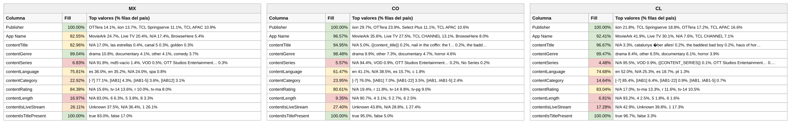

# Reporte — Content Objects por país: México, Colombia y Chile (consolidado v10 a v13)

**Fuente:** `inventory-consolidado-v10-a-v13.csv` — 579,679 filas únicas, 403,522,711,360 requests (métricas del corte v13, ventana 9–23 ago 2026, cuando la llave existe en varios archivos; v13 comparte el 92% de las llaves con el consolidado anterior).
**Data completa:** `reporte-content-objects-detallado-v13-consolidado.json` (top-15 de valores por columna para cada país). Generado con `scripts/analizar.py`.

**Nota del corte v13:** el total de requests del universo **bajó** de 429 mil M a 403 mil M — la ventana nueva trae volúmenes menores en las llaves compartidas — y los eCPM volvieron a recalcularse (el máximo ahora es 135.3, otro outlier peruano). Como siempre: los content objects son estables entre cortes; las métricas no.

## Comparativo de fill por columna

Porcentaje de filas de cada país con dato útil (excluye centinelas y basura equivalente a vacío):

**Campos de app / vendedor:**

| Columna | México | Colombia | Chile |
|---|---:|---:|---:|
| Publisher | 100% | 100% | 100% |
| App Name | 82.5% | 96.6% | 92.4% |

**Content objects:**

| Columna | México | Colombia | Chile |
|---|---:|---:|---:|
| contentIsTitlePresent | 100% | 100% | 100% |
| contentGenre | 99.0% | 98.5% | 99.5% |
| contentTitle | 83.0% | 95.0% | 96.7% |
| contentRating | 84.4% | 80.6% | 83.0% |
| contentLanguage | 75.8% | **61.5%** | 74.7% |
| contentIsLiveStream | 26.1% | 27.4% | **17.3%** |
| contentCategory | 22.9% | 23.9% | **14.6%** |
| contentLength | 17.0% | 9.3% | 6.8% |
| contentSeries | 6.8% | 5.6% | 4.5% |

Versión visual con los tres países lado a lado (fill con semáforo):

*(Generada con `scripts/generar_visual_paises.py` a partir del JSON de este reporte.)*

## México — 169,125 filas (29.2%) · 59.8% de los requests

eCPM: 81.7% de filas en cero · media no-cero 2.40 · **ponderado 3.60**

*Nota: "no vacías" incluye la exclusión de centinelas — una fila cuenta como vacía tanto si la celda no trae valor como si trae `Not Available`, `Not Applicable`, `Unknown` o basura equivalente a vacío (`[-7]`, hash MD5 de cadena vacía, macros sin reemplazar).*

**Campos de app / vendedor:**

| Columna | % de filas no vacías | # filas no vacías | Top 3 referencias (% filas del país) |
|---|---:|---:|---|
| Publisher | 100% | 169,125 | OTTera 14.1%, iion 13.7%, TCL Springserve 11.1% |
| App Name | 82.5% | 139,617 | MovieArk 24.7%, Live TV 20.4%, *N/A 17.4%* |

**Content objects:**

| Columna | % de filas no vacías | # filas no vacías | Top 3 referencias (% filas del país) |
|---|---:|---:|---|
| contentIsTitlePresent | 100% | 169,125 | true 83.0%, false 17.0% |
| contentGenre | 99.0% | 167,495 | drama 10.8%, documentary 4.1%, other 4.1% |
| contentRating | 84.4% | 142,700 | *N/A 15.6%*, tv-14 13.6%, r 10.0% |
| contentTitle | 83.0% | 140,304 | *N/A 17.0%*, las estrellas 0.4%, canal 5 0.3% |
| contentLanguage | 75.8% | 128,222 | **es 36.0%, en 35.2%**, *N/A 24.0%* |
| contentIsLiveStream | 26.1% | 44,151 | *Unknown 37.5%*, *N/A 36.4%*, 1 26.1% |
| contentCategory | 22.9% | 38,759 | *[-7] 77.1%*, [IAB1] 4.3%, [IAB1-5] 3.6% |
| contentLength | 17.0% | 28,695 | *N/A 83.0%*, 6 6.3%, 5 3.8% |
| contentSeries | 6.8% | 11,544 | *N/A 91.8%*, md5-vacío 1.4%, VOD 0.5% |

**Conclusiones — México:**
- Con v13 **el español pasa al frente también en filas** (es 36.0% vs en 35.2%) — antes solo ganaba en requests. El contenido local sigue empujando (Las Estrellas, Canal 5 en el top de títulos).
- Sigue con la peor tasa de títulos de los tres (17.0% sin título, que es donde vive el volumen Roku/EPG) y la mayor fragmentación (182 publishers, 535 bundles, 6,452 variantes de género).
- El eCPM ponderado siguió bajando con el recálculo: 3.78 → **3.60** (y la media no-cero a 2.40). La tendencia entre cortes es consistente: los precios de México se revisan a la baja en cada versión.

## Colombia — 55,737 filas (9.6%) · 6.0% de los requests

eCPM: 87.9% de filas en cero · media no-cero 3.30 · **ponderado 4.51**

*Nota: "no vacías" incluye la exclusión de centinelas — una fila cuenta como vacía tanto si la celda no trae valor como si trae `Not Available`, `Not Applicable`, `Unknown` o basura equivalente a vacío (`[-7]`, hash MD5 de cadena vacía, macros sin reemplazar).*

**Campos de app / vendedor:**

| Columna | % de filas no vacías | # filas no vacías | Top 3 referencias (% filas del país) |
|---|---:|---:|---|
| Publisher | 100% | 55,737 | iion 29.7%, OTTera 23.9%, Select Plus 11.1% |
| App Name | 96.6% | 53,828 | MovieArk 35.6%, Live TV 27.5%, TCL CHANNEL 13.1% |

**Content objects:**

| Columna | % de filas no vacías | # filas no vacías | Top 3 referencias (% filas del país) |
|---|---:|---:|---|
| contentIsTitlePresent | 100% | 55,737 | true 95.0%, false 5.0% |
| contentGenre | 98.5% | 54,890 | drama 9.9%, other 7.3%, documentary 4.7% |
| contentTitle | 95.0% | 52,925 | *N/A 5.0%*, {{content_title}} 0.2%, nail in the coffin 0.2% |
| contentRating | 80.6% | 44,928 | *N/A 19.4%*, r 11.8%, tv-14 9.8% |
| contentLanguage | **61.5%** | 34,262 | en 41.1%, *N/A 38.5%*, es 15.7% |
| contentIsLiveStream | 27.4% | 15,270 | *Unknown 43.8%*, *N/A 28.8%*, 1 27.4% |
| contentCategory | 23.9% | 13,350 | *[-7] 76.0%*, [IAB1] 7.0%, [IAB1-22] 3.5% |
| contentLength | 9.3% | 5,212 | *N/A 90.7%*, 4 3.1%, 5 2.7% |
| contentSeries | 5.6% | 3,102 | *N/A 94.4%*, VOD 0.9%, OTT Studios Ent. 0.2% |

**Conclusiones — Colombia:**
- **La novedad grande del corte v13: el precio colombiano se recuperó** — el ponderado saltó de 3.01 a **4.51** (y la media no-cero de 2.63 a 3.30). Sigue con la peor tasa de monetización de los tres (87.9% en cero), pero ya no es también el más barato: parece que entró demanda nueva en la ventana 9–23 ago.
- La metadata no se movió: sigue el peor idioma (61.5%, en 41.1% vs es 15.7%) y la macro `{{content_title}}` sigue activa.
- iion sigue liderando (29.7%) — el único mercado grande donde no manda OTTera ni TCL.

## Chile — 63,613 filas (11.0%) · 5.7% de los requests

eCPM: **76.8% de filas en cero (la mejor tasa de los tres)** · media no-cero 6.62 · **ponderado 6.92**

*Nota: "no vacías" incluye la exclusión de centinelas — una fila cuenta como vacía tanto si la celda no trae valor como si trae `Not Available`, `Not Applicable`, `Unknown` o basura equivalente a vacío (`[-7]`, hash MD5 de cadena vacía, macros sin reemplazar).*

**Campos de app / vendedor:**

| Columna | % de filas no vacías | # filas no vacías | Top 3 referencias (% filas del país) |
|---|---:|---:|---|
| Publisher | 100% | 63,613 | iion 21.8%, TCL Springserve 18.8%, OTTera 17.2% |
| App Name | 92.4% | 58,785 | MovieArk 41.9%, Live TV 30.1%, *N/A 7.6%* |

**Content objects:**

| Columna | % de filas no vacías | # filas no vacías | Top 3 referencias (% filas del país) |
|---|---:|---:|---|
| contentIsTitlePresent | 100% | 63,613 | true 96.7%, false 3.3% |
| contentGenre | 99.5% | 63,276 | drama 8.4%, other 6.5%, documentary 6.1% |
| contentTitle | 96.7% | 61,492 | *N/A 3.3%*, catalunya über alles! 0.2%, the baddest bad boy 0.2% |
| contentRating | 83.0% | 52,824 | *N/A 17.0%*, tv-ma 13.3%, r 11.6% |
| contentLanguage | 74.7% | 47,507 | en 52.0%, *N/A 25.3%*, es 18.7% |
| contentIsLiveStream | **17.3%** | 10,995 | *N/A 42.9%*, *Unknown 39.8%*, 1 17.3% |
| contentCategory | **14.6%** | 9,315 | *[-7] 85.4%*, [IAB1] 6.4%, [IAB1-22] 0.9% |
| contentLength | 6.8% | 4,329 | *N/A 93.2%*, 4 2.5%, 5 1.8% |
| contentSeries | 4.5% | 2,852 | *N/A 95.5%*, VOD 0.9%, {{CONTENT_SERIES}} 0.1% |

**Conclusiones — Chile:**
- El recálculo de v13 le recortó el premium: ponderado 8.17 → **6.92**. Sigue siendo el mejor precio de los tres, pero la brecha con Argentina (~6.0) se cerró. A cambio, mejoró su tasa de monetización: 80.6% → 76.8% de filas en cero, la mejor de los tres mercados.
- El perfil no cambia: VOD/película (MovieArk 41.9%, livestream 17.3% — mínimo del dataset), catálogo anglófono (en 52.0% vs es 18.7%) y metadata estructural pobre (categoría 14.6%, duración 6.8%).

---

**Síntesis del corte v13.** La estructura (fills, jerarquías, responsables) se mantiene casi idéntica — las variaciones de fill entre cortes son de décimas. Lo que sí se movió, otra vez, son las métricas: menos requests totales (−6%), México más barato (3.60), Chile menos premium (6.92) y **Colombia recuperando precio (4.51)**. Tres cortes seguidos confirman la regla operativa: para metadata puede usarse cualquier versión; para precios hay que fijar versión y fecha.
