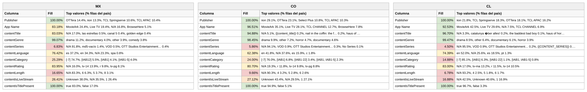

# Reporte — Content Objects por país: México, Colombia y Chile (consolidado v10 a v14)

**Fuente:** `inventory-consolidado-v10-a-v14.csv` — 607,878 filas únicas, 396,370,107,200 requests (métricas del corte v14, ventana 11–25 ago 2026, cuando la llave existe en varios archivos; v14 aportó 28,199 combinaciones nuevas).
**Data completa:** `reporte-content-objects-detallado-v14-consolidado.json` (top-15 de valores por columna para cada país). Generado con `scripts/analizar.py`.

**Nota del corte v14:** los requests totales siguen bajando (−1.8% vs el corte anterior) y el eCPM ponderado global también (4.40 → 4.20); el outlier de 135.3 de Perú persiste. Los content objects, como siempre, casi no se mueven.

## Comparativo de fill por columna

Porcentaje de filas de cada país con dato útil (excluye centinelas y basura equivalente a vacío):

**Campos de app / vendedor:**

| Columna | México | Colombia | Chile |
|---|---:|---:|---:|
| Publisher | 100% | 100% | 100% |
| App Name | 83.2% | 96.5% | 92.5% |

**Content objects:**

| Columna | México | Colombia | Chile |
|---|---:|---:|---:|
| contentIsTitlePresent | 100% | 100% | 100% |
| contentGenre | 99.1% | 98.5% | 99.5% |
| contentTitle | 83.0% | 94.9% | 96.7% |
| contentRating | 84.0% | 80.7% | 83.0% |
| contentLanguage | 76.4% | **62.4%** | 74.4% |
| contentIsLiveStream | 26.4% | 27.1% | **16.9%** |
| contentCategory | 25.3% | 24.0% | **14.9%** |
| contentLength | 16.6% | 9.7% | 6.8% |
| contentSeries | 6.8% | 5.9% | 4.5% |

Versión visual con los tres países lado a lado (fill con semáforo):

*(Generada con `scripts/generar_visual_paises.py` a partir del JSON de este reporte.)*

## México — 180,593 filas (29.7%) · 59.3% de los requests

eCPM: 81.7% de filas en cero · media no-cero 2.21 · **ponderado 3.33**

*Nota: "no vacías" incluye la exclusión de centinelas — una fila cuenta como vacía tanto si la celda no trae valor como si trae `Not Available`, `Not Applicable`, `Unknown` o basura equivalente a vacío (`[-7]`, hash MD5 de cadena vacía, macros sin reemplazar).*

**Campos de app / vendedor:**

| Columna | % de filas no vacías | Top 3 referencias (% filas del país) |
|---|---:|---|
| Publisher | 100% | OTTera 14.4%, iion 13.3%, TCL Springserve 10.6% |
| App Name | 83.2% | MovieArk 24.4%, Live TV 19.4%, *N/A 16.8%* |

**Content objects:**

| Columna | % de filas no vacías | Top 3 referencias (% filas del país) |
|---|---:|---|
| contentIsTitlePresent | 100% | true 83.0%, false 17.0% |
| contentGenre | 99.1% | drama 11.2%, documentary 4.0%, other 3.9% |
| contentRating | 84.0% | *N/A 16.0%*, tv-14 13.9%, r 9.8% |
| contentTitle | 83.0% | *N/A 17.0%*, las estrellas 0.5%, canal 5 0.4% |
| contentLanguage | 76.4% | **es 37.2%, en 34.3%**, *N/A 23.3%* |
| contentIsLiveStream | 26.4% | *Unknown 38.0%*, *N/A 35.5%*, 1 26.4% |
| contentCategory | 25.3% | *[-7] 74.7%*, [IAB12] 5.5%, [IAB1] 4.1% |
| contentLength | 16.6% | *N/A 83.3%*, 6 6.3%, 5 3.7% |
| contentSeries | 6.8% | *N/A 91.8%*, md5-vacío 1.4%, VOD 0.5% |

**Conclusiones — México:**
- El español consolida su ventaja en filas (37.2% vs 34.3% — la brecha se amplió respecto al corte anterior) y ViX en Hisense (`tv.vidaa.ui.apps.vix`) ya es el 3er bundle del país (5.3% de filas).
- Novedad en categoría: sube a 25.3% de fill y aparece **[IAB12] "News" como el valor válido más común (5.5%)** — pero viene del default sospechoso de Vidaa (ver reporte de publishers), así que ese "avance" hay que tomarlo con pinzas.
- El eCPM ponderado siguió bajando: 3.60 → **3.33** (media no-cero 2.21). Cuatro cortes seguidos revisando México a la baja.

## Colombia — 58,262 filas (9.6%) · 5.8% de los requests

eCPM: 86.6% de filas en cero · media no-cero 3.80 · **ponderado 4.97**

*Nota: "no vacías" incluye la exclusión de centinelas — una fila cuenta como vacía tanto si la celda no trae valor como si trae `Not Available`, `Not Applicable`, `Unknown` o basura equivalente a vacío (`[-7]`, hash MD5 de cadena vacía, macros sin reemplazar).*

**Campos de app / vendedor:**

| Columna | % de filas no vacías | Top 3 referencias (% filas del país) |
|---|---:|---|
| Publisher | 100% | iion 29.1%, OTTera 23.1%, Select Plus 10.8% |
| App Name | 96.5% | MovieArk 35.1%, Live TV 28.1%, TCL CHANNEL 12.7% |

**Content objects:**

| Columna | % de filas no vacías | Top 3 referencias (% filas del país) |
|---|---:|---|
| contentIsTitlePresent | 100% | true 94.9%, false 5.1% |
| contentGenre | 98.5% | drama 9.9%, other 7.2%, horror 4.7% |
| contentTitle | 94.9% | *N/A 5.1%*, {{content_title}} 0.2%, nail in the coffin 0.2% |
| contentRating | 80.7% | *N/A 19.3%*, r 11.8%, tv-14 9.8% |
| contentLanguage | **62.4%** | en 41.8%, *N/A 37.6%*, es 15.9% |
| contentIsLiveStream | 27.1% | *Unknown 43.4%*, *N/A 29.5%*, 1 27.1% |
| contentCategory | 24.0% | *[-7] 76.0%*, [IAB1] 6.8%, [IAB1-22] 3.4% |
| contentLength | 9.7% | *N/A 90.3%*, 4 3.2%, 5 2.8% |
| contentSeries | 5.9% | *N/A 94.1%*, VOD 0.9%, OTT Studios Ent. 0.3% |

**Conclusiones — Colombia:**
- **La recuperación de precio continúa**: ponderado 3.01 (v12) → 4.51 (v13) → **4.97** (v14), y la tasa de monetización también mejora (86.6% en cero, venía de 87.9%). El motor está en anime y acción (ver reporte de género: anime colombiano a 11.0 de eCPM con 8.2% del tráfico).
- La metadata sigue igual: peor idioma de los tres (62.4%) y la macro `{{content_title}}` activa.

## Chile — 66,112 filas (10.9%) · 5.6% de los requests

eCPM: **76.3% de filas en cero (la mejor tasa de los tres)** · media no-cero 6.41 · **ponderado 6.52**

*Nota: "no vacías" incluye la exclusión de centinelas — una fila cuenta como vacía tanto si la celda no trae valor como si trae `Not Available`, `Not Applicable`, `Unknown` o basura equivalente a vacío (`[-7]`, hash MD5 de cadena vacía, macros sin reemplazar).*

**Campos de app / vendedor:**

| Columna | % de filas no vacías | Top 3 referencias (% filas del país) |
|---|---:|---|
| Publisher | 100% | iion 21.8%, TCL Springserve 18.3%, OTTera 18.1% |
| App Name | 92.5% | MovieArk 42.5%, Live TV 29.6%, *N/A 7.5%* |

**Content objects:**

| Columna | % de filas no vacías | Top 3 referencias (% filas del país) |
|---|---:|---|
| contentIsTitlePresent | 100% | true 96.7%, false 3.3% |
| contentGenre | 99.5% | drama 8.5%, other 6.4%, documentary 6.1% |
| contentTitle | 96.7% | *N/A 3.3%*, catalunya über alles! 0.2%, the baddest bad boy 0.1% |
| contentRating | 83.0% | *N/A 17.0%*, tv-ma 13.2%, r 11.5% |
| contentLanguage | 74.4% | en 52.0%, *N/A 25.6%*, es 18.5% |
| contentIsLiveStream | **16.9%** | *N/A 42.5%*, *Unknown 40.6%*, 1 16.9% |
| contentCategory | **14.9%** | *[-7] 85.1%*, [IAB1] 6.3%, [IAB1-22] 1.1% |
| contentLength | 6.8% | *N/A 93.2%*, 4 2.5%, 5 1.8% |
| contentSeries | 4.5% | *N/A 95.5%*, VOD 0.9%, OTT Studios Ent. 0.2% |

**Conclusiones — Chile:**
- El premium se sigue desgastando: ponderado 8.17 → 6.92 → **6.52**, ya prácticamente empatado con Argentina (~6.0). En compensación, mantiene la mejor tasa de monetización de los tres (76.3% en cero).
- El perfil no cambia: VOD/película (MovieArk 42.5%), catálogo anglófono (52.0% en) y la peor metadata estructural (livestream 16.9%, categoría 14.9%).

---

**Síntesis del corte v14.** Quinta versión y el patrón es inequívoco: la metadata es una foto fija (las variaciones son de décimas) mientras los precios se recalculan siempre a la baja en los grandes (ponderado global 4.98 → 4.55 → 4.40 → 4.20) — con la excepción notable de **Colombia, que suma dos cortes seguidos mejorando** (3.01 → 4.51 → 4.97). La brecha de precios entre los tres mercados se está cerrando: México 3.33, Colombia 4.97, Chile 6.52.
