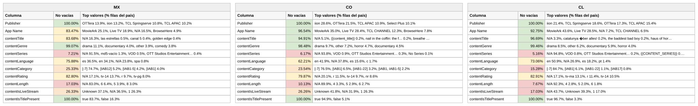

# Reporte — Content Objects por país: México, Colombia y Chile (consolidado v10 a v15)

**Fuente:** `inventory-consolidado-v10-a-v15.csv` — 648,589 filas únicas, 385,830,361,280 requests (métricas del corte v15, ventana 15–29 ago 2026, cuando la llave existe en varios archivos; v15 aportó 40,711 combinaciones nuevas).
**Data completa:** `reporte-content-objects-detallado-v15-consolidado.json` (top-15 de valores por columna para cada país). Generado con `scripts/analizar.py`.

**Nota del corte v15:** los requests totales siguen bajando (−2.7% vs el corte anterior) y el eCPM ponderado global también, aunque cada vez menos (4.20 → 4.16); el outlier de 135.3 de Perú persiste. La novedad está en otra parte: **el % de tráfico monetizado subió a 52.9%** — primera vez en seis cortes que sale de la banda 51±0.1 (ver reporte de normalización).

## Comparativo de % de filas no vacías por columna

Porcentaje de filas de cada país con dato útil (excluye centinelas y basura equivalente a vacío):

**Campos de app / vendedor:**

| Columna | México | Colombia | Chile |
|---|---:|---:|---:|
| Publisher | 100% | 100% | 100% |
| App Name | 83.5% | 96.5% | 92.8% |

**Content objects:**

| Columna | México | Colombia | Chile |
|---|---:|---:|---:|
| contentIsTitlePresent | 100% | 100% | 100% |
| contentGenre | 99.1% | 98.5% | 99.5% |
| contentTitle | 83.7% | 94.9% | 96.7% |
| contentRating | 82.8% | 79.9% | 82.9% |
| contentLanguage | 75.9% | **62.2%** | 73.1% |
| contentIsLiveStream | 26.3% | 26.3% | **17.0%** |
| contentCategory | 25.3% | 23.5% | **15.3%** |
| contentLength | 17.0% | 10.1% | 7.7% |
| contentSeries | 7.2% | 6.2% | 5.2% |

Versión visual con los tres países lado a lado (semáforo por % de filas no vacías):

*(Generada con `scripts/generar_visual_paises.py` a partir del JSON de este reporte.)*

## México — 193,264 filas (29.8%) · 59.0% de los requests

eCPM: 81.0% de filas en cero · media no-cero 2.08 · **ponderado 3.25**

*Nota: "no vacías" incluye la exclusión de centinelas — una fila cuenta como vacía tanto si la celda no trae valor como si trae `Not Available`, `Not Applicable`, `Unknown` o basura equivalente a vacío (`[-7]`, hash MD5 de cadena vacía, macros sin reemplazar).*

**Campos de app / vendedor:**

| Columna | % de filas no vacías | Top 3 referencias (% filas del país) |
|---|---:|---|
| Publisher | 100% | OTTera 13.9%, iion 13.2%, TCL Springserve 10.8% |
| App Name | 83.5% | MovieArk 25.1%, Live TV 18.9%, *N/A 16.5%* |

**Content objects:**

| Columna | % de filas no vacías | Top 3 referencias (% filas del país) |
|---|---:|---|
| contentIsTitlePresent | 100% | true 83.7%, false 16.3% |
| contentGenre | 99.1% | drama 11.1%, documentary 4.0%, other 3.9% |
| contentTitle | 83.7% | *N/A 16.3%*, las estrellas 0.5%, canal 5 0.4% |
| contentRating | 82.8% | *N/A 17.1%*, tv-14 13.7%, r 9.7% |
| contentLanguage | 75.9% | **es 36.5%, en 34.1%**, *N/A 23.8%* |
| contentIsLiveStream | 26.3% | *Unknown 37.1%*, *N/A 36.5%*, 1 26.3% |
| contentCategory | 25.3% | *[-7] 74.7%*, [IAB12] 5.2%, [IAB1-5] 4.2% |
| contentLength | 17.0% | *N/A 83.0%*, 6 6.4%, 5 3.9% |
| contentSeries | 7.2% | *N/A 91.5%*, md5-vacío 1.3%, VOD 0.5% |

**Conclusiones — México:**
- El español mantiene la delantera en filas (36.5% vs 34.1%) y los canales lineales siguen ganando terreno: **"golden edge" y "golden multiplex" ya están en el top 5 de títulos** (0.4% cada uno), junto a "las estrellas" y "canal 5" — el catálogo lineal de Televisa/Vidaa se expande.
- contentRating retrocedió ~1.2pp (84.0% → 82.8%), el movimiento más grande de un content object mexicano en seis cortes — probablemente mezcla del corte v15, a vigilar en el próximo.
- El eCPM ponderado completa la quinta bajada: 3.60 → 3.33 → **3.25** (media no-cero 2.08).

## Colombia — 63,163 filas (9.7%) · 5.7% de los requests

eCPM: 84.9% de filas en cero (venía de 86.6%) · media no-cero 4.39 · **ponderado 5.36**

*Nota: "no vacías" incluye la exclusión de centinelas — una fila cuenta como vacía tanto si la celda no trae valor como si trae `Not Available`, `Not Applicable`, `Unknown` o basura equivalente a vacío (`[-7]`, hash MD5 de cadena vacía, macros sin reemplazar).*

**Campos de app / vendedor:**

| Columna | % de filas no vacías | Top 3 referencias (% filas del país) |
|---|---:|---|
| Publisher | 100% | iion 28.6%, OTTera 21.5%, TCL APAC 10.9% |
| App Name | 96.5% | MovieArk 35.0%, Live TV 28.4%, TCL CHANNEL 12.3% |

**Content objects:**

| Columna | % de filas no vacías | Top 3 referencias (% filas del país) |
|---|---:|---|
| contentIsTitlePresent | 100% | true 94.9%, false 5.1% |
| contentGenre | 98.5% | drama 9.7%, other 7.2%, horror 4.7% |
| contentTitle | 94.9% | *N/A 5.1%*, {{content_title}} 0.2%, nail in the coffin 0.2% |
| contentRating | 79.9% | *N/A 20.1%*, r 11.5%, tv-14 9.7% |
| contentLanguage | **62.2%** | en 41.9%, *N/A 37.8%*, es 15.6% |
| contentIsLiveStream | 26.3% | *Unknown 41.8%*, *N/A 31.9%*, 1 26.3% |
| contentCategory | 23.5% | *[-7] 76.5%*, [IAB1] 6.5%, [IAB1-22] 3.2% |
| contentLength | 10.1% | *N/A 89.9%*, 4 3.3%, 5 2.9% |
| contentSeries | 6.2% | *N/A 93.8%*, VOD 0.9%, OTT Studios Ent. 0.3% |

**Conclusiones — Colombia:**
- **Tercer corte consecutivo de recuperación**: ponderado 4.51 (v13) → 4.97 (v14) → **5.36**, y la tasa de monetización acompaña (84.9% en cero, venía de 86.6%). Sigue siendo la única historia de crecimiento del dataset — el motor, como muestra el reporte de género, está en anime (11.0 de eCPM), aventura (10.2) y acción (9.1).
- Movimiento en el top de vendedores: **TCL APAC entró al top 3 del país (10.9%)** desplazando a Select Plus (10.1%).
- La metadata no acompaña al precio: sigue el peor idioma de los tres (62.2%) y la macro `{{content_title}}` activa.

## Chile — 70,326 filas (10.8%) · 5.6% de los requests

eCPM: **75.7% de filas en cero (la mejor tasa de los tres)** · media no-cero 6.24 · **ponderado 6.19**

*Nota: "no vacías" incluye la exclusión de centinelas — una fila cuenta como vacía tanto si la celda no trae valor como si trae `Not Available`, `Not Applicable`, `Unknown` o basura equivalente a vacío (`[-7]`, hash MD5 de cadena vacía, macros sin reemplazar).*

**Campos de app / vendedor:**

| Columna | % de filas no vacías | Top 3 referencias (% filas del país) |
|---|---:|---|
| Publisher | 100% | iion 21.4%, TCL Springserve 18.6%, OTTera 17.3% |
| App Name | 92.8% | MovieArk 43.6%, Live TV 28.5%, *N/A 7.2%* |

**Content objects:**

| Columna | % de filas no vacías | Top 3 referencias (% filas del país) |
|---|---:|---|
| contentIsTitlePresent | 100% | true 96.7%, false 3.3% |
| contentGenre | 99.5% | drama 8.5%, other 6.2%, documentary 5.9% |
| contentTitle | 96.7% | *N/A 3.3%*, catalunya über alles! 0.2%, the baddest bad boy 0.2% |
| contentRating | 82.9% | *N/A 17.1%*, tv-ma 13.1%, r 11.4% |
| contentLanguage | 73.1% | en 50.9%, *N/A 26.9%*, es 18.2% |
| contentIsLiveStream | **17.0%** | *N/A 43.7%*, *Unknown 39.3%*, 1 17.0% |
| contentCategory | **15.3%** | *[-7] 84.7%*, [IAB1] 6.1%, [IAB1-22] 1.1% |
| contentLength | 7.7% | *N/A 92.3%*, 4 2.8%, 5 2.0% |
| contentSeries | 5.2% | *N/A 94.8%*, VOD 0.8%, OTT Studios Ent. 0.2% |

**Conclusiones — Chile:**
- El premium se sigue desgastando: ponderado 6.92 → 6.52 → **6.19**, ya en empate técnico con Argentina (~6.19 ambos). Mantiene, eso sí, la mejor tasa de monetización de los tres (75.7% en cero).
- El perfil no cambia: VOD/película (MovieArk 43.6%), catálogo anglófono (50.9% en) y la peor metadata estructural (livestream 17.0%, categoría 15.3%).

---

**Síntesis del corte v15.** Sexta versión: la metadata sigue siendo una foto fija (variaciones de décimas, con la excepción del rating mexicano, −1.2pp), los precios completan la quinta bajada global (4.98 → 4.55 → 4.40 → 4.20 → **4.16**, ya moderándose) y **Colombia encadena tres cortes subiendo** (4.51 → 4.97 → 5.36). La brecha entre mercados se sigue cerrando por ambos lados: México 3.25, Colombia 5.36, Chile 6.19 — Chile ya empató con Argentina y Colombia se acerca. El cambio de fondo del corte es la partición vendido/muerto: **52.9% del tráfico monetizado, primera salida de la banda 51±0.1 en seis cortes**.
