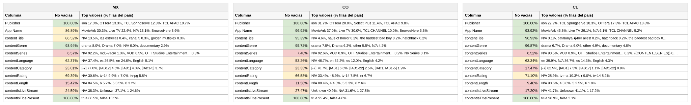

# Reporte — Content Objects por país: México, Colombia y Chile (consolidado v10 a v16)

**Fuente:** `inventory-consolidado-v10-a-v16.csv` — 810,933 filas únicas, 365,377,125,360 requests (métricas del corte v16, ventana 19 ago–2 sep 2026, cuando la llave existe en varios archivos; v16 aportó **162,344 combinaciones nuevas**, cuatro veces más que cualquier corte anterior).
**Data completa:** `reporte-content-objects-detallado-v16-consolidado.json` (top-15 de valores por columna para cada país). Generado con `scripts/analizar.py`.

**Nota del corte v16 — el corte no es comparable sin leer esto.** El reporte de inventario cambió de formato a mitad de la ventana: el 28% de las filas de v16 (18% de sus requests) llega con **otra escritura de la metadata** — género con mayúscula inicial (`Drama` en vez de `drama`), rating en una escala nueva (`All Ages`, `Teen`, `Teen Plus`, `Adults`, `Unrated`) e idioma como nombre completo (`English`, `Spanish`) en vez del código ISO (`en`, `es`). Afecta a **todos los publishers por igual** (Roku, ViX, Vidaa, iion, OTTera, TCL…), así que no es un vendedor que cambió su feed: es la plataforma que emite el reporte la que cambió cómo normaliza los content objects. Consecuencias:

1. **El mismo contenido aparece dos veces**: 4,969 títulos tienen filas en los dos formatos dentro de v16. Como la llave de consolidación son las 14 dimensiones, `drama|tv-14|es` y `Drama|Not Applicable|Not Applicable` son combinaciones distintas — de ahí las 162k llaves "nuevas". Solo el 68% de las llaves de v16 ya existían en v15 (históricamente era ~97%).
2. **Rating e idioma se vaciaron en el formato nuevo**: en esas filas el rating viene vacío en el 68% y el idioma en el 72% (contra 18% y 25% en el formato viejo). Por eso las caídas de 10–13 puntos en contentRating y contentLanguage de este reporte **no son que los vendedores dejaran de mandar el dato: es que el reporte dejó de traerlo** en la parte nueva de la ventana.
3. **Sube el doble conteo**: las llaves viejas que ya no están en v16 conservan sus métricas de cortes anteriores (6.6% de los requests del consolidado, antes 3.8%). Para análisis de tráfico conviene usar solo v16 (341,139,919,520 requests) o esperar a que el formato se estabilice.

En lo demás, el corte sigue la tendencia: requests totales −5.3% vs el corte anterior, eCPM ponderado global 4.16 → **4.06**, tráfico monetizado 52.9% → 52.6%, y un outlier nuevo de 194.3 en Perú (ver reporte de normalización).

## Comparativo de % de filas no vacías por columna

Porcentaje de filas de cada país con dato útil (excluye centinelas y basura equivalente a vacío). Entre paréntesis, el valor del consolidado anterior (v10 a v15) cuando el cambio supera un punto:

**Campos de app / vendedor:**

| Columna | México | Colombia | Chile |
|---|---:|---:|---:|
| Publisher | 100% | 100% | 100% |
| App Name | 86.9% (83.5) | 96.9% | 93.9% (92.8) |

**Content objects:**

| Columna | México | Colombia | Chile |
|---|---:|---:|---:|
| contentIsTitlePresent | 100% | 100% | 100% |
| contentGenre | 93.9% (99.1) | 95.7% (98.5) | 96.9% (99.5) |
| contentTitle | 86.5% (83.7) | 95.4% | 96.9% |
| contentRating | **69.4% (82.8)** | **66.6% (79.9)** | **71.1% (82.9)** |
| contentLanguage | **62.4% (75.9)** | **53.3% (62.2)** | **63.3% (73.1)** |
| contentIsLiveStream | 24.6% (26.3) | 27.5% (26.3) | **17.2%** |
| contentCategory | 23.0% (25.3) | 23.3% | **17.5% (15.3)** |
| contentLength | 15.5% (17.0) | 11.6% (10.1) | 9.4% (7.7) |
| contentSeries | 6.6% | 7.4% (6.2) | 6.5% (5.2) |

Lectura: **las tres columnas que caen (género, rating, idioma) son exactamente las tres que cambiaron de escritura** en el formato nuevo. Las que suben un poco (título, App Name, length, series) lo hacen porque el formato nuevo trae mejor poblados esos campos (título 95% vs 92%, length 16% vs 12%). Nada de esto habla de un cambio en lo que mandan los vendedores.

Versión visual con los tres países lado a lado (semáforo por % de filas no vacías):

*(Generada con `scripts/generar_visual_paises.py` a partir del JSON de este reporte. En contentGenre aparecen `drama` y `Drama` como valores separados: es literal, así vienen ahora.)*

## México — 267,688 filas (33.0%) · 61.1% de los requests

eCPM: 81.1% de filas en cero · media no-cero 2.05 · **ponderado 3.21**

*Nota: "no vacías" incluye la exclusión de centinelas — una fila cuenta como vacía tanto si la celda no trae valor como si trae `Not Available`, `Not Applicable`, `Unknown` o basura equivalente a vacío (`[-7]`, hash MD5 de cadena vacía, macros sin reemplazar).*

**Campos de app / vendedor:**

| Columna | % de filas no vacías | Top 3 referencias (% filas del país) |
|---|---:|---|
| Publisher | 100% | iion 17.0%, OTTera 13.3%, TCL Springserve 12.3% |
| App Name | 86.9% | MovieArk 30.3%, Live TV 22.4%, *N/A 13.1%* |

**Content objects:**

| Columna | % de filas no vacías | Top 3 referencias (% filas del país) |
|---|---:|---|
| contentIsTitlePresent | 100% | true 86.5%, false 13.5% |
| contentGenre | 93.9% | drama 8.0%, **Drama 7.0%**, *N/A 6.0%* |
| contentTitle | 86.5% | *N/A 13.5%*, las estrellas 0.4%, canal 5 0.3% |
| contentRating | 69.4% | *N/A 30.6%*, tv-14 9.9%, r 7.0% |
| contentLanguage | 62.4% | *N/A 37.4%*, es 26.5%, en 24.6% |
| contentIsLiveStream | 24.6% | *N/A 38.3%*, *Unknown 37.1%*, 1 24.6% |
| contentCategory | 23.0% | *[-7] 77.0%*, [IAB12] 4.6%, [IAB1] 4.0% |
| contentLength | 15.5% | *N/A 84.5%*, 6 5.2%, 5 3.5% |
| contentSeries | 6.6% | *N/A 92.2%*, md5-vacío 1.3%, VOD 0.5% |

**Conclusiones — México:**
- México es el país donde más pesa el formato nuevo (24% de sus filas en el consolidado) y por eso el que más metadata "pierde": rating −13.4pp e idioma −13.5pp. `Drama` con mayúscula ya es el segundo valor de género del país (7.0%), pisándole los talones a `drama` (8.0%).
- Cambió el orden de los vendedores: **iion pasa a ser el primer publisher en filas (17.0%)**, desplazando a OTTera (13.3%). Es un efecto del formato nuevo (iion es el que más filas duplicadas trae: 34% de las suyas en v16), no de más tráfico — en requests iion sigue tercero.
- El español conserva la delantera en filas (26.5% vs 24.6%), pero el margen se lee con cuidado: `English` (5.1%) y `Spanish` (2.0%) van aparte; sumados, inglés 29.7% vs español 28.5% — **el inglés ya empata o supera al español en variedad de catálogo**.
- El eCPM ponderado completa la sexta bajada: 3.33 → 3.25 → **3.21**, con la media no-cero estable en 2.05. Los canales lineales de Televisa/Vidaa siguen en el top de títulos (las estrellas, canal 5, golden multiplex, golden edge).

## Colombia — 82,085 filas (10.1%) · 5.9% de los requests

eCPM: 85.8% de filas en cero (venía de 84.9%) · media no-cero 4.74 · **ponderado 5.60**

*Nota: "no vacías" incluye la exclusión de centinelas — una fila cuenta como vacía tanto si la celda no trae valor como si trae `Not Available`, `Not Applicable`, `Unknown` o basura equivalente a vacío (`[-7]`, hash MD5 de cadena vacía, macros sin reemplazar).*

**Campos de app / vendedor:**

| Columna | % de filas no vacías | Top 3 referencias (% filas del país) |
|---|---:|---|
| Publisher | 100% | iion 31.7%, OTTera 20.0%, Select Plus 11.4% |
| App Name | 96.9% | MovieArk 37.0%, Live TV 30.0%, TCL CHANNEL 10.0% |

**Content objects:**

| Columna | % de filas no vacías | Top 3 referencias (% filas del país) |
|---|---:|---|
| contentIsTitlePresent | 100% | true 95.4%, false 4.6% |
| contentGenre | 95.7% | drama 7.5%, **Drama 6.2%**, other 5.5% |
| contentTitle | 95.4% | *N/A 4.6%*, haus of horror 0.2%, the baddest bad boy 0.2% |
| contentRating | 66.6% | *N/A 33.4%*, r 8.9%, tv-14 7.5% |
| contentLanguage | **53.3%** | *N/A 46.7%*, en 32.2%, es 12.0% |
| contentIsLiveStream | 27.5% | *Unknown 40.9%*, *N/A 31.6%*, 1 27.5% |
| contentCategory | 23.3% | *[-7] 76.7%*, [IAB1] 6.6%, [IAB1-22] 2.5% |
| contentLength | 11.6% | *N/A 88.4%*, 4 4.3%, 5 3.3% |
| contentSeries | 7.4% | *N/A 92.6%*, VOD 0.9%, OTT Studios Ent. 0.2% |

**Conclusiones — Colombia:**
- **Cuarto corte consecutivo de recuperación de precio**: ponderado 4.51 → 4.97 → 5.36 → **5.60**. Esta vez, sin embargo, la tasa de monetización no acompaña (85.8% en cero, venía de 84.9%): sube el precio de lo que se vende, no la cantidad vendida. El motor sigue siendo el mismo (anime 10.9, aventura 9.8, acción 9.0 — ver reporte de género).
- Vuelve a moverse el top de vendedores: **Select Plus recupera el tercer puesto (11.4%)** y TCL APAC sale del podio (9.8%). iion se dispara a 31.7% de las filas del país por el mismo efecto de duplicación del formato nuevo.
- La peor metadata de idioma de los tres se agrava: 53.3%, casi la mitad de las filas colombianas ya no dicen en qué idioma va el contenido. La macro `{{content_title}}` sigue activa (0.15%).

## Chile — 89,663 filas (11.1%) · 5.1% de los requests

eCPM: **77.0% de filas en cero (sigue siendo la mejor tasa de los tres)** · media no-cero 6.24 · **ponderado 5.96**

*Nota: "no vacías" incluye la exclusión de centinelas — una fila cuenta como vacía tanto si la celda no trae valor como si trae `Not Available`, `Not Applicable`, `Unknown` o basura equivalente a vacío (`[-7]`, hash MD5 de cadena vacía, macros sin reemplazar).*

**Campos de app / vendedor:**

| Columna | % de filas no vacías | Top 3 referencias (% filas del país) |
|---|---:|---|
| Publisher | 100% | iion 22.2%, TCL Springserve 18.3%, OTTera 17.3% |
| App Name | 93.9% | MovieArk 45.3%, Live TV 29.1%, *N/A 6.1%* |

**Content objects:**

| Columna | % de filas no vacías | Top 3 referencias (% filas del país) |
|---|---:|---|
| contentIsTitlePresent | 100% | true 96.9%, false 3.1% |
| contentGenre | 96.9% | drama 6.7%, **Drama 6.0%**, other 4.9% |
| contentTitle | 96.9% | *N/A 3.1%*, catalunya über alles! 0.2%, hatchback 0.2% |
| contentRating | 71.1% | *N/A 28.9%*, tv-ma 10.3%, r 9.0% |
| contentLanguage | 63.3% | en 39.9%, *N/A 36.7%*, es 14.3% |
| contentIsLiveStream | **17.2%** | *N/A 41.7%*, *Unknown 41.1%*, 1 17.2% |
| contentCategory | **17.5%** | *[-7] 82.5%*, [IAB1] 7.5%, [IAB17] 1.1% |
| contentLength | 9.4% | *N/A 90.6%*, 4 3.8%, 5 2.5% |
| contentSeries | 6.5% | *N/A 93.5%*, VOD 0.9%, OTT Studios Ent. 0.2% |

**Conclusiones — Chile:**
- **Chile perdió el liderato de precio**: ponderado 6.92 → 6.52 → 6.19 → **5.96**, cuarta bajada seguida, y ya está por debajo de Argentina (6.12). Sigue teniendo la mejor tasa de monetización de los tres (77.0% en cero), pero también se erosiona (venía de 75.7%).
- El perfil no cambia: VOD/película (MovieArk 45.3%), catálogo anglófono (39.9% `en` + 4.3% `English`) y la peor metadata estructural (livestream 17.2%, categoría 17.5%). El mojibake de `catalunya über alles!` sigue siendo el título más frecuente del país.

---

**Síntesis del corte v16.** Séptima versión y la primera con una **ruptura de formato en la fuente**: el 28% de las filas del corte llega con otra escritura de género, rating e idioma, con rating e idioma vacíos en dos de cada tres de esas filas. Eso infla el consolidado (648k → 811k filas, 4,969 títulos duplicados en ambos formatos) y produce caídas de 10–13pp en rating e idioma que **no son de los vendedores sino del reporte**. Los precios siguen su curso: sexta bajada global (4.98 → … → 4.16 → **4.06**), **Colombia cuarto corte subiendo (5.60)**, Chile cuarto corte bajando (5.96) y ya detrás de Argentina, México 3.21. El tráfico monetizado se sostuvo en 52.6% (la subida de v15 a 52.9% no fue un rebote de un solo corte). Recomendación operativa: **confirmar con la plataforma (PubMatic) qué cambió en el reporte y desde qué fecha**, y hasta entonces tratar rating e idioma como no comparables con los cortes anteriores.
