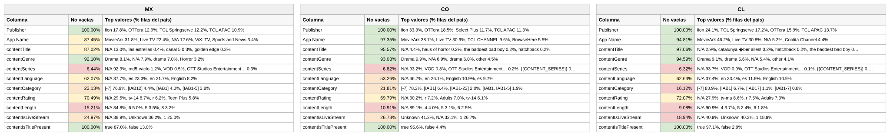

# Reporte — Content Objects por país: México, Colombia y Chile (consolidado v10 a v17)

**Fuente:** `inventory-consolidado-v10-a-v17.csv` — 959,442 filas únicas, 380,355,807,040 requests (métricas del corte v17, ventana 24 ago–7 sep 2026, cuando la llave existe en varios archivos; v17 aportó **148,509 combinaciones nuevas**).
**Data completa:** `reporte-content-objects-detallado-v17-consolidado.json` (top-15 de valores por columna para cada país). Generado con `scripts/analizar.py`.

**Nota del corte v17 — la migración de formato avanza.** Lo que en v16 era el 28% de las filas ya es **el 54% de las filas de v17 (52% de sus requests)**: la escritura nueva del reporte (`Drama` con mayúscula, rating `All Ages`/`Teen`/`Teen Plus`/`Adults`, idioma `English`/`Spanish`) es ahora la mayoritaria y afecta a todos los publishers (iion 56%, TCL 54%, OTTera 47%, Roku 44%, Select Plus 73% de sus filas). Tres cosas cambian respecto a la lectura de v16:

1. **El formato nuevo ya no viene tan vacío.** En v16 sus filas traían rating en el 32% e idioma en el 28%; en v17, **rating 60% e idioma 48%**. La plataforma está corrigiendo la migración sobre la marcha. El formato viejo, en cambio, empeoró (rating 80%, idioma 64% en v17): parece que lo que queda en escritura vieja es el residuo de las rutas que aún no migran.
2. **El consolidado sigue inflándose por duplicación**: 959k filas, con 7,502 títulos presentes en ambas escrituras. Solo el 71% de las llaves de v17 existían en v16. Y **el doble conteo ya pesa 10.6% de los requests** (las llaves de cortes anteriores que no están en v17 conservan sus métricas viejas; en v16 era 6.6%, antes del cambio 3.8%). Para tráfico, usar solo v17 (340,106,429,600 requests, −0.3% vs v16).
3. **Los outliers de Perú (194.3, 135.3, 102.9…) ya no están en v17** — sobreviven en el consolidado solo por esas llaves viejas. En v17 el máximo es 95.9. Otro argumento para leer el tráfico y el precio sobre el corte, no sobre el acumulado.

En lo demás: eCPM ponderado global 4.06 → **4.04** (v17 solo: 4.05), y el tráfico monetizado **cayó a 50.7%** (52.6% en v16) — vuelve a la banda de 51 que había dejado en v15 (ver reporte de normalización).

## Comparativo de % de filas no vacías por columna

Porcentaje de filas de cada país con dato útil (excluye centinelas y basura equivalente a vacío). Entre paréntesis, el valor del consolidado anterior (v10 a v16) cuando el cambio supera un punto:

**Campos de app / vendedor:**

| Columna | México | Colombia | Chile |
|---|---:|---:|---:|
| Publisher | 100% | 100% | 100% |
| App Name | 87.5% | 97.3% | 94.8% |

**Content objects:**

| Columna | México | Colombia | Chile |
|---|---:|---:|---:|
| contentIsTitlePresent | 100% | 100% | 100% |
| contentGenre | 92.1% (93.9) | 93.0% (95.7) | 94.6% (96.9) |
| contentTitle | 87.0% | 95.6% | 97.1% |
| contentRating | 70.5% (69.4) | 69.8% (66.6) | 72.1% (71.1) |
| contentLanguage | 62.1% | **53.3%** | 62.6% |
| contentIsLiveStream | 25.0% | 26.7% | **18.9% (17.2)** |
| contentCategory | 23.1% | 21.8% (23.3) | **16.1% (17.5)** |
| contentLength | 15.2% | 10.9% | 9.1% |
| contentSeries | 6.4% | 6.8% | 6.3% |

Lectura: **rating dejó de caer y recupera 1–3 puntos** (el formato nuevo ya trae más rating), **idioma se estabiliza** en el nivel bajo de v16 (62/53/63) y **género sigue bajando** (−2pp en los tres): el formato nuevo trae `Not Applicable` de género en una de cada nueve filas. Frente a v15 (antes del cambio), el saldo sigue siendo −12pp en rating y −10/−14pp en idioma — y sigue siendo del reporte, no de los vendedores.

Versión visual con los tres países lado a lado (semáforo por % de filas no vacías):

*(Generada con `scripts/generar_visual_paises.py` a partir del JSON de este reporte. En contentGenre aparecen `Drama` y `drama` como valores separados: es literal, así vienen ahora — y `Drama` ya es el primero en los tres países.)*

## México — 304,329 filas (31.7%) · 60.2% de los requests

eCPM: 79.5% de filas en cero (venía de 81.1%) · media no-cero 2.05 · **ponderado 3.11**

*Nota: "no vacías" incluye la exclusión de centinelas — una fila cuenta como vacía tanto si la celda no trae valor como si trae `Not Available`, `Not Applicable`, `Unknown` o basura equivalente a vacío (`[-7]`, hash MD5 de cadena vacía, macros sin reemplazar).*

**Campos de app / vendedor:**

| Columna | % de filas no vacías | Top 3 referencias (% filas del país) |
|---|---:|---|
| Publisher | 100% | iion 17.8%, OTTera 12.9%, TCL Springserve 12.2% |
| App Name | 87.5% | MovieArk 31.8%, Live TV 22.4%, *N/A 12.6%* |

**Content objects:**

| Columna | % de filas no vacías | Top 3 referencias (% filas del país) |
|---|---:|---|
| contentIsTitlePresent | 100% | true 87.0%, false 13.0% |
| contentGenre | 92.1% | **Drama 8.1%**, *N/A 7.9%*, drama 7.0% |
| contentTitle | 87.0% | *N/A 13.0%*, las estrellas 0.4%, canal 5 0.3% |
| contentRating | 70.5% | *N/A 29.5%*, tv-14 8.7%, r 6.2% |
| contentLanguage | 62.1% | *N/A 37.7%*, es 23.3%, en 21.7% |
| contentIsLiveStream | 25.0% | *N/A 38.9%*, *Unknown 36.2%*, 1 25.0% |
| contentCategory | 23.1% | *[-7] 76.9%*, [IAB12] 4.4%, [IAB1] 4.0% |
| contentLength | 15.2% | *N/A 84.8%*, 6 5.0%, 5 3.5% |
| contentSeries | 6.4% | *N/A 92.3%*, md5-vacío 1.2%, VOD 0.5% |

**Conclusiones — México:**
- `Drama` con mayúscula ya es el primer valor de género del país (8.1% vs 7.0% de `drama`) y `Teen Plus` (5.8%) y `Adults` (5.7%) entraron al top 5 de rating: la escritura nueva es la dominante en el tráfico mexicano (33% de las filas del consolidado, 54% de las de v17).
- Idioma, sumando escrituras: **inglés 29.9% vs español 28.3%** — segundo corte con el inglés por delante en variedad de catálogo (`English` ya es el 8.2% de las filas).
- El eCPM ponderado completa la séptima bajada: 3.25 → 3.21 → **3.11**, pero la tasa de monetización mejoró (79.5% en cero, venía de 81.1%): se vende más inventario a menor precio. iion consolida el primer puesto en filas (17.8%).

## Colombia — 101,514 filas (10.6%) · 6.6% de los requests

eCPM: 85.7% de filas en cero · media no-cero 4.65 · **ponderado 5.85**

*Nota: "no vacías" incluye la exclusión de centinelas — una fila cuenta como vacía tanto si la celda no trae valor como si trae `Not Available`, `Not Applicable`, `Unknown` o basura equivalente a vacío (`[-7]`, hash MD5 de cadena vacía, macros sin reemplazar).*

**Campos de app / vendedor:**

| Columna | % de filas no vacías | Top 3 referencias (% filas del país) |
|---|---:|---|
| Publisher | 100% | iion 33.3%, OTTera 18.5%, Select Plus 11.7% |
| App Name | 97.3% | MovieArk 38.7%, Live TV 30.9%, TCL CHANNEL 9.6% |

**Content objects:**

| Columna | % de filas no vacías | Top 3 referencias (% filas del país) |
|---|---:|---|
| contentIsTitlePresent | 100% | true 95.6%, false 4.4% |
| contentGenre | 93.0% | **Drama 9.9%**, *N/A 6.9%*, drama 6.0% |
| contentTitle | 95.6% | *N/A 4.4%*, haus of horror 0.2%, the baddest bad boy 0.2% |
| contentRating | 69.8% | *N/A 30.2%*, r 7.2%, **Adults 7.0%** |
| contentLanguage | **53.3%** | *N/A 46.7%*, en 26.1%, **English 10.9%** |
| contentIsLiveStream | 26.7% | *Unknown 41.2%*, *N/A 32.1%*, 1 26.7% |
| contentCategory | 21.8% | *[-7] 78.2%*, [IAB1] 6.4%, [IAB1-22] 2.0% |
| contentLength | 10.9% | *N/A 89.1%*, 4 4.0%, 5 3.1% |
| contentSeries | 6.8% | *N/A 93.2%*, VOD 0.8%, OTT Studios Ent. 0.2% |

**Conclusiones — Colombia:**
- **Quinto corte consecutivo subiendo de precio**: 4.51 → 4.97 → 5.36 → 5.60 → **5.85**, ya a dos décimas de Chile. Como en v16, sube el precio y no la cantidad (85.7% en cero, plano); el sell-through del país bajó a 28.8% del tráfico (32.5% en v16). El motor sigue en anime (10.3), aventura (9.6), acción (9.1) e infantil (8.4).
- Colombia es el país con más peso del formato nuevo (35% de sus filas): `Adults` ya es el tercer rating (7.0%) y `English` el tercer idioma (10.9%). Sumando escrituras, inglés 37.0% vs español 12.3%: el catálogo colombiano es tres veces más anglófono que hispano.
- Sigue con la peor metadata de idioma de los tres (53.3%) y la macro `{{content_title}}` ya es el cuarto "título" más frecuente del país (0.19%).

## Chile — 107,269 filas (11.2%) · 5.3% de los requests

eCPM: **77.1% de filas en cero (sigue siendo la mejor tasa de los tres)** · media no-cero 6.43 · **ponderado 6.10**

*Nota: "no vacías" incluye la exclusión de centinelas — una fila cuenta como vacía tanto si la celda no trae valor como si trae `Not Available`, `Not Applicable`, `Unknown` o basura equivalente a vacío (`[-7]`, hash MD5 de cadena vacía, macros sin reemplazar).*

**Campos de app / vendedor:**

| Columna | % de filas no vacías | Top 3 referencias (% filas del país) |
|---|---:|---|
| Publisher | 100% | iion 24.1%, TCL Springserve 17.2%, OTTera 15.9% |
| App Name | 94.8% | MovieArk 46.2%, Live TV 30.8%, *N/A 5.2%* |

**Content objects:**

| Columna | % de filas no vacías | Top 3 referencias (% filas del país) |
|---|---:|---|
| contentIsTitlePresent | 100% | true 97.1%, false 2.9% |
| contentGenre | 94.6% | **Drama 9.1%**, drama 5.6%, *N/A 5.4%* |
| contentTitle | 97.1% | *N/A 2.9%*, catalunya über alles! 0.2%, hatchback 0.2% |
| contentRating | 72.1% | *N/A 27.9%*, tv-ma 8.6%, r 7.5% |
| contentLanguage | 62.6% | *N/A 37.4%*, en 33.4%, es 11.9% |
| contentIsLiveStream | **18.9%** | *N/A 40.9%*, *Unknown 40.2%*, 1 18.9% |
| contentCategory | **16.1%** | *[-7] 83.9%*, [IAB1] 6.7%, [IAB17] 1.1% |
| contentLength | 9.1% | *N/A 90.9%*, 4 3.7%, 5 2.4% |
| contentSeries | 6.3% | *N/A 93.7%*, VOD 0.9%, OTT Studios Ent. 0.1% |

**Conclusiones — Chile:**
- **Primer rebote de precio en cinco cortes**: 6.92 → 6.52 → 6.19 → 5.96 → **6.10**. No alcanza para recuperar el liderato (Argentina subió a 6.25), pero rompe la racha. La tasa de monetización se mantiene (77.1% en cero) aunque el sell-through en tráfico cayó a 35.9% (40.1% en v16).
- Perfil intacto: VOD/película (MovieArk 46.2%), catálogo anglófono (33.4% `en` + 10.9% `English` = 44.3% vs 14.5% español) y la peor metadata estructural de los tres (livestream 18.9%, categoría 16.1%). `catalunya über alles!` sigue siendo el título más frecuente del país.

---

**Síntesis del corte v17.** Octava versión y segunda bajo el cambio de formato del reporte, que ya es mayoritario (54% de v17). La buena noticia es que **el formato nuevo viene mejor poblado que en v16** (rating 60% e idioma 48% de sus filas, contra 32% y 28%), así que rating dejó de caer. La mala es que **el consolidado por llave ya no deduplica** (959k filas, 7,502 títulos en ambas escrituras, 10.6% de requests de llaves viejas) y conviene leer tráfico y precio sobre el corte. En precios: México séptima bajada (**3.11**), **Colombia quinto corte subiendo (5.85)**, **Chile rebota (6.10)** pero sigue detrás de Argentina (6.25). El tráfico monetizado **retrocedió a 50.7%**: la salida de la banda de 51 en v15–v16 no se sostuvo. Sigue pendiente **confirmar con la plataforma qué cambió en el reporte y cuándo termina la migración**; mientras tanto, rating e idioma no son comparables con los cortes anteriores a v16.
