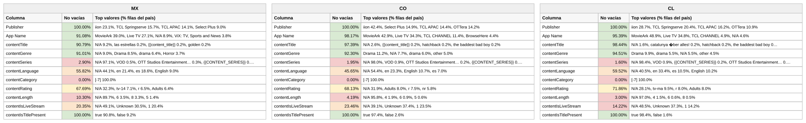

# Reporte — Content objects cuando **contentCategory** viene vacío: México, Colombia y Chile (consolidado v10 a v17)

**Fuente:** `inventory-consolidado-v10-a-v17.csv` — 959,442 filas, 380,355,807,040 requests. **Subconjunto analizado: las 749,518 filas (78.12% del total) donde `contentCategory` no trae dato útil**, que concentran 256,905,347,920 requests (67.54% del total).
**Data completa:** `vacios-contentCategory.json` (top-15 de valores por columna para cada país). Generado con `scripts/analizar.py --solo-vacios-en contentCategory`; las columnas de referencia ("todo el dataset") salen de `reporte-content-objects-detallado-v17-consolidado.json`.

*Una fila cuenta como vacía en `contentCategory` tanto si la celda no trae valor como si trae `Not Available`, `Not Applicable`, `Unknown` o basura equivalente a vacío (`[-7]` en categoría, hash MD5 de cadena vacía en serie). Los porcentajes de este reporte son **sobre las filas del subconjunto** (las que tienen `contentCategory` vacío), salvo donde se indique "todo el dataset".*

## Tamaño del subconjunto por país

| País | Filas con la columna vacía | % de las filas del país | % de los requests del país | eCPM pond. del subconjunto (todo el país) |
|---|---:|---:|---:|---:|
| México | 233,931 | 76.9% | 62.1% | 2.488 (3.107) |
| Colombia | 79,378 | 78.2% | 75.3% | 6.588 (5.849) |
| Chile | 89,980 | 83.9% | 74.3% | 6.514 (6.104) |

## Comparativo de % de filas no vacías de las demás columnas

Porcentaje de filas del subconjunto con dato útil en cada una de las otras columnas. Entre paréntesis, el mismo porcentaje en **todo el dataset** del país: la diferencia dice si el vacío de `contentCategory` viene acompañado de otros vacíos o no.

**Campos de app / vendedor:**

| Columna | México | Colombia | Chile |
|---|---:|---:|---:|
| Publisher | 100% (100%) | 100% (100%) | 100% (100%) |
| App Name | 91.1% (87.5%) | 98.2% (97.3%) | 95.4% (94.8%) |

**Content objects:**

| Columna | México | Colombia | Chile |
|---|---:|---:|---:|
| contentIsTitlePresent | 100% (100%) | 100% (100%) | 100% (100%) |
| contentGenre | 91.0% (92.1%) | 92.3% (93.0%) | 94.5% (94.6%) |
| contentTitle | 90.8% (87.0%) | 97.4% (95.6%) | 98.4% (97.1%) |
| contentRating | 67.7% (70.5%) | 68.1% (69.8%) | 71.9% (72.1%) |
| contentLanguage | 55.8% (62.1%) | 45.6% (53.3%) | 59.5% (62.6%) |
| contentIsLiveStream | 20.4% (25.0%) | 23.5% (26.7%) | 14.2% (18.9%) |
| contentLength | 10.3% (15.2%) | 4.2% (10.9%) | 3.0% (9.1%) |
| contentSeries | 2.9% (6.4%) | 1.9% (6.8%) | 1.6% (6.3%) |

*En negrilla, las columnas que pierden 10 puntos o más de completitud dentro del subconjunto respecto a todo el dataset.*

Versión visual con los tres países lado a lado (semáforo por % de filas no vacías dentro del subconjunto):

*(Generada con `scripts/generar_visual_paises.py` a partir del JSON de este reporte.)*

## México — 233,931 filas con `contentCategory` vacío (76.9% del país) · 62.1% de los requests del país

eCPM del subconjunto: 77.23% de filas en cero (todo el país: 79.54%) · media no-cero 1.984 · **ponderado 2.488** (todo el país: 3.107)

**Campos de app / vendedor:**

| Columna | % de filas no vacías | Top 3 referencias (% filas del subconjunto) |
|---|---:|---|
| Publisher | 100% | iion 23.1%, TCL Springserve 15.7%, TCL APAC 14.1% |
| App Name | 91.1% | MovieArk 39.0%, Live TV 27.1%, *N/A 8.9%* |

**Content objects:**

| Columna | % de filas no vacías | Top 3 referencias (% filas del subconjunto) |
|---|---:|---|
| contentIsTitlePresent | 100% | true 90.8%, false 9.2% |
| contentGenre | 91.0% | *N/A 9.0%*, Drama 8.5%, drama 6.4% |
| contentTitle | 90.8% | *N/A 9.2%*, las estrellas 0.2%, *{{content_title}} 0.2%* |
| contentRating | 67.7% | *N/A 32.3%*, tv-14 7.1%, r 6.5% |
| contentLanguage | 55.8% | *N/A 44.1%*, en 21.4%, es 18.6% |
| contentIsLiveStream | 20.4% | *N/A 49.1%*, *Unknown 30.5%*, 1 20.4% |
| contentLength | 10.3% | *N/A 89.7%*, 6 3.5%, 8 3.3% |
| contentSeries | 2.9% | *N/A 97.1%*, VOD 0.5%, OTT Studios Ent. 0.3% |

## Colombia — 79,378 filas con `contentCategory` vacío (78.2% del país) · 75.3% de los requests del país

eCPM del subconjunto: 84.47% de filas en cero (todo el país: 85.69%) · media no-cero 4.386 · **ponderado 6.588** (todo el país: 5.849)

**Campos de app / vendedor:**

| Columna | % de filas no vacías | Top 3 referencias (% filas del subconjunto) |
|---|---:|---|
| Publisher | 100% | iion 42.4%, Select Plus 14.9%, TCL APAC 14.4% |
| App Name | 98.2% | MovieArk 42.9%, Live TV 34.3%, TCL CHANNEL 11.4% |

**Content objects:**

| Columna | % de filas no vacías | Top 3 referencias (% filas del subconjunto) |
|---|---:|---|
| contentIsTitlePresent | 100% | true 97.4%, false 2.6% |
| contentGenre | 92.3% | Drama 11.2%, *N/A 7.7%*, drama 6.0% |
| contentTitle | 97.4% | *N/A 2.6%*, *{{content_title}} 0.2%*, hatchback 0.2% |
| contentRating | 68.1% | *N/A 31.9%*, Adults 8.0%, r 7.5% |
| contentLanguage | 45.6% | *N/A 54.4%*, en 23.3%, English 10.7% |
| contentIsLiveStream | 23.5% | *N/A 39.1%*, *Unknown 37.4%*, 1 23.5% |
| contentLength | 4.2% | *N/A 95.8%*, 4 1.9%, 6 0.9% |
| contentSeries | 1.9% | *N/A 98.0%*, VOD 0.9%, OTT Studios Ent. 0.2% |

## Chile — 89,980 filas con `contentCategory` vacío (83.9% del país) · 74.3% de los requests del país

eCPM del subconjunto: 75.32% de filas en cero (todo el país: 77.11%) · media no-cero 6.547 · **ponderado 6.514** (todo el país: 6.104)

**Campos de app / vendedor:**

| Columna | % de filas no vacías | Top 3 referencias (% filas del subconjunto) |
|---|---:|---|
| Publisher | 100% | iion 28.7%, TCL Springserve 20.4%, TCL APAC 16.2% |
| App Name | 95.4% | MovieArk 48.9%, Live TV 34.8%, TCL CHANNEL 4.9% |

**Content objects:**

| Columna | % de filas no vacías | Top 3 referencias (% filas del subconjunto) |
|---|---:|---|
| contentIsTitlePresent | 100% | true 98.4%, false 1.6% |
| contentGenre | 94.5% | Drama 9.9%, drama 5.5%, *N/A 5.5%* |
| contentTitle | 98.4% | *N/A 1.6%*, catalunya �ber alles! 0.2%, hatchback 0.2% |
| contentRating | 71.9% | *N/A 28.1%*, tv-ma 9.5%, r 8.0% |
| contentLanguage | 59.5% | *N/A 40.5%*, en 33.4%, es 10.5% |
| contentIsLiveStream | 14.2% | *N/A 48.5%*, *Unknown 37.3%*, 1 14.2% |
| contentLength | 3.0% | *N/A 97.0%*, 4 1.5%, 6 0.6% |
| contentSeries | 1.6% | *N/A 98.4%*, VOD 0.9%, *{{CONTENT_SERIES}} 0.2%* |

---

## Conclusiones — cuando falta la categoría

- **Es la norma, no la excepción**: 78% de las filas y 67.5% de los requests. El subconjunto es, en la práctica, "todo el dataset menos Roku, Vidaa y Coocaa" — los tres únicos publishers que mandan `[IAB…]` de forma consistente. Por eso su perfil casi calca al del país: mismos vendedores (iion 24%, OTTera 17%, TCL 31%, Select Plus 11%), mismas apps (MovieArk 41%, Live TV 26%, TCL Channel 14%).
- **Lo que sí cambia**: las otras dos columnas "estructurales" caen con ella — **contentLength 5.6% (12.2% en todo el dataset) y contentSeries 1.9% (6.7%)**. Categoría, duración y serie las manda el mismo puñado de rutas; donde falta una, faltan las tres.
- **Lo descriptivo se mantiene**: género 93%, título 95%, rating 72%, idioma 61% — casi iguales al dataset. Es decir, la categoría IAB se puede derivar del género en más del 90% de estas filas (es lo que hace el pipeline de relleno: 22% → 94%).
- **Precio**: en México el tráfico sin categoría paga 2.49 contra 3.11 del país; en Colombia y Chile pasa lo contrario (6.59 vs 5.85; 6.51 vs 6.10). La categoría IAB no explica el precio: lo explica quién vende (Roku en México sí manda categoría y cobra 5.3).
