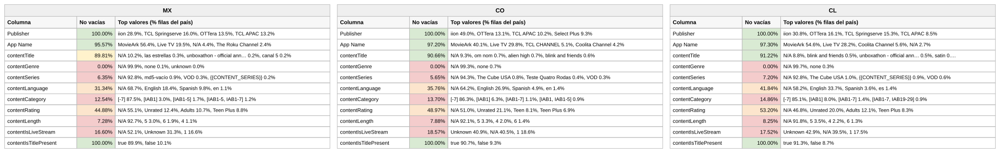

# Reporte — Content objects cuando **contentGenre** viene vacío: México, Colombia y Chile (consolidado v10 a v17)

**Fuente:** `inventory-consolidado-v10-a-v17.csv` — 959,442 filas, 380,355,807,040 requests. **Subconjunto analizado: las 60,981 filas (6.36% del total) donde `contentGenre` no trae dato útil**, que concentran 52,768,176,320 requests (13.87% del total).
**Data completa:** `vacios-contentGenre.json` (top-15 de valores por columna para cada país). Generado con `scripts/analizar.py --solo-vacios-en contentGenre`; las columnas de referencia ("todo el dataset") salen de `reporte-content-objects-detallado-v17-consolidado.json`.

*Una fila cuenta como vacía en `contentGenre` tanto si la celda no trae valor como si trae `Not Available`, `Not Applicable`, `Unknown` o basura equivalente a vacío (`[-7]` en categoría, hash MD5 de cadena vacía en serie). Los porcentajes de este reporte son **sobre las filas del subconjunto** (las que tienen `contentGenre` vacío), salvo donde se indique "todo el dataset".*

## Tamaño del subconjunto por país

| País | Filas con la columna vacía | % de las filas del país | % de los requests del país | eCPM pond. del subconjunto (todo el país) |
|---|---:|---:|---:|---:|
| México | 24,044 | 7.9% | 12.2% | 2.795 (3.107) |
| Colombia | 7,080 | 7.0% | 12.4% | 3.276 (5.849) |
| Chile | 5,806 | 5.4% | 10.2% | 8.115 (6.104) |

## Comparativo de % de filas no vacías de las demás columnas

Porcentaje de filas del subconjunto con dato útil en cada una de las otras columnas. Entre paréntesis, el mismo porcentaje en **todo el dataset** del país: la diferencia dice si el vacío de `contentGenre` viene acompañado de otros vacíos o no.

**Campos de app / vendedor:**

| Columna | México | Colombia | Chile |
|---|---:|---:|---:|
| Publisher | 100% (100%) | 100% (100%) | 100% (100%) |
| App Name | 95.6% (87.5%) | 97.2% (97.3%) | 97.3% (94.8%) |

**Content objects:**

| Columna | México | Colombia | Chile |
|---|---:|---:|---:|
| contentIsTitlePresent | 100% (100%) | 100% (100%) | 100% (100%) |
| contentTitle | 89.8% (87.0%) | 90.7% (95.6%) | 91.2% (97.1%) |
| contentRating | **44.9% (70.5%)** | **49.0% (69.8%)** | **53.2% (72.1%)** |
| contentLanguage | **31.3% (62.1%)** | **35.8% (53.3%)** | **41.8% (62.6%)** |
| contentIsLiveStream | 16.6% (25.0%) | 18.6% (26.7%) | 17.5% (18.9%) |
| contentCategory | **12.5% (23.1%)** | 13.7% (21.8%) | 14.9% (16.1%) |
| contentLength | 7.3% (15.2%) | 7.9% (10.9%) | 8.2% (9.1%) |
| contentSeries | 6.3% (6.4%) | 5.7% (6.8%) | 7.2% (6.3%) |

*En negrilla, las columnas que pierden 10 puntos o más de completitud dentro del subconjunto respecto a todo el dataset.*

Versión visual con los tres países lado a lado (semáforo por % de filas no vacías dentro del subconjunto):

*(Generada con `scripts/generar_visual_paises.py` a partir del JSON de este reporte.)*

## México — 24,044 filas con `contentGenre` vacío (7.9% del país) · 12.2% de los requests del país

eCPM del subconjunto: 79.38% de filas en cero (todo el país: 79.54%) · media no-cero 1.969 · **ponderado 2.795** (todo el país: 3.107)

**Campos de app / vendedor:**

| Columna | % de filas no vacías | Top 3 referencias (% filas del subconjunto) |
|---|---:|---|
| Publisher | 100% | iion 28.9%, TCL Springserve 16.0%, OTTera 13.5% |
| App Name | 95.6% | MovieArk 56.4%, Live TV 19.5%, *N/A 4.4%* |

**Content objects:**

| Columna | % de filas no vacías | Top 3 referencias (% filas del subconjunto) |
|---|---:|---|
| contentIsTitlePresent | 100% | true 89.9%, false 10.1% |
| contentTitle | 89.8% | *N/A 10.2%*, las estrellas 0.3%, unboxathon - official annou… 0.2% |
| contentRating | 44.9% | *N/A 55.1%*, Unrated 12.4%, Adults 10.7% |
| contentLanguage | 31.3% | *N/A 68.7%*, English 18.4%, Spanish 9.8% |
| contentIsLiveStream | 16.6% | *N/A 52.1%*, *Unknown 31.3%*, 1 16.6% |
| contentCategory | 12.5% | *[-7] 87.5%*, [IAB1] 3.0%, [IAB1-5] 1.7% |
| contentLength | 7.3% | *N/A 92.7%*, 5 3.0%, 6 1.9% |
| contentSeries | 6.3% | *N/A 92.8%*, *md5-vacío 0.9%*, VOD 0.3% |

## Colombia — 7,080 filas con `contentGenre` vacío (7.0% del país) · 12.4% de los requests del país

eCPM del subconjunto: 87.25% de filas en cero (todo el país: 85.69%) · media no-cero 4.154 · **ponderado 3.276** (todo el país: 5.849)

**Campos de app / vendedor:**

| Columna | % de filas no vacías | Top 3 referencias (% filas del subconjunto) |
|---|---:|---|
| Publisher | 100% | iion 49.0%, OTTera 13.1%, TCL APAC 10.2% |
| App Name | 97.2% | MovieArk 40.1%, Live TV 29.8%, TCL CHANNEL 5.1% |

**Content objects:**

| Columna | % de filas no vacías | Top 3 referencias (% filas del subconjunto) |
|---|---:|---|
| contentIsTitlePresent | 100% | true 90.7%, false 9.3% |
| contentTitle | 90.7% | *N/A 9.3%*, om nom 0.7%, alien high 0.7% |
| contentRating | 49.0% | *N/A 51.0%*, Unrated 21.1%, Teen 8.1% |
| contentLanguage | 35.8% | *N/A 64.2%*, English 26.9%, Spanish 4.9% |
| contentIsLiveStream | 18.6% | *Unknown 40.9%*, *N/A 40.5%*, 1 18.6% |
| contentCategory | 13.7% | *[-7] 86.3%*, [IAB1] 6.3%, [IAB1-7] 1.1% |
| contentLength | 7.9% | *N/A 92.1%*, 5 3.3%, 4 2.0% |
| contentSeries | 5.7% | *N/A 94.3%*, The Cube USA 0.8%, Teste Quatro Rodas 0.4% |

## Chile — 5,806 filas con `contentGenre` vacío (5.4% del país) · 10.2% de los requests del país

eCPM del subconjunto: 78.56% de filas en cero (todo el país: 77.11%) · media no-cero 5.919 · **ponderado 8.115** (todo el país: 6.104)

**Campos de app / vendedor:**

| Columna | % de filas no vacías | Top 3 referencias (% filas del subconjunto) |
|---|---:|---|
| Publisher | 100% | iion 30.8%, OTTera 16.1%, TCL Springserve 15.3% |
| App Name | 97.3% | MovieArk 54.6%, Live TV 28.2%, Coolita Channel 5.6% |

**Content objects:**

| Columna | % de filas no vacías | Top 3 referencias (% filas del subconjunto) |
|---|---:|---|
| contentIsTitlePresent | 100% | true 91.3%, false 8.7% |
| contentTitle | 91.2% | *N/A 8.8%*, blink and friends 0.5%, unboxathon - official annou… 0.5% |
| contentRating | 53.2% | *N/A 46.8%*, Unrated 20.0%, Adults 12.1% |
| contentLanguage | 41.8% | *N/A 58.2%*, English 33.7%, Spanish 3.6% |
| contentIsLiveStream | 17.5% | *Unknown 42.9%*, *N/A 39.5%*, 1 17.5% |
| contentCategory | 14.9% | *[-7] 85.1%*, [IAB1] 8.0%, [IAB1-7] 1.4% |
| contentLength | 8.2% | *N/A 91.8%*, 5 3.5%, 4 2.2% |
| contentSeries | 7.2% | *N/A 92.8%*, The Cube USA 1.0%, *{{CONTENT_SERIES}} 0.9%* |

---

## Conclusiones — cuando falta el género

- **Es un vacío chico pero pesado**: 6.4% de las filas del consolidado concentran el 13.9% de los requests. México pone el 53% de esos requests (12.2% del tráfico mexicano va sin género).
- **Viene en paquete con la escritura nueva del reporte.** En el subconjunto dominan los valores de la lista cerrada (`Unrated`, `Adults`, `Teen`, `English`, `Spanish`) y el `Not Applicable` de la plataforma: cuando el género falta, **rating (52% vs 74% en todo el dataset) e idioma (40% vs 66%) faltan también**. No es que el vendedor no mande género: es que la normalización de la fuente descartó las tres cosas a la vez.
- **Quién lo produce**: iion (30% del subconjunto; 49% en Colombia), OTTera (17%) y las dos rutas TCL (23%) — todo catálogo MovieArk (48%) y Live TV (20%).
- **Lo recuperable**: el título sí viene (88–91% de las filas del subconjunto), así que el relleno intra-título tiene de dónde copiar; la categoría, en cambio, está vacía en el 86% y no se puede derivar del género porque no hay género — es el único caso en que la cadena género → categoría se rompe.
- **Precio**: el tráfico sin género no es barato — en Chile paga 8.1 de eCPM ponderado contra 6.1 del país, y en México 2.8 contra 3.1. El vacío de género no penaliza la venta.
