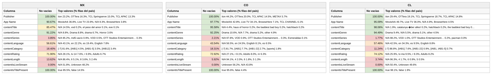

# Reporte — Content objects cuando **contentIsLiveStream** viene vacío: México, Colombia y Chile (consolidado v10 a v17)

**Fuente:** `inventory-consolidado-v10-a-v17.csv` — 959,442 filas, 380,355,807,040 requests. **Subconjunto analizado: las 683,273 filas (71.22% del total) donde `contentIsLiveStream` no trae dato útil**, que concentran 220,172,328,800 requests (57.89% del total).
**Data completa:** `vacios-contentIsLiveStream.json` (top-15 de valores por columna para cada país). Generado con `scripts/analizar.py --solo-vacios-en contentIsLiveStream`; las columnas de referencia ("todo el dataset") salen de `reporte-content-objects-detallado-v17-consolidado.json`.

*Una fila cuenta como vacía en `contentIsLiveStream` tanto si la celda no trae valor como si trae `Not Available`, `Not Applicable`, `Unknown` o basura equivalente a vacío (`[-7]` en categoría, hash MD5 de cadena vacía en serie). Los porcentajes de este reporte son **sobre las filas del subconjunto** (las que tienen `contentIsLiveStream` vacío), salvo donde se indique "todo el dataset".*

## Tamaño del subconjunto por país

| País | Filas con la columna vacía | % de las filas del país | % de los requests del país | eCPM pond. del subconjunto (todo el país) |
|---|---:|---:|---:|---:|
| México | 228,336 | 75.0% | 56.0% | 2.781 (3.107) |
| Colombia | 74,375 | 73.3% | 63.6% | 6.895 (5.849) |
| Chile | 86,954 | 81.1% | 78.5% | 6.346 (6.104) |

## Comparativo de % de filas no vacías de las demás columnas

Porcentaje de filas del subconjunto con dato útil en cada una de las otras columnas. Entre paréntesis, el mismo porcentaje en **todo el dataset** del país: la diferencia dice si el vacío de `contentIsLiveStream` viene acompañado de otros vacíos o no.

**Campos de app / vendedor:**

| Columna | México | Colombia | Chile |
|---|---:|---:|---:|
| Publisher | 100% (100%) | 100% (100%) | 100% (100%) |
| App Name | 90.7% (87.5%) | 97.8% (97.3%) | 95.1% (94.8%) |

**Content objects:**

| Columna | México | Colombia | Chile |
|---|---:|---:|---:|
| contentIsTitlePresent | 100% (100%) | 100% (100%) | 100% (100%) |
| contentGenre | 91.2% (92.1%) | 92.2% (93.0%) | 94.5% (94.6%) |
| contentTitle | 85.5% (87.0%) | 95.6% (95.6%) | 98.1% (97.1%) |
| contentRating | 71.9% (70.5%) | 72.9% (69.8%) | 74.1% (72.1%) |
| contentLanguage | 56.6% (62.1%) | 43.5% (53.3%) | 57.5% (62.6%) |
| contentCategory | 18.4% (23.1%) | 18.3% (21.8%) | 11.2% (16.1%) |
| contentLength | 13.6% (15.2%) | 5.9% (10.9%) | 3.7% (9.1%) |
| contentSeries | 3.9% (6.4%) | 2.2% (6.8%) | 1.8% (6.3%) |

*En negrilla, las columnas que pierden 10 puntos o más de completitud dentro del subconjunto respecto a todo el dataset.*

Versión visual con los tres países lado a lado (semáforo por % de filas no vacías dentro del subconjunto):

*(Generada con `scripts/generar_visual_paises.py` a partir del JSON de este reporte.)*

## México — 228,336 filas con `contentIsLiveStream` vacío (75.0% del país) · 56.0% de los requests del país

eCPM del subconjunto: 77.25% de filas en cero (todo el país: 79.54%) · media no-cero 1.974 · **ponderado 2.781** (todo el país: 3.107)

**Campos de app / vendedor:**

| Columna | % de filas no vacías | Top 3 referencias (% filas del subconjunto) |
|---|---:|---|
| Publisher | 100% | iion 23.2%, OTTera 16.3%, TCL Springserve 15.0% |
| App Name | 90.7% | MovieArk 36.8%, Live TV 23.9%, *N/A 9.3%* |

**Content objects:**

| Columna | % de filas no vacías | Top 3 referencias (% filas del subconjunto) |
|---|---:|---|
| contentIsTitlePresent | 100% | true 85.5%, false 14.5% |
| contentGenre | 91.2% | *N/A 8.8%*, Drama 8.8%, drama 6.7% |
| contentTitle | 85.5% | *N/A 14.5%*, vod 0.2%, el peso del amor 0.1% |
| contentRating | 71.9% | *N/A 28.1%*, tv-14 7.6%, r 6.9% |
| contentLanguage | 56.6% | *N/A 43.1%*, en 22.2%, es 19.4% |
| contentCategory | 18.4% | *[-7] 81.6%*, [IAB1] 4.5%, [IAB1-5] 3.5% |
| contentLength | 13.6% | *N/A 86.4%*, 6 5.1%, 8 3.6% |
| contentSeries | 3.9% | *N/A 95.2%*, *md5-vacío 0.9%*, VOD 0.5% |

## Colombia — 74,375 filas con `contentIsLiveStream` vacío (73.3% del país) · 63.6% de los requests del país

eCPM del subconjunto: 83.69% de filas en cero (todo el país: 85.69%) · media no-cero 4.324 · **ponderado 6.895** (todo el país: 5.849)

**Campos de app / vendedor:**

| Columna | % de filas no vacías | Top 3 referencias (% filas del subconjunto) |
|---|---:|---|
| Publisher | 100% | iion 44.2%, OTTera 20.0%, TCL APAC 14.5% |
| App Name | 97.8% | MovieArk 42.8%, Live TV 34.1%, BrowseHere 7.1% |

**Content objects:**

| Columna | % de filas no vacías | Top 3 referencias (% filas del subconjunto) |
|---|---:|---|
| contentIsTitlePresent | 100% | true 95.6%, false 4.4% |
| contentGenre | 92.2% | Drama 10.6%, *N/A 7.7%*, drama 5.2% |
| contentTitle | 95.6% | *N/A 4.4%*, haus of horror 0.2%, the baddest bad boy 0.2% |
| contentRating | 72.9% | *N/A 27.1%*, r 8.1%, Adults 8.0% |
| contentLanguage | 43.5% | *N/A 56.5%*, en 24.5%, English 8.1% |
| contentCategory | 18.3% | *[-7] 81.7%*, [IAB1] 7.7%, [IAB1-22] 2.7% |
| contentLength | 5.9% | *N/A 94.1%*, 4 2.0%, 6 1.8% |
| contentSeries | 2.2% | *N/A 97.8%*, VOD 0.9%, OTT Studios Ent. 0.3% |

## Chile — 86,954 filas con `contentIsLiveStream` vacío (81.1% del país) · 78.5% de los requests del país

eCPM del subconjunto: 74.72% de filas en cero (todo el país: 77.11%) · media no-cero 6.474 · **ponderado 6.346** (todo el país: 6.104)

**Campos de app / vendedor:**

| Columna | % de filas no vacías | Top 3 referencias (% filas del subconjunto) |
|---|---:|---|
| Publisher | 100% | iion 29.4%, OTTera 19.1%, TCL Springserve 18.7% |
| App Name | 95.1% | MovieArk 49.7%, Live TV 36.0%, *N/A 4.9%* |

**Content objects:**

| Columna | % de filas no vacías | Top 3 referencias (% filas del subconjunto) |
|---|---:|---|
| contentIsTitlePresent | 100% | true 98.1%, false 1.9% |
| contentGenre | 94.5% | Drama 9.4%, *N/A 5.5%*, drama 5.1% |
| contentTitle | 98.1% | *N/A 1.9%*, catalunya �ber alles! 0.2%, hatchback 0.2% |
| contentRating | 74.1% | *N/A 25.9%*, tv-ma 9.5%, r 8.3% |
| contentLanguage | 57.5% | *N/A 42.5%*, en 34.3%, es 9.5% |
| contentCategory | 11.2% | *[-7] 88.8%*, [IAB1] 7.6%, [IAB1-22] 0.9% |
| contentLength | 3.7% | *N/A 96.3%*, 4 1.7%, 6 0.9% |
| contentSeries | 1.8% | *N/A 98.2%*, VOD 1.0%, OTT Studios Ent. 0.2% |

---

## Conclusiones — cuando falta livestream

- **71% de las filas y 58% de los requests**. Como el valor declarado es siempre `1` (ver reporte de relleno), "vacío" aquí significa "la ruta no lo manda", y eso es iion (26%), OTTera (24%) y las dos TCL (27%): el pool MovieArk (40%) + Live TV (27%) + BrowseHere (10%).
- **Lo descriptivo no cambia** (género 93%, título 92%, rating 77.5% — incluso mejor que el dataset); **lo estructural sí**: serie 2.6% (6.7%), length 8.2% (12.2%), categoría 18.3% (21.9%).
- **El vacío es en parte resoluble por app, no por título**: Live TV de TCL (27% del subconjunto) y Coolita son servicios 100% lineales, y el pipeline los marca `1` por semántica de app (20 puntos). MovieArk (40%) es mixto y se deja vacío a propósito: ni el título ni la app determinan el modo de entrega.
- **Precio**: sin diferencia relevante (2.78 vs 3.11 en México; 6.90 vs 5.85 en Colombia; 6.35 vs 6.10 en Chile). Chile es el país con más filas sin livestream (81% del país).
