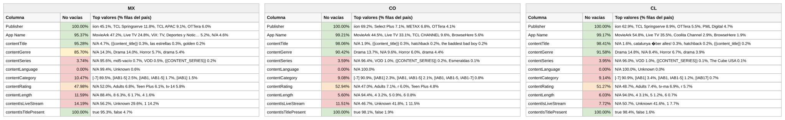

# Reporte — Content objects cuando **contentLanguage** viene vacío: México, Colombia y Chile (consolidado v10 a v17)

**Fuente:** `inventory-consolidado-v10-a-v17.csv` — 959,442 filas, 380,355,807,040 requests. **Subconjunto analizado: las 323,330 filas (33.7% del total) donde `contentLanguage` no trae dato útil**, que concentran 122,791,702,560 requests (32.28% del total).
**Data completa:** `vacios-contentLanguage.json` (top-15 de valores por columna para cada país). Generado con `scripts/analizar.py --solo-vacios-en contentLanguage`; las columnas de referencia ("todo el dataset") salen de `reporte-content-objects-detallado-v17-consolidado.json`.

*Una fila cuenta como vacía en `contentLanguage` tanto si la celda no trae valor como si trae `Not Available`, `Not Applicable`, `Unknown` o basura equivalente a vacío (`[-7]` en categoría, hash MD5 de cadena vacía en serie). Los porcentajes de este reporte son **sobre las filas del subconjunto** (las que tienen `contentLanguage` vacío), salvo donde se indique "todo el dataset".*

## Tamaño del subconjunto por país

| País | Filas con la columna vacía | % de las filas del país | % de los requests del país | eCPM pond. del subconjunto (todo el país) |
|---|---:|---:|---:|---:|
| México | 115,443 | 37.9% | 31.2% | 2.689 (3.107) |
| Colombia | 47,452 | 46.7% | 45.0% | 8.678 (5.849) |
| Chile | 40,090 | 37.4% | 32.1% | 6.703 (6.104) |

## Comparativo de % de filas no vacías de las demás columnas

Porcentaje de filas del subconjunto con dato útil en cada una de las otras columnas. Entre paréntesis, el mismo porcentaje en **todo el dataset** del país: la diferencia dice si el vacío de `contentLanguage` viene acompañado de otros vacíos o no.

**Campos de app / vendedor:**

| Columna | México | Colombia | Chile |
|---|---:|---:|---:|
| Publisher | 100% (100%) | 100% (100%) | 100% (100%) |
| App Name | 95.4% (87.5%) | 99.2% (97.3%) | 99.2% (94.8%) |

**Content objects:**

| Columna | México | Colombia | Chile |
|---|---:|---:|---:|
| contentIsTitlePresent | 100% (100%) | 100% (100%) | 100% (100%) |
| contentGenre | 85.7% (92.1%) | 90.4% (93.0%) | 91.6% (94.6%) |
| contentTitle | 95.3% (87.0%) | 98.1% (95.6%) | 98.4% (97.1%) |
| contentRating | **48.0% (70.5%)** | **52.9% (69.8%)** | **51.3% (72.1%)** |
| contentIsLiveStream | **14.2% (25.0%)** | **11.5% (26.7%)** | **7.7% (18.9%)** |
| contentCategory | **10.5% (23.1%)** | **9.1% (21.8%)** | 9.1% (16.1%) |
| contentLength | 11.6% (15.2%) | 5.6% (10.9%) | 6.0% (9.1%) |
| contentSeries | 3.7% (6.4%) | 3.6% (6.8%) | 4.0% (6.3%) |

*En negrilla, las columnas que pierden 10 puntos o más de completitud dentro del subconjunto respecto a todo el dataset.*

Versión visual con los tres países lado a lado (semáforo por % de filas no vacías dentro del subconjunto):

*(Generada con `scripts/generar_visual_paises.py` a partir del JSON de este reporte.)*

## México — 115,443 filas con `contentLanguage` vacío (37.9% del país) · 31.2% de los requests del país

eCPM del subconjunto: 75.18% de filas en cero (todo el país: 79.54%) · media no-cero 2.159 · **ponderado 2.689** (todo el país: 3.107)

**Campos de app / vendedor:**

| Columna | % de filas no vacías | Top 3 referencias (% filas del subconjunto) |
|---|---:|---|
| Publisher | 100% | iion 45.1%, TCL Springserve 11.8%, TCL APAC 9.1% |
| App Name | 95.4% | MovieArk 47.2%, Live TV 24.8%, ViX (Deportes y Noticias) 5.2% |

**Content objects:**

| Columna | % de filas no vacías | Top 3 referencias (% filas del subconjunto) |
|---|---:|---|
| contentIsTitlePresent | 100% | true 95.3%, false 4.7% |
| contentGenre | 85.7% | *N/A 14.3%*, Drama 14.0%, Horror 5.7% |
| contentTitle | 95.3% | *N/A 4.7%*, *{{content_title}} 0.3%*, las estrellas 0.3% |
| contentRating | 48.0% | *N/A 52.0%*, Adults 6.8%, Teen Plus 6.1% |
| contentIsLiveStream | 14.2% | *N/A 56.2%*, *Unknown 29.6%*, 1 14.2% |
| contentCategory | 10.5% | *[-7] 89.5%*, [IAB1-5] 2.5%, [IAB1, IAB1-5] 1.7% |
| contentLength | 11.6% | *N/A 88.4%*, 8 6.3%, 6 1.7% |
| contentSeries | 3.7% | *N/A 95.6%*, *md5-vacío 0.7%*, VOD 0.5% |

## Colombia — 47,452 filas con `contentLanguage` vacío (46.7% del país) · 45.0% de los requests del país

eCPM del subconjunto: 89.12% de filas en cero (todo el país: 85.69%) · media no-cero 7.734 · **ponderado 8.678** (todo el país: 5.849)

**Campos de app / vendedor:**

| Columna | % de filas no vacías | Top 3 referencias (% filas del subconjunto) |
|---|---:|---|
| Publisher | 100% | iion 69.2%, Select Plus 7.1%, METAX 6.8% |
| App Name | 99.2% | MovieArk 44.5%, Live TV 33.1%, TCL CHANNEL 9.6% |

**Content objects:**

| Columna | % de filas no vacías | Top 3 referencias (% filas del subconjunto) |
|---|---:|---|
| contentIsTitlePresent | 100% | true 98.1%, false 1.9% |
| contentGenre | 90.4% | Drama 13.7%, *N/A 9.6%*, Horror 6.0% |
| contentTitle | 98.1% | *N/A 1.9%*, *{{content_title}} 0.3%*, hatchback 0.2% |
| contentRating | 52.9% | *N/A 47.0%*, Adults 7.1%, r 6.0% |
| contentIsLiveStream | 11.5% | *N/A 46.7%*, *Unknown 41.8%*, 1 11.5% |
| contentCategory | 9.1% | *[-7] 90.9%*, [IAB1] 2.3%, [IAB1, IAB1-5] 2.1% |
| contentLength | 5.6% | *N/A 94.4%*, 4 3.2%, 5 0.9% |
| contentSeries | 3.6% | *N/A 96.4%*, VOD 1.0%, *{{CONTENT_SERIES}} 0.2%* |

## Chile — 40,090 filas con `contentLanguage` vacío (37.4% del país) · 32.1% de los requests del país

eCPM del subconjunto: 88.41% de filas en cero (todo el país: 77.11%) · media no-cero 5.36 · **ponderado 6.703** (todo el país: 6.104)

**Campos de app / vendedor:**

| Columna | % de filas no vacías | Top 3 referencias (% filas del subconjunto) |
|---|---:|---|
| Publisher | 100% | iion 62.9%, TCL Springserve 8.9%, OTTera 5.5% |
| App Name | 99.2% | MovieArk 54.8%, Live TV 35.5%, Coolita Channel 2.9% |

**Content objects:**

| Columna | % de filas no vacías | Top 3 referencias (% filas del subconjunto) |
|---|---:|---|
| contentIsTitlePresent | 100% | true 98.4%, false 1.6% |
| contentGenre | 91.6% | Drama 14.8%, *N/A 8.4%*, Horror 6.7% |
| contentTitle | 98.4% | *N/A 1.6%*, catalunya �ber alles! 0.3%, hatchback 0.2% |
| contentRating | 51.3% | *N/A 48.7%*, Adults 7.4%, tv-ma 6.9% |
| contentIsLiveStream | 7.7% | *N/A 50.7%*, *Unknown 41.6%*, 1 7.7% |
| contentCategory | 9.1% | *[-7] 90.9%*, [IAB1] 3.4%, [IAB1, IAB1-5] 1.2% |
| contentLength | 6.0% | *N/A 94.0%*, 4 3.1%, 5 1.2% |
| contentSeries | 4.0% | *N/A 96.0%*, VOD 1.0%, *{{CONTENT_SERIES}} 0.1%* |

---

## Conclusiones — cuando falta el idioma

- **Un tercio del dataset (33.7% de filas, 32% de requests) y un solo responsable principal: iion, 55% del subconjunto** (69% en Colombia, 63% en Chile, 45% en México). iion despoja el idioma en el 97% de sus filas cuando sus rutas hermanas TCL lo mandan en 77–82%. El resto del vacío es la escritura nueva del reporte, que trae `Not Applicable` de idioma en la mitad de sus filas.
- **Viene en paquete con otros vacíos**: rating 50% (74% en todo el dataset), livestream 15% (29%), categoría 10% (22%). En el subconjunto los ratings que sí aparecen son de la lista cerrada (`Adults`, `Teen Plus`): es la huella de la normalización de la fuente.
- **Lo recuperable es enorme**: el título viene en el 96% de estas filas y el catálogo es el mismo MovieArk/Live TV (73%) que en otras rutas sí trae idioma. Es la columna donde el relleno intra-título más rinde (66% → 96% en el pipeline).
- **Precio y venta**: el tráfico sin idioma es el peor vendido en Colombia (89% de filas en cero) y Chile (88%), pero cuando vende, paga más (8.68 vs 5.85 en Colombia; 6.70 vs 6.10 en Chile). Es el catálogo de vitrina de iion/Select Plus: mucho inventario, poca venta, precio alto. En México pasa lo contrario (2.69 vs 3.11).
