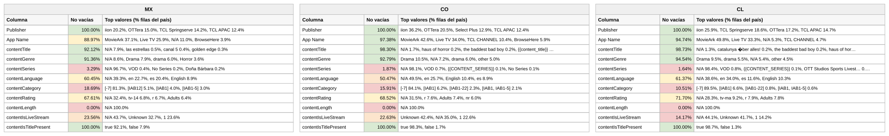

# Reporte — Content objects cuando **contentLength** viene vacío: México, Colombia y Chile (consolidado v10 a v17)

**Fuente:** `inventory-consolidado-v10-a-v17.csv` — 959,442 filas, 380,355,807,040 requests. **Subconjunto analizado: las 842,777 filas (87.84% del total) donde `contentLength` no trae dato útil**, que concentran 284,429,258,880 requests (74.78% del total).
**Data completa:** `vacios-contentLength.json` (top-15 de valores por columna para cada país). Generado con `scripts/analizar.py --solo-vacios-en contentLength`; las columnas de referencia ("todo el dataset") salen de `reporte-content-objects-detallado-v17-consolidado.json`.

*Una fila cuenta como vacía en `contentLength` tanto si la celda no trae valor como si trae `Not Available`, `Not Applicable`, `Unknown` o basura equivalente a vacío (`[-7]` en categoría, hash MD5 de cadena vacía en serie). Los porcentajes de este reporte son **sobre las filas del subconjunto** (las que tienen `contentLength` vacío), salvo donde se indique "todo el dataset".*

## Tamaño del subconjunto por país

| País | Filas con la columna vacía | % de las filas del país | % de los requests del país | eCPM pond. del subconjunto (todo el país) |
|---|---:|---:|---:|---:|
| México | 258,052 | 84.8% | 68.5% | 2.474 (3.107) |
| Colombia | 90,437 | 89.1% | 83.2% | 6.748 (5.849) |
| Chile | 97,526 | 90.9% | 84.7% | 6.516 (6.104) |

## Comparativo de % de filas no vacías de las demás columnas

Porcentaje de filas del subconjunto con dato útil en cada una de las otras columnas. Entre paréntesis, el mismo porcentaje en **todo el dataset** del país: la diferencia dice si el vacío de `contentLength` viene acompañado de otros vacíos o no.

**Campos de app / vendedor:**

| Columna | México | Colombia | Chile |
|---|---:|---:|---:|
| Publisher | 100% (100%) | 100% (100%) | 100% (100%) |
| App Name | 89.0% (87.5%) | 97.4% (97.3%) | 94.7% (94.8%) |

**Content objects:**

| Columna | México | Colombia | Chile |
|---|---:|---:|---:|
| contentIsTitlePresent | 100% (100%) | 100% (100%) | 100% (100%) |
| contentGenre | 91.4% (92.1%) | 92.8% (93.0%) | 94.5% (94.6%) |
| contentTitle | 92.1% (87.0%) | 98.3% (95.6%) | 98.7% (97.1%) |
| contentRating | 67.6% (70.5%) | 68.5% (69.8%) | 71.7% (72.1%) |
| contentLanguage | 60.5% (62.1%) | 50.5% (53.3%) | 61.4% (62.6%) |
| contentIsLiveStream | 23.6% (25.0%) | 22.6% (26.7%) | 14.2% (18.9%) |
| contentCategory | 18.7% (23.1%) | 15.9% (21.8%) | 10.5% (16.1%) |
| contentSeries | 3.3% (6.4%) | 1.9% (6.8%) | 1.6% (6.3%) |

*En negrilla, las columnas que pierden 10 puntos o más de completitud dentro del subconjunto respecto a todo el dataset.*

Versión visual con los tres países lado a lado (semáforo por % de filas no vacías dentro del subconjunto):

*(Generada con `scripts/generar_visual_paises.py` a partir del JSON de este reporte.)*

## México — 258,052 filas con `contentLength` vacío (84.8% del país) · 68.5% de los requests del país

eCPM del subconjunto: 78.73% de filas en cero (todo el país: 79.54%) · media no-cero 1.972 · **ponderado 2.474** (todo el país: 3.107)

**Campos de app / vendedor:**

| Columna | % de filas no vacías | Top 3 referencias (% filas del subconjunto) |
|---|---:|---|
| Publisher | 100% | iion 20.2%, OTTera 15.0%, TCL Springserve 14.2% |
| App Name | 89.0% | MovieArk 37.1%, Live TV 25.9%, *N/A 11.0%* |

**Content objects:**

| Columna | % de filas no vacías | Top 3 referencias (% filas del subconjunto) |
|---|---:|---|
| contentIsTitlePresent | 100% | true 92.1%, false 7.9% |
| contentGenre | 91.4% | *N/A 8.6%*, Drama 7.9%, drama 6.0% |
| contentTitle | 92.1% | *N/A 7.9%*, las estrellas 0.5%, canal 5 0.4% |
| contentRating | 67.6% | *N/A 32.4%*, tv-14 6.8%, r 6.7% |
| contentLanguage | 60.5% | *N/A 39.3%*, en 22.7%, es 20.4% |
| contentIsLiveStream | 23.6% | *N/A 43.7%*, *Unknown 32.7%*, 1 23.6% |
| contentCategory | 18.7% | *[-7] 81.3%*, [IAB12] 5.1%, [IAB1] 4.0% |
| contentSeries | 3.3% | *N/A 96.7%*, VOD 0.4%, No Series 0.2% |

## Colombia — 90,437 filas con `contentLength` vacío (89.1% del país) · 83.2% de los requests del país

eCPM del subconjunto: 85.67% de filas en cero (todo el país: 85.69%) · media no-cero 4.719 · **ponderado 6.748** (todo el país: 5.849)

**Campos de app / vendedor:**

| Columna | % de filas no vacías | Top 3 referencias (% filas del subconjunto) |
|---|---:|---|
| Publisher | 100% | iion 36.2%, OTTera 20.5%, Select Plus 12.9% |
| App Name | 97.4% | MovieArk 42.6%, Live TV 34.0%, TCL CHANNEL 10.4% |

**Content objects:**

| Columna | % de filas no vacías | Top 3 referencias (% filas del subconjunto) |
|---|---:|---|
| contentIsTitlePresent | 100% | true 98.3%, false 1.7% |
| contentGenre | 92.8% | Drama 10.5%, *N/A 7.2%*, drama 6.0% |
| contentTitle | 98.3% | *N/A 1.7%*, haus of horror 0.2%, the baddest bad boy 0.2% |
| contentRating | 68.5% | *N/A 31.5%*, r 7.6%, Adults 7.4% |
| contentLanguage | 50.5% | *N/A 49.5%*, en 25.7%, English 10.4% |
| contentIsLiveStream | 22.6% | *Unknown 42.4%*, *N/A 35.0%*, 1 22.6% |
| contentCategory | 15.9% | *[-7] 84.1%*, [IAB1] 6.2%, [IAB1-22] 2.3% |
| contentSeries | 1.9% | *N/A 98.1%*, VOD 0.7%, *{{CONTENT_SERIES}} 0.1%* |

## Chile — 97,526 filas con `contentLength` vacío (90.9% del país) · 84.7% de los requests del país

eCPM del subconjunto: 77.6% de filas en cero (todo el país: 77.11%) · media no-cero 6.545 · **ponderado 6.516** (todo el país: 6.104)

**Campos de app / vendedor:**

| Columna | % de filas no vacías | Top 3 referencias (% filas del subconjunto) |
|---|---:|---|
| Publisher | 100% | iion 25.9%, TCL Springserve 18.6%, OTTera 17.2% |
| App Name | 94.7% | MovieArk 49.8%, Live TV 33.3%, *N/A 5.3%* |

**Content objects:**

| Columna | % de filas no vacías | Top 3 referencias (% filas del subconjunto) |
|---|---:|---|
| contentIsTitlePresent | 100% | true 98.7%, false 1.3% |
| contentGenre | 94.5% | Drama 9.5%, drama 5.5%, *N/A 5.4%* |
| contentTitle | 98.7% | *N/A 1.3%*, catalunya �ber alles! 0.2%, the baddest bad boy 0.2% |
| contentRating | 71.7% | *N/A 28.3%*, tv-ma 9.2%, r 7.9% |
| contentLanguage | 61.4% | *N/A 38.6%*, en 34.0%, es 11.6% |
| contentIsLiveStream | 14.2% | *N/A 44.1%*, *Unknown 41.7%*, 1 14.2% |
| contentCategory | 10.5% | *[-7] 89.5%*, [IAB1] 6.6%, [IAB1-22] 0.8% |
| contentSeries | 1.6% | *N/A 98.4%*, VOD 0.8%, *{{CONTENT_SERIES}} 0.1%* |

---

## Conclusiones — cuando falta la duración

- **Casi todo el dataset**: 88% de las filas y 75% de los requests. Los que sí mandan `contentLength` son Roku (80% de sus filas), Coocaa (100%) y ViX vía SpringServe (53%, siempre `8`); el resto — OTTera, iion, TCL, Select Plus — no la manda nunca. El subconjunto es ese resto.
- **Sin duración también faltan categoría (16% vs 22%) y serie (2% vs 6.7%)**, y **sobra título** (96% vs 93%): las rutas que mandan duración (Roku, ViX) son precisamente las que no mandan título. Estructura e identidad viajan en rutas distintas.
- **Recordatorio**: el valor de esta columna es un código 1–8, no minutos (ver reporte de relleno). El vacío no se llena desde afuera; lo útil es `ext_runtime_min` vía IMDb, disponible para el 43% del consolidado.
- **Precio**: en México el tráfico sin duración paga 2.47 contra 3.11 — el que la trae es Roku (5.3) y ViX (2.2), y pesa Roku. En Colombia y Chile, al revés (6.75 vs 5.85; 6.52 vs 6.10).
