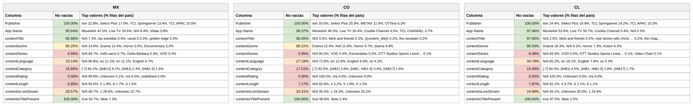

# Reporte — Content objects cuando **contentRating** viene vacío: México, Colombia y Chile (consolidado v10 a v17)

**Fuente:** `inventory-consolidado-v10-a-v17.csv` — 959,442 filas, 380,355,807,040 requests. **Subconjunto analizado: las 246,533 filas (25.7% del total) donde `contentRating` no trae dato útil**, que concentran 98,885,649,280 requests (26.0% del total).
**Data completa:** `vacios-contentRating.json` (top-15 de valores por columna para cada país). Generado con `scripts/analizar.py --solo-vacios-en contentRating`; las columnas de referencia ("todo el dataset") salen de `reporte-content-objects-detallado-v17-consolidado.json`.

*Una fila cuenta como vacía en `contentRating` tanto si la celda no trae valor como si trae `Not Available`, `Not Applicable`, `Unknown` o basura equivalente a vacío (`[-7]` en categoría, hash MD5 de cadena vacía en serie). Los porcentajes de este reporte son **sobre las filas del subconjunto** (las que tienen `contentRating` vacío), salvo donde se indique "todo el dataset".*

## Tamaño del subconjunto por país

| País | Filas con la columna vacía | % de las filas del país | % de los requests del país | eCPM pond. del subconjunto (todo el país) |
|---|---:|---:|---:|---:|
| México | 89,816 | 29.5% | 26.5% | 2.387 (3.107) |
| Colombia | 30,664 | 30.2% | 28.6% | 4.786 (5.849) |
| Chile | 29,956 | 27.9% | 21.7% | 6.671 (6.104) |

## Comparativo de % de filas no vacías de las demás columnas

Porcentaje de filas del subconjunto con dato útil en cada una de las otras columnas. Entre paréntesis, el mismo porcentaje en **todo el dataset** del país: la diferencia dice si el vacío de `contentRating` viene acompañado de otros vacíos o no.

**Campos de app / vendedor:**

| Columna | México | Colombia | Chile |
|---|---:|---:|---:|
| Publisher | 100% (100%) | 100% (100%) | 100% (100%) |
| App Name | 90.6% (87.5%) | 98.4% (97.3%) | 97.5% (94.8%) |

**Content objects:**

| Columna | México | Colombia | Chile |
|---|---:|---:|---:|
| contentIsTitlePresent | 100% (100%) | 100% (100%) | 100% (100%) |
| contentGenre | 85.2% (92.1%) | 88.2% (93.0%) | 90.9% (94.6%) |
| contentTitle | 92.7% (87.0%) | 96.5% (95.6%) | 97.5% (97.1%) |
| contentLanguage | **33.1% (62.1%)** | **27.2% (53.3%)** | **34.8% (62.6%)** |
| contentIsLiveStream | 28.6% (25.0%) | 34.3% (26.7%) | 24.9% (18.9%) |
| contentCategory | 15.8% (23.1%) | 17.5% (21.8%) | 15.5% (16.1%) |
| contentLength | 7.0% (15.2%) | 7.2% (10.9%) | 7.9% (9.1%) |
| contentSeries | 4.6% (6.4%) | 6.0% (6.8%) | 6.1% (6.3%) |

*En negrilla, las columnas que pierden 10 puntos o más de completitud dentro del subconjunto respecto a todo el dataset.*

Versión visual con los tres países lado a lado (semáforo por % de filas no vacías dentro del subconjunto):

*(Generada con `scripts/generar_visual_paises.py` a partir del JSON de este reporte.)*

## México — 89,816 filas con `contentRating` vacío (29.5% del país) · 26.5% de los requests del país

eCPM del subconjunto: 79.35% de filas en cero (todo el país: 79.54%) · media no-cero 1.884 · **ponderado 2.387** (todo el país: 3.107)

**Campos de app / vendedor:**

| Columna | % de filas no vacías | Top 3 referencias (% filas del subconjunto) |
|---|---:|---|
| Publisher | 100% | iion 22.8%, Select Plus 17.0%, TCL Springserve 13.4% |
| App Name | 90.6% | MovieArk 42.5%, Live TV 29.6%, *N/A 9.4%* |

**Content objects:**

| Columna | % de filas no vacías | Top 3 referencias (% filas del subconjunto) |
|---|---:|---|
| contentIsTitlePresent | 100% | true 92.7%, false 7.3% |
| contentGenre | 85.2% | *N/A 14.8%*, Drama 13.4%, Horror 5.5% |
| contentTitle | 92.7% | *N/A 7.3%*, las estrellas 0.4%, canal 5 0.3% |
| contentLanguage | 33.1% | *N/A 66.8%*, es 11.1%, en 11.1% |
| contentIsLiveStream | 28.6% | *N/A 48.7%*, 1 28.6%, *Unknown 22.7%* |
| contentCategory | 15.8% | *[-7] 84.2%*, [IAB12] 6.1%, [IAB1] 2.4% |
| contentLength | 7.0% | *N/A 93.0%*, 5 1.9%, 8 1.7% |
| contentSeries | 4.6% | *N/A 94.7%*, *md5-vacío 0.7%*, Doña Bárbara 0.4% |

## Colombia — 30,664 filas con `contentRating` vacío (30.2% del país) · 28.6% de los requests del país

eCPM del subconjunto: 90.26% de filas en cero (todo el país: 85.69%) · media no-cero 4.637 · **ponderado 4.786** (todo el país: 5.849)

**Campos de app / vendedor:**

| Columna | % de filas no vacías | Top 3 referencias (% filas del subconjunto) |
|---|---:|---|
| Publisher | 100% | iion 33.5%, Select Plus 25.9%, METAX 11.0% |
| App Name | 98.4% | MovieArk 46.3%, Live TV 35.4%, Coolita Channel 4.5% |

**Content objects:**

| Columna | % de filas no vacías | Top 3 referencias (% filas del subconjunto) |
|---|---:|---|
| contentIsTitlePresent | 100% | true 96.6%, false 3.4% |
| contentGenre | 88.2% | Drama 15.4%, *N/A 11.8%*, Horror 6.7% |
| contentTitle | 96.5% | *N/A 3.5%*, blink and friends 0.3%, *{{content_title}} 0.2%* |
| contentLanguage | 27.2% | *N/A 72.8%*, en 12.9%, English 6.9% |
| contentIsLiveStream | 34.3% | *N/A 35.5%*, 1 34.3%, *Unknown 30.2%* |
| contentCategory | 17.5% | *[-7] 82.5%*, [IAB1] 3.6%, [IAB1, IAB1-5] 3.4% |
| contentLength | 7.2% | *N/A 92.8%*, 4 3.2%, 5 1.9% |
| contentSeries | 6.0% | *N/A 94.0%*, VOD 0.4%, Esmeraldas 0.2% |

## Chile — 29,956 filas con `contentRating` vacío (27.9% del país) · 21.7% de los requests del país

eCPM del subconjunto: 81.38% de filas en cero (todo el país: 77.11%) · media no-cero 6.224 · **ponderado 6.671** (todo el país: 6.104)

**Campos de app / vendedor:**

| Columna | % de filas no vacías | Top 3 referencias (% filas del subconjunto) |
|---|---:|---|
| Publisher | 100% | iion 24.4%, Select Plus 16.8%, TCL Springserve 14.2% |
| App Name | 97.5% | MovieArk 53.6%, Live TV 33.7%, Coolita Channel 5.4% |

**Content objects:**

| Columna | % de filas no vacías | Top 3 referencias (% filas del subconjunto) |
|---|---:|---|
| contentIsTitlePresent | 100% | true 97.5%, false 2.5% |
| contentGenre | 90.9% | Drama 16.3%, *N/A 9.1%*, Horror 7.3% |
| contentTitle | 97.5% | *N/A 2.5%*, blink and friends 0.2%, real stories with christ - … 0.2% |
| contentLanguage | 34.8% | *N/A 65.2%*, en 18.1%, English 7.8% |
| contentIsLiveStream | 24.9% | *N/A 45.1%*, *Unknown 30.0%*, 1 24.9% |
| contentCategory | 15.5% | *[-7] 84.5%*, [IAB1] 4.5%, [IAB1, IAB1-5] 1.8% |
| contentLength | 7.9% | *N/A 92.1%*, 4 3.7%, 5 2.1% |
| contentSeries | 6.1% | *N/A 93.9%*, VOD 0.5%, OTT Studios Sports Livestre… 0.1% |

---

## Conclusiones — cuando falta el rating

- **Un cuarto del dataset (25.7% de filas, 26% de requests)** y dos responsables: **Select Plus (26% del subconjunto; 77% de sus propias filas sin rating)** e iion (22%), sobre catálogo MovieArk (48%) y Live TV (27%). En Colombia, Select Plus e iion suman el 59% del subconjunto.
- **Viene en paquete con el idioma**: idioma 35% (66% en todo el dataset) y género 88% (94%). Los tres se pierden juntos en las mismas rutas y en la escritura nueva de la fuente. En cambio **livestream sube** (37.6% vs 28.8%): Select Plus marca `1` en el 100% de sus filas.
- **Lo recuperable**: el título viene en el 95% de estas filas y el mismo contenido trae rating por otras rutas; el pipeline recupera 8 puntos (74% → 82%) y lo que queda es ambigüedad real entre franjas (`g` vs `tv-pg`). Para más, la única fuente abierta con clasificación por país es TMDB.
- **Precio y venta**: es el tráfico peor vendido de Colombia (90% de filas en cero, catálogo de vitrina de Select Plus) y el más barato de México (2.39 vs 3.11). Chile es la excepción (6.67 vs 6.10).
