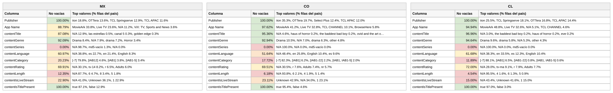

# Reporte — Content objects cuando **contentSeries** viene vacío: México, Colombia y Chile (consolidado v10 a v17)

**Fuente:** `inventory-consolidado-v10-a-v17.csv` — 959,442 filas, 380,355,807,040 requests. **Subconjunto analizado: las 895,551 filas (93.34% del total) donde `contentSeries` no trae dato útil**, que concentran 351,684,832,000 requests (92.46% del total).
**Data completa:** `vacios-contentSeries.json` (top-15 de valores por columna para cada país). Generado con `scripts/analizar.py --solo-vacios-en contentSeries`; las columnas de referencia ("todo el dataset") salen de `reporte-content-objects-detallado-v17-consolidado.json`.

*Una fila cuenta como vacía en `contentSeries` tanto si la celda no trae valor como si trae `Not Available`, `Not Applicable`, `Unknown` o basura equivalente a vacío (`[-7]` en categoría, hash MD5 de cadena vacía en serie). Los porcentajes de este reporte son **sobre las filas del subconjunto** (las que tienen `contentSeries` vacío), salvo donde se indique "todo el dataset".*

## Tamaño del subconjunto por país

| País | Filas con la columna vacía | % de las filas del país | % de los requests del país | eCPM pond. del subconjunto (todo el país) |
|---|---:|---:|---:|---:|
| México | 284,735 | 93.6% | 95.1% | 3.09 (3.107) |
| Colombia | 94,595 | 93.2% | 87.8% | 6.582 (5.849) |
| Chile | 100,494 | 93.7% | 88.3% | 6.435 (6.104) |

## Comparativo de % de filas no vacías de las demás columnas

Porcentaje de filas del subconjunto con dato útil en cada una de las otras columnas. Entre paréntesis, el mismo porcentaje en **todo el dataset** del país: la diferencia dice si el vacío de `contentSeries` viene acompañado de otros vacíos o no.

**Campos de app / vendedor:**

| Columna | México | Colombia | Chile |
|---|---:|---:|---:|
| Publisher | 100% (100%) | 100% (100%) | 100% (100%) |
| App Name | 88.8% (87.5%) | 97.6% (97.3%) | 94.9% (94.8%) |

**Content objects:**

| Columna | México | Colombia | Chile |
|---|---:|---:|---:|
| contentIsTitlePresent | 100% (100%) | 100% (100%) | 100% (100%) |
| contentGenre | 92.1% (92.1%) | 92.9% (93.0%) | 94.6% (94.6%) |
| contentTitle | 87.1% (87.0%) | 95.4% (95.6%) | 97.0% (97.1%) |
| contentRating | 69.9% (70.5%) | 69.5% (69.8%) | 72.0% (72.1%) |
| contentLanguage | 61.0% (62.1%) | 51.6% (53.3%) | 61.7% (62.6%) |
| contentIsLiveStream | 22.9% (25.0%) | 23.1% (26.7%) | 15.0% (18.9%) |
| contentCategory | 20.2% (23.1%) | 17.7% (21.8%) | 11.9% (16.1%) |
| contentLength | 12.3% (15.2%) | 6.2% (10.9%) | 4.5% (9.1%) |

*En negrilla, las columnas que pierden 10 puntos o más de completitud dentro del subconjunto respecto a todo el dataset.*

Versión visual con los tres países lado a lado (semáforo por % de filas no vacías dentro del subconjunto):

*(Generada con `scripts/generar_visual_paises.py` a partir del JSON de este reporte.)*

## México — 284,735 filas con `contentSeries` vacío (93.6% del país) · 95.1% de los requests del país

eCPM del subconjunto: 79.22% de filas en cero (todo el país: 79.54%) · media no-cero 2.012 · **ponderado 3.09** (todo el país: 3.107)

**Campos de app / vendedor:**

| Columna | % de filas no vacías | Top 3 referencias (% filas del subconjunto) |
|---|---:|---|
| Publisher | 100% | iion 18.8%, OTTera 13.6%, TCL Springserve 12.9% |
| App Name | 88.8% | MovieArk 33.8%, Live TV 23.6%, *N/A 11.2%* |

**Content objects:**

| Columna | % de filas no vacías | Top 3 referencias (% filas del subconjunto) |
|---|---:|---|
| contentIsTitlePresent | 100% | true 87.1%, false 12.9% |
| contentGenre | 92.1% | Drama 8.4%, *N/A 7.9%*, drama 7.2% |
| contentTitle | 87.1% | *N/A 12.9%*, las estrellas 0.5%, canal 5 0.3% |
| contentRating | 69.9% | *N/A 30.1%*, tv-14 8.2%, r 6.5% |
| contentLanguage | 61.0% | *N/A 38.8%*, es 22.7%, en 21.4% |
| contentIsLiveStream | 22.9% | *N/A 41.0%*, *Unknown 36.1%*, 1 22.9% |
| contentCategory | 20.2% | *[-7] 79.8%*, [IAB12] 4.6%, [IAB1] 3.8% |
| contentLength | 12.3% | *N/A 87.7%*, 6 4.7%, 8 3.4% |

## Colombia — 94,595 filas con `contentSeries` vacío (93.2% del país) · 87.8% de los requests del país

eCPM del subconjunto: 85.73% de filas en cero (todo el país: 85.69%) · media no-cero 4.754 · **ponderado 6.582** (todo el país: 5.849)

**Campos de app / vendedor:**

| Columna | % de filas no vacías | Top 3 referencias (% filas del subconjunto) |
|---|---:|---|
| Publisher | 100% | iion 35.3%, OTTera 19.7%, Select Plus 12.4% |
| App Name | 97.6% | MovieArk 41.2%, Live TV 32.8%, TCL CHANNEL 10.1% |

**Content objects:**

| Columna | % de filas no vacías | Top 3 referencias (% filas del subconjunto) |
|---|---:|---|
| contentIsTitlePresent | 100% | true 95.4%, false 4.6% |
| contentGenre | 92.9% | Drama 10.5%, *N/A 7.0%*, drama 6.3% |
| contentTitle | 95.4% | *N/A 4.6%*, haus of horror 0.2%, the baddest bad boy 0.2% |
| contentRating | 69.5% | *N/A 30.5%*, r 7.6%, Adults 7.4% |
| contentLanguage | 51.6% | *N/A 48.4%*, en 25.8%, English 10.4% |
| contentIsLiveStream | 23.1% | *Unknown 42.9%*, *N/A 34.0%*, 1 23.1% |
| contentCategory | 17.7% | *[-7] 82.3%*, [IAB1] 6.2%, [IAB1-22] 2.2% |
| contentLength | 6.2% | *N/A 93.8%*, 6 2.1%, 4 1.9% |

## Chile — 100,494 filas con `contentSeries` vacío (93.7% del país) · 88.3% de los requests del país

eCPM del subconjunto: 77.02% de filas en cero (todo el país: 77.11%) · media no-cero 6.539 · **ponderado 6.435** (todo el país: 6.104)

**Campos de app / vendedor:**

| Columna | % de filas no vacías | Top 3 referencias (% filas del subconjunto) |
|---|---:|---|
| Publisher | 100% | iion 25.5%, TCL Springserve 18.1%, OTTera 16.8% |
| App Name | 94.9% | MovieArk 48.8%, Live TV 32.6%, *N/A 5.1%* |

**Content objects:**

| Columna | % de filas no vacías | Top 3 referencias (% filas del subconjunto) |
|---|---:|---|
| contentIsTitlePresent | 100% | true 97.0%, false 3.0% |
| contentGenre | 94.6% | Drama 9.6%, drama 5.8%, *N/A 5.3%* |
| contentTitle | 97.0% | *N/A 3.0%*, the baddest bad boy 0.2%, haus of horror 0.2% |
| contentRating | 72.0% | *N/A 28.0%*, tv-ma 9.1%, r 7.9% |
| contentLanguage | 61.7% | *N/A 38.3%*, en 33.5%, es 12.3% |
| contentIsLiveStream | 15.0% | *N/A 43.4%*, *Unknown 41.6%*, 1 15.0% |
| contentCategory | 11.9% | *[-7] 88.1%*, [IAB1] 6.5%, [IAB1-22] 0.8% |
| contentLength | 4.5% | *N/A 95.5%*, 4 1.6%, 6 1.3% |

---

## Conclusiones — cuando falta la serie

- **No dice nada por sí solo**: 93% de las filas y 92% de los requests. Con el 6.7% que sí trae serie concentrado en Coocaa (90% de sus filas), Roku (hashes MD5) y unos pocos feeds, el subconjunto "sin serie" es el dataset entero y su perfil es idéntico al país en publisher, app, género, título, rating e idioma (diferencias de menos de un punto).
- **Lo único que se mueve** es lo estructural: contentLength 7.8% (12.2%) y contentCategory 17.9% (21.9%), por la misma razón que en categoría — las tres columnas viajan juntas en las mismas rutas.
- **La ausencia es mayoritariamente correcta**: según IMDb el catálogo es ~76% película, y una película no pertenece a ninguna serie. El relleno solo aporta en el ~8% de series identificadas (`tvSeries`/`tvMiniSeries`).
- **Precio**: idéntico al del país en los tres mercados (3.09 vs 3.11 en México; 6.58 vs 5.85 en Colombia; 6.44 vs 6.10 en Chile). Tener o no serie no mueve el eCPM.
