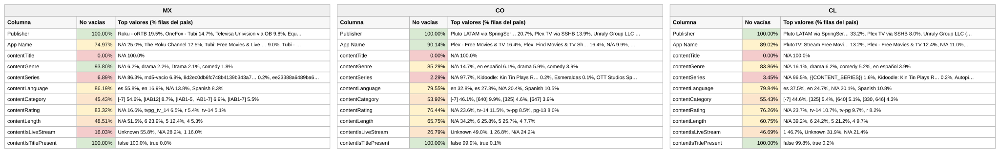

# Reporte — Content objects cuando **contentTitle** viene vacío: México, Colombia y Chile (consolidado v10 a v17)

**Fuente:** `inventory-consolidado-v10-a-v17.csv` — 959,442 filas, 380,355,807,040 requests. **Subconjunto analizado: las 67,762 filas (7.06% del total) donde `contentTitle` no trae dato útil**, que concentran 112,157,641,280 requests (29.49% del total).
**Data completa:** `vacios-contentTitle.json` (top-15 de valores por columna para cada país). Generado con `scripts/analizar.py --solo-vacios-en contentTitle`; las columnas de referencia ("todo el dataset") salen de `reporte-content-objects-detallado-v17-consolidado.json`.

*Una fila cuenta como vacía en `contentTitle` tanto si la celda no trae valor como si trae `Not Available`, `Not Applicable`, `Unknown` o basura equivalente a vacío (`[-7]` en categoría, hash MD5 de cadena vacía en serie). Los porcentajes de este reporte son **sobre las filas del subconjunto** (las que tienen `contentTitle` vacío), salvo donde se indique "todo el dataset".*

## Tamaño del subconjunto por país

| País | Filas con la columna vacía | % de las filas del país | % de los requests del país | eCPM pond. del subconjunto (todo el país) |
|---|---:|---:|---:|---:|
| México | 39,503 | 13.0% | 39.7% | 3.384 (3.107) |
| Colombia | 4,494 | 4.4% | 7.2% | 3.373 (5.849) |
| Chile | 3,159 | 2.9% | 7.6% | 8.837 (6.104) |

## Comparativo de % de filas no vacías de las demás columnas

Porcentaje de filas del subconjunto con dato útil en cada una de las otras columnas. Entre paréntesis, el mismo porcentaje en **todo el dataset** del país: la diferencia dice si el vacío de `contentTitle` viene acompañado de otros vacíos o no.

**Campos de app / vendedor:**

| Columna | México | Colombia | Chile |
|---|---:|---:|---:|
| Publisher | 100% (100%) | 100% (100%) | 100% (100%) |
| App Name | 75.0% (87.5%) | 90.1% (97.3%) | 89.0% (94.8%) |

**Content objects:**

| Columna | México | Colombia | Chile |
|---|---:|---:|---:|
| contentIsTitlePresent | 100% (100%) | 100% (100%) | 100% (100%) |
| contentGenre | 93.8% (92.1%) | 85.3% (93.0%) | **83.9% (94.6%)** |
| contentRating | 83.3% (70.5%) | 76.4% (69.8%) | 76.3% (72.1%) |
| contentLanguage | 86.2% (62.1%) | 79.5% (53.3%) | 79.8% (62.6%) |
| contentIsLiveStream | 16.0% (25.0%) | 26.8% (26.7%) | 46.7% (18.9%) |
| contentCategory | 45.4% (23.1%) | 53.9% (21.8%) | 55.4% (16.1%) |
| contentLength | 48.5% (15.2%) | 65.8% (10.9%) | 60.8% (9.1%) |
| contentSeries | 6.9% (6.4%) | 2.3% (6.8%) | 3.5% (6.3%) |

*En negrilla, las columnas que pierden 10 puntos o más de completitud dentro del subconjunto respecto a todo el dataset.*

Versión visual con los tres países lado a lado (semáforo por % de filas no vacías dentro del subconjunto):

*(Generada con `scripts/generar_visual_paises.py` a partir del JSON de este reporte.)*

## México — 39,503 filas con `contentTitle` vacío (13.0% del país) · 39.7% de los requests del país

eCPM del subconjunto: 89.58% de filas en cero (todo el país: 79.54%) · media no-cero 2.387 · **ponderado 3.384** (todo el país: 3.107)

**Campos de app / vendedor:**

| Columna | % de filas no vacías | Top 3 referencias (% filas del subconjunto) |
|---|---:|---|
| Publisher | 100% | Roku - oRTB 19.5%, OneFox - Tubi 14.7%, Televisa (OB) 9.8% |
| App Name | 75.0% | *N/A 25.0%*, The Roku Channel 12.5%, Tubi: Free Movies & Live TV 9.0% |

**Content objects:**

| Columna | % de filas no vacías | Top 3 referencias (% filas del subconjunto) |
|---|---:|---|
| contentIsTitlePresent | 100% | false 100.0%, true 0.0% |
| contentGenre | 93.8% | *N/A 6.2%*, drama 2.2%, Drama 2.1% |
| contentRating | 83.3% | *N/A 16.6%*, tvpg_tv_14 6.5%, r 5.4% |
| contentLanguage | 86.2% | es 55.8%, en 16.9%, *N/A 13.8%* |
| contentIsLiveStream | 16.0% | *Unknown 55.8%*, *N/A 28.2%*, 1 16.0% |
| contentCategory | 45.4% | *[-7] 54.6%*, [IAB12] 8.7%, [IAB1-5, IAB1-7] 6.9% |
| contentLength | 48.5% | *N/A 51.5%*, 6 23.9%, 5 12.4% |
| contentSeries | 6.9% | *N/A 86.3%*, *md5-vacío 6.8%*, 8d2ec0db6fc748b4139b343a7f4… 0.2% |

## Colombia — 4,494 filas con `contentTitle` vacío (4.4% del país) · 7.2% de los requests del país

eCPM del subconjunto: 88.47% de filas en cero (todo el país: 85.69%) · media no-cero 4.29 · **ponderado 3.373** (todo el país: 5.849)

**Campos de app / vendedor:**

| Columna | % de filas no vacías | Top 3 referencias (% filas del subconjunto) |
|---|---:|---|
| Publisher | 100% | Pluto LATAM via SpringServe 20.7%, Plex TV via SSHB 13.9%, Unruly Group LLC (oRTB) 13.1% |
| App Name | 90.1% | Plex - Free Movies & TV 16.4%, Plex: Find Movies & TV Shows 16.4%, *N/A 9.9%* |

**Content objects:**

| Columna | % de filas no vacías | Top 3 referencias (% filas del subconjunto) |
|---|---:|---|
| contentIsTitlePresent | 100% | false 99.9%, true 0.1% |
| contentGenre | 85.3% | *N/A 14.7%*, en español 6.1%, drama 5.9% |
| contentRating | 76.4% | *N/A 23.6%*, tv-14 11.5%, tv-pg 8.5% |
| contentLanguage | 79.5% | en 32.8%, es 27.3%, *N/A 20.4%* |
| contentIsLiveStream | 26.8% | *Unknown 49.0%*, 1 26.8%, *N/A 24.2%* |
| contentCategory | 53.9% | *[-7] 46.1%*, [640] 9.9%, [325] 4.6% |
| contentLength | 65.8% | *N/A 34.2%*, 6 25.8%, 5 25.7% |
| contentSeries | 2.3% | *N/A 97.7%*, Kidoodle: Kin Tin Plays Rob… 0.2%, Esmeraldas 0.1% |

## Chile — 3,159 filas con `contentTitle` vacío (2.9% del país) · 7.6% de los requests del país

eCPM del subconjunto: 64.55% de filas en cero (todo el país: 77.11%) · media no-cero 6.573 · **ponderado 8.837** (todo el país: 6.104)

**Campos de app / vendedor:**

| Columna | % de filas no vacías | Top 3 referencias (% filas del subconjunto) |
|---|---:|---|
| Publisher | 100% | Pluto LATAM via SpringServe 33.2%, Plex TV via SSHB 8.0%, Unruly Group LLC (oRTB) 6.9% |
| App Name | 89.0% | PlutoTV: Stream Free Movies… 13.2%, Plex - Free Movies & TV 12.4%, *N/A 11.0%* |

**Content objects:**

| Columna | % de filas no vacías | Top 3 referencias (% filas del subconjunto) |
|---|---:|---|
| contentIsTitlePresent | 100% | false 99.8%, true 0.2% |
| contentGenre | 83.9% | *N/A 16.1%*, drama 6.2%, comedy 5.2% |
| contentRating | 76.3% | *N/A 23.7%*, tv-14 10.7%, tv-pg 9.7% |
| contentLanguage | 79.8% | es 37.5%, en 24.7%, *N/A 20.1%* |
| contentIsLiveStream | 46.7% | 1 46.7%, *Unknown 31.9%*, *N/A 21.4%* |
| contentCategory | 55.4% | *[-7] 44.6%*, [325] 5.4%, [640] 5.1% |
| contentLength | 60.8% | *N/A 39.2%*, 6 24.2%, 5 21.2% |
| contentSeries | 3.5% | *N/A 96.5%*, *{{CONTENT_SERIES}} 1.6%*, Kidoodle: Kin Tin Plays Rob… 0.2% |

---

## Conclusiones — cuando falta el título

- **Es el vacío más caro del dataset**: solo 7.1% de las filas, pero **29.5% de los requests**, y el 81% de esos requests es México (39.7% del tráfico mexicano va sin título). `contentIsTitlePresent = false` en el 99.9% de estas filas: la bandera es coherente.
- **Es otro dataset**: aquí no aparecen OTTera ni iion. Mandan Roku (15%; 20% en México), Pluto (10%), Tubi (9%), Televisa (8%) y Plex (8%), y el App Name viene vacío en el 19% (25% en México). Son las rutas de **placeholders** (`roku`, `epg`, `vod`) y de feeds sin identidad.
- **Buena estructura, sin identidad**: en estas filas la categoría sube a 50% (22% en todo el dataset), la duración a 53.5% (12%), el idioma a 83% (66%) y el rating a 80% (74%). Es la imagen invertida del resto del inventario: las rutas que mandan categoría y duración son las que no dicen qué programa es. En Colombia y Chile aparecen además categorías numéricas (`[640]`, `[325]`) de la taxonomía IAB 2.x/3.0 de Pluto y Plex.
- **No se puede rellenar**: sin título no hay llave para IMDb ni para el intra-título. Solo lo arregla el vendedor (o su feed de EPG).
- **Precio y venta**: en México el tráfico sin título paga más que el país (3.38 vs 3.11) con menos filas vendidas (89.6% en cero): es el EPG de Roku, pocas combinaciones con mucho volumen. En Chile, 8.84 de eCPM y 47% de livestream=1 (Pluto lineal).
