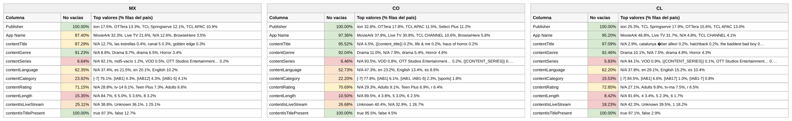

# Content Objects por país: México, Colombia y Chile (consolidado v10 a v18)

**Fuente:** `inventory-consolidado-v10-a-v18.csv` — 1,071,840 filas únicas, 426,223,575,360 requests (métricas del corte v18, ventana 29 ago–12 sep 2026; v18 aportó 112,398 combinaciones nuevas). Solo v18: 512,000 filas, 370,603,937,600 requests.
**Data completa:** `reporte-content-objects-detallado-v18-consolidado.json` (top-15 de valores por columna para cada país). Generado con `scripts/analizar.py`.

*Nota: "llenas" excluye centinelas — una fila cuenta como vacía tanto si la celda no trae valor como si trae `Not Available`, `Not Applicable`, `Unknown` o basura equivalente a vacío (`[-7]`, hash MD5 de cadena vacía, macros sin reemplazar).*

*Nota sobre las columnas de requests y eCPM en las tablas por país: "Requests llenas" / "Requests vacías" es el total de requests de las filas del país donde esa columna trae dato útil / viene vacía. "eCPM pond." = Σ(eCPM × requests) / Σ requests de esas filas, sin contar las que tienen requests = 0 o eCPM = 0. Calculado con `scripts/requests_ecpm_por_vacio.py` → `reporte-requests-ecpm-por-vacio-v18.json`.*

*Nota sobre `md5-vacío`: en `contentSeries` algunos vendedores mandan un hash MD5 en vez del nombre de la serie. El valor `d41d8cd98f00b204e9800998ecf8427e` es el MD5 de la cadena vacía, es decir, el vendedor hasheó un texto en blanco; se cuenta como vacío.*

## Comparativo de % de filas llenas por columna

Entre paréntesis, el valor del consolidado anterior (v10 a v17) cuando el cambio supera un punto.

**Campos de app / vendedor:**

| Columna | México | Colombia | Chile |
|---|---:|---:|---:|
| Publisher | 100% | 100% | 100% |
| App Name | 87.4% | 97.4% | 95.2% |

**Content objects:**

| Columna | México | Colombia | Chile |
|---|---:|---:|---:|
| contentIsTitlePresent | 100% | 100% | 100% |
| contentGenre | 91.2% | 92.0% | 92.5% (94.6) |
| contentTitle | 87.3% | 95.5% | 97.1% |
| contentRating | 71.2% | 70.7% | 72.8% |
| contentLanguage | 62.4% | 52.7% | 62.2% |
| contentIsLiveStream | 25.1% | 26.7% | 18.2% |
| contentCategory | 23.9% | 22.2% | 15.5% |
| contentLength | 15.3% | 10.5% | 8.4% |
| contentSeries | 6.6% | 6.5% | 5.8% |

*(Generada con `scripts/generar_visual_paises.py` a partir del JSON de este reporte. En contentGenre aparecen `Drama` y `drama` como valores separados: así vienen en la fuente.)*

## Total consolidado (todos los países) — 1,071,840 filas · 426,223,575,360 requests

eCPM: 82.5% de filas en cero · media no-cero 4.53 · ponderado 4.04

**Campos de app / vendedor:**

| Columna | % de filas llenas | Top 3 referencias (% filas del total) | Requests llenas | eCPM pond. llenas | Requests vacías | eCPM pond. vacías |
|---|---:|---|---:|---:|---:|---:|
| Publisher | 100% | OTTera 20.6%, iion 19.4%, TCL Springserve 12.4% | 426,223,575,360 | $4.04 | 0 | — |
| App Name | 93.7% | MovieArk 34.6%, Live TV 22.8%, TCL CHANNEL 11.6% | 391,904,094,240 | $4.18 | 34,319,481,120 | $2.69 |

**Content objects:**

| Columna | % de filas llenas | Top 3 referencias (% filas del total) | Requests llenas | eCPM pond. llenas | Requests vacías | eCPM pond. vacías |
|---|---:|---|---:|---:|---:|---:|
| contentIsTitlePresent | 100% | true 93.1%, false 6.9% | 426,223,575,360 | $4.04 | 0 | — |
| contentGenre | 92.4% | Drama 9.2%, *N/A 7.5%*, drama 6.0% | 360,144,181,200 | $3.96 | 66,079,394,160 | $4.41 |
| contentTitle | 93.1% | *N/A 6.9%*, roku 0.2%, epg 0.1% | 304,468,102,480 | $4.07 | 121,755,472,880 | $3.98 |
| contentRating | 74.9% | *N/A 25.1%*, Adults 8.1%, tv-14 7.0% | 315,813,674,240 | $4.24 | 110,409,901,120 | $3.49 |
| contentLanguage | 66.2% | *N/A 33.7%*, en 27.9%, es 16.0% | 280,003,900,880 | $4.06 | 146,219,674,480 | $3.99 |
| contentIsLiveStream | 28.9% | *Unknown 37.5%*, *N/A 33.5%*, 1 28.9% | 180,941,806,400 | $4.00 | 245,281,768,960 | $4.07 |
| contentCategory | 21.9% | *[-7] 78.1%*, [IAB1] 5.4%, [IAB1-22] 2.9% | 131,371,682,720 | $4.30 | 294,851,892,640 | $3.92 |
| contentLength | 11.9% | *N/A 88.1%*, 5 3.3%, 4 3.1% | 99,630,319,200 | $4.51 | 326,593,256,160 | $3.85 |
| contentSeries | 6.5% | *N/A 92.8%*, *md5-vacío 0.7%*, VOD 0.6% | 29,592,960,640 | $3.60 | 396,630,614,720 | $4.07 |

## México — 328,845 filas (30.7%) · 59.1% de los requests

eCPM: 80.0% de filas en cero · media no-cero 2.06 · ponderado 3.20

**Campos de app / vendedor:**

| Columna | % de filas llenas | Top 3 referencias (% filas del país) | Requests llenas | eCPM pond. llenas | Requests vacías | eCPM pond. vacías |
|---|---:|---|---:|---:|---:|---:|
| Publisher | 100% | iion 17.5%, OTTera 13.3%, TCL Springserve 12.1% | 251,776,068,880 | $3.20 | 0 | — |
| App Name | 87.4% | MovieArk 32.3%, Live TV 21.6%, *N/A 12.6%* | 223,200,927,200 | $3.33 | 28,575,141,680 | $2.26 |

**Content objects:**

| Columna | % de filas llenas | Top 3 referencias (% filas del país) | Requests llenas | eCPM pond. llenas | Requests vacías | eCPM pond. vacías |
|---|---:|---|---:|---:|---:|---:|
| contentIsTitlePresent | 100% | true 87.3%, false 12.7% | 251,776,068,880 | $3.20 | 0 | — |
| contentGenre | 91.2% | *N/A 8.8%*, Drama 8.7%, drama 6.5% | 216,354,524,800 | $3.16 | 35,421,544,080 | $3.43 |
| contentTitle | 87.3% | *N/A 12.7%*, las estrellas 0.4%, canal 5 0.3% | 153,663,795,040 | $2.95 | 98,112,273,840 | $3.55 |
| contentRating | 71.2% | *N/A 28.8%*, tv-14 8.1%, Teen Plus 7.3% | 185,945,231,760 | $3.50 | 65,830,837,120 | $2.34 |
| contentLanguage | 62.4% | *N/A 37.4%*, es 21.5%, en 20.1% | 168,641,028,160 | $3.48 | 83,135,040,720 | $2.65 |
| contentIsLiveStream | 25.1% | *N/A 38.8%*, *Unknown 36.1%*, 1 25.1% | 113,407,234,000 | $3.52 | 138,368,834,880 | $2.84 |
| contentCategory | 23.9% | *[-7] 76.1%*, [IAB1] 4.3%, [IAB12] 4.3% | 92,790,362,240 | $4.35 | 158,985,706,640 | $2.54 |
| contentLength | 15.3% | *N/A 84.7%*, 6 5.0%, 5 3.6% | 75,090,024,240 | $4.69 | 176,686,044,640 | $2.44 |
| contentSeries | 6.6% | *N/A 92.1%*, *md5-vacío 1.2%*, VOD 0.5% | 12,120,951,680 | $3.70 | 239,655,117,200 | $3.17 |

## Colombia — 114,223 filas (10.7%) · 7.3% de los requests

eCPM: 86.4% de filas en cero · media no-cero 4.25 · ponderado 5.03

**Campos de app / vendedor:**

| Columna | % de filas llenas | Top 3 referencias (% filas del país) | Requests llenas | eCPM pond. llenas | Requests vacías | eCPM pond. vacías |
|---|---:|---|---:|---:|---:|---:|
| Publisher | 100% | iion 32.8%, OTTera 17.8%, TCL APAC 11.5% | 31,032,732,560 | $5.03 | 0 | — |
| App Name | 97.4% | MovieArk 37.8%, Live TV 30.8%, TCL CHANNEL 10.6% | 29,995,251,680 | $4.91 | 1,037,480,880 | $6.36 |

**Content objects:**

| Columna | % de filas llenas | Top 3 referencias (% filas del país) | Requests llenas | eCPM pond. llenas | Requests vacías | eCPM pond. vacías |
|---|---:|---|---:|---:|---:|---:|
| contentIsTitlePresent | 100% | true 95.5%, false 4.5% | 31,032,732,560 | $5.03 | 0 | — |
| contentGenre | 92.0% | Drama 11.0%, *N/A 7.9%*, drama 5.4% | 26,813,145,360 | $5.45 | 4,219,587,200 | $2.99 |
| contentTitle | 95.5% | *N/A 4.5%*, {{content_title}} 0.2%, life & me 0.2% | 28,865,513,440 | $5.31 | 2,167,219,120 | $3.41 |
| contentRating | 70.7% | *N/A 29.3%*, Adults 9.1%, Teen Plus 6.9% | 22,410,576,240 | $5.24 | 8,622,156,320 | $4.38 |
| contentLanguage | 52.7% | *N/A 47.3%*, en 23.2%, English 13.4% | 16,536,785,120 | $3.63 | 14,495,947,440 | $7.46 |
| contentIsLiveStream | 26.7% | *Unknown 40.4%*, *N/A 32.9%*, 1 26.7% | 11,424,824,480 | $4.35 | 19,607,908,080 | $5.58 |
| contentCategory | 22.2% | *[-7] 77.8%*, [IAB1] 6.1%, [IAB1, IAB1-5] 2.3% | 6,899,772,240 | $4.74 | 24,132,960,320 | $5.16 |
| contentLength | 10.5% | *N/A 89.5%*, 4 3.8%, 5 3.0% | 4,804,151,920 | $3.50 | 26,228,580,640 | $5.52 |
| contentSeries | 6.5% | *N/A 93.5%*, VOD 0.8%, OTT Studios Ent. 0.2% | 3,363,751,680 | $2.95 | 27,668,980,880 | $5.49 |

## Chile — 122,923 filas (11.5%) · 5.7% de los requests

eCPM: 78.1% de filas en cero · media no-cero 6.46 · ponderado 6.11

**Campos de app / vendedor:**

| Columna | % de filas llenas | Top 3 referencias (% filas del país) | Requests llenas | eCPM pond. llenas | Requests vacías | eCPM pond. vacías |
|---|---:|---|---:|---:|---:|---:|
| Publisher | 100% | iion 25.3%, TCL Springserve 17.9%, OTTera 15.6% | 24,304,976,800 | $6.11 | 0 | — |
| App Name | 95.2% | MovieArk 46.8%, Live TV 31.7%, *N/A 4.8%* | 23,415,349,840 | $6.12 | 889,626,960 | $6.00 |

**Content objects:**

| Columna | % de filas llenas | Top 3 referencias (% filas del país) | Requests llenas | eCPM pond. llenas | Requests vacías | eCPM pond. vacías |
|---|---:|---|---:|---:|---:|---:|
| contentIsTitlePresent | 100% | true 97.1%, false 2.9% | 24,304,976,800 | $6.11 | 0 | — |
| contentGenre | 92.5% | Drama 10.1%, *N/A 7.5%*, drama 4.8% | 21,297,972,480 | $5.85 | 3,007,004,320 | $7.95 |
| contentTitle | 97.1% | *N/A 2.9%*, catalunya �ber alles! 0.2%, hatchback 0.2% | 22,529,672,320 | $5.79 | 1,775,304,480 | $9.14 |
| contentRating | 72.8% | *N/A 27.1%*, Adults 9.8%, tv-ma 7.5% | 18,995,032,800 | $5.91 | 5,309,944,000 | $7.10 |
| contentLanguage | 62.2% | *N/A 37.8%*, en 29.1%, English 15.2% | 16,084,206,720 | $5.90 | 8,220,770,080 | $7.36 |
| contentIsLiveStream | 18.2% | *N/A 42.3%*, *Unknown 39.5%*, 1 18.2% | 5,556,279,120 | $5.83 | 18,748,697,680 | $6.20 |
| contentCategory | 15.5% | *[-7] 84.5%*, [IAB1] 6.6%, [IAB17] 1.0% | 5,181,273,520 | $4.89 | 19,123,703,280 | $6.39 |
| contentLength | 8.4% | *N/A 91.6%*, 4 3.4%, 5 2.3% | 3,187,057,360 | $5.07 | 21,117,919,440 | $6.34 |
| contentSeries | 5.8% | *N/A 94.1%*, VOD 0.9%, {{CONTENT_SERIES}} 0.1% | 2,408,447,120 | $4.85 | 21,896,529,680 | $6.31 |
