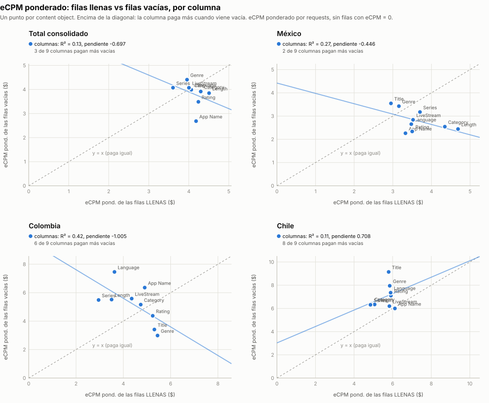
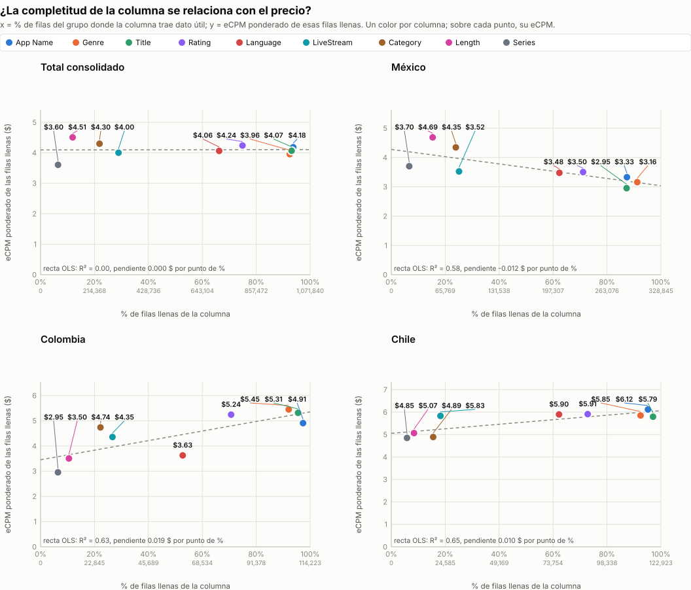
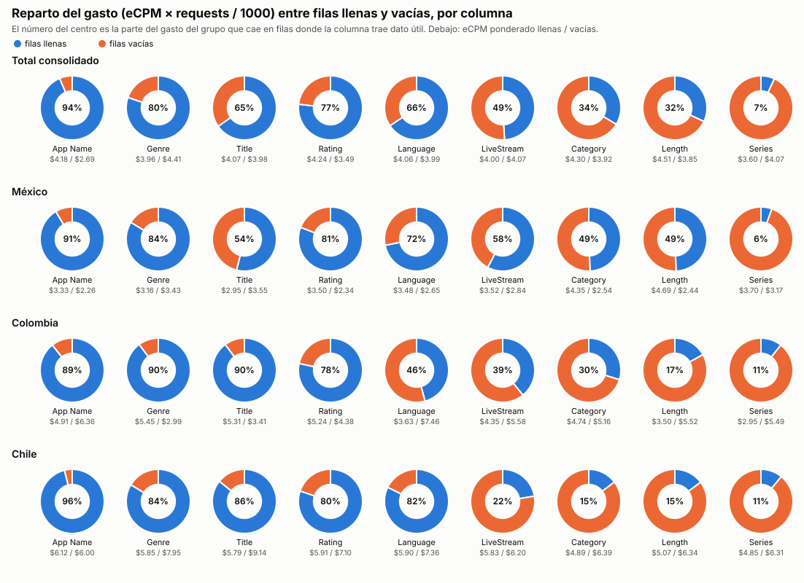
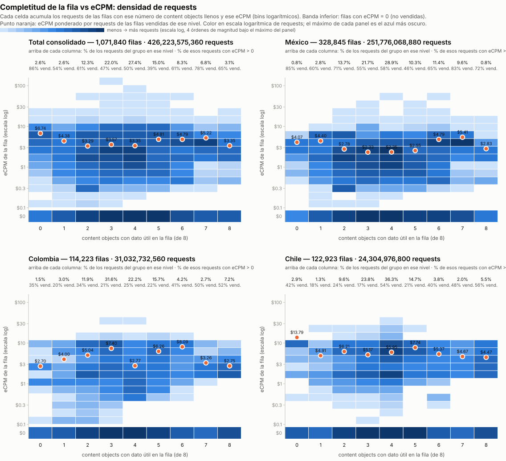

# Gráficos: eCPM de las filas llenas vs vacías (consolidado v10 a v18)

**Fuente:** `reporte-requests-ecpm-por-vacio-v18.json` (mismos datos de las tablas por país del detallado). Generado con `scripts/generar_graficos_ecpm_vacio.py` → `graficos-ecpm-vacio-r2.json`.

*eCPM ponderado = Σ(eCPM × requests) / Σ requests, sin las filas con requests = 0 o eCPM = 0. Un punto por content object (9 columnas: App Name y los 8 content objects con filas vacías; contentIsTitlePresent y Publisher vienen al 100% y no entran). R² es el de la recta de mínimos cuadrados (OLS) sobre esos 9 puntos.*

## 1. eCPM llenas (x) vs eCPM vacías (y)

| Grupo | R² | Pendiente | Intercepto | Columnas que pagan más vacías |
|---|---:|---:|---:|---:|
| Total consolidado | 0.128 | -0.697 | 6.69 | 3 de 9 |
| México | 0.270 | -0.446 | 4.42 | 2 de 9 |
| Colombia | 0.422 | -1.005 | 9.63 | 6 de 9 |
| Chile | 0.114 | 0.708 | 3.03 | 8 de 9 |

## 2. % de filas llenas (x) vs eCPM (y), por serie

| Grupo | Serie | R² | Pendiente ($ por punto de %) | Intercepto |
|---|---|---:|---:|---:|
| Total consolidado | eCPM filas llenas | 0.000 | 0.0001 | 4.10 |
| Total consolidado | eCPM filas vacías | 0.091 | -0.0040 | 4.05 |
| México | eCPM filas llenas | 0.585 | -0.0124 | 4.28 |
| México | eCPM filas vacías | 0.033 | 0.0025 | 2.67 |
| Colombia | eCPM filas llenas | 0.627 | 0.0190 | 3.45 |
| Colombia | eCPM filas vacías | 0.151 | -0.0144 | 5.91 |
| Chile | eCPM filas llenas | 0.653 | 0.0101 | 5.05 |
| Chile | eCPM filas vacías | 0.400 | 0.0165 | 6.12 |

## 3. Reparto del gasto (eCPM × requests / 1000) entre filas llenas y vacías

*% del gasto del grupo que cae en filas donde la columna trae dato útil. El gasto se calcula solo sobre filas con eCPM > 0.*

| Columna | Total consolidado | México | Colombia | Chile |
|---|---:|---:|---:|---:|
| App Name | 93.6% | 91.5% | 89.4% | 96.1% |
| contentGenre | 80.3% | 83.7% | 89.9% | 83.7% |
| contentTitle | 65.2% | 54.0% | 89.8% | 85.8% |
| contentRating | 76.8% | 81.0% | 78.4% | 80.3% |
| contentLanguage | 65.6% | 71.9% | 45.7% | 82.2% |
| contentIsLiveStream | 49.1% | 57.7% | 39.1% | 22.4% |
| contentCategory | 33.6% | 49.4% | 29.8% | 14.7% |
| contentLength | 32.0% | 49.4% | 16.9% | 14.8% |
| contentSeries | 6.9% | 5.6% | 10.7% | 10.9% |

## 4. Completitud de la fila vs eCPM: densidad de requests (fila a fila)

Cada fila del consolidado se clasifica por cuántos de los 8 content objects trae con dato útil (contentGenre, contentCategory, contentSeries, contentLength, contentLanguage, contentIsLiveStream, contentTitle, contentRating; contentIsTitlePresent no cuenta porque siempre viene). El heatmap acumula los requests de las filas en cada celda de (campos llenos, bin logarítmico de eCPM); la banda inferior son las filas con eCPM = 0. El punto naranja es el eCPM ponderado (>0) de cada nivel. Generado con `scripts/generar_heatmap_completitud_ecpm.py` → `graficos-ecpm-completitud-heatmap.json`.

**Total consolidado** — 1,071,840 filas · 426,223,575,360 requests

| Campos llenos (de 8) | % filas | % requests | % requests vendidos (eCPM > 0) | eCPM pond. (>0) |
|---:|---:|---:|---:|---:|
| 0 | 0.1% | 2.6% | 86.0% | $6.74 |
| 1 | 2.0% | 2.6% | 53.5% | $4.38 |
| 2 | 10.8% | 12.3% | 60.6% | $3.29 |
| 3 | 23.4% | 22.0% | 46.7% | $3.57 |
| 4 | 32.8% | 27.4% | 50.3% | $3.35 |
| 5 | 21.7% | 15.0% | 38.9% | $4.81 |
| 6 | 4.8% | 8.3% | 61.2% | $4.79 |
| 7 | 1.9% | 6.8% | 77.6% | $5.22 |
| 8 | 2.6% | 3.1% | 64.8% | $3.35 |

**México** — 328,845 filas · 251,776,068,880 requests

| Campos llenos (de 8) | % filas | % requests | % requests vendidos (eCPM > 0) | eCPM pond. (>0) |
|---:|---:|---:|---:|---:|
| 0 | 0.1% | 0.8% | 85.5% | $4.07 |
| 1 | 3.0% | 2.8% | 60.1% | $4.40 |
| 2 | 13.9% | 13.7% | 70.5% | $2.78 |
| 3 | 23.1% | 21.7% | 55.5% | $2.33 |
| 4 | 31.6% | 28.9% | 57.5% | $2.35 |
| 5 | 17.9% | 10.3% | 46.3% | $2.55 |
| 6 | 6.5% | 11.4% | 64.9% | $4.79 |
| 7 | 2.5% | 9.6% | 82.7% | $5.41 |
| 8 | 1.3% | 0.8% | 71.8% | $2.83 |

**Colombia** — 114,223 filas · 31,032,732,560 requests

| Campos llenos (de 8) | % filas | % requests | % requests vendidos (eCPM > 0) | eCPM pond. (>0) |
|---:|---:|---:|---:|---:|
| 0 | 0.1% | 1.5% | 34.9% | $2.70 |
| 1 | 2.5% | 3.0% | 19.5% | $4.00 |
| 2 | 13.4% | 11.9% | 33.9% | $5.04 |
| 3 | 32.2% | 31.6% | 20.9% | $7.40 |
| 4 | 24.2% | 22.2% | 25.2% | $2.77 |
| 5 | 18.6% | 15.7% | 21.8% | $6.26 |
| 6 | 4.6% | 4.2% | 40.7% | $8.09 |
| 7 | 1.6% | 2.7% | 49.8% | $3.26 |
| 8 | 2.8% | 7.2% | 51.6% | $2.75 |

**Chile** — 122,923 filas · 24,304,976,800 requests

| Campos llenos (de 8) | % filas | % requests | % requests vendidos (eCPM > 0) | eCPM pond. (>0) |
|---:|---:|---:|---:|---:|
| 0 | 0.1% | 2.9% | 42.1% | $13.79 |
| 1 | 1.6% | 1.3% | 18.5% | $4.91 |
| 2 | 13.9% | 9.6% | 24.1% | $6.21 |
| 3 | 28.1% | 23.8% | 16.5% | $5.17 |
| 4 | 35.7% | 36.3% | 54.3% | $5.95 |
| 5 | 13.6% | 14.7% | 21.1% | $7.74 |
| 6 | 3.2% | 3.8% | 40.5% | $5.37 |
| 7 | 1.3% | 2.0% | 48.0% | $4.67 |
| 8 | 2.5% | 5.5% | 55.6% | $4.47 |
