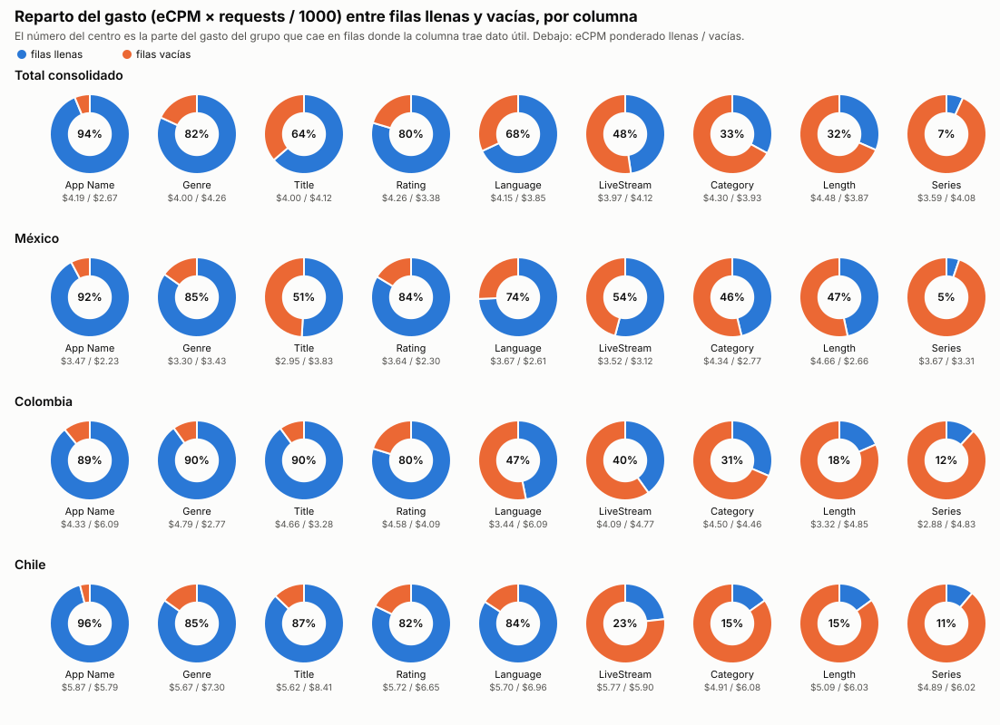
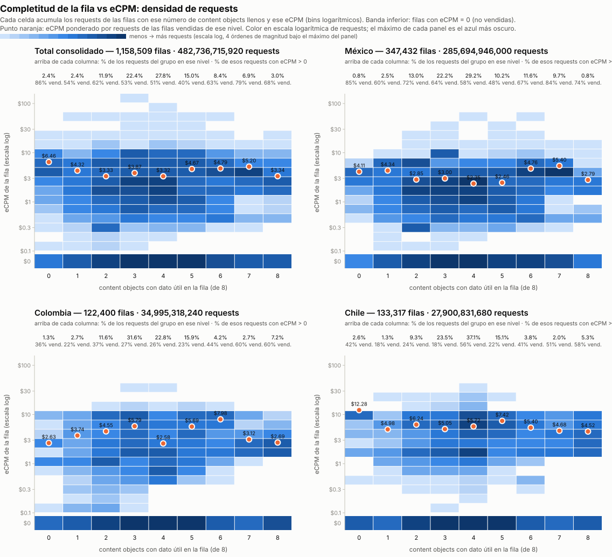
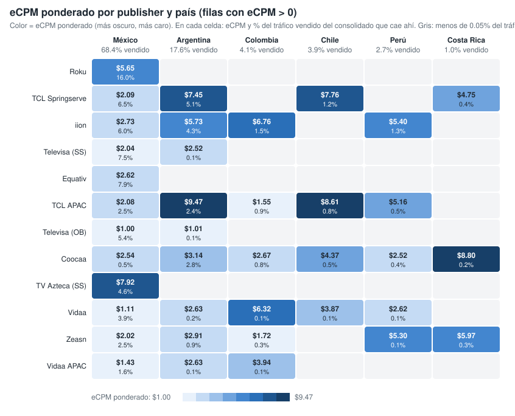
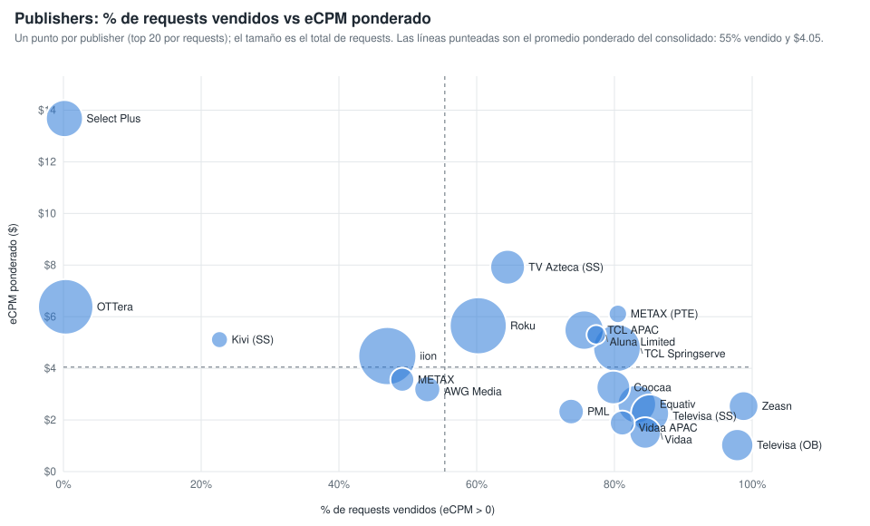

# Gráficos: eCPM de las filas llenas vs vacías (consolidado v10 a v19)

**Fuente:** `recursos/reporte-requests-ecpm-por-vacio-v19.json` (mismos datos de las tablas por país del detallado). Generado con `scripts/generar_graficos_ecpm_vacio.py` → `recursos/graficos-ecpm-vacio-r2.json`; tablas con `scripts/generar_reporte_graficos.py`.

*eCPM ponderado = Σ(eCPM × requests) / Σ requests, sin las filas con requests = 0 o eCPM = 0. Columnas: App Name y los 8 content objects con filas vacías; contentIsTitlePresent y Publisher vienen al 100% y no entran.*

## 1. Reparto del gasto (eCPM × requests / 1000) entre filas llenas y vacías

*% del gasto del grupo que cae en filas donde la columna trae dato útil. El gasto se calcula solo sobre filas con eCPM > 0.*

| Columna | Total consolidado | México | Colombia | Chile |
|---|---:|---:|---:|---:|
| App Name | 93.8% | 92.2% | 89.1% | 96.0% |
| contentGenre | 81.9% | 84.8% | 90.1% | 84.9% |
| contentTitle | 63.7% | 50.9% | 89.9% | 87.2% |
| contentRating | 79.6% | 83.7% | 79.8% | 82.2% |
| contentLanguage | 68.0% | 74.3% | 46.8% | 84.2% |
| contentIsLiveStream | 47.7% | 54.1% | 40.1% | 23.2% |
| contentCategory | 33.0% | 46.3% | 31.4% | 15.2% |
| contentLength | 31.5% | 46.7% | 18.4% | 15.0% |
| contentSeries | 6.8% | 5.2% | 11.9% | 11.2% |

## 2. Completitud de la fila vs eCPM: densidad de requests (fila a fila)

Cada fila del consolidado se clasifica por cuántos de los 8 content objects trae con dato útil (contentGenre, contentCategory, contentSeries, contentLength, contentLanguage, contentIsLiveStream, contentTitle, contentRating; contentIsTitlePresent no cuenta porque siempre viene). El heatmap acumula los requests de las filas en cada celda de (campos llenos, bin logarítmico de eCPM); la banda inferior son las filas con eCPM = 0. El punto naranja es el eCPM ponderado (>0) de cada nivel. Generado con `scripts/generar_heatmap_completitud_ecpm.py` → `recursos/graficos-ecpm-completitud-heatmap.json`.

**Total consolidado** — 1,158,509 filas · 482,736,715,920 requests

| Campos llenos (de 8) | % filas | % requests | % requests vendidos (eCPM > 0) | eCPM pond. (>0) |
|---:|---:|---:|---:|---:|
| 0 | 0.1% | 2.4% | 85.9% | $6.46 |
| 1 | 2.1% | 2.4% | 53.7% | $4.32 |
| 2 | 11.2% | 11.9% | 61.5% | $3.33 |
| 3 | 23.6% | 22.4% | 52.8% | $3.87 |
| 4 | 32.4% | 27.8% | 51.2% | $3.32 |
| 5 | 21.4% | 15.0% | 39.8% | $4.67 |
| 6 | 4.8% | 8.4% | 63.0% | $4.79 |
| 7 | 1.9% | 6.9% | 79.1% | $5.20 |
| 8 | 2.5% | 3.0% | 67.9% | $3.34 |

**México** — 347,432 filas · 285,694,946,000 requests

| Campos llenos (de 8) | % filas | % requests | % requests vendidos (eCPM > 0) | eCPM pond. (>0) |
|---:|---:|---:|---:|---:|
| 0 | 0.1% | 0.8% | 84.9% | $4.11 |
| 1 | 3.0% | 2.5% | 59.8% | $4.34 |
| 2 | 14.0% | 13.0% | 71.8% | $2.85 |
| 3 | 23.0% | 22.2% | 63.6% | $3.00 |
| 4 | 31.3% | 29.2% | 58.3% | $2.35 |
| 5 | 17.8% | 10.2% | 48.0% | $2.46 |
| 6 | 6.7% | 11.6% | 66.6% | $4.76 |
| 7 | 2.6% | 9.7% | 83.9% | $5.40 |
| 8 | 1.3% | 0.8% | 73.7% | $2.79 |

**Colombia** — 122,400 filas · 34,995,318,240 requests

| Campos llenos (de 8) | % filas | % requests | % requests vendidos (eCPM > 0) | eCPM pond. (>0) |
|---:|---:|---:|---:|---:|
| 0 | 0.1% | 1.3% | 35.7% | $2.63 |
| 1 | 2.5% | 2.7% | 21.5% | $3.74 |
| 2 | 13.8% | 11.6% | 36.6% | $4.55 |
| 3 | 32.3% | 31.6% | 26.9% | $5.79 |
| 4 | 24.2% | 22.8% | 26.4% | $2.58 |
| 5 | 18.3% | 15.9% | 22.7% | $5.69 |
| 6 | 4.5% | 4.2% | 44.1% | $7.98 |
| 7 | 1.6% | 2.7% | 59.7% | $3.12 |
| 8 | 2.7% | 7.2% | 59.6% | $2.69 |

**Chile** — 133,317 filas · 27,900,831,680 requests

| Campos llenos (de 8) | % filas | % requests | % requests vendidos (eCPM > 0) | eCPM pond. (>0) |
|---:|---:|---:|---:|---:|
| 0 | 0.1% | 2.6% | 42.3% | $12.28 |
| 1 | 1.8% | 1.3% | 18.3% | $4.98 |
| 2 | 14.7% | 9.3% | 23.6% | $6.24 |
| 3 | 28.1% | 23.5% | 17.7% | $5.05 |
| 4 | 35.4% | 37.1% | 55.9% | $5.72 |
| 5 | 13.2% | 15.1% | 21.7% | $7.42 |
| 6 | 3.2% | 3.8% | 41.1% | $5.40 |
| 7 | 1.2% | 2.0% | 50.7% | $4.68 |
| 8 | 2.3% | 5.3% | 58.4% | $4.52 |

## 3. Qué mueve el eCPM ponderado: la ruta de venta (publisher y país)

Sobre las filas con eCPM > 0 y requests > 0, la combinación publisher × país explica cerca de dos tercios de la variación del eCPM ponderado; los content objects, controlando por la ruta, aportan pocos puntos (género y rating los que más). Generado con `scripts/generar_graficos_drivers_ecpm.py` → `recursos/graficos-drivers-ecpm.json`.

### 3.1 eCPM ponderado por publisher y país

*Publishers ordenados por requests vendidos (top 12). En cada celda, eCPM ponderado y, debajo, % del tráfico vendido del consolidado que cae en esa combinación. Vacío = menos del 0.05 % del tráfico vendido.*

| Publisher | Mexico | Argentina | Colombia | Chile | Peru | Costa Rica |
|---|---:|---:|---:|---:|---:|---:|
| Roku - oRTB | $5.65 (16.0%) | — | — | — | — | — |
| TCL ADS - Springserve | $2.09 (6.5%) | $7.45 (5.1%) | — | $7.76 (1.2%) | — | $4.75 (0.4%) |
| iion Pty Ltd | $2.73 (6.0%) | $5.73 (4.3%) | $6.76 (1.5%) | — | $5.40 (1.3%) | — |
| Televisa Univision via SpringServe | $2.04 (7.5%) | $2.52 (0.1%) | — | — | — | — |
| Equativ (Formerly SMART AdServer) - oRTB CTV | $2.62 (7.9%) | — | — | — | — | — |
| TCL ADs (APAC) | $2.08 (2.5%) | $9.47 (2.4%) | $1.55 (0.9%) | $8.61 (0.8%) | $5.16 (0.5%) | — |
| Televisa Univision via OB | $1.00 (5.4%) | $1.01 (0.1%) | — | — | — | — |
| Coocaa, a SKYWORTH company | $2.54 (0.5%) | $3.15 (2.8%) | $2.67 (0.8%) | $4.38 (0.5%) | $2.52 (0.4%) | $8.80 (0.2%) |
| TV Azteca - Springserve | $7.92 (4.6%) | — | — | — | — | — |
| Vidaa | $1.11 (3.9%) | $2.63 (0.2%) | $6.32 (0.1%) | $3.87 (0.1%) | $2.62 (0.1%) | — |
| Zeasn Europe B.V. | $2.02 (2.5%) | $2.92 (0.9%) | $1.72 (0.3%) | — | $5.30 (0.1%) | $5.97 (0.3%) |
| Vidaa  APAC Hisense Headquarter | $1.43 (1.6%) | $2.63 (0.1%) | $3.94 (0.1%) | — | — | — |

### 3.2 Publishers: % de requests vendidos vs eCPM ponderado

*Un punto por publisher (top 20 por requests); el tamaño es el total de requests. Líneas punteadas: promedio ponderado del consolidado (55 % vendido, $4.05).*

| Publisher | Requests | % vendido (eCPM > 0) | eCPM pond. | % del tráfico vendido |
|---|---:|---:|---:|---:|
| iion Pty Ltd | 74,914,338,080 | 47.0% | $4.48 | 13.2% |
| Roku - oRTB | 71,242,132,400 | 60.2% | $5.65 | 16.1% |
| OTTera.tv | 66,580,855,520 | 0.3% | $6.38 | 0.1% |
| TCL ADS - Springserve | 45,260,186,640 | 80.4% | $4.79 | 13.6% |
| TCL ADs (APAC) | 27,098,439,200 | 75.6% | $5.48 | 7.7% |
| Equativ (Formerly SMART AdServer) - oRTB CTV | 25,464,790,800 | 83.3% | $2.61 | 7.9% |
| Televisa Univision via SpringServe | 25,078,019,680 | 85.2% | $2.25 | 8.0% |
| Select Plus PTE LTD (CTV) | 22,836,943,680 | 0.1% | $13.68 | 0.0% |
| TV Azteca - Springserve | 18,892,164,560 | 64.5% | $7.92 | 4.6% |
| Coocaa, a SKYWORTH company | 17,434,893,120 | 79.8% | $3.26 | 5.2% |
| Televisa Univision via OB | 15,145,327,600 | 97.8% | $1.03 | 5.5% |
| Vidaa | 14,056,808,560 | 84.5% | $1.50 | 4.4% |
| Zeasn Europe B.V. | 11,740,200,320 | 98.7% | $2.54 | 4.3% |
| AWG Media | 7,687,746,400 | 52.8% | $3.19 | 1.5% |
| PML Digital | 7,007,781,760 | 73.7% | $2.33 | 1.9% |
| Vidaa  APAC Hisense Headquarter | 6,535,494,320 | 81.1% | $1.88 | 2.0% |
| METAX SOFTWARE PTE. LTD. (Exchange) | 5,692,454,640 | 49.2% | $3.56 | 1.1% |
| Aluna Limited | 2,491,119,840 | 77.4% | $5.30 | 0.7% |
| METAX SOFTWARE PTE. LTD. | 1,850,575,760 | 80.5% | $6.11 | 0.6% |
| Kivi via Springserve | 1,236,449,920 | 22.7% | $5.11 | 0.1% |
