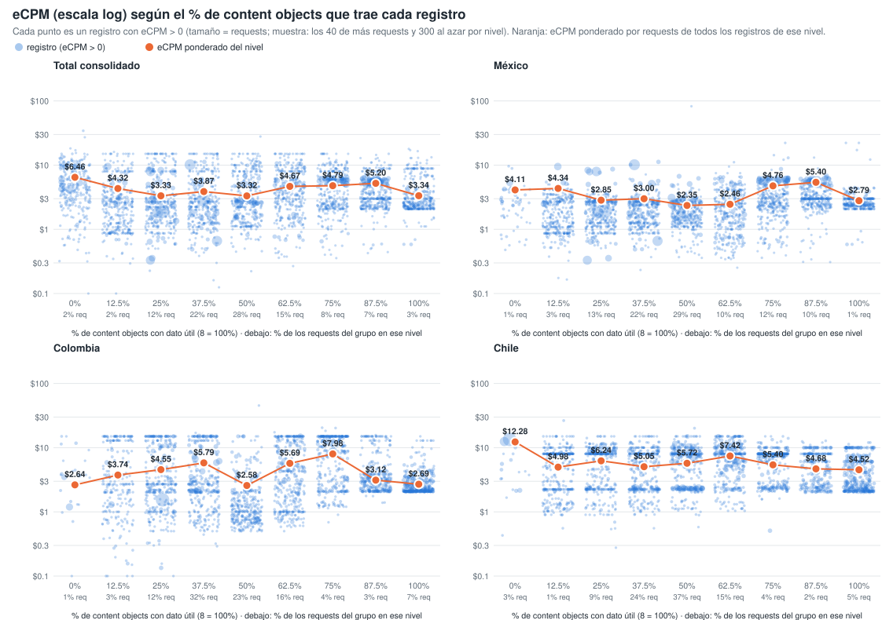
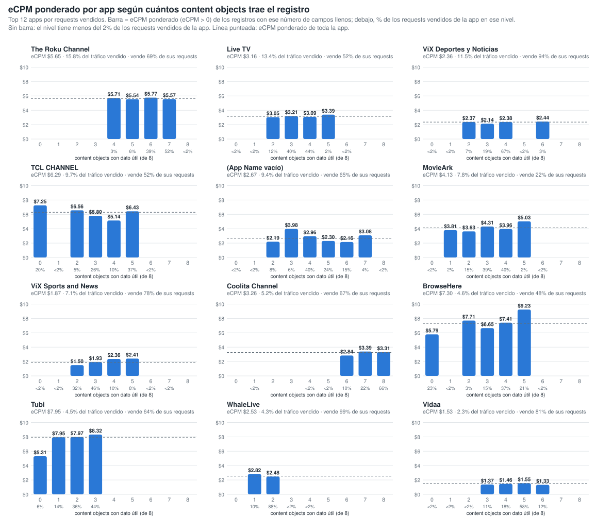
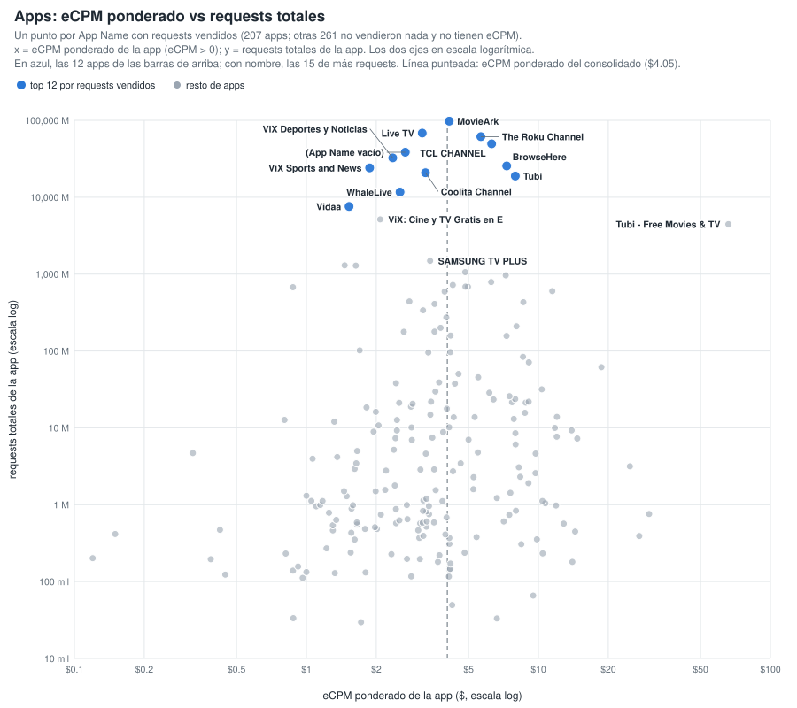
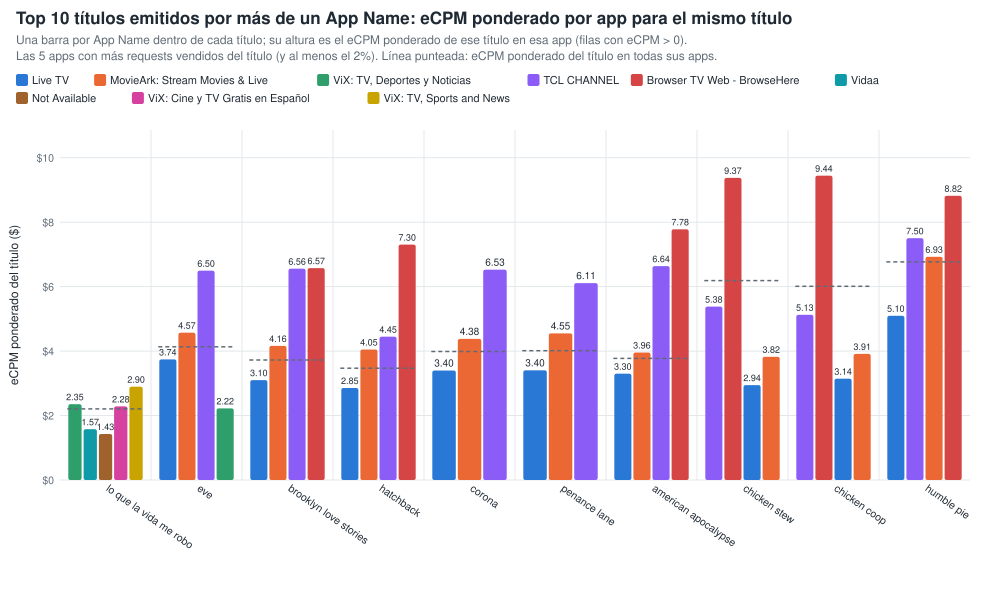
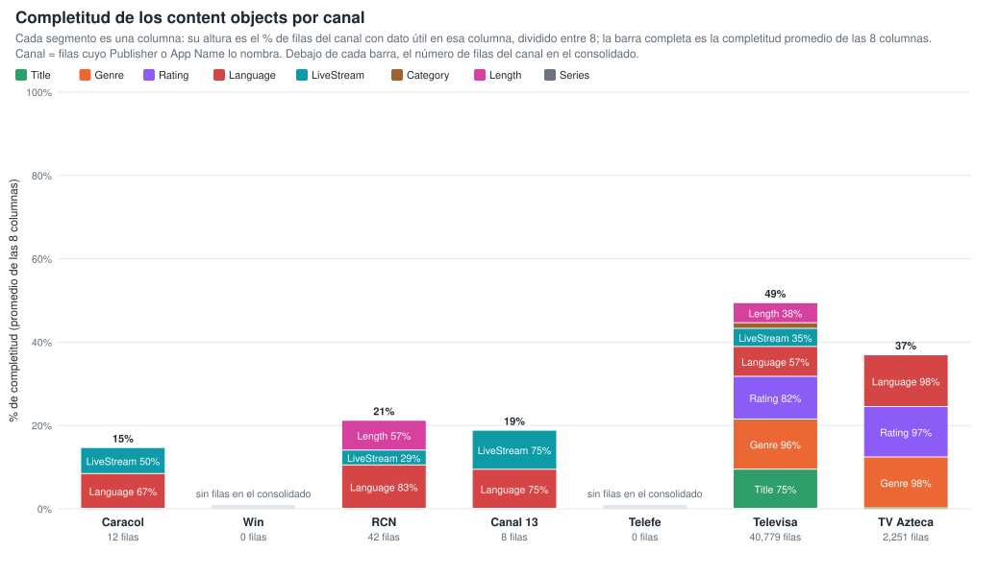
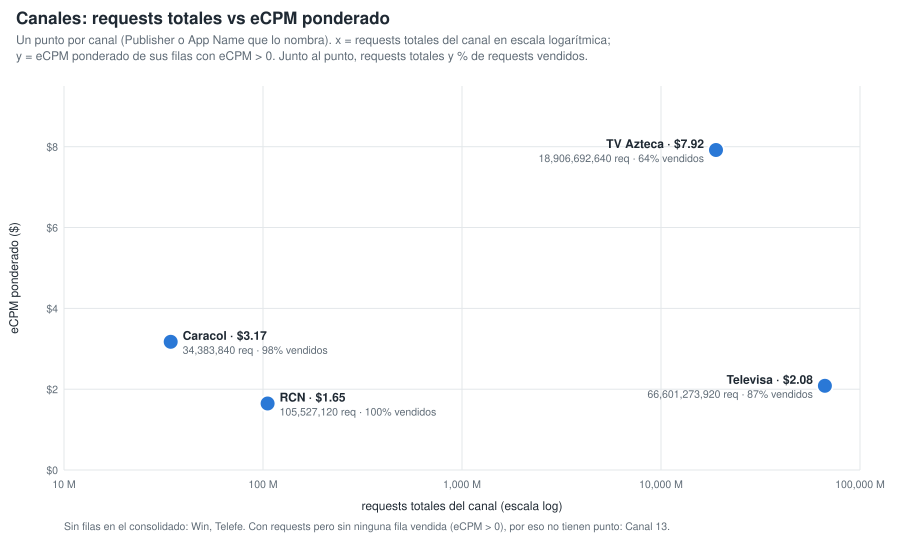
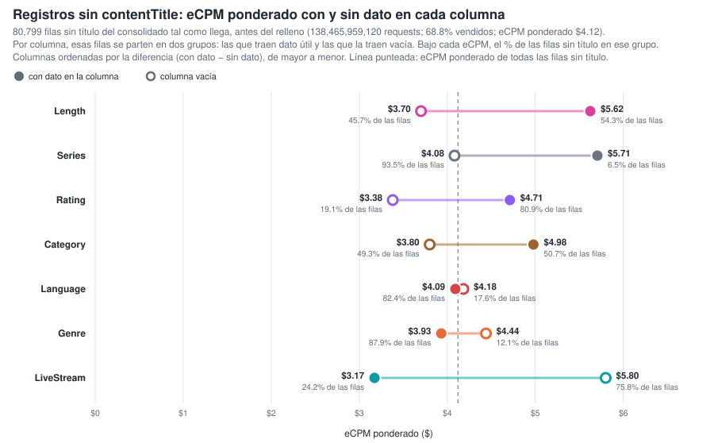
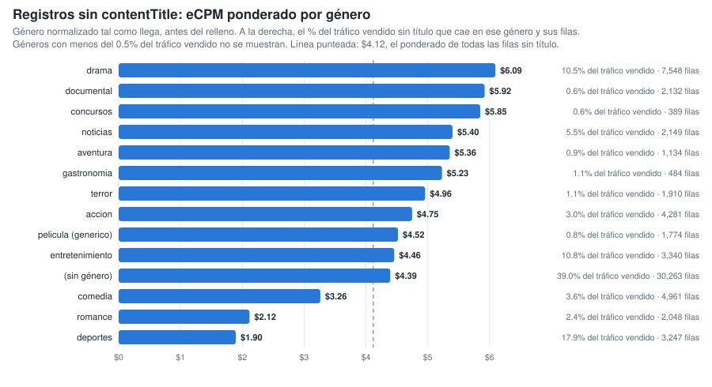

# Gráficos: eCPM de las filas llenas vs vacías (consolidado v10 a v19)

**Fuente:** `recursos/reporte-requests-ecpm-por-vacio-v19.json` (mismos datos de las tablas por país del detallado). Generado con `scripts/generar_graficos_ecpm_vacio.py` → `recursos/graficos-ecpm-vacio-r2.json`; tablas con `scripts/generar_reporte_graficos.py`.

*eCPM ponderado = Σ(eCPM × requests) / Σ requests, sin las filas con requests = 0 o eCPM = 0. Columnas: App Name y los 8 content objects con filas vacías; contentIsTitlePresent y Publisher vienen al 100% y no entran.*

## 1. Reparto del gasto (eCPM × requests / 1000) entre filas llenas y vacías

*% del gasto del grupo que cae en filas donde la columna trae dato útil. El gasto se calcula solo sobre filas con eCPM > 0.*

| Columna | Total consolidado | México | Colombia | Chile |
|---|---:|---:|---:|---:|
| App Name | 93.8% | 92.2% | 89.1% | 96.0% |
| contentGenre | 81.9% | 84.8% | 90.1% | 84.9% |
| contentTitle | 63.7% | 50.9% | 89.9% | 87.2% |
| contentRating | 79.6% | 83.7% | 79.8% | 82.2% |
| contentLanguage | 68.0% | 74.3% | 46.8% | 84.2% |
| contentIsLiveStream | 47.7% | 54.1% | 40.1% | 23.2% |
| contentCategory | 33.0% | 46.3% | 31.4% | 15.2% |
| contentLength | 31.5% | 46.7% | 18.4% | 15.0% |
| contentSeries | 6.8% | 5.2% | 11.9% | 11.2% |

## 2. % de columnas llenas de la fila vs eCPM (fila a fila)

Cada registro del consolidado se clasifica por el % de los 8 content objects que trae con dato útil (contentGenre, contentCategory, contentSeries, contentLength, contentLanguage, contentIsLiveStream, contentTitle, contentRating; contentIsTitlePresent no cuenta porque siempre viene). Cada punto es un registro con eCPM > 0, con el eCPM en escala logarítmica y el tamaño según sus requests (por nivel y panel se dibujan los 40 registros de más requests y 300 al azar). El punto naranja es el eCPM ponderado por requests de todos los registros del nivel. Generado con `scripts/generar_scatter_completitud_ecpm.py` → `recursos/graficos-ecpm-completitud-scatter.json`.

**Total consolidado** — 1,158,509 filas · 482,736,715,920 requests

| % de columnas llenas (de 8) | % filas | % requests | % requests vendidos (eCPM > 0) | eCPM pond. (>0) |
|---:|---:|---:|---:|---:|
| 0% (0) | 0.1% | 2.4% | 85.9% | $6.46 |
| 12.5% (1) | 2.1% | 2.4% | 53.7% | $4.32 |
| 25% (2) | 11.2% | 11.9% | 61.5% | $3.33 |
| 37.5% (3) | 23.6% | 22.4% | 52.8% | $3.87 |
| 50% (4) | 32.4% | 27.8% | 51.2% | $3.32 |
| 62.5% (5) | 21.4% | 15.0% | 39.8% | $4.67 |
| 75% (6) | 4.8% | 8.4% | 63.0% | $4.79 |
| 87.5% (7) | 1.9% | 6.9% | 79.1% | $5.20 |
| 100% (8) | 2.5% | 3.0% | 67.9% | $3.34 |

**México** — 347,432 filas · 285,694,946,000 requests

| % de columnas llenas (de 8) | % filas | % requests | % requests vendidos (eCPM > 0) | eCPM pond. (>0) |
|---:|---:|---:|---:|---:|
| 0% (0) | 0.1% | 0.8% | 84.9% | $4.11 |
| 12.5% (1) | 3.0% | 2.5% | 59.8% | $4.34 |
| 25% (2) | 14.0% | 13.0% | 71.8% | $2.85 |
| 37.5% (3) | 23.0% | 22.2% | 63.6% | $3.00 |
| 50% (4) | 31.3% | 29.2% | 58.3% | $2.35 |
| 62.5% (5) | 17.8% | 10.2% | 48.0% | $2.46 |
| 75% (6) | 6.7% | 11.6% | 66.6% | $4.76 |
| 87.5% (7) | 2.6% | 9.7% | 83.9% | $5.40 |
| 100% (8) | 1.3% | 0.8% | 73.7% | $2.79 |

**Colombia** — 122,400 filas · 34,995,318,240 requests

| % de columnas llenas (de 8) | % filas | % requests | % requests vendidos (eCPM > 0) | eCPM pond. (>0) |
|---:|---:|---:|---:|---:|
| 0% (0) | 0.1% | 1.3% | 35.7% | $2.63 |
| 12.5% (1) | 2.5% | 2.7% | 21.5% | $3.74 |
| 25% (2) | 13.8% | 11.6% | 36.6% | $4.55 |
| 37.5% (3) | 32.3% | 31.6% | 26.9% | $5.79 |
| 50% (4) | 24.2% | 22.8% | 26.4% | $2.58 |
| 62.5% (5) | 18.3% | 15.9% | 22.7% | $5.69 |
| 75% (6) | 4.5% | 4.2% | 44.1% | $7.98 |
| 87.5% (7) | 1.6% | 2.7% | 59.7% | $3.12 |
| 100% (8) | 2.7% | 7.2% | 59.6% | $2.69 |

**Chile** — 133,317 filas · 27,900,831,680 requests

| % de columnas llenas (de 8) | % filas | % requests | % requests vendidos (eCPM > 0) | eCPM pond. (>0) |
|---:|---:|---:|---:|---:|
| 0% (0) | 0.1% | 2.6% | 42.3% | $12.28 |
| 12.5% (1) | 1.8% | 1.3% | 18.3% | $4.98 |
| 25% (2) | 14.7% | 9.3% | 23.6% | $6.24 |
| 37.5% (3) | 28.1% | 23.5% | 17.7% | $5.05 |
| 50% (4) | 35.4% | 37.1% | 55.9% | $5.72 |
| 62.5% (5) | 13.2% | 15.1% | 21.7% | $7.42 |
| 75% (6) | 3.2% | 3.8% | 41.1% | $5.40 |
| 87.5% (7) | 1.2% | 2.0% | 50.7% | $4.68 |
| 100% (8) | 2.3% | 5.3% | 58.4% | $4.52 |

## 3. Por app: eCPM ponderado según cuántos content objects trae el registro

Top 12 apps por requests vendidos. Para cada app, barra = eCPM ponderado (eCPM > 0) de los registros con ese número de content objects con dato útil (de 8); debajo de cada barra, el % de los requests vendidos de la app en ese nivel. Los niveles con menos del 2 % de los requests vendidos de la app no se dibujan ni se tabulan. Generado con `scripts/generar_barras_app_completitud.py` → `recursos/graficos-app-completitud-barras.json`.

| App | eCPM pond. app | % tráfico vendido | 0 | 1 | 2 | 3 | 4 | 5 | 6 | 7 | 8 |
|---|---:|---:|---:|---:|---:|---:|---:|---:|---:|---:|---:|
| The Roku Channel | $5.65 | 15.8% | — | — | — | — | $5.71 (3%) | $5.54 (6%) | $5.77 (39%) | $5.57 (52%) | — |
| Live TV | $3.16 | 13.4% | — | — | $3.05 (12%) | $3.21 (40%) | $3.09 (44%) | $3.39 (2%) | — | — | — |
| ViX: TV, Deportes y Noticias | $2.36 | 11.5% | — | — | $2.37 (7%) | $2.14 (19%) | $2.38 (67%) | — | $2.44 (3%) | — | — |
| TCL CHANNEL | $6.29 | 9.7% | $7.25 (20%) | — | $6.56 (5%) | $5.80 (26%) | $5.14 (10%) | $6.43 (37%) | — | — | — |
| Not Available | $2.67 | 9.4% | — | — | $2.19 (8%) | $3.98 (6%) | $2.96 (40%) | $2.30 (24%) | $2.16 (15%) | $3.08 (4%) | — |
| MovieArk: Stream Movies & Live | $4.13 | 7.8% | — | $3.81 (2%) | $3.63 (15%) | $4.31 (39%) | $3.96 (40%) | $5.03 (2%) | — | — | — |
| ViX: TV, Sports and News | $1.87 | 7.1% | — | — | $1.50 (32%) | $1.93 (46%) | $2.36 (10%) | $2.41 (8%) | — | — | — |
| Coolita Channel | $3.26 | 5.2% | — | — | — | — | — | — | $2.84 (10%) | $3.39 (22%) | $3.31 (66%) |
| Browser TV Web - BrowseHere | $7.30 | 4.6% | $5.79 (23%) | — | $7.71 (3%) | $6.65 (15%) | $7.41 (37%) | $9.23 (21%) | — | — | — |
| Tubi: Free Movies & Live TV | $7.95 | 4.5% | $5.31 (6%) | $7.95 (14%) | $7.97 (36%) | $8.32 (44%) | — | — | — | — | — |
| WhaleLive | $2.53 | 4.3% | — | $2.82 (10%) | $2.48 (88%) | — | — | — | — | — | — |
| Vidaa | $1.53 | 2.3% | — | — | — | $1.37 (11%) | $1.46 (18%) | $1.55 (58%) | $1.33 (12%) | — | — |

*Entre paréntesis, el % de los requests vendidos de la app que cae en ese nivel de campos llenos.*

### 3.1 Apps: eCPM ponderado vs requests totales

Un punto por App Name con requests vendidos (207 apps; otras 261 no vendieron nada y no tienen eCPM). x = eCPM ponderado de la app (eCPM > 0); y = requests totales de la app; los dos ejes en escala logarítmica. Línea punteada: eCPM ponderado del consolidado ($4.05). Tabla: las 30 apps de más requests; todas están en `recursos/graficos-app-requests-ecpm.json`.

| App | Requests | Requests vendidos | % vendido | eCPM pond. |
|---|---:|---:|---:|---:|
| MovieArk: Stream Movies & Live | 97,524,350,080 | 20,974,494,880 | 21.5% | $4.13 |
| Live TV | 68,321,892,640 | 35,886,452,160 | 52.5% | $3.16 |
| The Roku Channel | 61,448,360,000 | 42,142,972,000 | 68.6% | $5.65 |
| TCL CHANNEL | 49,487,615,040 | 25,940,096,400 | 52.4% | $6.29 |
| Not Available | 38,535,553,600 | 25,077,156,640 | 65.1% | $2.67 |
| ViX: TV, Deportes y Noticias | 32,522,983,680 | 30,658,562,400 | 94.3% | $2.36 |
| Browser TV Web - BrowseHere | 25,513,605,760 | 12,280,917,600 | 48.1% | $7.30 |
| ViX: TV, Sports and News | 24,109,323,920 | 18,910,923,760 | 78.4% | $1.87 |
| Coolita Channel | 20,841,947,040 | 14,005,176,800 | 67.2% | $3.26 |
| Tubi: Free Movies & Live TV | 18,860,726,880 | 12,103,747,680 | 64.2% | $7.95 |
| WhaleLive | 11,694,306,080 | 11,574,312,480 | 99.0% | $2.53 |
| Vidaa | 7,591,572,000 | 6,136,743,920 | 80.8% | $1.53 |
| ViX: Cine y TV Gratis en Español | 5,150,639,200 | 3,756,738,800 | 72.9% | $2.08 |
| Tubi - Free Movies & TV | 4,457,417,920 | 56,320 | 0.0% | $65.89 |
| SAMSUNG TV PLUS | 1,488,394,560 | 1,085,142,640 | 72.9% | $3.41 |
| ViX: Cine y TV en Español | 1,299,028,800 | 1,174,135,520 | 90.4% | $1.46 |
| VIX - Filmes e TV | 1,290,805,920 | 1,224,764,400 | 94.9% | $1.63 |
| Open Browser - TV Web Browser | 1,061,289,280 | 943,451,840 | 88.9% | $4.83 |
| Metax TV - Live TV & Movies | 963,628,160 | 666,715,680 | 69.2% | $7.23 |
| Ottera | 787,757,600 | 406,236,800 | 51.6% | $6.26 |
| Plex - Free Movies & TV | 722,116,320 | 146,623,040 | 20.3% | $4.28 |
| LG | 685,774,480 | 14,956,640 | 2.2% | $4.85 |
| Free Games by PlayWorks | 684,958,400 | 14,460,320 | 2.1% | $4.97 |
| Univision App: Univision & Unimas Free | 676,313,680 | 661,755,600 | 97.8% | $0.88 |
| PlutoTV: Stream Free Movies/TV | 601,448,480 | 147,159,840 | 24.5% | $11.48 |
| Plex: Find Movies & TV Shows | 593,204,640 | 81,158,240 | 13.7% | $3.94 |
| FreeTube- Search & Watch Free | 440,818,560 | 89,185,440 | 20.2% | $2.78 |
| Pluto TV - Free Movies/Shows | 432,212,000 | 47,226,480 | 10.9% | $8.61 |
| Xiaomi TV+: Watch Live TV | 409,790,880 | 97,692,960 | 23.8% | $3.57 |
| FreeTV: Películas, Series y TV | 338,013,040 | 212,657,440 | 62.9% | $3.18 |

## 4. Títulos emitidos por más de un App Name

15,799 títulos reales, agrupados solo por App Name (sin pageURL). Generado con `scripts/generar_tabla_pageurl_titulos.py` → `recursos/titulos-appname.json`.

| App Name distintos por título | % de títulos | % de requests |
|---:|---:|---:|
| 1 | 47.7% | 7.8% |
| 2 | 27.3% | 8.3% |
| 3 | 7.0% | 2.1% |
| 4 | 3.3% | 2.1% |
| 5+ | 14.7% | 79.7% |

**Top 10 títulos (por requests) en dos o más App Name:** una barra por App Name dentro de cada título, con altura = eCPM ponderado de ese título en esa app (eCPM > 0; las 5 apps con más requests vendidos del título). Línea punteada = eCPM ponderado del título en todas sus apps.

| Título | App Name | Requests | eCPM pond. | Reparto por app (% de requests vendidos, eCPM pond. de la app) |
|---|---:|---:|---:|---|
| lo que la vida me robo | 7 | 3,106,572,320 | $2.21 | ViX: TV, Deportes y Noticias 70% ($2.35), Vidaa 11% ($1.57), Not Available 8% ($1.43), ViX: Cine y TV Gratis en Español 6% ($2.28), ViX: TV, Sports and News 4% ($2.90) |
| eve | 12 | 2,169,736,560 | $4.13 | Live TV 55% ($3.74), MovieArk: Stream Movies & Live 36% ($4.57), TCL CHANNEL 4% ($6.50), ViX: TV, Deportes y Noticias 2% ($2.22), Browser TV Web - BrowseHere 2% ($5.89) |
| brooklyn love stories | 8 | 2,111,762,640 | $3.72 | Live TV 54% ($3.10), MovieArk: Stream Movies & Live 39% ($4.16), TCL CHANNEL 4% ($6.56), Browser TV Web - BrowseHere 2% ($6.57), Not Available 1% ($3.85) |
| hatchback | 7 | 2,070,447,840 | $3.47 | Live TV 56% ($2.85), MovieArk: Stream Movies & Live 37% ($4.05), TCL CHANNEL 4% ($4.45), Browser TV Web - BrowseHere 2% ($7.30), Not Available 1% ($4.14) |
| corona | 7 | 2,055,902,000 | $3.99 | Live TV 54% ($3.40), MovieArk: Stream Movies & Live 40% ($4.38), TCL CHANNEL 4% ($6.53), Browser TV Web - BrowseHere 2% ($7.44), Not Available 0% ($3.91) |
| penance lane | 8 | 2,047,331,120 | $4.01 | Live TV 56% ($3.40), MovieArk: Stream Movies & Live 38% ($4.55), TCL CHANNEL 4% ($6.11), Browser TV Web - BrowseHere 2% ($7.06), Not Available 0% ($3.85) |
| american apocalypse | 8 | 2,046,553,920 | $3.77 | Live TV 56% ($3.30), MovieArk: Stream Movies & Live 37% ($3.96), TCL CHANNEL 4% ($6.64), Browser TV Web - BrowseHere 2% ($7.78), Not Available 1% ($5.06) |
| chicken stew | 7 | 1,882,113,200 | $6.19 | TCL CHANNEL 61% ($5.38), Browser TV Web - BrowseHere 27% ($9.37), Live TV 8% ($2.94), MovieArk: Stream Movies & Live 4% ($3.82), Not Available 0% ($4.54) |
| chicken coop | 7 | 1,858,788,400 | $6.01 | TCL CHANNEL 62% ($5.13), Browser TV Web - BrowseHere 25% ($9.44), Live TV 7% ($3.14), MovieArk: Stream Movies & Live 5% ($3.91), Not Available 0% ($2.72) |
| humble pie | 7 | 1,786,588,400 | $6.77 | Live TV 32% ($5.10), TCL CHANNEL 31% ($7.50), MovieArk: Stream Movies & Live 23% ($6.93), Browser TV Web - BrowseHere 13% ($8.82), Not Available 0% ($7.03) |

## 5. Completitud de los content objects por canal

Canal = filas cuyo Publisher o App Name lo nombra (Caracol via OB / ditu por Caracol, RCN via OB / Canal RCN, Canal 13 OB, Televisa Univision via … / ViX, TV Azteca - Springserve / Azteca TV). Cada segmento de la barra es una columna, con altura = % de filas del canal con dato útil en esa columna dividido entre 8; la barra completa es la completitud promedio de las 8 columnas. Generado con `scripts/generar_barras_canales_completitud.py` → `recursos/graficos-canales-completitud-barras.json`.

| Canal | Filas | Requests | Promedio | Title | Genre | Rating | Language | IsLiveStream | Category | Length | Series |
|---|---:|---:|---:|---:|---:|---:|---:|---:|---:|---:|---:|
| Televisa | 40,779 | 66,601,273,920 | 49.4% | 75.2% | 96.3% | 82.0% | 57.3% | 34.8% | 10.7% | 38.3% | 0.2% |
| TV Azteca | 2,251 | 18,906,692,640 | 36.9% | 0.7% | 97.9% | 96.8% | 98.5% | 0.2% | 0.4% | 0.4% | 0.2% |
| RCN | 42 | 105,527,120 | 21.1% | 0.0% | 0.0% | 0.0% | 83.3% | 28.6% | 0.0% | 57.1% | 0.0% |
| Canal 13 | 8 | 9,988,800 | 18.8% | 0.0% | 0.0% | 0.0% | 75.0% | 75.0% | 0.0% | 0.0% | 0.0% |
| Caracol | 12 | 34,383,840 | 14.6% | 0.0% | 0.0% | 0.0% | 66.7% | 50.0% | 0.0% | 0.0% | 0.0% |
| Win | 0 | 0 | — | — | — | — | — | — | — | — | — |
| Telefe | 0 | 0 | — | — | — | — | — | — | — | — | — |

*Win y Telefe no aparecen en el consolidado: ningún Publisher ni App Name los nombra.*

## 6. Canales: requests totales vs eCPM ponderado

Un punto por canal (mismos canales y misma definición de la sección 5). x = requests totales del canal en escala logarítmica; y = eCPM ponderado de sus filas con eCPM > 0. Junto al punto, requests totales y % de requests vendidos.

| Canal | Requests | Requests vendidos | % vendido | eCPM pond. |
|---|---:|---:|---:|---:|
| Televisa | 66,601,273,920 | 57,893,466,880 | 86.9% | $2.08 |
| TV Azteca | 18,906,692,640 | 12,184,514,160 | 64.4% | $7.92 |
| RCN | 105,527,120 | 105,382,000 | 99.9% | $1.65 |
| Caracol | 34,383,840 | 33,774,800 | 98.2% | $3.17 |
| Canal 13 | 9,988,800 | 0 | 0.0% | — (sin filas vendidas) |
| Win | 0 | 0 | — | — |
| Telefe | 0 | 0 | — | — |

## 7. Registros sin contentTitle: qué content objects se relacionan con el eCPM

80,799 filas sin título (138,465,959,120 requests; 68.8% vendidos; eCPM ponderado $4.12). Generado con `scripts/generar_graficos_sin_titulo.py` → `recursos/graficos-sin-titulo.json`.

### 7.1 eCPM ponderado con y sin dato en cada columna

Filas sin título del consolidado tal como llega, antes del relleno. Por columna se parten en dos grupos: las que traen dato útil (círculo lleno) y las que la traen vacía (círculo hueco); de cada grupo, su % de las filas sin título, su % de requests vendidos y su eCPM ponderado. Diferencia = eCPM con dato − eCPM sin dato.

| Columna | % filas con dato | % vendido con dato | eCPM pond. con dato | % filas sin dato | % vendido sin dato | eCPM pond. sin dato | Diferencia |
|---|---:|---:|---:|---:|---:|---:|---:|
| contentLength | 54.3% | 57.0% | $5.62 | 45.7% | 73.0% | $3.70 | +$1.92 |
| contentSeries | 6.5% | 46.0% | $5.71 | 93.5% | 69.6% | $4.08 | +$1.62 |
| contentRating | 80.9% | 61.5% | $4.71 | 19.1% | 80.8% | $3.38 | +$1.33 |
| contentCategory | 50.7% | 50.1% | $4.98 | 49.3% | 80.0% | $3.80 | +$1.18 |
| contentLanguage | 82.4% | 65.2% | $4.09 | 17.6% | 77.9% | $4.18 | −$0.09 |
| contentGenre | 87.9% | 65.0% | $3.93 | 12.1% | 76.4% | $4.44 | −$0.51 |
| contentIsLiveStream | 24.2% | 82.8% | $3.17 | 75.8% | 52.9% | $5.80 | −$2.63 |

### 7.2 eCPM ponderado por género en las filas sin título

Género normalizado tal como llega. Es el content object que más separa el precio cuando no hay título: explica el 20.6 % de la variación del eCPM ponderado solo y aporta 6.9 puntos más controlando por publisher × país (rating: 17.1 % y 4.7 puntos; livestream, length, categoría y series: menos de 1.5 puntos).

| Género | Filas | % del tráfico vendido sin título | eCPM pond. |
|---|---:|---:|---:|
| drama | 7,548 | 10.5% | $6.09 |
| documental | 2,132 | 0.6% | $5.92 |
| concursos | 389 | 0.6% | $5.85 |
| noticias | 2,149 | 5.5% | $5.40 |
| aventura | 1,134 | 0.9% | $5.36 |
| gastronomia | 484 | 1.1% | $5.23 |
| terror | 1,910 | 1.1% | $4.96 |
| accion | 4,281 | 3.0% | $4.75 |
| pelicula (generico) | 1,774 | 0.8% | $4.52 |
| entretenimiento | 3,340 | 10.8% | $4.46 |
| (sin género) | 30,263 | 39.0% | $4.39 |
| thriller | 1,678 | 0.5% | $4.18 |
| comedia | 4,961 | 3.6% | $3.26 |
| romance | 2,048 | 2.4% | $2.12 |
| deportes | 3,247 | 17.9% | $1.90 |
