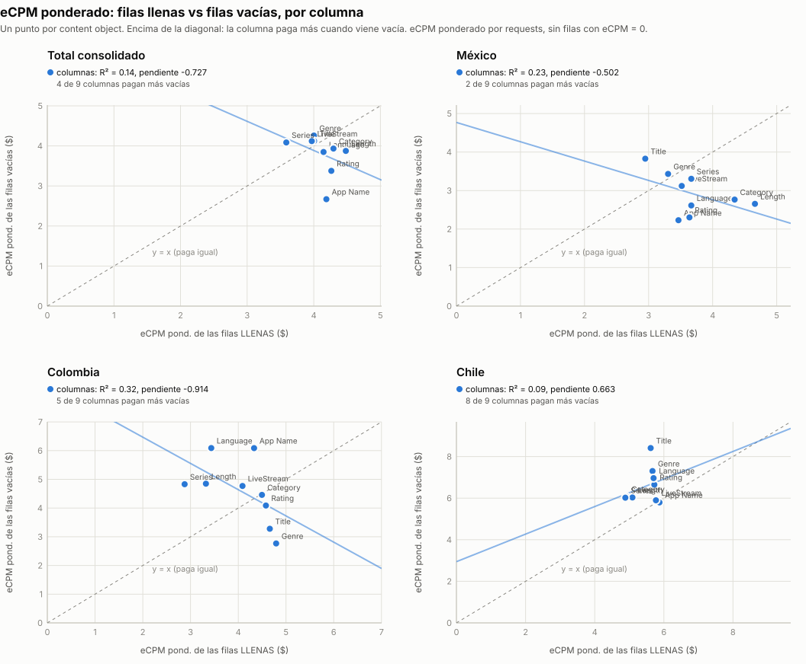
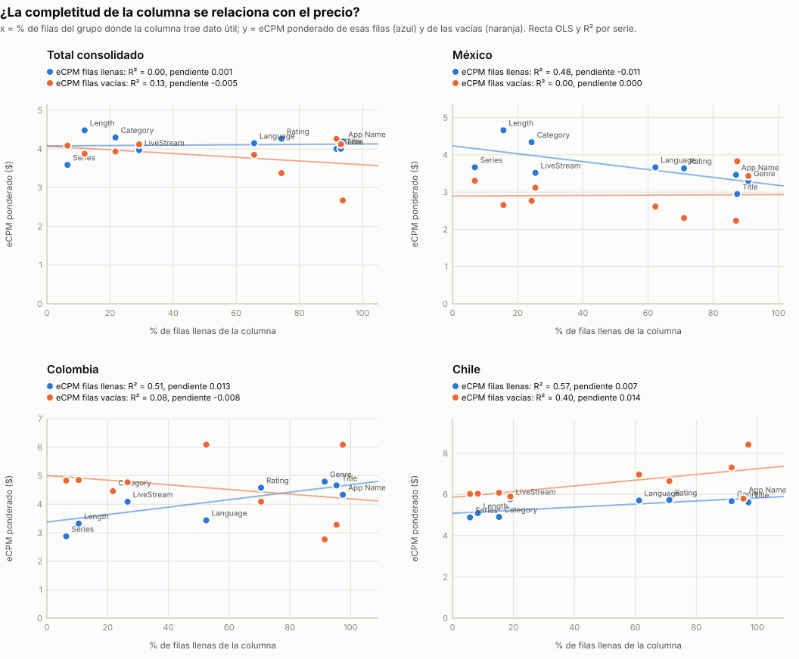

# Gráficos: eCPM de las filas llenas vs vacías (consolidado v10 a v19)

**Fuente:** `recursos/reporte-requests-ecpm-por-vacio-v19.json` (mismos datos de las tablas por país del detallado). Generado con `scripts/generar_graficos_ecpm_vacio.py` → `recursos/graficos-ecpm-vacio-r2.json`; tablas con `scripts/generar_reporte_graficos.py`.

*eCPM ponderado = Σ(eCPM × requests) / Σ requests, sin las filas con requests = 0 o eCPM = 0. Un punto por content object (9 columnas: App Name y los 8 content objects con filas vacías; contentIsTitlePresent y Publisher vienen al 100% y no entran). R² es el de la recta de mínimos cuadrados (OLS) sobre esos 9 puntos.*

## 1. eCPM llenas (x) vs eCPM vacías (y)

| Grupo | R² | Pendiente | Intercepto | Columnas que pagan más vacías |
|---|---:|---:|---:|---:|
| Total consolidado | 0.138 | -0.727 | 6.79 | 4 de 9 |
| México | 0.234 | -0.502 | 4.77 | 2 de 9 |
| Colombia | 0.316 | -0.914 | 8.30 | 5 de 9 |
| Chile | 0.091 | 0.663 | 2.95 | 8 de 9 |

## 2. % de filas llenas (x) vs eCPM (y), por serie

| Grupo | Serie | R² | Pendiente ($ por punto de %) | Intercepto |
|---|---|---:|---:|---:|
| Total consolidado | eCPM filas llenas | 0.005 | 0.0005 | 4.08 |
| Total consolidado | eCPM filas vacías | 0.127 | -0.0048 | 4.07 |
| México | eCPM filas llenas | 0.481 | -0.0106 | 4.24 |
| México | eCPM filas vacías | 0.001 | 0.0004 | 2.89 |
| Colombia | eCPM filas llenas | 0.513 | 0.0131 | 3.38 |
| Colombia | eCPM filas vacías | 0.075 | -0.0082 | 5.01 |
| Chile | eCPM filas llenas | 0.569 | 0.0075 | 5.08 |
| Chile | eCPM filas vacías | 0.401 | 0.0139 | 5.86 |

## 3. Reparto del gasto (eCPM × requests / 1000) entre filas llenas y vacías

*% del gasto del grupo que cae en filas donde la columna trae dato útil. El gasto se calcula solo sobre filas con eCPM > 0.*

| Columna | Total consolidado | México | Colombia | Chile |
|---|---:|---:|---:|---:|
| App Name | 93.8% | 92.2% | 89.1% | 96.0% |
| contentGenre | 81.9% | 84.8% | 90.1% | 84.9% |
| contentTitle | 63.7% | 50.9% | 89.9% | 87.2% |
| contentRating | 79.6% | 83.7% | 79.8% | 82.2% |
| contentLanguage | 68.0% | 74.3% | 46.8% | 84.2% |
| contentIsLiveStream | 47.7% | 54.1% | 40.1% | 23.2% |
| contentCategory | 33.0% | 46.3% | 31.4% | 15.2% |
| contentLength | 31.5% | 46.7% | 18.4% | 15.0% |
| contentSeries | 6.8% | 5.2% | 11.9% | 11.2% |

## 4. Completitud de la fila vs eCPM: densidad de requests (fila a fila)

Cada fila del consolidado se clasifica por cuántos de los 8 content objects trae con dato útil (contentGenre, contentCategory, contentSeries, contentLength, contentLanguage, contentIsLiveStream, contentTitle, contentRating; contentIsTitlePresent no cuenta porque siempre viene). El heatmap acumula los requests de las filas en cada celda de (campos llenos, bin logarítmico de eCPM); la banda inferior son las filas con eCPM = 0. El punto naranja es el eCPM ponderado (>0) de cada nivel. Generado con `scripts/generar_heatmap_completitud_ecpm.py` → `recursos/graficos-ecpm-completitud-heatmap.json`.

**Total consolidado** — 1,158,509 filas · 482,736,715,920 requests

| Campos llenos (de 8) | % filas | % requests | % requests vendidos (eCPM > 0) | eCPM pond. (>0) |
|---:|---:|---:|---:|---:|
| 0 | 0.1% | 2.4% | 85.9% | $6.46 |
| 1 | 2.1% | 2.4% | 53.7% | $4.32 |
| 2 | 11.2% | 11.9% | 61.5% | $3.33 |
| 3 | 23.6% | 22.4% | 52.8% | $3.87 |
| 4 | 32.4% | 27.8% | 51.2% | $3.32 |
| 5 | 21.4% | 15.0% | 39.8% | $4.67 |
| 6 | 4.8% | 8.4% | 63.0% | $4.79 |
| 7 | 1.9% | 6.9% | 79.1% | $5.20 |
| 8 | 2.5% | 3.0% | 67.9% | $3.34 |

**México** — 347,432 filas · 285,694,946,000 requests

| Campos llenos (de 8) | % filas | % requests | % requests vendidos (eCPM > 0) | eCPM pond. (>0) |
|---:|---:|---:|---:|---:|
| 0 | 0.1% | 0.8% | 84.9% | $4.11 |
| 1 | 3.0% | 2.5% | 59.8% | $4.34 |
| 2 | 14.0% | 13.0% | 71.8% | $2.85 |
| 3 | 23.0% | 22.2% | 63.6% | $3.00 |
| 4 | 31.3% | 29.2% | 58.3% | $2.35 |
| 5 | 17.8% | 10.2% | 48.0% | $2.46 |
| 6 | 6.7% | 11.6% | 66.6% | $4.76 |
| 7 | 2.6% | 9.7% | 83.9% | $5.40 |
| 8 | 1.3% | 0.8% | 73.7% | $2.79 |

**Colombia** — 122,400 filas · 34,995,318,240 requests

| Campos llenos (de 8) | % filas | % requests | % requests vendidos (eCPM > 0) | eCPM pond. (>0) |
|---:|---:|---:|---:|---:|
| 0 | 0.1% | 1.3% | 35.7% | $2.63 |
| 1 | 2.5% | 2.7% | 21.5% | $3.74 |
| 2 | 13.8% | 11.6% | 36.6% | $4.55 |
| 3 | 32.3% | 31.6% | 26.9% | $5.79 |
| 4 | 24.2% | 22.8% | 26.4% | $2.58 |
| 5 | 18.3% | 15.9% | 22.7% | $5.69 |
| 6 | 4.5% | 4.2% | 44.1% | $7.98 |
| 7 | 1.6% | 2.7% | 59.7% | $3.12 |
| 8 | 2.7% | 7.2% | 59.6% | $2.69 |

**Chile** — 133,317 filas · 27,900,831,680 requests

| Campos llenos (de 8) | % filas | % requests | % requests vendidos (eCPM > 0) | eCPM pond. (>0) |
|---:|---:|---:|---:|---:|
| 0 | 0.1% | 2.6% | 42.3% | $12.28 |
| 1 | 1.8% | 1.3% | 18.3% | $4.98 |
| 2 | 14.7% | 9.3% | 23.6% | $6.24 |
| 3 | 28.1% | 23.5% | 17.7% | $5.05 |
| 4 | 35.4% | 37.1% | 55.9% | $5.72 |
| 5 | 13.2% | 15.1% | 21.7% | $7.42 |
| 6 | 3.2% | 3.8% | 41.1% | $5.40 |
| 7 | 1.2% | 2.0% | 50.7% | $4.68 |
| 8 | 2.3% | 5.3% | 58.4% | $4.52 |
