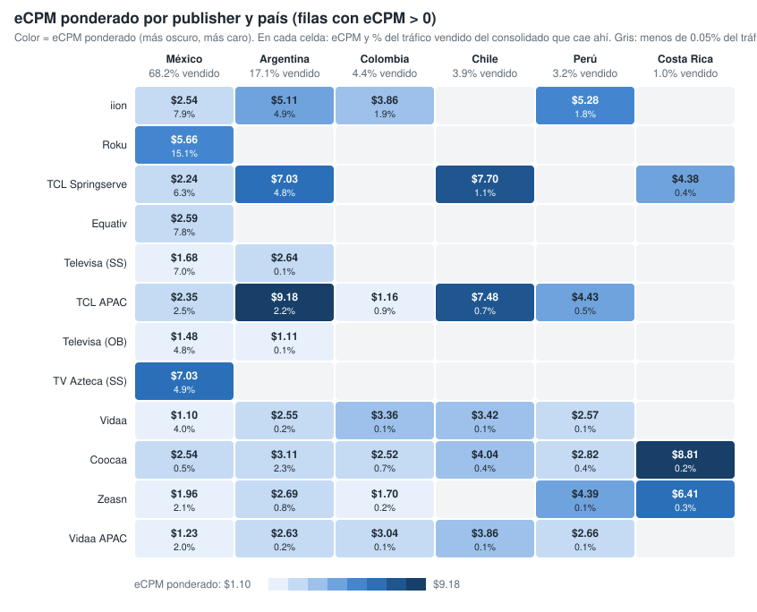
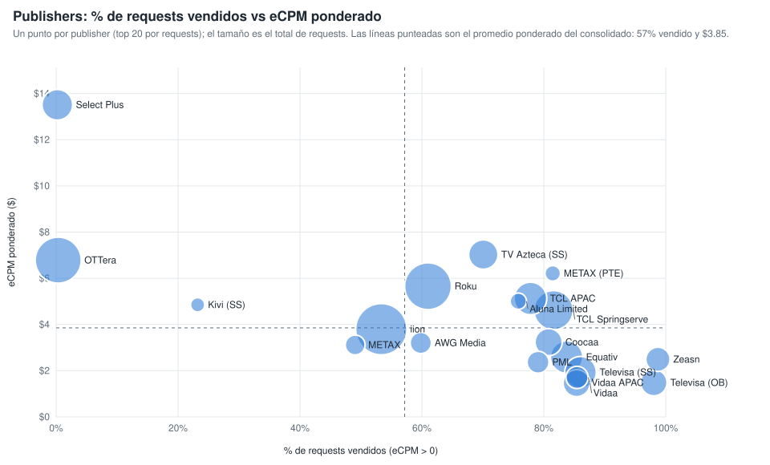

# Qué mueve el eCPM ponderado: la ruta de venta (publisher y país) (consolidado v10 a v20)

Sobre las filas con eCPM > 0 y requests > 0, la combinación publisher × país explica el 67.3 % de la variación del eCPM ponderado; los content objects, controlando por la ruta, aportan pocos puntos (género y rating los que más). Generado con `scripts/generar_graficos_drivers_ecpm.py` → `graficos-drivers-ecpm.json`.

## 1. eCPM ponderado por publisher y país

*Publishers ordenados por requests vendidos (top 12). En cada celda, eCPM ponderado y, debajo, % del tráfico vendido del consolidado que cae en esa combinación. Vacío = menos del 0.05 % del tráfico vendido.*

| Publisher | Mexico | Argentina | Colombia | Chile | Peru | Costa Rica |
|---|---:|---:|---:|---:|---:|---:|
| iion Pty Ltd | $2.54 (7.9%) | $5.11 (4.9%) | $3.86 (1.9%) | — | $5.28 (1.8%) | — |
| Roku - oRTB | $5.66 (15.2%) | — | — | — | — | — |
| TCL ADS - Springserve | $2.24 (6.3%) | $7.03 (4.8%) | — | $7.71 (1.1%) | — | $4.38 (0.4%) |
| Equativ (Formerly SMART AdServer) - oRTB CTV | $2.59 (7.8%) | — | — | — | — | — |
| Televisa Univision via SpringServe | $1.68 (7.0%) | $2.63 (0.1%) | — | — | — | — |
| TCL ADs (APAC) | $2.35 (2.5%) | $9.18 (2.2%) | $1.16 (0.9%) | $7.48 (0.7%) | $4.43 (0.5%) | — |
| Televisa Univision via OB | $1.48 (4.8%) | $1.11 (0.1%) | — | — | — | — |
| TV Azteca - Springserve | $7.03 (4.9%) | — | — | — | — | — |
| Vidaa | $1.10 (4.0%) | $2.55 (0.2%) | $3.36 (0.1%) | $3.42 (0.1%) | $2.57 (0.1%) | — |
| Coocaa, a SKYWORTH company | $2.54 (0.5%) | $3.11 (2.3%) | $2.52 (0.7%) | $4.04 (0.4%) | $2.82 (0.4%) | $8.81 (0.2%) |
| Zeasn Europe B.V. | $1.96 (2.1%) | $2.69 (0.8%) | $1.70 (0.2%) | — | $4.39 (0.1%) | $6.41 (0.2%) |
| Vidaa  APAC Hisense Headquarter | $1.23 (2.0%) | $2.63 (0.2%) | $3.04 (0.1%) | $3.86 (0.1%) | $2.66 (0.1%) | — |

## 2. Publishers: % de requests vendidos vs eCPM ponderado

*Un punto por publisher (top 20 por requests); el tamaño es el total de requests. Líneas punteadas: promedio ponderado del consolidado (57 % vendido, $3.85).*

| Publisher | Requests | % vendido (eCPM > 0) | eCPM pond. | % del tráfico vendido |
|---|---:|---:|---:|---:|
| iion Pty Ltd | 100,482,223,440 | 53.3% | $3.80 | 16.7% |
| Roku - oRTB | 79,774,949,280 | 61.0% | $5.66 | 15.2% |
| OTTera.tv | 76,322,983,280 | 0.3% | $6.79 | 0.1% |
| TCL ADS - Springserve | 51,058,744,240 | 81.6% | $4.62 | 13.0% |
| TCL ADs (APAC) | 30,574,026,560 | 77.8% | $5.13 | 7.4% |
| Equativ (Formerly SMART AdServer) - oRTB CTV | 29,838,362,480 | 83.7% | $2.59 | 7.8% |
| Televisa Univision via SpringServe | 28,045,808,640 | 86.0% | $1.93 | 7.5% |
| Select Plus PTE LTD (CTV) | 25,698,980,160 | 0.2% | $13.51 | 0.0% |
| TV Azteca - Springserve | 22,501,762,080 | 70.1% | $7.03 | 4.9% |
| Coocaa, a SKYWORTH company | 17,668,687,360 | 80.8% | $3.24 | 4.4% |
| Vidaa | 17,228,357,120 | 85.4% | $1.46 | 4.6% |
| Televisa Univision via OB | 16,355,806,800 | 98.0% | $1.49 | 5.0% |
| Zeasn Europe B.V. | 12,199,608,320 | 98.7% | $2.49 | 3.8% |
| Vidaa  APAC Hisense Headquarter | 9,314,980,480 | 85.4% | $1.71 | 2.5% |
| PML Digital | 8,796,359,840 | 79.1% | $2.37 | 2.2% |
| AWG Media | 7,892,650,160 | 59.8% | $3.20 | 1.5% |
| METAX SOFTWARE PTE. LTD. (Exchange) | 6,089,359,360 | 49.1% | $3.12 | 0.9% |
| Aluna Limited | 2,600,993,040 | 75.8% | $5.01 | 0.6% |
| METAX SOFTWARE PTE. LTD. | 2,066,552,080 | 81.5% | $6.21 | 0.5% |
| Kivi via Springserve | 1,275,336,400 | 23.2% | $4.85 | 0.1% |
