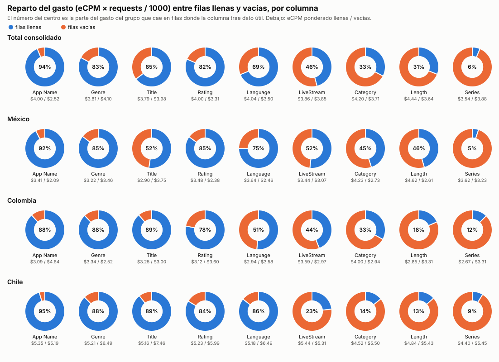
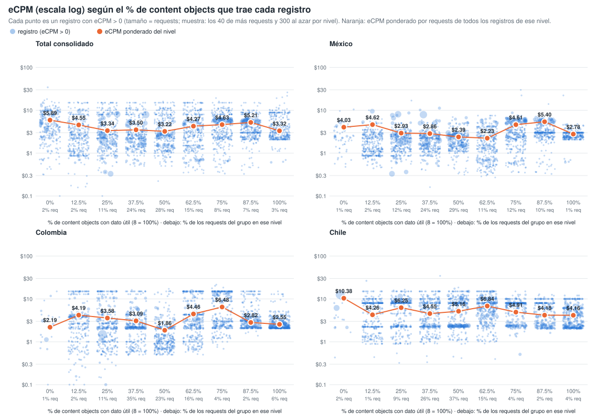
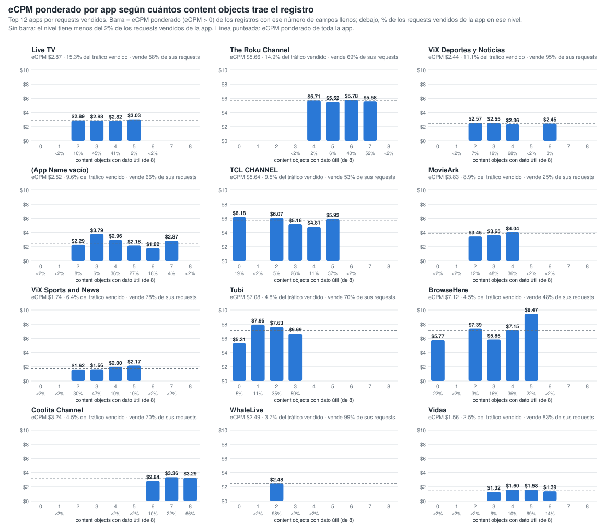
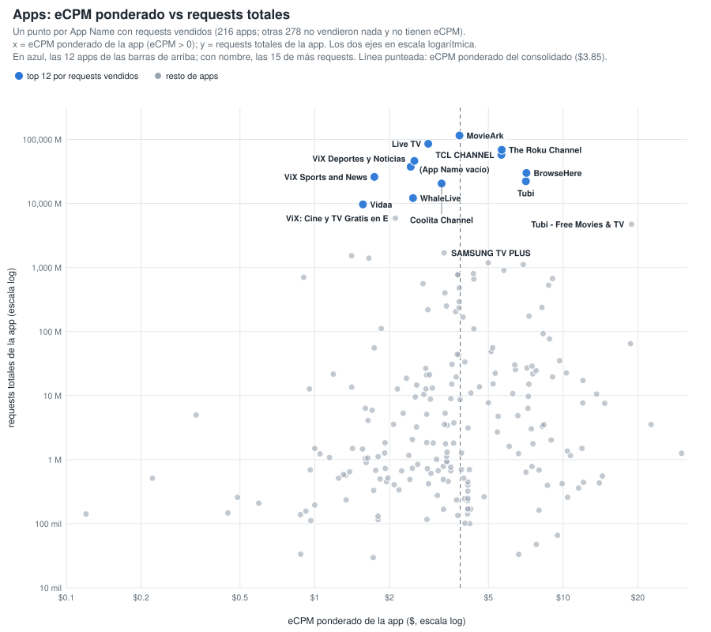
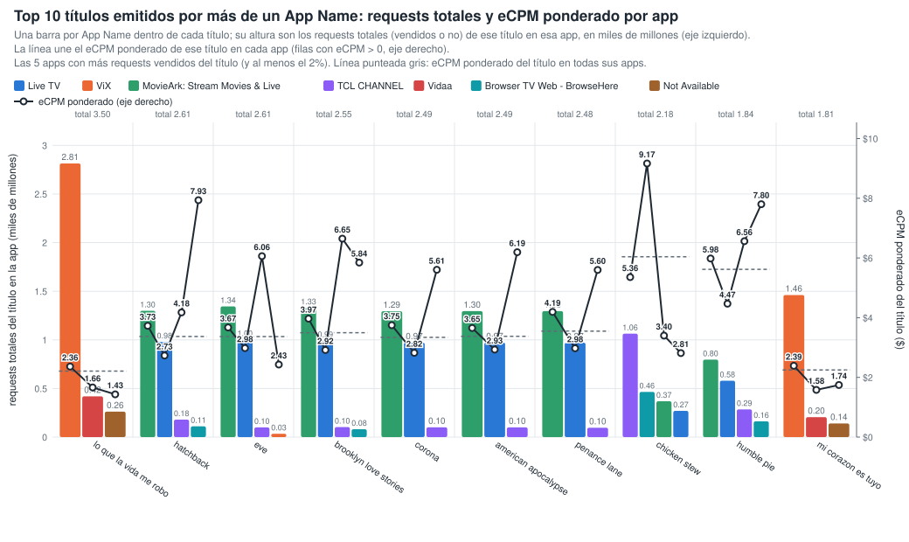
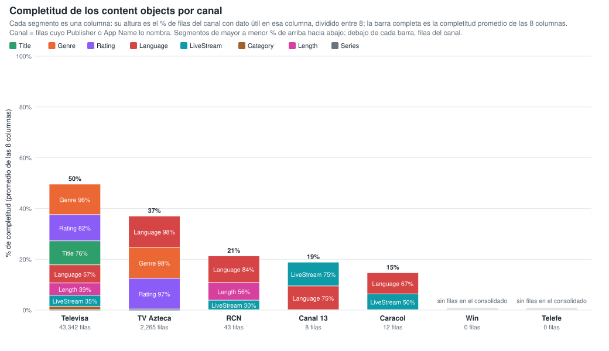
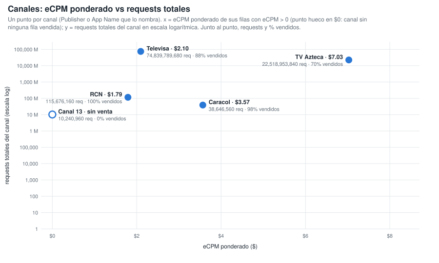
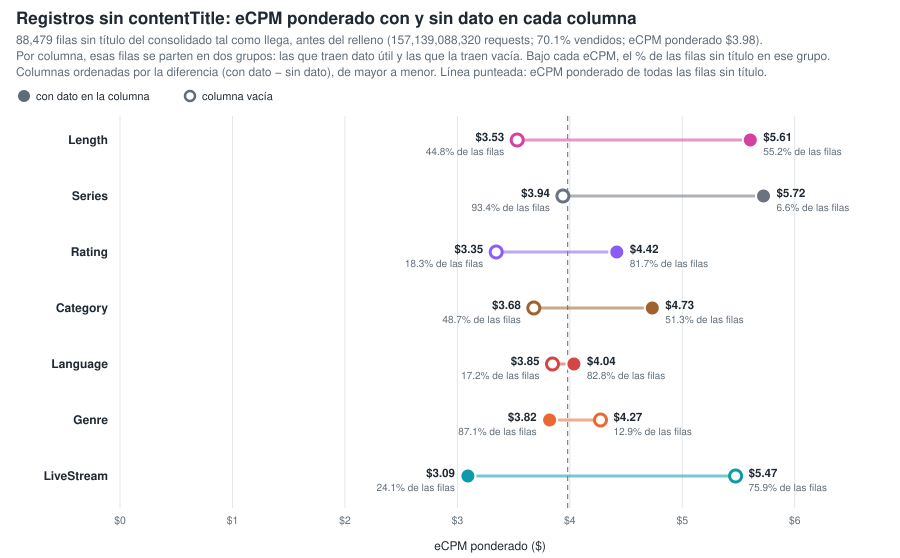
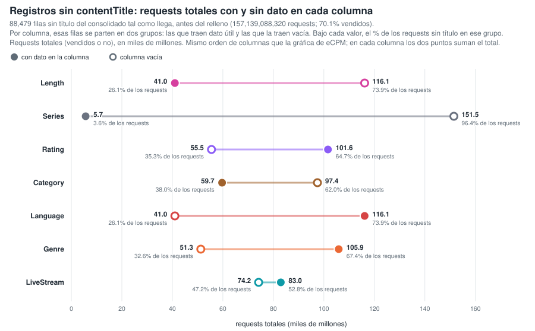
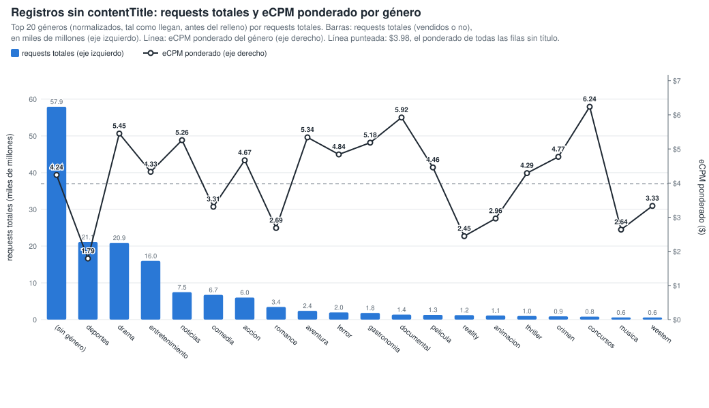

# Gráficos: eCPM de las filas llenas vs vacías (consolidado v10 a v20)

**Fuente:** `recursos/reporte-requests-ecpm-por-vacio-v20.json` (mismos datos de las tablas por país del detallado). Generado con `scripts/generar_graficos_ecpm_vacio.py` → `recursos/graficos-ecpm-vacio-r2.json`; tablas con `scripts/generar_reporte_graficos.py`.

*eCPM ponderado = Σ(eCPM × requests) / Σ requests, sin las filas con requests = 0 o eCPM = 0. Columnas: App Name y los 8 content objects con filas vacías; contentIsTitlePresent y Publisher vienen al 100% y no entran.*

## 1. Reparto del gasto (eCPM × requests / 1000) entre filas llenas y vacías

*% del gasto del grupo que cae en filas donde la columna trae dato útil. El gasto se calcula solo sobre filas con eCPM > 0.*

| Columna | Total consolidado | México | Colombia | Chile |
|---|---:|---:|---:|---:|
| App Name | 93.8% | 92.5% | 88.4% | 95.4% |
| contentGenre | 82.9% | 85.4% | 87.9% | 87.8% |
| contentTitle | 64.6% | 52.3% | 88.7% | 89.3% |
| contentRating | 81.5% | 85.0% | 78.1% | 83.7% |
| contentLanguage | 68.7% | 75.1% | 51.4% | 85.6% |
| contentIsLiveStream | 45.9% | 51.7% | 44.0% | 23.2% |
| contentCategory | 32.6% | 45.1% | 33.0% | 14.2% |
| contentLength | 31.1% | 45.6% | 18.4% | 13.4% |
| contentSeries | 6.4% | 5.2% | 12.5% | 8.8% |

## 2. % de columnas llenas de la fila vs eCPM (fila a fila)

Cada registro del consolidado se clasifica por el % de los 8 content objects que trae con dato útil (contentGenre, contentCategory, contentSeries, contentLength, contentLanguage, contentIsLiveStream, contentTitle, contentRating; contentIsTitlePresent no cuenta porque siempre viene). Cada punto es un registro con eCPM > 0, con el eCPM en escala logarítmica y el tamaño según sus requests (por nivel y panel se dibujan los 40 registros de más requests y 300 al azar). El punto naranja es el eCPM ponderado por requests de todos los registros del nivel. Generado con `scripts/generar_scatter_completitud_ecpm.py` → `recursos/graficos-ecpm-completitud-scatter.json`.

**Total consolidado** — 1,272,878 filas · 561,740,400,400 requests

| % de columnas llenas (de 8) | % filas | % requests | % requests vendidos (eCPM > 0) | eCPM pond. (>0) |
|---:|---:|---:|---:|---:|
| 0% (0) | 0.1% | 2.2% | 86.0% | $5.89 |
| 12.5% (1) | 2.0% | 1.9% | 51.4% | $4.55 |
| 25% (2) | 11.0% | 11.4% | 63.0% | $3.34 |
| 37.5% (3) | 23.9% | 23.9% | 57.2% | $3.50 |
| 50% (4) | 32.3% | 27.8% | 52.0% | $3.22 |
| 62.5% (5) | 21.3% | 15.2% | 42.7% | $4.27 |
| 75% (6) | 4.9% | 8.4% | 64.5% | $4.63 |
| 87.5% (7) | 2.0% | 6.6% | 79.6% | $5.21 |
| 100% (8) | 2.4% | 2.6% | 70.9% | $3.31 |

**México** — 376,062 filas · 332,331,358,560 requests

| % de columnas llenas (de 8) | % filas | % requests | % requests vendidos (eCPM > 0) | eCPM pond. (>0) |
|---:|---:|---:|---:|---:|
| 0% (0) | 0.1% | 0.7% | 83.5% | $4.03 |
| 12.5% (1) | 3.0% | 2.1% | 54.9% | $4.62 |
| 25% (2) | 13.8% | 12.3% | 73.6% | $2.93 |
| 37.5% (3) | 23.0% | 23.5% | 68.2% | $2.86 |
| 50% (4) | 30.9% | 28.9% | 59.0% | $2.39 |
| 62.5% (5) | 17.9% | 10.6% | 52.4% | $2.23 |
| 75% (6) | 7.0% | 11.7% | 68.0% | $4.61 |
| 87.5% (7) | 3.0% | 9.5% | 83.8% | $5.40 |
| 100% (8) | 1.4% | 0.7% | 74.6% | $2.78 |

**Colombia** — 131,911 filas · 41,174,705,360 requests

| % de columnas llenas (de 8) | % filas | % requests | % requests vendidos (eCPM > 0) | eCPM pond. (>0) |
|---:|---:|---:|---:|---:|
| 0% (0) | 0.1% | 1.4% | 31.2% | $2.19 |
| 12.5% (1) | 2.4% | 2.1% | 40.4% | $4.19 |
| 25% (2) | 13.7% | 11.0% | 37.4% | $3.58 |
| 37.5% (3) | 32.7% | 34.5% | 31.2% | $3.08 |
| 50% (4) | 24.1% | 23.1% | 28.1% | $1.86 |
| 62.5% (5) | 18.1% | 16.1% | 27.0% | $4.46 |
| 75% (6) | 4.5% | 4.0% | 45.0% | $6.48 |
| 87.5% (7) | 1.7% | 2.1% | 64.7% | $2.82 |
| 100% (8) | 2.6% | 5.6% | 66.9% | $2.55 |

**Chile** — 145,451 filas · 33,595,642,240 requests

| % de columnas llenas (de 8) | % filas | % requests | % requests vendidos (eCPM > 0) | eCPM pond. (>0) |
|---:|---:|---:|---:|---:|
| 0% (0) | 0.1% | 2.4% | 40.4% | $10.38 |
| 12.5% (1) | 1.8% | 1.1% | 15.9% | $4.26 |
| 25% (2) | 14.8% | 8.5% | 22.3% | $6.25 |
| 37.5% (3) | 28.9% | 25.9% | 16.8% | $4.55 |
| 50% (4) | 34.9% | 37.3% | 56.9% | $5.16 |
| 62.5% (5) | 13.0% | 15.2% | 25.7% | $6.84 |
| 75% (6) | 3.2% | 3.6% | 42.2% | $4.92 |
| 87.5% (7) | 1.2% | 1.7% | 55.6% | $4.18 |
| 100% (8) | 2.1% | 4.3% | 61.5% | $4.16 |

## 3. Por app: eCPM ponderado según cuántos content objects trae el registro

Top 12 apps por requests vendidos. Para cada app, barra = eCPM ponderado (eCPM > 0) de los registros con ese número de content objects con dato útil (de 8); debajo de cada barra, el % de los requests vendidos de la app en ese nivel. Los niveles con menos del 2 % de los requests vendidos de la app no se dibujan ni se tabulan. Generado con `scripts/generar_barras_app_completitud.py` → `recursos/graficos-app-completitud-barras.json`.

| App | eCPM pond. app | % tráfico vendido | 0 | 1 | 2 | 3 | 4 | 5 | 6 | 7 | 8 |
|---|---:|---:|---:|---:|---:|---:|---:|---:|---:|---:|---:|
| Live TV | $2.87 | 15.3% | — | — | $2.89 (10%) | $2.88 (45%) | $2.82 (41%) | $3.03 (2%) | — | — | — |
| The Roku Channel | $5.66 | 14.9% | — | — | — | — | $5.71 (2%) | $5.52 (6%) | $5.78 (40%) | $5.58 (52%) | — |
| ViX: TV, Deportes y Noticias | $2.44 | 11.1% | — | — | $2.57 (7%) | $2.55 (19%) | $2.36 (68%) | — | $2.46 (3%) | — | — |
| Not Available | $2.52 | 9.6% | — | — | $2.29 (8%) | $3.79 (6%) | $2.96 (36%) | $2.18 (27%) | $1.82 (18%) | $2.87 (4%) | — |
| TCL CHANNEL | $5.64 | 9.5% | $6.18 (19%) | — | $6.07 (5%) | $5.16 (26%) | $4.81 (11%) | $5.92 (37%) | — | — | — |
| MovieArk: Stream Movies & Live | $3.83 | 8.9% | — | — | $3.45 (12%) | $3.65 (48%) | $4.04 (36%) | — | — | — | — |
| ViX: TV, Sports and News | $1.74 | 6.4% | — | — | $1.62 (30%) | $1.66 (47%) | $2.00 (10%) | $2.17 (10%) | — | — | — |
| Tubi: Free Movies & Live TV | $7.08 | 4.8% | $5.31 (5%) | $7.95 (11%) | $7.63 (35%) | $6.69 (50%) | — | — | — | — | — |
| Browser TV Web - BrowseHere | $7.12 | 4.5% | $5.77 (22%) | — | $7.39 (3%) | $5.85 (16%) | $7.15 (36%) | $9.47 (22%) | — | — | — |
| Coolita Channel | $3.24 | 4.5% | — | — | — | — | — | — | $2.84 (10%) | $3.36 (22%) | $3.29 (66%) |
| WhaleLive | $2.49 | 3.7% | — | — | $2.48 (98%) | — | — | — | — | — | — |
| Vidaa | $1.56 | 2.5% | — | — | — | $1.32 (6%) | $1.60 (10%) | $1.58 (69%) | $1.39 (14%) | — | — |

*Entre paréntesis, el % de los requests vendidos de la app que cae en ese nivel de campos llenos.*

### 3.1 Apps: eCPM ponderado vs requests totales

Un punto por App Name con requests vendidos (216 apps; otras 278 no vendieron nada y no tienen eCPM). x = eCPM ponderado de la app (eCPM > 0); y = requests totales de la app; los dos ejes en escala logarítmica. Línea punteada: eCPM ponderado del consolidado ($3.85). Tabla: las 30 apps de más requests; todas están en `recursos/graficos-app-requests-ecpm.json`.

| App | Requests | Requests vendidos | % vendido | eCPM pond. |
|---|---:|---:|---:|---:|
| MovieArk: Stream Movies & Live | 115,531,306,720 | 28,510,071,040 | 24.7% | $3.83 |
| Live TV | 85,525,707,520 | 49,242,626,240 | 57.6% | $2.87 |
| The Roku Channel | 68,997,153,920 | 47,861,887,360 | 69.4% | $5.66 |
| TCL CHANNEL | 57,562,013,760 | 30,546,831,360 | 53.1% | $5.64 |
| Not Available | 46,174,991,840 | 30,717,527,040 | 66.5% | $2.52 |
| ViX: TV, Deportes y Noticias | 37,491,422,080 | 35,552,847,200 | 94.8% | $2.44 |
| Browser TV Web - BrowseHere | 30,046,109,120 | 14,563,365,920 | 48.5% | $7.12 |
| ViX: TV, Sports and News | 26,035,700,160 | 20,419,276,560 | 78.4% | $1.74 |
| Tubi: Free Movies & Live TV | 22,265,140,800 | 15,537,028,080 | 69.8% | $7.08 |
| Coolita Channel | 20,513,931,360 | 14,385,917,760 | 70.1% | $3.24 |
| WhaleLive | 12,149,360,640 | 12,017,939,680 | 98.9% | $2.49 |
| Vidaa | 9,681,771,760 | 8,027,444,720 | 82.9% | $1.56 |
| ViX: Cine y TV Gratis en Español | 5,888,404,160 | 4,377,501,760 | 74.3% | $2.11 |
| Tubi - Free Movies & TV | 4,757,847,840 | 988,640 | 0.0% | $18.84 |
| SAMSUNG TV PLUS | 1,694,086,240 | 1,243,847,520 | 73.4% | $3.32 |
| ViX: Cine y TV en Español | 1,525,299,360 | 1,379,849,760 | 90.5% | $1.41 |
| VIX - Filmes e TV | 1,399,960,800 | 1,332,579,360 | 95.2% | $1.65 |
| Open Browser - TV Web Browser | 1,182,383,360 | 1,042,013,120 | 88.1% | $4.99 |
| Metax TV - Live TV & Movies | 1,112,910,560 | 815,727,040 | 73.3% | $6.91 |
| Ottera | 900,673,760 | 354,675,360 | 39.4% | $5.78 |
| Plex - Free Movies & TV | 805,469,120 | 164,399,040 | 20.4% | $4.35 |
| LG | 771,418,960 | 226,434,720 | 29.4% | $3.77 |
| Free Games by PlayWorks | 770,595,840 | 225,942,240 | 29.3% | $3.77 |
| Univision App: Univision & Unimas Free | 703,818,400 | 688,653,280 | 97.8% | $0.90 |
| PlutoTV: Stream Free Movies/TV | 672,490,400 | 165,426,720 | 24.6% | $9.06 |
| Plex: Find Movies & TV Shows | 662,434,560 | 81,600,640 | 12.3% | $4.38 |
| FreeTube- Search & Watch Free | 559,648,960 | 141,766,560 | 25.3% | $2.73 |
| Pluto TV - Free Movies/Shows | 530,293,120 | 51,125,360 | 9.6% | $8.74 |
| Xiaomi TV+: Watch Live TV | 480,372,240 | 120,601,440 | 25.1% | $3.82 |
| FreeTV: Películas, Series y TV | 402,439,520 | 255,861,200 | 63.6% | $3.34 |

## 4. Títulos emitidos por más de un App Name

16,985 títulos reales, agrupados solo por App Name (sin pageURL). Generado con `scripts/generar_tabla_pageurl_titulos.py` → `recursos/titulos-appname.json`.

| App Name distintos por título | % de títulos | % de requests |
|---:|---:|---:|
| 1 | 49.5% | 7.1% |
| 2 | 26.2% | 8.5% |
| 3 | 9.0% | 13.7% |
| 4 | 3.6% | 1.9% |
| 5+ | 11.7% | 68.7% |

**Top 10 títulos (por requests) en dos o más App Name:** una barra por App Name dentro de cada título, con altura = requests totales (vendidos o no) de ese título en esa app, en miles de millones, en el eje izquierdo (las 5 apps con más requests vendidos del título, de mayor a menor requests). La línea une el eCPM ponderado (eCPM > 0) de ese título en cada app, en el eje derecho. Línea punteada = eCPM ponderado del título en todas sus apps; sobre cada grupo, los requests totales del título. Las variantes de ViX (ViX: TV, Deportes y Noticias; ViX: TV, Sports and News; ViX: Cine y TV…; VIX - Filmes e TV) cuentan como una sola app, ViX.

| Título | App Name | Requests | eCPM pond. | Reparto por app (% de requests vendidos, eCPM pond. de la app) |
|---|---:|---:|---:|---|
| lo que la vida me robo | 3 | 3,495,698,080 | $2.21 | ViX 81% ($2.36), Vidaa 12% ($1.66), Not Available 8% ($1.43) |
| hatchback | 7 | 2,612,686,960 | $3.37 | Live TV 53% ($2.73), MovieArk: Stream Movies & Live 35% ($3.73), TCL CHANNEL 8% ($4.18), Browser TV Web - BrowseHere 3% ($7.93), Not Available 0% ($4.14) |
| eve | 9 | 2,611,004,960 | $3.37 | Live TV 55% ($2.98), MovieArk: Stream Movies & Live 37% ($3.67), TCL CHANNEL 3% ($6.06), ViX 2% ($2.43), Browser TV Web - BrowseHere 2% ($5.60) |
| brooklyn love stories | 8 | 2,550,146,560 | $3.50 | Live TV 56% ($2.92), MovieArk: Stream Movies & Live 38% ($3.97), TCL CHANNEL 3% ($6.65), Browser TV Web - BrowseHere 2% ($5.84), Not Available 0% ($3.85) |
| corona | 7 | 2,490,872,480 | $3.34 | Live TV 57% ($2.82), MovieArk: Stream Movies & Live 37% ($3.75), TCL CHANNEL 4% ($5.61), Browser TV Web - BrowseHere 2% ($6.91), Not Available 0% ($3.91) |
| american apocalypse | 8 | 2,487,103,280 | $3.38 | Live TV 57% ($2.93), MovieArk: Stream Movies & Live 36% ($3.65), TCL CHANNEL 4% ($6.19), Browser TV Web - BrowseHere 2% ($6.02), Not Available 1% ($5.06) |
| penance lane | 8 | 2,482,604,640 | $3.55 | Live TV 59% ($2.98), MovieArk: Stream Movies & Live 36% ($4.19), TCL CHANNEL 3% ($5.60), Browser TV Web - BrowseHere 2% ($5.92), Not Available 0% ($3.78) |
| chicken stew | 7 | 2,177,397,200 | $6.04 | TCL CHANNEL 60% ($5.36), Browser TV Web - BrowseHere 26% ($9.17), Live TV 9% ($2.81), MovieArk: Stream Movies & Live 5% ($3.40), Not Available 0% ($4.54) |
| humble pie | 7 | 1,840,425,120 | $5.62 | Live TV 43% ($4.47), MovieArk: Stream Movies & Live 28% ($5.98), TCL CHANNEL 19% ($6.56), Browser TV Web - BrowseHere 10% ($7.80), Not Available 0% ($7.03) |
| mi corazon es tuyo | 3 | 1,806,081,600 | $2.25 | ViX 81% ($2.39), Vidaa 11% ($1.58), Not Available 8% ($1.74) |

| Título | Requests del título | Requests por app (% de los requests del título) |
|---|---:|---|
| lo que la vida me robo | 3,495,698,080 | ViX 2,814,503,200 (81%), Vidaa 419,256,320 (12%), Not Available 261,938,560 (7%) |
| hatchback | 2,612,686,960 | MovieArk: Stream Movies & Live 1,299,346,880 (50%), Live TV 978,676,960 (37%), TCL CHANNEL 179,582,640 (7%), Browser TV Web - BrowseHere 110,667,840 (4%) |
| eve | 2,611,004,960 | MovieArk: Stream Movies & Live 1,344,400,320 (51%), Live TV 1,003,014,880 (38%), TCL CHANNEL 99,462,960 (4%), ViX 33,894,080 (1%) |
| brooklyn love stories | 2,550,146,560 | MovieArk: Stream Movies & Live 1,329,956,320 (52%), Live TV 991,965,920 (39%), TCL CHANNEL 103,440,480 (4%), Browser TV Web - BrowseHere 80,571,360 (3%) |
| corona | 2,490,872,480 | MovieArk: Stream Movies & Live 1,294,967,200 (52%), Live TV 970,633,120 (39%), TCL CHANNEL 100,906,560 (4%) |
| american apocalypse | 2,487,103,280 | MovieArk: Stream Movies & Live 1,295,634,080 (52%), Live TV 972,057,760 (39%), TCL CHANNEL 99,736,800 (4%) |
| penance lane | 2,482,604,640 | MovieArk: Stream Movies & Live 1,295,351,840 (52%), Live TV 970,659,040 (39%), TCL CHANNEL 96,105,120 (4%) |
| chicken stew | 2,177,397,200 | TCL CHANNEL 1,063,805,280 (49%), Browser TV Web - BrowseHere 464,543,040 (21%), MovieArk: Stream Movies & Live 368,740,640 (17%), Live TV 269,401,600 (12%) |
| humble pie | 1,840,425,120 | MovieArk: Stream Movies & Live 796,505,600 (43%), Live TV 579,861,760 (32%), TCL CHANNEL 285,127,440 (15%), Browser TV Web - BrowseHere 161,968,640 (9%) |
| mi corazon es tuyo | 1,806,081,600 | ViX 1,461,129,440 (81%), Vidaa 204,614,560 (11%), Not Available 140,337,600 (8%) |

## 5. Completitud de los content objects por canal

Canal = filas cuyo Publisher o App Name lo nombra (Caracol via OB / ditu por Caracol, RCN via OB / Canal RCN, Canal 13 OB, Televisa Univision via … / ViX, TV Azteca - Springserve / Azteca TV). Cada segmento de la barra es una columna, con altura = % de filas del canal con dato útil en esa columna dividido entre 8, apilados de mayor % (arriba) a menor (abajo); la barra completa es la completitud promedio de las 8 columnas. La tabla va ordenada por completitud promedio. Generado con `scripts/generar_barras_canales_completitud.py` → `recursos/graficos-canales-completitud-barras.json`.

| Canal | Promedio | Filas | Requests | Title | Genre | Rating | Language | IsLiveStream | Category | Length | Series |
|---|---:|---:|---:|---:|---:|---:|---:|---:|---:|---:|---:|
| Televisa | 49.5% | 43,342 | 74,839,789,680 | 75.6% | 96.2% | 82.5% | 57.1% | 34.7% | 10.9% | 38.7% | 0.2% |
| TV Azteca | 36.9% | 2,265 | 22,518,953,840 | 0.9% | 97.8% | 96.6% | 98.5% | 0.3% | 0.5% | 0.5% | 0.2% |
| RCN | 21.2% | 43 | 115,676,160 | 0.0% | 0.0% | 0.0% | 83.7% | 30.2% | 0.0% | 55.8% | 0.0% |
| Canal 13 | 18.8% | 8 | 10,240,960 | 0.0% | 0.0% | 0.0% | 75.0% | 75.0% | 0.0% | 0.0% | 0.0% |
| Caracol | 14.6% | 12 | 38,646,560 | 0.0% | 0.0% | 0.0% | 66.7% | 50.0% | 0.0% | 0.0% | 0.0% |
| Win | — | 0 | 0 | — | — | — | — | — | — | — | — |
| Telefe | — | 0 | 0 | — | — | — | — | — | — | — | — |

*Win y Telefe no aparecen en el consolidado: ningún Publisher ni App Name los nombra.*

## 6. Canales: eCPM ponderado vs requests totales

Un punto por canal (mismos canales y misma definición de la sección 5). x = eCPM ponderado de sus filas con eCPM > 0; un canal con requests pero sin ninguna fila vendida va en $0 con un punto hueco; y = requests totales del canal en escala logarítmica. Junto al punto, requests totales y % de requests vendidos.

| Canal | Requests | Requests vendidos | % vendido | eCPM pond. |
|---|---:|---:|---:|---:|
| Televisa | 74,839,789,680 | 65,491,297,520 | 87.5% | $2.10 |
| TV Azteca | 22,518,953,840 | 15,770,614,880 | 70.0% | $7.03 |
| RCN | 115,676,160 | 115,531,040 | 99.9% | $1.79 |
| Caracol | 38,646,560 | 38,037,520 | 98.4% | $3.57 |
| Canal 13 | 10,240,960 | 0 | 0.0% | — (sin filas vendidas) |
| Win | 0 | 0 | — | — |
| Telefe | 0 | 0 | — | — |

## 7. Registros sin contentTitle: qué content objects se relacionan con el eCPM

88,479 filas sin título (157,139,088,320 requests; 70.1% vendidos; eCPM ponderado $3.98). Generado con `scripts/generar_graficos_sin_titulo.py` → `recursos/graficos-sin-titulo.json`.

### 7.1 eCPM ponderado con y sin dato en cada columna

Filas sin título del consolidado tal como llega, antes del relleno. Por columna se parten en dos grupos: las que traen dato útil (círculo lleno) y las que la traen vacía (círculo hueco); de cada grupo, su % de las filas sin título, su % de requests vendidos y su eCPM ponderado. Diferencia = eCPM con dato − eCPM sin dato.

| Columna | % filas con dato | % vendido con dato | eCPM pond. con dato | % filas sin dato | % vendido sin dato | eCPM pond. sin dato | Diferencia |
|---|---:|---:|---:|---:|---:|---:|---:|
| contentLength | 55.2% | 58.1% | $5.61 | 44.8% | 74.3% | $3.53 | +$2.07 |
| contentSeries | 6.6% | 47.0% | $5.72 | 93.4% | 70.9% | $3.94 | +$1.78 |
| contentRating | 81.7% | 64.2% | $4.42 | 18.3% | 80.7% | $3.35 | +$1.07 |
| contentCategory | 51.3% | 52.7% | $4.73 | 48.7% | 80.7% | $3.68 | +$1.05 |
| contentLanguage | 82.8% | 67.3% | $4.04 | 17.2% | 78.0% | $3.85 | +$0.19 |
| contentGenre | 87.1% | 67.0% | $3.82 | 12.9% | 76.4% | $4.27 | −$0.45 |
| contentIsLiveStream | 24.1% | 83.3% | $3.09 | 75.9% | 55.3% | $5.47 | −$2.38 |

### 7.2 Requests totales con y sin dato en cada columna

Las mismas filas sin título y los mismos dos grupos por columna que en 7.1 (mismo orden de columnas), con los requests totales (vendidos o no) de cada grupo en el eje x, en miles de millones. En cada columna los dos puntos suman el total de requests sin título (157,139,088,320).

| Columna | Requests con dato | % requests con dato | Requests sin dato | % requests sin dato |
|---|---:|---:|---:|---:|
| contentLength | 41,002,150,320 | 26.1% | 116,136,938,000 | 73.9% |
| contentSeries | 5,668,094,160 | 3.6% | 151,470,994,160 | 96.4% |
| contentRating | 101,623,775,520 | 64.7% | 55,515,312,800 | 35.3% |
| contentCategory | 59,697,194,960 | 38.0% | 97,441,893,360 | 62.0% |
| contentLanguage | 116,143,810,400 | 73.9% | 40,995,277,920 | 26.1% |
| contentGenre | 105,876,235,600 | 67.4% | 51,262,852,720 | 32.6% |
| contentIsLiveStream | 82,956,906,000 | 52.8% | 74,182,182,320 | 47.2% |

### 7.3 Requests totales y eCPM ponderado por género en las filas sin título

Género normalizado tal como llega. Es el content object que más separa el precio cuando no hay título: explica el 21.9 % de la variación del eCPM ponderado solo y aporta 3.1 puntos más controlando por publisher × país (rating: 18.5 % y 1.8 puntos; livestream, length, categoría y series: 1.1 puntos o menos).

Top 20 géneros por requests totales. Barras = requests totales (vendidos o no) del género, en miles de millones (eje izquierdo), de mayor a menor; línea = eCPM ponderado del género (eje derecho). Línea punteada = eCPM ponderado de todas las filas sin título.

| Género | Filas | Requests | % vendido | % del tráfico vendido sin título | eCPM pond. |
|---|---:|---:|---:|---:|---:|
| (sin género) | 32,360 | 57,943,260,400 | 71.1% | 37.4% | $4.24 |
| deportes | 3,610 | 21,103,643,840 | 92.3% | 17.7% | $1.79 |
| drama | 8,227 | 20,897,932,560 | 60.4% | 11.5% | $5.45 |
| entretenimiento | 3,808 | 15,969,619,120 | 73.7% | 10.7% | $4.33 |
| noticias | 2,437 | 7,454,753,440 | 85.8% | 5.8% | $5.26 |
| comedia | 5,495 | 6,745,655,280 | 58.2% | 3.6% | $3.31 |
| accion | 4,692 | 6,007,107,040 | 57.3% | 3.1% | $4.67 |
| romance | 2,309 | 3,448,791,760 | 75.6% | 2.4% | $2.69 |
| aventura | 1,274 | 2,386,531,040 | 45.1% | 1.0% | $5.34 |
| terror | 2,136 | 1,957,364,640 | 69.5% | 1.2% | $4.84 |
| gastronomia | 529 | 1,819,690,880 | 63.0% | 1.0% | $5.18 |
| documental | 2,408 | 1,364,902,400 | 43.4% | 0.5% | $5.92 |
| pelicula | 1,991 | 1,287,367,120 | 73.8% | 0.9% | $4.46 |
| reality | 2,702 | 1,229,691,360 | 45.6% | 0.5% | $2.45 |
| animacion | 339 | 1,102,251,680 | 51.5% | 0.5% | $2.96 |
| thriller | 1,887 | 981,399,120 | 54.9% | 0.5% | $4.29 |
| crimen | 3,394 | 883,261,360 | 22.0% | 0.2% | $4.77 |
| concursos | 472 | 816,689,760 | 77.6% | 0.6% | $6.24 |
| musica | 649 | 588,109,360 | 63.2% | 0.3% | $2.64 |
| western | 428 | 581,664,960 | 0.5% | 0.0% | $3.33 |
