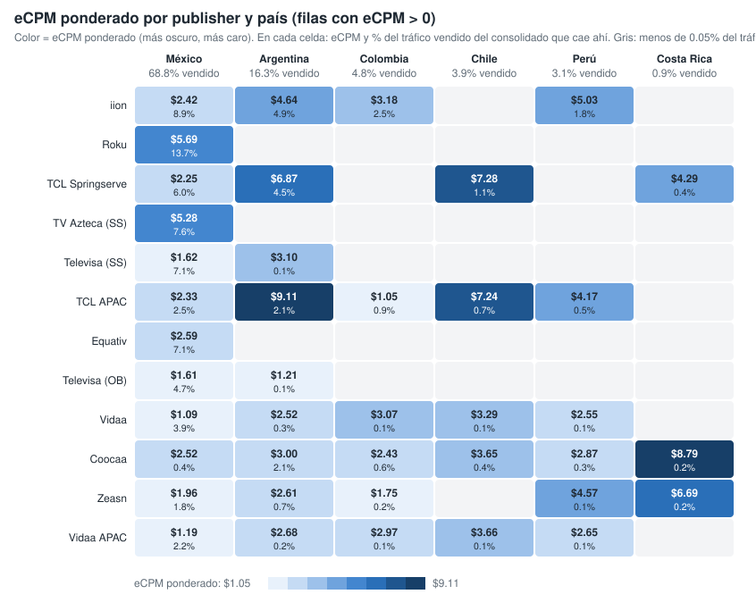
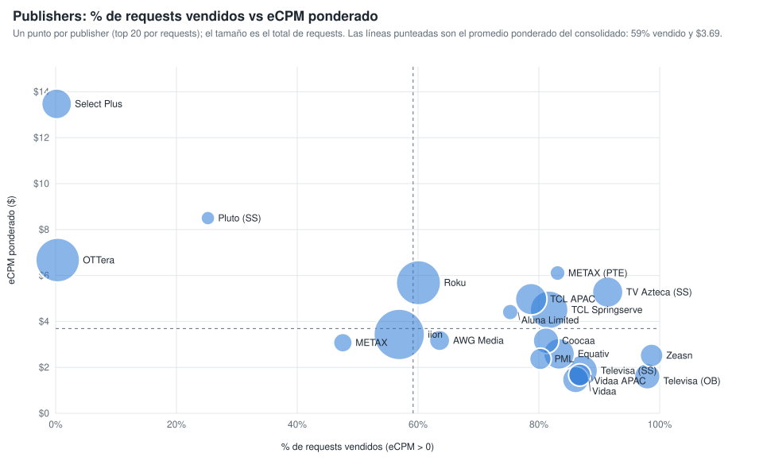

# Qué mueve el eCPM ponderado: la ruta de venta (publisher y país) (consolidado v10 a v21)

Sobre las filas con eCPM > 0 y requests > 0, la combinación publisher × país explica el 66.3 % de la variación del eCPM ponderado; los content objects, controlando por la ruta, aportan pocos puntos (género y rating los que más). Generado con `scripts/generar_graficos_drivers_ecpm.py` → `graficos-drivers-ecpm.json`.

## 1. eCPM ponderado por publisher y país

*Publishers ordenados por requests vendidos (top 12). En cada celda, eCPM ponderado y, debajo, % del tráfico vendido del consolidado que cae en esa combinación. Vacío = menos del 0.05 % del tráfico vendido.*

| Publisher | Mexico | Argentina | Colombia | Chile | Peru | Costa Rica |
|---|---:|---:|---:|---:|---:|---:|
| iion Pty Ltd | $2.42 (8.9%) | $4.64 (4.9%) | $3.18 (2.5%) | — | $5.03 (1.8%) | — |
| Roku - oRTB | $5.69 (13.7%) | — | — | — | — | — |
| TCL ADS - Springserve | $2.25 (6.0%) | $6.87 (4.5%) | — | $7.28 (1.1%) | — | $4.29 (0.4%) |
| TV Azteca - Springserve | $5.28 (7.6%) | — | — | — | — | — |
| Televisa Univision via SpringServe | $1.62 (7.1%) | $3.10 (0.1%) | — | — | — | — |
| TCL ADs (APAC) | $2.33 (2.5%) | $9.11 (2.1%) | $1.05 (0.9%) | $7.24 (0.7%) | $4.17 (0.5%) | — |
| Equativ (Formerly SMART AdServer) - oRTB CTV | $2.59 (7.1%) | — | — | — | — | — |
| Televisa Univision via OB | $1.60 (4.7%) | $1.21 (0.1%) | — | — | — | — |
| Vidaa | $1.09 (3.9%) | $2.52 (0.3%) | $3.07 (0.1%) | $3.29 (0.1%) | $2.55 (0.1%) | — |
| Coocaa, a SKYWORTH company | $2.52 (0.4%) | $3.00 (2.1%) | $2.43 (0.6%) | $3.65 (0.4%) | $2.87 (0.3%) | $8.79 (0.2%) |
| Zeasn Europe B.V. | $1.96 (1.8%) | $2.61 (0.7%) | $1.75 (0.2%) | — | $4.57 (0.1%) | $6.69 (0.2%) |
| Vidaa  APAC Hisense Headquarter | $1.19 (2.2%) | $2.68 (0.2%) | $2.98 (0.1%) | $3.66 (0.1%) | $2.65 (0.1%) | — |

## 2. Publishers: % de requests vendidos vs eCPM ponderado

*Un punto por publisher (top 20 por requests); el tamaño es el total de requests. Líneas punteadas: promedio ponderado del consolidado (59 % vendido, $3.69).*

| Publisher | Requests | % vendido (eCPM > 0) | eCPM pond. | % del tráfico vendido |
|---|---:|---:|---:|---:|
| iion Pty Ltd | 111,737,053,760 | 56.9% | $3.43 | 18.1% |
| Roku - oRTB | 79,873,201,520 | 60.1% | $5.69 | 13.7% |
| OTTera.tv | 77,801,192,240 | 0.3% | $6.67 | 0.1% |
| TCL ADS - Springserve | 53,209,637,200 | 81.7% | $4.51 | 12.4% |
| TCL ADs (APAC) | 32,050,893,120 | 78.7% | $4.97 | 7.2% |
| Televisa Univision via SpringServe | 30,325,855,840 | 87.2% | $1.86 | 7.5% |
| Equativ (Formerly SMART AdServer) - oRTB CTV | 30,003,626,400 | 83.3% | $2.59 | 7.1% |
| TV Azteca - Springserve | 29,370,923,120 | 91.4% | $5.28 | 7.6% |
| Select Plus PTE LTD (CTV) | 27,326,041,040 | 0.2% | $13.47 | 0.0% |
| Vidaa | 18,609,416,800 | 86.1% | $1.46 | 4.6% |
| Televisa Univision via OB | 17,316,792,800 | 97.9% | $1.61 | 4.8% |
| Coocaa, a SKYWORTH company | 17,172,469,920 | 81.2% | $3.16 | 4.0% |
| Zeasn Europe B.V. | 11,847,276,480 | 98.7% | $2.52 | 3.3% |
| Vidaa  APAC Hisense Headquarter | 10,849,549,040 | 86.8% | $1.67 | 2.7% |
| PML Digital | 9,860,552,240 | 80.3% | $2.37 | 2.2% |
| AWG Media | 7,772,170,160 | 63.6% | $3.17 | 1.4% |
| METAX SOFTWARE PTE. LTD. (Exchange) | 5,738,866,880 | 47.5% | $3.07 | 0.8% |
| Aluna Limited | 2,658,083,200 | 75.2% | $4.41 | 0.6% |
| METAX SOFTWARE PTE. LTD. | 2,084,347,760 | 83.1% | $6.11 | 0.5% |
| Pluto LATAM via SpringServe | 1,310,782,240 | 25.2% | $8.50 | 0.1% |
