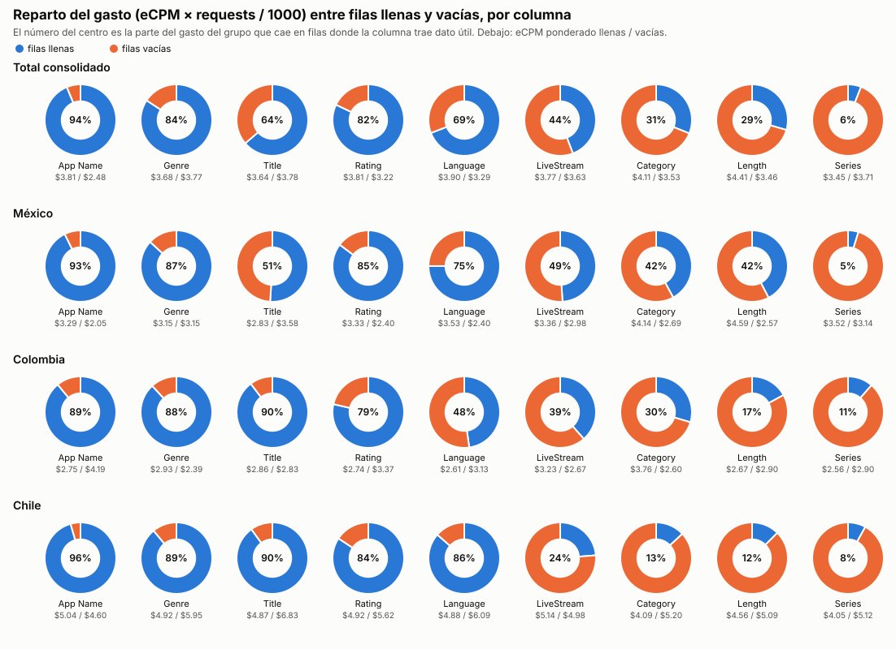
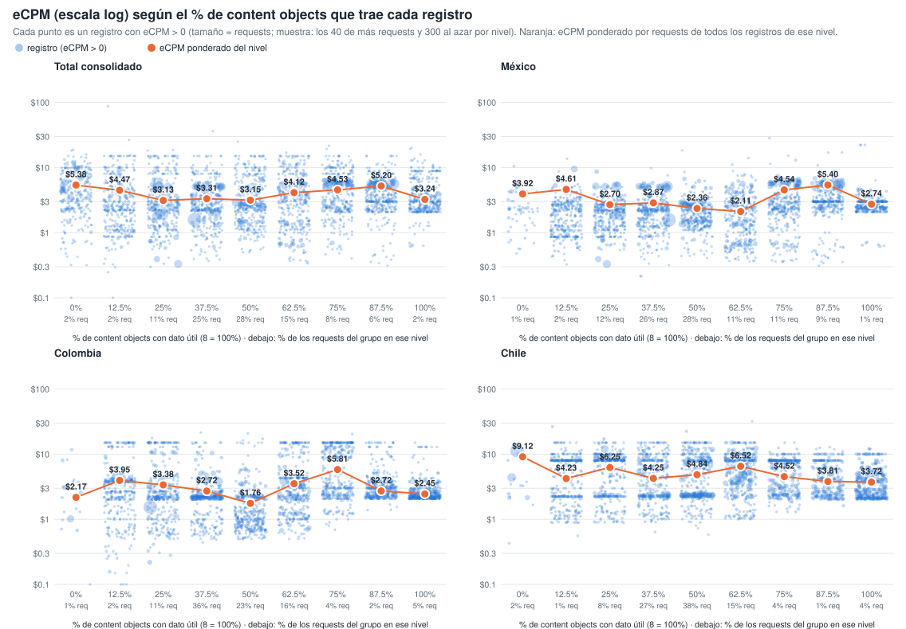
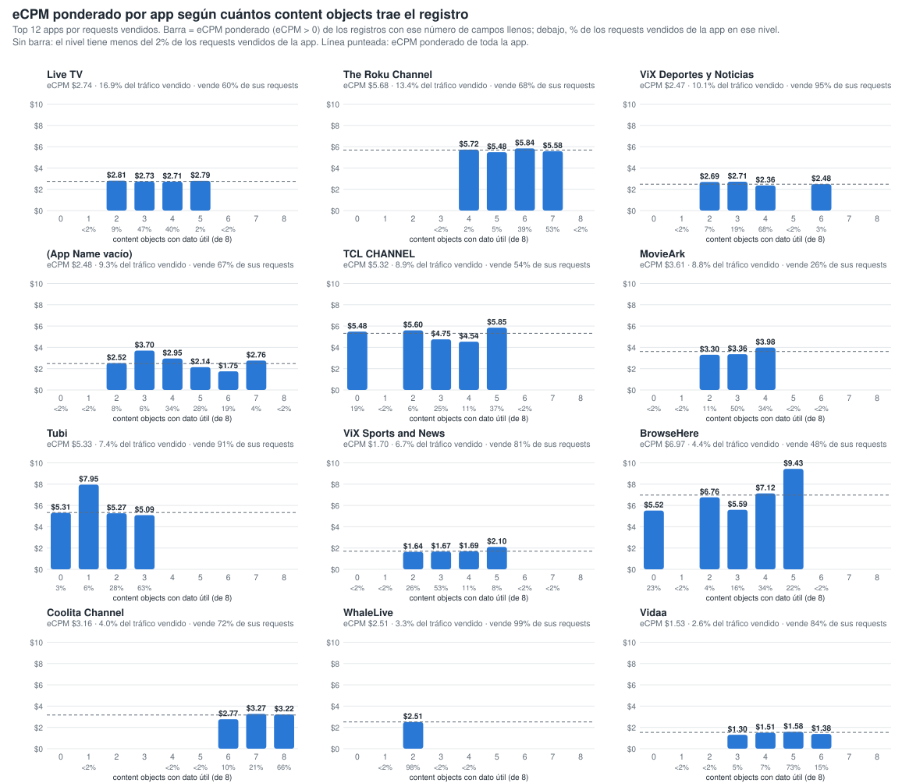
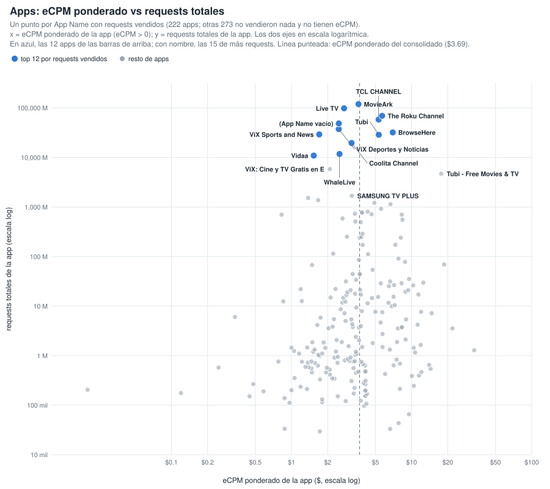
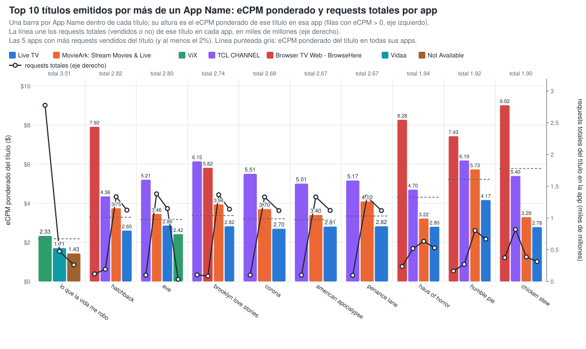
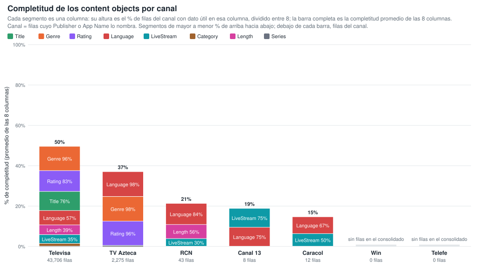
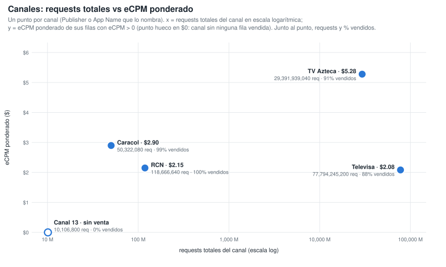
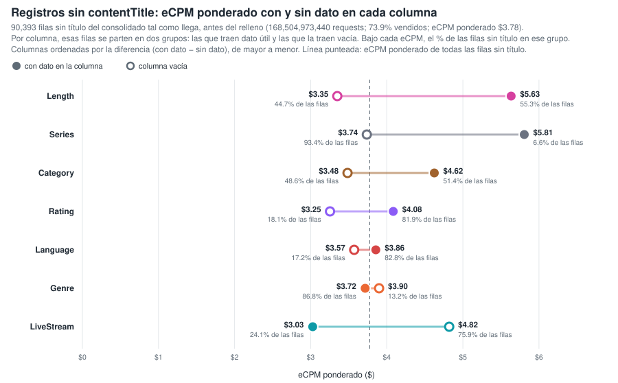
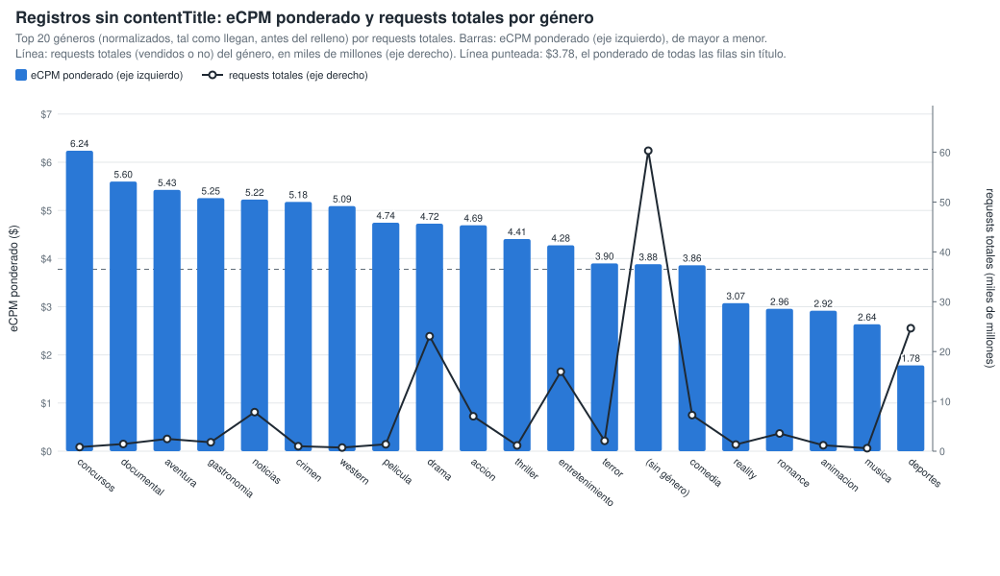

# Gráficos: eCPM de las filas llenas vs vacías (consolidado v10 a v21)

**Fuente:** `recursos/reporte-requests-ecpm-por-vacio-v21.json` (mismos datos de las tablas por país del detallado). Generado con `scripts/generar_graficos_ecpm_vacio.py` → `recursos/graficos-ecpm-vacio-r2.json`; tablas con `scripts/generar_reporte_graficos.py`.

*eCPM ponderado = Σ(eCPM × requests) / Σ requests, sin las filas con requests = 0 o eCPM = 0. Columnas: App Name y los 8 content objects con filas vacías; contentIsTitlePresent y Publisher vienen al 100% y no entran.*

## 1. Reparto del gasto (eCPM × requests / 1000) entre filas llenas y vacías

*% del gasto del grupo que cae en filas donde la columna trae dato útil. El gasto se calcula solo sobre filas con eCPM > 0.*

| Columna | Total consolidado | México | Colombia | Chile |
|---|---:|---:|---:|---:|
| App Name | 93.8% | 92.7% | 89.0% | 95.5% |
| contentGenre | 84.3% | 86.8% | 88.2% | 89.0% |
| contentTitle | 63.7% | 51.0% | 89.7% | 90.0% |
| contentRating | 82.1% | 85.2% | 78.6% | 84.3% |
| contentLanguage | 69.1% | 75.0% | 47.8% | 86.4% |
| contentIsLiveStream | 44.2% | 49.0% | 38.5% | 23.7% |
| contentCategory | 31.1% | 42.1% | 29.6% | 13.1% |
| contentLength | 29.5% | 42.4% | 17.1% | 12.5% |
| contentSeries | 5.9% | 4.7% | 11.4% | 8.0% |

## 2. % de columnas llenas de la fila vs eCPM (fila a fila)

Cada registro del consolidado se clasifica por el % de los 8 content objects que trae con dato útil (contentGenre, contentCategory, contentSeries, contentLength, contentLanguage, contentIsLiveStream, contentTitle, contentRating; contentIsTitlePresent no cuenta porque siempre viene). Cada punto es un registro con eCPM > 0, con el eCPM en escala logarítmica y el tamaño según sus requests (por nivel y panel se dibujan los 40 registros de más requests y 300 al azar). El punto naranja es el eCPM ponderado por requests de todos los registros del nivel. Generado con `scripts/generar_scatter_completitud_ecpm.py` → `recursos/graficos-ecpm-completitud-scatter.json`.

**Total consolidado** — 1,298,145 filas · 593,279,479,040 requests

| % de columnas llenas (de 8) | % filas | % requests | % requests vendidos (eCPM > 0) | eCPM pond. (>0) |
|---:|---:|---:|---:|---:|
| 0% (0) | 0.1% | 2.2% | 85.8% | $5.38 |
| 12.5% (1) | 2.0% | 1.8% | 51.5% | $4.47 |
| 25% (2) | 10.9% | 11.1% | 64.6% | $3.13 |
| 37.5% (3) | 23.9% | 25.4% | 64.1% | $3.31 |
| 50% (4) | 32.2% | 27.5% | 52.2% | $3.15 |
| 62.5% (5) | 21.3% | 15.0% | 43.7% | $4.12 |
| 75% (6) | 5.0% | 8.2% | 63.4% | $4.54 |
| 87.5% (7) | 2.1% | 6.3% | 79.1% | $5.20 |
| 100% (8) | 2.4% | 2.4% | 73.0% | $3.24 |

**México** — 383,163 filas · 353,529,904,640 requests

| % de columnas llenas (de 8) | % filas | % requests | % requests vendidos (eCPM > 0) | eCPM pond. (>0) |
|---:|---:|---:|---:|---:|
| 0% (0) | 0.1% | 0.7% | 81.9% | $3.92 |
| 12.5% (1) | 3.0% | 1.9% | 55.1% | $4.61 |
| 25% (2) | 13.7% | 12.0% | 75.5% | $2.70 |
| 37.5% (3) | 22.9% | 25.6% | 77.4% | $2.87 |
| 50% (4) | 30.7% | 28.2% | 59.0% | $2.36 |
| 62.5% (5) | 17.9% | 10.6% | 53.8% | $2.11 |
| 75% (6) | 7.3% | 11.2% | 66.7% | $4.54 |
| 87.5% (7) | 3.1% | 9.0% | 83.0% | $5.40 |
| 100% (8) | 1.4% | 0.7% | 75.2% | $2.74 |

**Colombia** — 134,258 filas · 43,451,662,400 requests

| % de columnas llenas (de 8) | % filas | % requests | % requests vendidos (eCPM > 0) | eCPM pond. (>0) |
|---:|---:|---:|---:|---:|
| 0% (0) | 0.1% | 1.4% | 28.9% | $2.17 |
| 12.5% (1) | 2.4% | 2.0% | 38.6% | $3.95 |
| 25% (2) | 13.7% | 10.8% | 41.0% | $3.38 |
| 37.5% (3) | 32.7% | 35.9% | 39.8% | $2.72 |
| 50% (4) | 24.1% | 23.2% | 31.2% | $1.76 |
| 62.5% (5) | 18.1% | 16.0% | 29.0% | $3.52 |
| 75% (6) | 4.6% | 4.1% | 45.8% | $5.81 |
| 87.5% (7) | 1.8% | 1.9% | 69.1% | $2.73 |
| 100% (8) | 2.6% | 4.7% | 73.9% | $2.45 |

**Chile** — 148,353 filas · 36,060,199,920 requests

| % de columnas llenas (de 8) | % filas | % requests | % requests vendidos (eCPM > 0) | eCPM pond. (>0) |
|---:|---:|---:|---:|---:|
| 0% (0) | 0.1% | 2.3% | 39.0% | $9.12 |
| 12.5% (1) | 1.7% | 1.1% | 15.8% | $4.23 |
| 25% (2) | 14.8% | 8.1% | 21.5% | $6.25 |
| 37.5% (3) | 28.9% | 26.7% | 16.0% | $4.25 |
| 50% (4) | 34.6% | 37.7% | 56.8% | $4.84 |
| 62.5% (5) | 13.4% | 15.4% | 27.7% | $6.52 |
| 75% (6) | 3.2% | 3.5% | 43.1% | $4.52 |
| 87.5% (7) | 1.2% | 1.5% | 56.6% | $3.81 |
| 100% (8) | 2.1% | 3.7% | 67.5% | $3.72 |

## 3. Por app: eCPM ponderado según cuántos content objects trae el registro

Top 12 apps por requests vendidos. Para cada app, barra = eCPM ponderado (eCPM > 0) de los registros con ese número de content objects con dato útil (de 8); debajo de cada barra, el % de los requests vendidos de la app en ese nivel. Los niveles con menos del 2 % de los requests vendidos de la app no se dibujan ni se tabulan. Generado con `scripts/generar_barras_app_completitud.py` → `recursos/graficos-app-completitud-barras.json`.

| App | eCPM pond. app | % tráfico vendido | 0 | 1 | 2 | 3 | 4 | 5 | 6 | 7 | 8 |
|---|---:|---:|---:|---:|---:|---:|---:|---:|---:|---:|---:|
| Live TV | $2.74 | 16.9% | — | — | $2.81 (9%) | $2.73 (47%) | $2.71 (40%) | $2.79 (2%) | — | — | — |
| The Roku Channel | $5.68 | 13.4% | — | — | — | — | $5.72 (2%) | $5.48 (5%) | $5.84 (39%) | $5.58 (53%) | — |
| ViX: TV, Deportes y Noticias | $2.47 | 10.1% | — | — | $2.69 (7%) | $2.71 (19%) | $2.36 (68%) | — | $2.48 (3%) | — | — |
| Not Available | $2.48 | 9.3% | — | — | $2.52 (8%) | $3.70 (6%) | $2.95 (34%) | $2.14 (28%) | $1.75 (19%) | $2.76 (4%) | — |
| TCL CHANNEL | $5.32 | 8.9% | $5.48 (19%) | — | $5.60 (6%) | $4.75 (25%) | $4.54 (11%) | $5.85 (37%) | — | — | — |
| MovieArk: Stream Movies & Live | $3.61 | 8.8% | — | — | $3.30 (11%) | $3.36 (50%) | $3.98 (34%) | — | — | — | — |
| Tubi: Free Movies & Live TV | $5.33 | 7.4% | $5.31 (3%) | $7.95 (6%) | $5.27 (28%) | $5.09 (63%) | — | — | — | — | — |
| ViX: TV, Sports and News | $1.70 | 6.7% | — | — | $1.64 (26%) | $1.67 (53%) | $1.69 (11%) | $2.10 (8%) | — | — | — |
| Browser TV Web - BrowseHere | $6.97 | 4.4% | $5.52 (23%) | — | $6.76 (4%) | $5.59 (16%) | $7.12 (34%) | $9.43 (22%) | — | — | — |
| Coolita Channel | $3.16 | 4.0% | — | — | — | — | — | — | $2.77 (10%) | $3.27 (21%) | $3.22 (66%) |
| WhaleLive | $2.51 | 3.3% | — | — | $2.51 (98%) | — | — | — | — | — | — |
| Vidaa | $1.53 | 2.6% | — | — | — | $1.30 (5%) | $1.51 (7%) | $1.58 (73%) | $1.38 (15%) | — | — |

*Entre paréntesis, el % de los requests vendidos de la app que cae en ese nivel de campos llenos.*

### 3.1 Apps: eCPM ponderado vs requests totales

Un punto por App Name con requests vendidos (222 apps; otras 273 no vendieron nada y no tienen eCPM). x = eCPM ponderado de la app (eCPM > 0); y = requests totales de la app; los dos ejes en escala logarítmica. Línea punteada: eCPM ponderado del consolidado ($3.69). Tabla: las 30 apps de más requests; todas están en `recursos/graficos-app-requests-ecpm.json`.

| App | Requests | Requests vendidos | % vendido | eCPM pond. |
|---|---:|---:|---:|---:|
| MovieArk: Stream Movies & Live | 118,872,772,320 | 30,856,203,680 | 26.0% | $3.61 |
| Live TV | 98,183,966,480 | 59,337,464,240 | 60.4% | $2.74 |
| The Roku Channel | 69,276,919,680 | 47,187,134,560 | 68.1% | $5.68 |
| TCL CHANNEL | 58,189,553,040 | 31,128,002,640 | 53.5% | $5.32 |
| Not Available | 48,560,129,200 | 32,680,598,880 | 67.3% | $2.48 |
| ViX: TV, Deportes y Noticias | 37,352,878,880 | 35,389,679,200 | 94.7% | $2.47 |
| Browser TV Web - BrowseHere | 32,058,530,480 | 15,562,919,440 | 48.5% | $6.97 |
| ViX: TV, Sports and News | 29,209,241,040 | 23,555,081,040 | 80.6% | $1.70 |
| Tubi: Free Movies & Live TV | 28,668,552,480 | 26,132,531,760 | 91.2% | $5.33 |
| Coolita Channel | 19,563,612,480 | 14,076,649,760 | 72.0% | $3.16 |
| WhaleLive | 11,767,158,400 | 11,633,664,480 | 98.9% | $2.51 |
| Vidaa | 10,924,757,200 | 9,146,745,200 | 83.7% | $1.53 |
| ViX: Cine y TV Gratis en Español | 5,822,336,560 | 4,371,780,960 | 75.1% | $2.08 |
| Tubi - Free Movies & TV | 4,702,619,040 | 1,704,480 | 0.0% | $17.65 |
| SAMSUNG TV PLUS | 1,685,452,720 | 1,237,179,040 | 73.4% | $3.18 |
| ViX: Cine y TV en Español | 1,522,452,480 | 1,371,211,360 | 90.1% | $1.38 |
| VIX - Filmes e TV | 1,376,993,280 | 1,307,438,880 | 94.9% | $1.67 |
| Open Browser - TV Web Browser | 1,211,010,560 | 1,086,459,360 | 89.7% | $4.90 |
| Metax TV - Live TV & Movies | 1,138,626,400 | 857,518,880 | 75.3% | $6.67 |
| Ottera | 919,530,800 | 346,990,080 | 37.7% | $5.57 |
| Plex - Free Movies & TV | 803,908,480 | 161,282,240 | 20.1% | $4.31 |
| LG | 774,075,840 | 208,697,920 | 27.0% | $3.86 |
| Free Games by PlayWorks | 773,279,200 | 208,379,840 | 26.9% | $3.86 |
| Azteca TV | 731,344,320 | 710,859,760 | 97.2% | $3.38 |
| Plex: Find Movies & TV Shows | 716,209,600 | 86,499,680 | 12.1% | $4.64 |
| PlutoTV: Stream Free Movies/TV | 701,358,000 | 179,602,880 | 25.6% | $8.28 |
| Univision App: Univision & Unimas Free | 701,304,960 | 686,211,360 | 97.8% | $0.83 |
| FreeTube- Search & Watch Free | 585,244,320 | 161,560,960 | 27.6% | $2.66 |
| Pluto TV - Free Movies/Shows | 553,133,040 | 48,274,000 | 8.7% | $8.40 |
| FreeTV: Películas, Series y TV | 509,746,720 | 316,446,000 | 62.1% | $3.40 |

## 4. Títulos emitidos por más de un App Name

17,345 títulos reales, agrupados solo por App Name (sin pageURL). Generado con `scripts/generar_tabla_pageurl_titulos.py` → `recursos/titulos-appname.json`.

| App Name distintos por título | % de títulos | % de requests |
|---:|---:|---:|
| 1 | 49.7% | 6.9% |
| 2 | 26.2% | 8.3% |
| 3 | 8.9% | 13.1% |
| 4 | 3.7% | 2.0% |
| 5+ | 11.5% | 69.7% |

**Top 10 títulos (por requests) en dos o más App Name:** una barra por App Name dentro de cada título, con altura = eCPM ponderado de ese título en esa app (eCPM > 0; las 5 apps con más requests vendidos del título), en el eje izquierdo. La línea une los requests totales (vendidos o no) de ese título en cada app, en miles de millones, en el eje derecho. Línea punteada = eCPM ponderado del título en todas sus apps; sobre cada grupo, los requests totales del título. Las variantes de ViX (ViX: TV, Deportes y Noticias; ViX: TV, Sports and News; ViX: Cine y TV…; VIX - Filmes e TV) cuentan como una sola app, ViX.

| Título | App Name | Requests | eCPM pond. | Reparto por app (% de requests vendidos, eCPM pond. de la app) |
|---|---:|---:|---:|---|
| lo que la vida me robo | 3 | 3,511,882,880 | $2.18 | ViX 79% ($2.33), Vidaa 13% ($1.71), Not Available 8% ($1.43) |
| hatchback | 7 | 2,815,142,560 | $3.29 | Live TV 56% ($2.60), MovieArk: Stream Movies & Live 33% ($3.75), TCL CHANNEL 7% ($4.36), Browser TV Web - BrowseHere 3% ($7.92), Not Available 0% ($4.14) |
| eve | 9 | 2,797,905,120 | $3.17 | Live TV 57% ($2.86), MovieArk: Stream Movies & Live 35% ($3.46), TCL CHANNEL 3% ($5.21), ViX 2% ($2.42), Browser TV Web - BrowseHere 2% ($5.67) |
| brooklyn love stories | 8 | 2,737,916,400 | $3.38 | Live TV 59% ($2.82), MovieArk: Stream Movies & Live 36% ($3.94), TCL CHANNEL 3% ($6.15), Browser TV Web - BrowseHere 2% ($5.82), Not Available 0% ($3.85) |
| corona | 7 | 2,677,168,960 | $3.21 | Live TV 60% ($2.70), MovieArk: Stream Movies & Live 34% ($3.70), TCL CHANNEL 3% ($5.51), Browser TV Web - BrowseHere 2% ($6.63), Not Available 0% ($3.91) |
| american apocalypse | 8 | 2,674,928,800 | $3.16 | Live TV 59% ($2.81), MovieArk: Stream Movies & Live 35% ($3.40), TCL CHANNEL 3% ($5.01), Browser TV Web - BrowseHere 2% ($6.09), Not Available 0% ($5.06) |
| penance lane | 8 | 2,670,981,760 | $3.35 | Live TV 62% ($2.82), MovieArk: Stream Movies & Live 34% ($4.10), TCL CHANNEL 3% ($5.17), Browser TV Web - BrowseHere 1% ($5.15), Not Available 0% ($3.71) |
| haus of horror | 7 | 1,938,707,120 | $4.31 | Live TV 33% ($2.80), TCL CHANNEL 32% ($4.70), MovieArk: Stream Movies & Live 19% ($3.22), Browser TV Web - BrowseHere 15% ($8.28), Not Available 0% ($4.48) |
| humble pie | 7 | 1,922,197,280 | $5.23 | Live TV 47% ($4.17), MovieArk: Stream Movies & Live 27% ($5.73), TCL CHANNEL 16% ($6.19), Browser TV Web - BrowseHere 9% ($7.43), Not Available 0% ($7.03) |
| chicken stew | 7 | 1,903,984,640 | $5.78 | TCL CHANNEL 55% ($5.40), Browser TV Web - BrowseHere 24% ($9.02), Live TV 13% ($2.78), MovieArk: Stream Movies & Live 7% ($3.29), Not Available 0% ($4.54) |

| Título | Requests del título | Requests por app (% de los requests del título) |
|---|---:|---|
| lo que la vida me robo | 3,511,882,880 | ViX 2,776,653,120 (79%), Vidaa 473,650,400 (13%), Not Available 261,579,360 (7%) |
| hatchback | 2,815,142,560 | MovieArk: Stream Movies & Live 1,334,235,360 (47%), Live TV 1,125,077,520 (40%), TCL CHANNEL 191,568,480 (7%), Browser TV Web - BrowseHere 119,245,040 (4%) |
| eve | 2,797,905,120 | MovieArk: Stream Movies & Live 1,380,068,960 (49%), Live TV 1,149,500,960 (41%), TCL CHANNEL 99,131,040 (4%), ViX 33,724,880 (1%) |
| brooklyn love stories | 2,737,916,400 | MovieArk: Stream Movies & Live 1,365,519,680 (50%), Live TV 1,139,000,640 (42%), TCL CHANNEL 103,420,800 (4%), Browser TV Web - BrowseHere 85,371,280 (3%) |
| corona | 2,677,168,960 | MovieArk: Stream Movies & Live 1,330,091,840 (50%), Live TV 1,116,852,160 (42%), TCL CHANNEL 100,840,560 (4%) |
| american apocalypse | 2,674,928,800 | MovieArk: Stream Movies & Live 1,331,661,600 (50%), Live TV 1,118,762,000 (42%), TCL CHANNEL 99,637,200 (4%) |
| penance lane | 2,670,981,760 | MovieArk: Stream Movies & Live 1,331,337,120 (50%), Live TV 1,116,627,200 (42%), TCL CHANNEL 96,035,040 (4%) |
| haus of horror | 1,938,707,120 | MovieArk: Stream Movies & Live 632,691,200 (33%), Live TV 529,288,880 (27%), TCL CHANNEL 519,194,160 (27%), Browser TV Web - BrowseHere 236,109,040 (12%) |
| humble pie | 1,922,197,280 | MovieArk: Stream Movies & Live 803,004,000 (42%), Live TV 667,269,760 (35%), TCL CHANNEL 269,725,920 (14%), Browser TV Web - BrowseHere 165,236,880 (9%) |
| chicken stew | 1,903,984,640 | TCL CHANNEL 819,023,760 (43%), MovieArk: Stream Movies & Live 385,872,000 (20%), Browser TV Web - BrowseHere 374,935,920 (20%), Live TV 312,777,040 (16%) |

## 5. Completitud de los content objects por canal

Canal = filas cuyo Publisher o App Name lo nombra (Caracol via OB / ditu por Caracol, RCN via OB / Canal RCN, Canal 13 OB, Televisa Univision via … / ViX, TV Azteca - Springserve / Azteca TV). Cada segmento de la barra es una columna, con altura = % de filas del canal con dato útil en esa columna dividido entre 8, apilados de mayor % (arriba) a menor (abajo); la barra completa es la completitud promedio de las 8 columnas. La tabla va ordenada por completitud promedio. Generado con `scripts/generar_barras_canales_completitud.py` → `recursos/graficos-canales-completitud-barras.json`.

| Canal | Promedio | Filas | Requests | Title | Genre | Rating | Language | IsLiveStream | Category | Length | Series |
|---|---:|---:|---:|---:|---:|---:|---:|---:|---:|---:|---:|
| Televisa | 49.5% | 43,706 | 77,794,245,200 | 75.6% | 96.2% | 82.6% | 57.1% | 34.8% | 10.9% | 38.6% | 0.2% |
| TV Azteca | 36.9% | 2,275 | 29,391,939,040 | 1.2% | 97.8% | 96.4% | 98.5% | 0.4% | 0.6% | 0.5% | 0.2% |
| RCN | 21.2% | 43 | 118,666,640 | 0.0% | 0.0% | 0.0% | 83.7% | 30.2% | 0.0% | 55.8% | 0.0% |
| Canal 13 | 18.8% | 8 | 10,106,800 | 0.0% | 0.0% | 0.0% | 75.0% | 75.0% | 0.0% | 0.0% | 0.0% |
| Caracol | 14.6% | 12 | 50,322,080 | 0.0% | 0.0% | 0.0% | 66.7% | 50.0% | 0.0% | 0.0% | 0.0% |
| Win | — | 0 | 0 | — | — | — | — | — | — | — | — |
| Telefe | — | 0 | 0 | — | — | — | — | — | — | — | — |

*Win y Telefe no aparecen en el consolidado: ningún Publisher ni App Name los nombra.*

## 6. Canales: requests totales vs eCPM ponderado

Un punto por canal (mismos canales y misma definición de la sección 5). x = requests totales del canal en escala logarítmica; y = eCPM ponderado de sus filas con eCPM > 0; un canal con requests pero sin ninguna fila vendida va en $0 con un punto hueco. Junto al punto, requests totales y % de requests vendidos.

| Canal | Requests | Requests vendidos | % vendido | eCPM pond. |
|---|---:|---:|---:|---:|
| Televisa | 77,794,245,200 | 68,431,557,280 | 88.0% | $2.08 |
| TV Azteca | 29,391,939,040 | 26,843,391,520 | 91.3% | $5.28 |
| RCN | 118,666,640 | 118,521,520 | 99.9% | $2.15 |
| Caracol | 50,322,080 | 49,713,040 | 98.8% | $2.90 |
| Canal 13 | 10,106,800 | 0 | 0.0% | — (sin filas vendidas) |
| Win | 0 | 0 | — | — |
| Telefe | 0 | 0 | — | — |

## 7. Registros sin contentTitle: qué content objects se relacionan con el eCPM

90,393 filas sin título (168,504,973,440 requests; 73.9% vendidos; eCPM ponderado $3.78). Generado con `scripts/generar_graficos_sin_titulo.py` → `recursos/graficos-sin-titulo.json`.

### 7.1 eCPM ponderado con y sin dato en cada columna

Filas sin título del consolidado tal como llega, antes del relleno. Por columna se parten en dos grupos: las que traen dato útil (círculo lleno) y las que la traen vacía (círculo hueco); de cada grupo, su % de las filas sin título, su % de requests vendidos y su eCPM ponderado. Diferencia = eCPM con dato − eCPM sin dato.

| Columna | % filas con dato | % vendido con dato | eCPM pond. con dato | % filas sin dato | % vendido sin dato | eCPM pond. sin dato | Diferencia |
|---|---:|---:|---:|---:|---:|---:|---:|
| contentLength | 55.3% | 56.4% | $5.63 | 44.7% | 79.6% | $3.35 | +$2.28 |
| contentSeries | 6.6% | 40.8% | $5.81 | 93.4% | 75.1% | $3.74 | +$2.07 |
| contentCategory | 51.4% | 52.4% | $4.62 | 48.6% | 86.1% | $3.48 | +$1.14 |
| contentRating | 81.9% | 70.3% | $4.08 | 18.1% | 81.0% | $3.25 | +$0.83 |
| contentLanguage | 82.8% | 72.1% | $3.86 | 17.2% | 79.0% | $3.57 | +$0.28 |
| contentGenre | 86.8% | 72.3% | $3.72 | 13.2% | 77.3% | $3.90 | −$0.18 |
| contentIsLiveStream | 24.1% | 83.6% | $3.03 | 75.9% | 63.6% | $4.82 | −$1.79 |

### 7.2 eCPM ponderado por género en las filas sin título

Género normalizado tal como llega. Explica el 24.4 % de la variación del eCPM ponderado solo y aporta 2.0 puntos más controlando por publisher × país (rating: 17.2 % y 3.2 puntos; livestream, length, categoría y series: 1.3 puntos o menos).

| Género | Filas | % del tráfico vendido sin título | eCPM pond. |
|---|---:|---:|---:|
| concursos | 513 | 0.5% | $6.24 |
| documental | 2,476 | 0.7% | $5.60 |
| aventura | 1,309 | 0.9% | $5.43 |
| gastronomia | 544 | 0.9% | $5.25 |
| noticias | 2,528 | 5.4% | $5.22 |
| pelicula (generico) | 2,043 | 0.8% | $4.74 |
| drama | 8,356 | 12.3% | $4.72 |
| accion | 4,777 | 4.2% | $4.69 |
| thriller | 1,925 | 0.7% | $4.41 |
| entretenimiento | 3,913 | 9.5% | $4.28 |
| terror | 2,186 | 1.2% | $3.90 |
| (sin género) | 32,982 | 34.8% | $3.88 |
| comedia | 5,594 | 4.4% | $3.86 |
| reality | 2,777 | 0.6% | $3.07 |
| romance | 2,365 | 2.3% | $2.96 |
| animacion | 355 | 0.5% | $2.92 |
| deportes | 3,704 | 18.4% | $1.78 |
