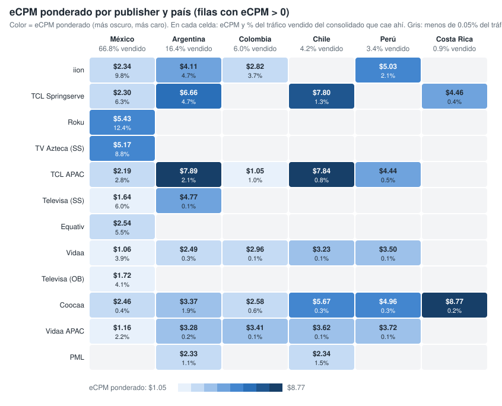
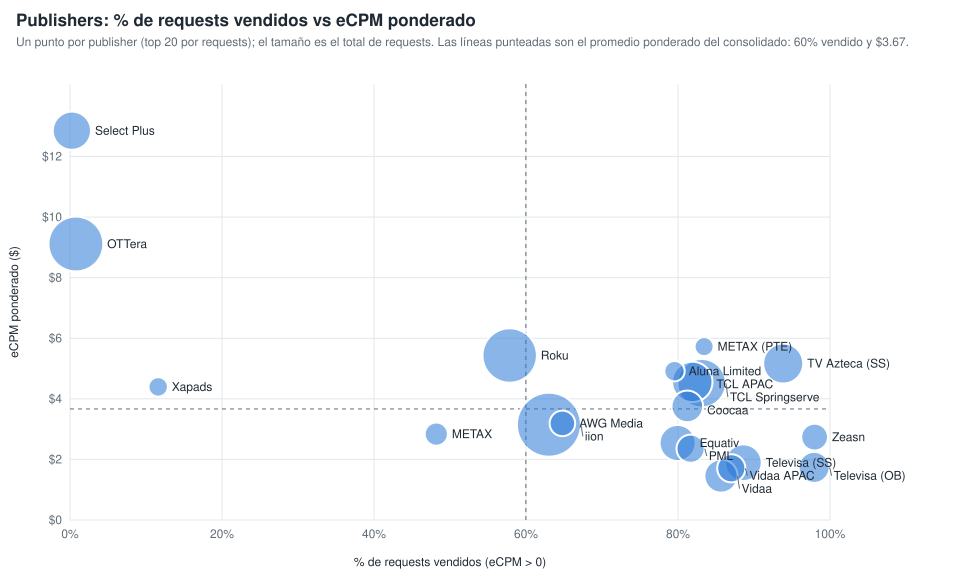

# Qué mueve el eCPM ponderado: la ruta de venta (publisher y país) (consolidado v10 a v22)

Sobre las filas con eCPM > 0 y requests > 0, la combinación publisher × país explica el 63.8 % de la variación del eCPM ponderado; los content objects, controlando por la ruta, aportan pocos puntos (género y rating los que más). Generado con `scripts/generar_graficos_drivers_ecpm.py` → `graficos-drivers-ecpm.json`.

## 1. eCPM ponderado por publisher y país

*Publishers ordenados por requests vendidos (top 12). En cada celda, eCPM ponderado y, debajo, % del tráfico vendido del consolidado que cae en esa combinación. Vacío = menos del 0.05 % del tráfico vendido.*

| Publisher | Mexico | Argentina | Colombia | Chile | Peru | Costa Rica |
|---|---:|---:|---:|---:|---:|---:|
| iion Pty Ltd | $2.35 (9.8%) | $4.11 (4.7%) | $2.82 (3.7%) | — | $5.03 (2.1%) | — |
| TCL ADS - Springserve | $2.30 (6.3%) | $6.66 (4.7%) | — | $7.80 (1.3%) | — | $4.46 (0.4%) |
| Roku - oRTB | $5.43 (12.4%) | — | — | — | — | — |
| TV Azteca - Springserve | $5.17 (8.8%) | — | — | — | — | — |
| TCL ADs (APAC) | $2.19 (2.8%) | $7.89 (2.1%) | $1.05 (1.0%) | $7.84 (0.8%) | $4.44 (0.5%) | — |
| Televisa Univision via SpringServe | $1.64 (6.0%) | $4.77 (0.1%) | — | — | — | — |
| Equativ (Formerly SMART AdServer) - oRTB CTV | $2.54 (5.5%) | — | — | — | — | — |
| Vidaa | $1.06 (3.9%) | $2.49 (0.3%) | $2.96 (0.1%) | $3.23 (0.1%) | $3.50 (0.1%) | — |
| Televisa Univision via OB | $1.73 (4.1%) | $1.76 (0.1%) | — | — | — | — |
| Coocaa, a SKYWORTH company | $2.46 (0.5%) | $3.37 (1.9%) | $2.58 (0.6%) | $5.67 (0.3%) | $4.96 (0.3%) | $8.77 (0.2%) |
| Vidaa  APAC Hisense Headquarter | $1.16 (2.2%) | $3.28 (0.2%) | $3.42 (0.1%) | $3.62 (0.1%) | $3.73 (0.1%) | — |
| PML Digital | — | $2.33 (1.1%) | — | $2.34 (1.5%) | — | — |

## 2. Publishers: % de requests vendidos vs eCPM ponderado

*Un punto por publisher (top 20 por requests); el tamaño es el total de requests. Líneas punteadas: promedio ponderado del consolidado (60 % vendido, $3.67).*

| Publisher | Requests | % vendido (eCPM > 0) | eCPM pond. | % del tráfico vendido |
|---|---:|---:|---:|---:|
| iion Pty Ltd | 120,686,549,903 | 63.0% | $3.15 | 20.4% |
| OTTera.tv | 81,526,588,080 | 0.8% | $9.11 | 0.2% |
| Roku - oRTB | 80,056,070,080 | 57.8% | $5.43 | 12.4% |
| TCL ADS - Springserve | 58,849,181,280 | 83.1% | $4.52 | 13.1% |
| TCL ADs (APAC) | 35,936,978,720 | 81.9% | $4.56 | 7.9% |
| TV Azteca - Springserve | 34,814,393,200 | 93.8% | $5.17 | 8.8% |
| Select Plus PTE LTD (CTV) | 30,806,957,440 | 0.2% | $12.85 | 0.0% |
| Televisa Univision via SpringServe | 27,042,151,280 | 88.6% | $1.89 | 6.4% |
| Equativ (Formerly SMART AdServer) - oRTB CTV | 25,900,208,560 | 79.9% | $2.54 | 5.5% |
| Vidaa | 19,966,566,240 | 85.7% | $1.45 | 4.6% |
| Coocaa, a SKYWORTH company | 17,096,787,520 | 81.2% | $3.75 | 3.7% |
| Televisa Univision via OB | 16,184,366,720 | 97.9% | $1.74 | 4.2% |
| PML Digital | 11,823,917,600 | 81.7% | $2.35 | 2.6% |
| Vidaa  APAC Hisense Headquarter | 11,760,140,720 | 87.0% | $1.71 | 2.7% |
| Zeasn Europe B.V. | 9,827,223,840 | 98.0% | $2.74 | 2.6% |
| AWG Media | 8,240,756,720 | 64.8% | $3.19 | 1.4% |
| METAX SOFTWARE PTE. LTD. (Exchange) | 5,550,602,640 | 48.2% | $2.83 | 0.7% |
| Aluna Limited | 3,149,628,240 | 79.5% | $4.91 | 0.7% |
| Xapads Media - CTV | 2,402,185,920 | 11.6% | $4.39 | 0.1% |
| METAX SOFTWARE PTE. LTD. | 2,178,492,400 | 83.4% | $5.72 | 0.5% |
