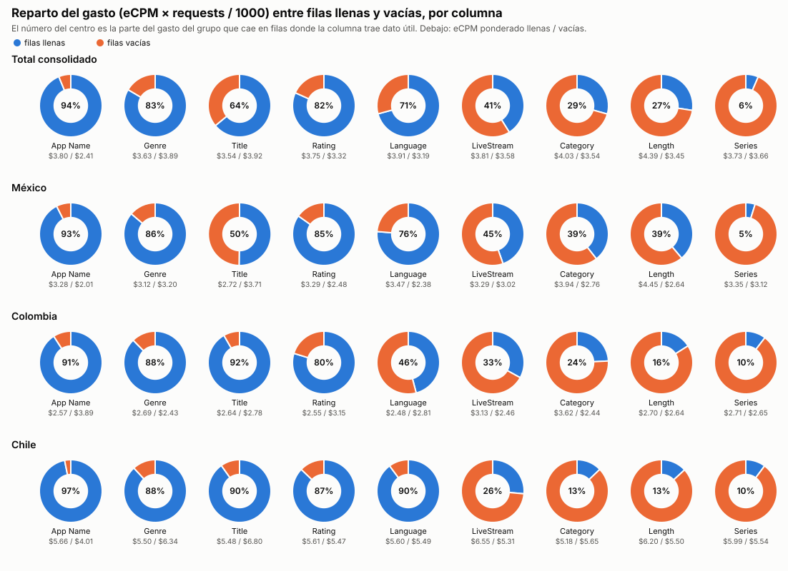
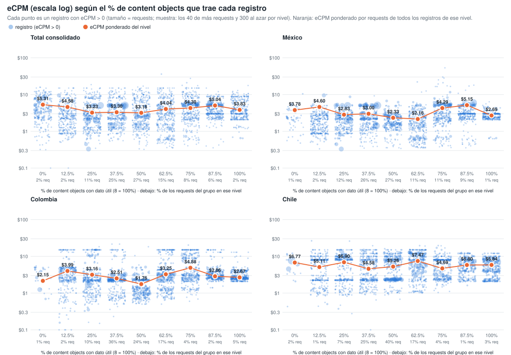
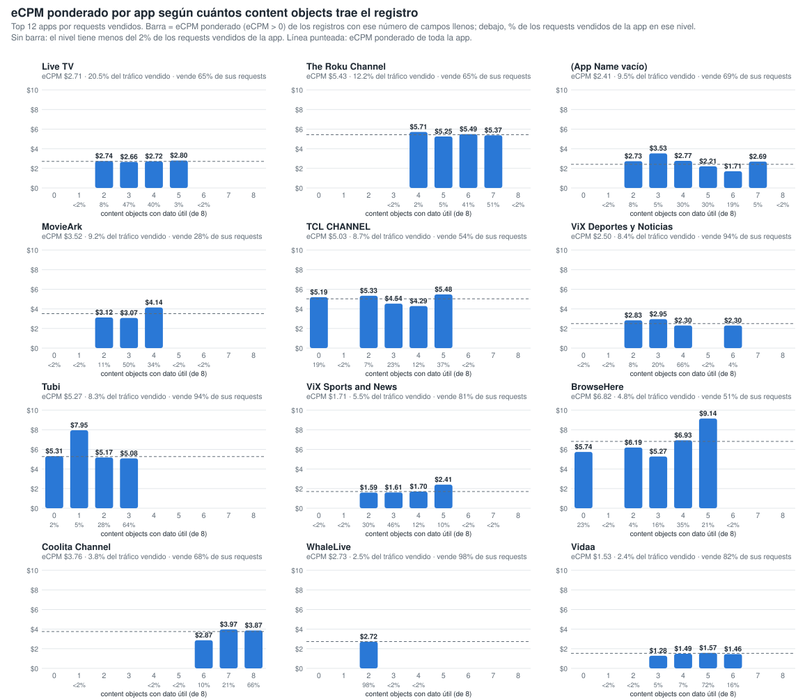
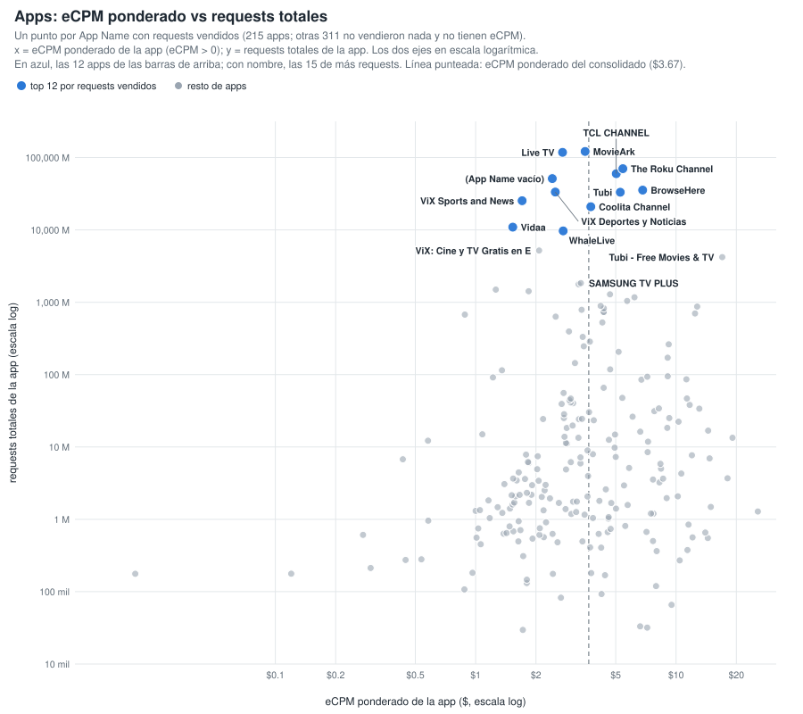
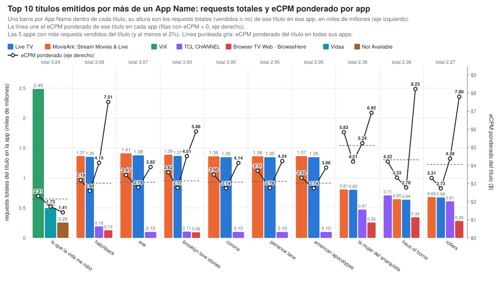
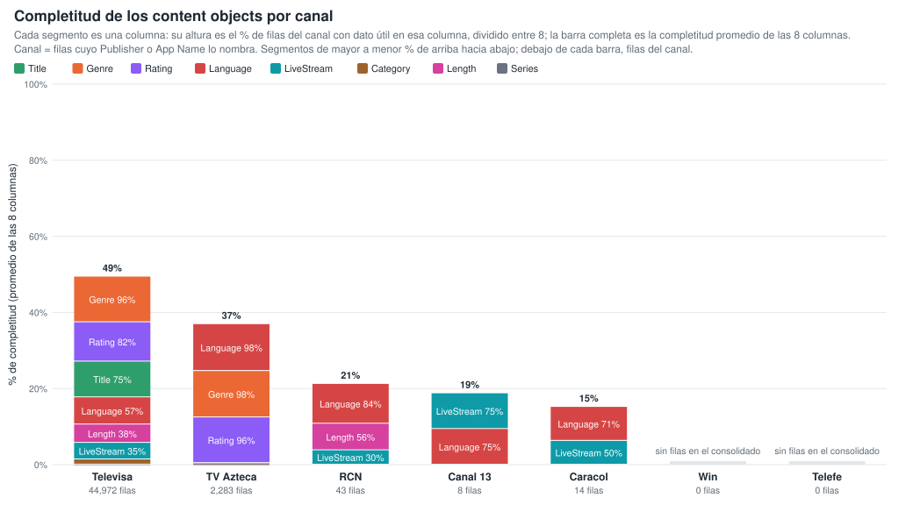
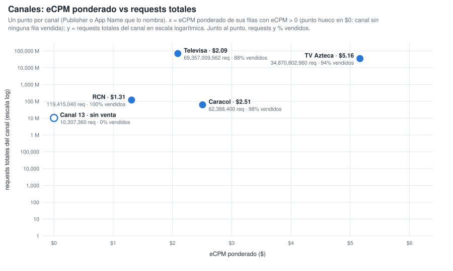
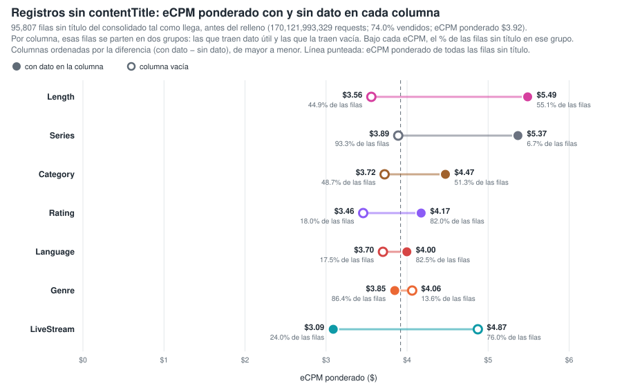
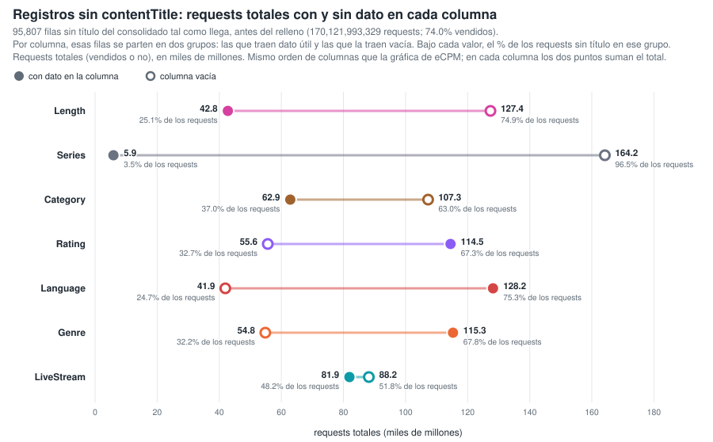
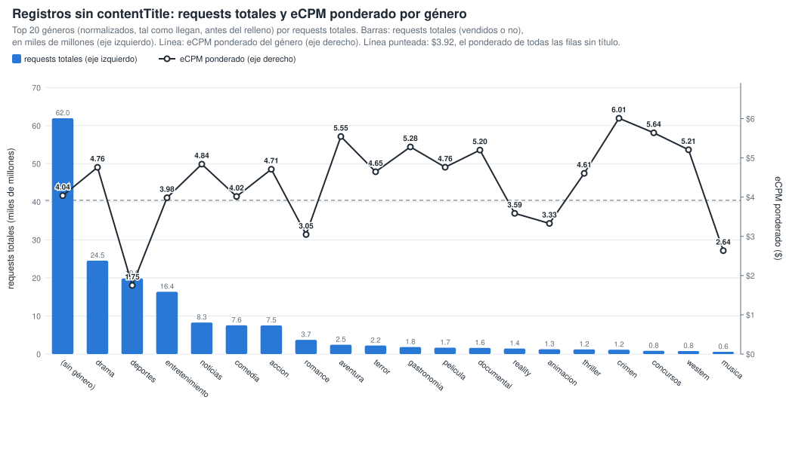

# Gráficos: eCPM de las filas llenas vs vacías (consolidado v10 a v22)

**Fuente:** `recursos/reporte-requests-ecpm-por-vacio-v22.json` (mismos datos de las tablas por país del detallado). Generado con `scripts/generar_graficos_ecpm_vacio.py` → `recursos/graficos-ecpm-vacio-r2.json`; tablas con `scripts/generar_reporte_graficos.py`.

*eCPM ponderado = Σ(eCPM × requests) / Σ requests, sin las filas con requests = 0 o eCPM = 0. Columnas: App Name y los 8 content objects con filas vacías; contentIsTitlePresent y Publisher vienen al 100% y no entran.*

## 1. Reparto del gasto (eCPM × requests / 1000) entre filas llenas y vacías

*% del gasto del grupo que cae en filas donde la columna trae dato útil. El gasto se calcula solo sobre filas con eCPM > 0.*

| Columna | Total consolidado | México | Colombia | Chile |
|---|---:|---:|---:|---:|
| App Name | 93.8% | 92.5% | 90.9% | 96.8% |
| contentGenre | 83.5% | 86.2% | 87.7% | 88.1% |
| contentTitle | 64.0% | 50.2% | 91.7% | 90.1% |
| contentRating | 81.7% | 84.8% | 79.8% | 87.2% |
| contentLanguage | 70.8% | 76.3% | 46.0% | 89.9% |
| contentIsLiveStream | 41.1% | 44.7% | 33.0% | 26.4% |
| contentCategory | 29.3% | 39.5% | 24.2% | 12.9% |
| contentLength | 27.5% | 38.9% | 16.1% | 13.2% |
| contentSeries | 6.5% | 4.8% | 10.4% | 10.2% |

## 2. % de columnas llenas de la fila vs eCPM (fila a fila)

Cada registro del consolidado se clasifica por el % de los 8 content objects que trae con dato útil (contentGenre, contentCategory, contentSeries, contentLength, contentLanguage, contentIsLiveStream, contentTitle, contentRating; contentIsTitlePresent no cuenta porque siempre viene). Cada punto es un registro con eCPM > 0, con el eCPM en escala logarítmica y el tamaño según sus requests (por nivel y panel se dibujan los 40 registros de más requests y 300 al azar). El punto naranja es el eCPM ponderado por requests de todos los registros del nivel. Generado con `scripts/generar_scatter_completitud_ecpm.py` → `recursos/graficos-ecpm-completitud-scatter.json`.

**Total consolidado** — 1,344,629 filas · 622,384,767,599 requests

| % de columnas llenas (de 8) | % filas | % requests | % requests vendidos (eCPM > 0) | eCPM pond. (>0) |
|---:|---:|---:|---:|---:|
| 0% (0) | 0.1% | 2.3% | 87.5% | $5.30 |
| 12.5% (1) | 2.0% | 1.8% | 51.9% | $4.58 |
| 25% (2) | 10.8% | 10.9% | 65.4% | $3.23 |
| 37.5% (3) | 23.6% | 25.3% | 67.5% | $3.30 |
| 50% (4) | 32.1% | 27.4% | 53.3% | $3.18 |
| 62.5% (5) | 21.5% | 15.4% | 44.2% | $4.04 |
| 75% (6) | 5.3% | 8.4% | 62.2% | $4.30 |
| 87.5% (7) | 2.2% | 6.1% | 74.5% | $5.04 |
| 100% (8) | 2.5% | 2.5% | 68.7% | $3.83 |

**México** — 397,781 filas · 364,942,734,446 requests

| % de columnas llenas (de 8) | % filas | % requests | % requests vendidos (eCPM > 0) | eCPM pond. (>0) |
|---:|---:|---:|---:|---:|
| 0% (0) | 0.1% | 0.7% | 82.9% | $3.78 |
| 12.5% (1) | 2.9% | 1.9% | 54.1% | $4.60 |
| 25% (2) | 13.6% | 12.1% | 75.8% | $2.83 |
| 37.5% (3) | 22.5% | 25.8% | 79.1% | $3.00 |
| 50% (4) | 30.3% | 27.4% | 58.9% | $2.33 |
| 62.5% (5) | 18.1% | 11.1% | 54.1% | $2.16 |
| 75% (6) | 7.7% | 11.5% | 65.7% | $4.29 |
| 87.5% (7) | 3.4% | 8.8% | 78.2% | $5.15 |
| 100% (8) | 1.5% | 0.7% | 75.5% | $2.69 |

**Colombia** — 139,362 filas · 48,262,557,051 requests

| % de columnas llenas (de 8) | % filas | % requests | % requests vendidos (eCPM > 0) | eCPM pond. (>0) |
|---:|---:|---:|---:|---:|
| 0% (0) | 0.1% | 1.4% | 35.9% | $2.15 |
| 12.5% (1) | 2.3% | 1.9% | 43.0% | $3.99 |
| 25% (2) | 13.3% | 9.9% | 48.9% | $3.16 |
| 37.5% (3) | 31.9% | 35.8% | 55.8% | $2.51 |
| 50% (4) | 24.3% | 23.9% | 37.3% | $1.76 |
| 62.5% (5) | 18.8% | 16.8% | 31.5% | $3.25 |
| 75% (6) | 4.7% | 4.0% | 45.4% | $4.88 |
| 87.5% (7) | 1.8% | 1.8% | 67.8% | $2.86 |
| 100% (8) | 2.6% | 4.5% | 72.0% | $2.67 |

**Chile** — 150,984 filas · 38,598,298,665 requests

| % de columnas llenas (de 8) | % filas | % requests | % requests vendidos (eCPM > 0) | eCPM pond. (>0) |
|---:|---:|---:|---:|---:|
| 0% (0) | 0.1% | 2.1% | 48.2% | $6.77 |
| 12.5% (1) | 1.7% | 1.0% | 15.2% | $5.11 |
| 25% (2) | 14.6% | 7.4% | 25.2% | $6.90 |
| 37.5% (3) | 28.9% | 24.6% | 18.9% | $4.58 |
| 50% (4) | 34.4% | 40.0% | 59.6% | $5.26 |
| 62.5% (5) | 13.6% | 16.5% | 30.3% | $7.47 |
| 75% (6) | 3.3% | 3.6% | 38.3% | $4.69 |
| 87.5% (7) | 1.2% | 1.4% | 59.2% | $5.80 |
| 100% (8) | 2.1% | 3.5% | 66.3% | $5.84 |

## 3. Por app: eCPM ponderado según cuántos content objects trae el registro

Top 12 apps por requests vendidos. Para cada app, barra = eCPM ponderado (eCPM > 0) de los registros con ese número de content objects con dato útil (de 8); debajo de cada barra, el % de los requests vendidos de la app en ese nivel. Los niveles con menos del 2 % de los requests vendidos de la app no se dibujan ni se tabulan. Generado con `scripts/generar_barras_app_completitud.py` → `recursos/graficos-app-completitud-barras.json`.

| App | eCPM pond. app | % tráfico vendido | 0 | 1 | 2 | 3 | 4 | 5 | 6 | 7 | 8 |
|---|---:|---:|---:|---:|---:|---:|---:|---:|---:|---:|---:|
| Live TV | $2.71 | 20.5% | — | — | $2.74 (8%) | $2.66 (47%) | $2.72 (40%) | $2.80 (3%) | — | — | — |
| The Roku Channel | $5.43 | 12.2% | — | — | — | — | $5.71 (2%) | $5.25 (5%) | $5.49 (41%) | $5.37 (51%) | — |
| Not Available | $2.41 | 9.5% | — | — | $2.73 (8%) | $3.53 (5%) | $2.77 (30%) | $2.21 (30%) | $1.71 (19%) | $2.69 (5%) | — |
| MovieArk: Stream Movies & Live | $3.52 | 9.2% | — | — | $3.12 (11%) | $3.07 (50%) | $4.14 (34%) | — | — | — | — |
| TCL CHANNEL | $5.03 | 8.7% | $5.19 (19%) | — | $5.33 (7%) | $4.54 (23%) | $4.29 (12%) | $5.48 (37%) | — | — | — |
| ViX: TV, Deportes y Noticias | $2.50 | 8.4% | — | — | $2.83 (8%) | $2.95 (20%) | $2.30 (66%) | — | $2.30 (4%) | — | — |
| Tubi: Free Movies & Live TV | $5.27 | 8.3% | $5.31 (2%) | $7.95 (5%) | $5.17 (28%) | $5.08 (64%) | — | — | — | — | — |
| ViX: TV, Sports and News | $1.71 | 5.5% | — | — | $1.59 (30%) | $1.61 (46%) | $1.70 (12%) | $2.41 (10%) | — | — | — |
| Browser TV Web - BrowseHere | $6.82 | 4.8% | $5.74 (23%) | — | $6.19 (4%) | $5.27 (16%) | $6.93 (35%) | $9.14 (21%) | — | — | — |
| Coolita Channel | $3.76 | 3.8% | — | — | — | — | — | — | $2.87 (10%) | $3.97 (21%) | $3.87 (66%) |
| WhaleLive | $2.73 | 2.5% | — | — | $2.72 (98%) | — | — | — | — | — | — |
| Vidaa | $1.53 | 2.4% | — | — | — | $1.28 (5%) | $1.49 (7%) | $1.57 (72%) | $1.46 (16%) | — | — |

*Entre paréntesis, el % de los requests vendidos de la app que cae en ese nivel de campos llenos.*

### 3.1 Apps: eCPM ponderado vs requests totales

Un punto por App Name con requests vendidos (215 apps; otras 311 no vendieron nada y no tienen eCPM). x = eCPM ponderado de la app (eCPM > 0); y = requests totales de la app; los dos ejes en escala logarítmica. Línea punteada: eCPM ponderado del consolidado ($3.67). Tabla: las 30 apps de más requests; todas están en `recursos/graficos-app-requests-ecpm.json`.

| App | Requests | Requests vendidos | % vendido | eCPM pond. |
|---|---:|---:|---:|---:|
| MovieArk: Stream Movies & Live | 121,544,000,268 | 34,182,687,990 | 28.1% | $3.52 |
| Live TV | 118,133,895,374 | 76,402,994,415 | 64.7% | $2.71 |
| The Roku Channel | 70,144,669,120 | 45,547,882,080 | 64.9% | $5.43 |
| TCL CHANNEL | 59,826,199,635 | 32,284,774,977 | 54.0% | $5.03 |
| Not Available | 51,254,931,694 | 35,304,985,621 | 68.9% | $2.41 |
| Browser TV Web - BrowseHere | 35,523,674,400 | 17,977,146,850 | 50.6% | $6.82 |
| ViX: TV, Deportes y Noticias | 33,388,946,080 | 31,307,503,360 | 93.8% | $2.50 |
| Tubi: Free Movies & Live TV | 33,123,806,640 | 30,956,420,880 | 93.5% | $5.27 |
| ViX: TV, Sports and News | 25,329,596,000 | 20,463,539,600 | 80.8% | $1.71 |
| Coolita Channel | 20,954,327,200 | 14,211,811,040 | 67.8% | $3.76 |
| Vidaa | 10,922,747,520 | 8,981,181,040 | 82.2% | $1.53 |
| WhaleLive | 9,688,168,160 | 9,536,067,200 | 98.4% | $2.73 |
| ViX: Cine y TV Gratis en Español | 5,189,121,280 | 3,904,404,080 | 75.2% | $2.07 |
| Tubi - Free Movies & TV | 4,207,978,400 | 2,788,000 | 0.1% | $17.01 |
| SAMSUNG TV PLUS | 1,839,782,256 | 1,300,940,560 | 70.7% | $3.35 |
| Azteca TV | 1,772,482,320 | 1,735,972,800 | 97.9% | $3.26 |
| ViX: Cine y TV en Español | 1,493,455,322 | 1,345,183,360 | 90.1% | $1.26 |
| VIX - Filmes e TV | 1,420,540,800 | 1,341,820,320 | 94.5% | $1.84 |
| Open Browser - TV Web Browser | 1,284,842,240 | 1,147,602,720 | 89.3% | $4.68 |
| Metax TV - Live TV & Movies | 1,170,132,960 | 885,154,720 | 75.6% | $6.20 |
| Ottera | 1,042,680,078 | 560,734,050 | 53.8% | $5.70 |
| Plex: Find Movies & TV Shows | 892,932,609 | 133,700,407 | 15.0% | $4.20 |
| PlutoTV: Stream Free Movies/TV | 871,783,680 | 349,538,080 | 40.1% | $12.74 |
| Plex - Free Movies & TV | 822,726,064 | 195,805,910 | 23.8% | $4.36 |
| FreeTV: Películas, Series y TV | 786,245,680 | 450,527,200 | 57.3% | $3.38 |
| LG | 732,972,603 | 208,795,969 | 28.5% | $4.35 |
| Free Games by PlayWorks | 731,371,296 | 208,453,622 | 28.5% | $4.36 |
| Pluto TV - Free Movies/Shows | 700,195,600 | 166,139,120 | 23.7% | $12.44 |
| Univision App: Univision & Unimas Free | 675,471,920 | 659,515,360 | 97.6% | $0.88 |
| FreeTube- Search & Watch Free | 632,685,198 | 209,555,874 | 33.1% | $2.51 |

## 4. Títulos emitidos por más de un App Name

18,246 títulos reales, agrupados solo por App Name (sin pageURL). Generado con `scripts/generar_tabla_pageurl_titulos.py` → `recursos/titulos-appname.json`.

| App Name distintos por título | % de títulos | % de requests |
|---:|---:|---:|
| 1 | 50.3% | 7.1% |
| 2 | 25.9% | 7.6% |
| 3 | 8.9% | 11.7% |
| 4 | 3.8% | 2.0% |
| 5+ | 11.2% | 71.5% |

**Top 10 títulos (por requests) en dos o más App Name:** una barra por App Name dentro de cada título, con altura = requests totales (vendidos o no) de ese título en esa app, en miles de millones, en el eje izquierdo (las 5 apps con más requests vendidos del título, de mayor a menor requests). La línea une el eCPM ponderado (eCPM > 0) de ese título en cada app, en el eje derecho. Línea punteada = eCPM ponderado del título en todas sus apps; sobre cada grupo, los requests totales del título. Las variantes de ViX (ViX: TV, Deportes y Noticias; ViX: TV, Sports and News; ViX: Cine y TV…; VIX - Filmes e TV) cuentan como una sola app, ViX.

| Título | App Name | Requests | eCPM pond. | Reparto por app (% de requests vendidos, eCPM pond. de la app) |
|---|---:|---:|---:|---|
| lo que la vida me robo | 3 | 3,241,841,932 | $2.15 | ViX 77% ($2.31), Vidaa 15% ($1.73), Not Available 8% ($1.41) |
| hatchback | 7 | 3,087,981,487 | $3.02 | Live TV 60% ($2.60), MovieArk: Stream Movies & Live 30% ($3.19), TCL CHANNEL 6% ($4.15), Browser TV Web - BrowseHere 3% ($7.51), Not Available 0% ($4.14) |
| eve | 9 | 3,069,637,197 | $3.07 | Live TV 61% ($2.79), MovieArk: Stream Movies & Live 32% ($3.47), TCL CHANNEL 2% ($3.92), Browser TV Web - BrowseHere 2% ($5.44), ViX 2% ($2.35) |
| brooklyn love stories | 8 | 3,004,989,584 | $3.15 | Live TV 63% ($2.77), MovieArk: Stream Movies & Live 32% ($3.62), TCL CHANNEL 2% ($4.51), Browser TV Web - BrowseHere 2% ($5.88), Not Available 0% ($3.85) |
| corona | 7 | 2,952,560,662 | $3.08 | Live TV 65% ($2.74), MovieArk: Stream Movies & Live 30% ($3.50), TCL CHANNEL 3% ($4.14), Browser TV Web - BrowseHere 2% ($6.26), Not Available 0% ($3.91) |
| penance lane | 8 | 2,950,085,333 | $3.12 | Live TV 64% ($2.76), MovieArk: Stream Movies & Live 31% ($3.71), TCL CHANNEL 3% ($4.24), Browser TV Web - BrowseHere 2% ($4.25), Not Available 0% ($3.71) |
| american apocalypse | 8 | 2,947,620,252 | $3.02 | Live TV 62% ($2.74), MovieArk: Stream Movies & Live 33% ($3.32), TCL CHANNEL 3% ($3.88), Browser TV Web - BrowseHere 2% ($5.64), Not Available 0% ($5.06) |
| la mujer del anarquista | 7 | 2,362,363,023 | $5.11 | Live TV 44% ($4.21), TCL CHANNEL 23% ($5.24), MovieArk: Stream Movies & Live 21% ($5.83), Browser TV Web - BrowseHere 12% ($6.92), Not Available 0% ($6.38) |
| haus of horror | 7 | 2,361,701,542 | $4.32 | TCL CHANNEL 35% ($4.22), Live TV 32% ($2.78), Browser TV Web - BrowseHere 17% ($8.23), MovieArk: Stream Movies & Live 16% ($3.33), Not Available 0% ($4.48) |
| rollers | 7 | 2,273,825,541 | $4.06 | Live TV 37% ($2.73), TCL CHANNEL 30% ($4.38), MovieArk: Stream Movies & Live 19% ($3.31), Browser TV Web - BrowseHere 14% ($7.80), Not Available 0% ($2.86) |

| Título | Requests del título | Requests por app (% de los requests del título) |
|---|---:|---|
| lo que la vida me robo | 3,241,841,932 | ViX 2,486,167,532 (77%), Vidaa 498,821,200 (15%), Not Available 256,853,200 (8%) |
| hatchback | 3,087,981,487 | MovieArk: Stream Movies & Live 1,366,938,886 (44%), Live TV 1,353,956,691 (44%), TCL CHANNEL 192,157,764 (6%), Browser TV Web - BrowseHere 128,048,218 (4%) |
| eve | 3,069,637,197 | MovieArk: Stream Movies & Live 1,413,053,534 (46%), Live TV 1,378,431,720 (45%), TCL CHANNEL 99,896,919 (3%) |
| brooklyn love stories | 3,004,989,584 | MovieArk: Stream Movies & Live 1,389,471,638 (46%), Live TV 1,368,999,995 (46%), TCL CHANNEL 105,394,554 (4%), Browser TV Web - BrowseHere 94,788,189 (3%) |
| corona | 2,952,560,662 | MovieArk: Stream Movies & Live 1,362,834,872 (46%), Live TV 1,347,216,608 (46%), TCL CHANNEL 101,126,946 (3%) |
| penance lane | 2,950,085,333 | MovieArk: Stream Movies & Live 1,363,987,424 (46%), Live TV 1,346,769,709 (46%), TCL CHANNEL 100,243,629 (3%) |
| american apocalypse | 2,947,620,252 | MovieArk: Stream Movies & Live 1,366,135,130 (46%), Live TV 1,347,378,045 (46%), TCL CHANNEL 99,773,901 (3%) |
| la mujer del anarquista | 2,362,363,023 | MovieArk: Stream Movies & Live 809,542,016 (34%), Live TV 804,137,576 (34%), TCL CHANNEL 473,798,607 (20%), Browser TV Web - BrowseHere 257,364,628 (11%) |
| haus of horror | 2,361,701,542 | TCL CHANNEL 709,716,129 (30%), MovieArk: Stream Movies & Live 647,351,268 (27%), Live TV 638,087,991 (27%), Browser TV Web - BrowseHere 344,664,922 (15%) |
| rollers | 2,273,825,541 | MovieArk: Stream Movies & Live 681,387,058 (30%), Live TV 676,223,180 (30%), TCL CHANNEL 610,911,885 (27%), Browser TV Web - BrowseHere 282,560,258 (12%) |

## 5. Completitud de los content objects por canal

Canal = filas cuyo Publisher o App Name lo nombra (Caracol via OB / ditu por Caracol, RCN via OB / Canal RCN, Canal 13 OB, Televisa Univision via … / ViX, TV Azteca - Springserve / Azteca TV). Cada segmento de la barra es una columna, con altura = % de filas del canal con dato útil en esa columna dividido entre 8, apilados de mayor % (arriba) a menor (abajo); la barra completa es la completitud promedio de las 8 columnas. La tabla va ordenada por completitud promedio. Generado con `scripts/generar_barras_canales_completitud.py` → `recursos/graficos-canales-completitud-barras.json`.

| Canal | Promedio | Filas | Requests | Title | Genre | Rating | Language | IsLiveStream | Category | Length | Series |
|---|---:|---:|---:|---:|---:|---:|---:|---:|---:|---:|---:|
| Televisa | 49.4% | 44,972 | 69,357,009,562 | 75.2% | 96.0% | 82.5% | 57.2% | 34.8% | 10.9% | 38.5% | 0.2% |
| TV Azteca | 36.9% | 2,283 | 34,870,802,960 | 1.3% | 97.6% | 96.1% | 98.5% | 0.6% | 0.6% | 0.5% | 0.2% |
| RCN | 21.2% | 43 | 119,415,040 | 0.0% | 0.0% | 0.0% | 83.7% | 30.2% | 0.0% | 55.8% | 0.0% |
| Canal 13 | 18.8% | 8 | 10,307,360 | 0.0% | 0.0% | 0.0% | 75.0% | 75.0% | 0.0% | 0.0% | 0.0% |
| Caracol | 15.2% | 14 | 62,388,400 | 0.0% | 0.0% | 0.0% | 71.4% | 50.0% | 0.0% | 0.0% | 0.0% |
| Win | — | 0 | 0 | — | — | — | — | — | — | — | — |
| Telefe | — | 0 | 0 | — | — | — | — | — | — | — | — |

*Win y Telefe no aparecen en el consolidado: ningún Publisher ni App Name los nombra.*

## 6. Canales: eCPM ponderado vs requests totales

Un punto por canal (mismos canales y misma definición de la sección 5). x = eCPM ponderado de sus filas con eCPM > 0; un canal con requests pero sin ninguna fila vendida va en $0 con un punto hueco; y = requests totales del canal en escala logarítmica. Junto al punto, requests totales y % de requests vendidos.

| Canal | Requests | Requests vendidos | % vendido | eCPM pond. |
|---|---:|---:|---:|---:|
| Televisa | 69,357,009,562 | 60,831,403,920 | 87.7% | $2.09 |
| TV Azteca | 34,870,802,960 | 32,692,393,680 | 93.8% | $5.16 |
| RCN | 119,415,040 | 119,269,920 | 99.9% | $1.31 |
| Caracol | 62,388,400 | 61,245,760 | 98.2% | $2.51 |
| Canal 13 | 10,307,360 | 0 | 0.0% | — (sin filas vendidas) |
| Win | 0 | 0 | — | — |
| Telefe | 0 | 0 | — | — |

## 7. Registros sin contentTitle: qué content objects se relacionan con el eCPM

95,807 filas sin título (170,121,993,329 requests; 74.0% vendidos; eCPM ponderado $3.92). Generado con `scripts/generar_graficos_sin_titulo.py` → `recursos/graficos-sin-titulo.json`.

### 7.1 eCPM ponderado con y sin dato en cada columna

Filas sin título del consolidado tal como llega, antes del relleno. Por columna se parten en dos grupos: las que traen dato útil (círculo lleno) y las que la traen vacía (círculo hueco); de cada grupo, su % de las filas sin título, su % de requests vendidos y su eCPM ponderado. Diferencia = eCPM con dato − eCPM sin dato.

| Columna | % filas con dato | % vendido con dato | eCPM pond. con dato | % filas sin dato | % vendido sin dato | eCPM pond. sin dato | Diferencia |
|---|---:|---:|---:|---:|---:|---:|---:|
| contentLength | 55.1% | 55.0% | $5.49 | 44.9% | 80.3% | $3.56 | +$1.93 |
| contentSeries | 6.7% | 40.8% | $5.37 | 93.3% | 75.2% | $3.89 | +$1.48 |
| contentCategory | 51.3% | 52.5% | $4.47 | 48.7% | 86.5% | $3.72 | +$0.75 |
| contentRating | 82.0% | 70.9% | $4.17 | 18.0% | 80.2% | $3.46 | +$0.72 |
| contentLanguage | 82.5% | 72.5% | $4.00 | 17.5% | 78.3% | $3.70 | +$0.29 |
| contentGenre | 86.4% | 72.6% | $3.85 | 13.6% | 76.9% | $4.06 | −$0.21 |
| contentIsLiveStream | 24.0% | 82.0% | $3.09 | 76.0% | 66.4% | $4.87 | −$1.78 |

### 7.2 Requests totales con y sin dato en cada columna

Las mismas filas sin título y los mismos dos grupos por columna que en 7.1 (mismo orden de columnas), con los requests totales (vendidos o no) de cada grupo en el eje x, en miles de millones. En cada columna los dos puntos suman el total de requests sin título (170,121,993,329).

| Columna | Requests con dato | % requests con dato | Requests sin dato | % requests sin dato |
|---|---:|---:|---:|---:|
| contentLength | 42,760,934,279 | 25.1% | 127,361,059,050 | 74.9% |
| contentSeries | 5,928,400,758 | 3.5% | 164,193,592,571 | 96.5% |
| contentCategory | 62,861,412,785 | 37.0% | 107,260,580,544 | 63.0% |
| contentRating | 114,494,183,794 | 67.3% | 55,627,809,535 | 32.7% |
| contentLanguage | 128,176,400,860 | 75.3% | 41,945,592,469 | 24.7% |
| contentGenre | 115,282,194,271 | 67.8% | 54,839,799,058 | 32.2% |
| contentIsLiveStream | 81,926,798,750 | 48.2% | 88,195,194,579 | 51.8% |

### 7.3 Requests totales y eCPM ponderado por género en las filas sin título

Género normalizado tal como llega. Explica el 20.1 % de la variación del eCPM ponderado solo y aporta 3.2 puntos más controlando por publisher × país (rating: 12.7 % y 3.4 puntos; livestream, length, categoría y series: 1.5 puntos o menos).

Top 20 géneros por requests totales. Barras = requests totales (vendidos o no) del género, en miles de millones (eje izquierdo), de mayor a menor; línea = eCPM ponderado del género (eje derecho). Línea punteada = eCPM ponderado de todas las filas sin título.

| Género | Filas | Requests | % vendido | % del tráfico vendido sin título | eCPM pond. |
|---|---:|---:|---:|---:|---:|
| (sin género) | 34,551 | 61,951,264,288 | 71.4% | 35.1% | $4.04 |
| drama | 8,881 | 24,544,605,593 | 70.6% | 13.8% | $4.76 |
| deportes | 3,997 | 19,865,992,069 | 92.5% | 14.6% | $1.75 |
| entretenimiento | 4,252 | 16,375,596,302 | 73.1% | 9.5% | $3.98 |
| noticias | 2,712 | 8,289,815,908 | 81.8% | 5.4% | $4.84 |
| comedia | 5,983 | 7,567,116,171 | 77.2% | 4.6% | $4.02 |
| accion | 5,061 | 7,521,297,031 | 74.3% | 4.4% | $4.71 |
| romance | 2,578 | 3,730,474,058 | 81.7% | 2.4% | $3.05 |
| aventura | 1,410 | 2,462,886,035 | 66.4% | 1.3% | $5.55 |
| terror | 2,292 | 2,236,083,037 | 64.3% | 1.1% | $4.65 |
| gastronomia | 578 | 1,839,806,119 | 61.5% | 0.9% | $5.28 |
| pelicula | 2,157 | 1,691,144,178 | 77.1% | 1.0% | $4.76 |
| documental | 2,650 | 1,614,603,458 | 52.6% | 0.7% | $5.20 |
| reality | 2,913 | 1,445,212,847 | 67.9% | 0.8% | $3.59 |
| animacion | 387 | 1,263,819,133 | 66.0% | 0.7% | $3.33 |
| thriller | 2,026 | 1,234,421,811 | 77.6% | 0.8% | $4.61 |
| crimen | 3,654 | 1,155,496,296 | 55.5% | 0.5% | $6.01 |
| concursos | 581 | 844,666,576 | 65.0% | 0.4% | $5.64 |
| western | 500 | 796,709,769 | 77.9% | 0.5% | $5.21 |
| musica | 649 | 588,109,360 | 63.2% | 0.3% | $2.64 |
