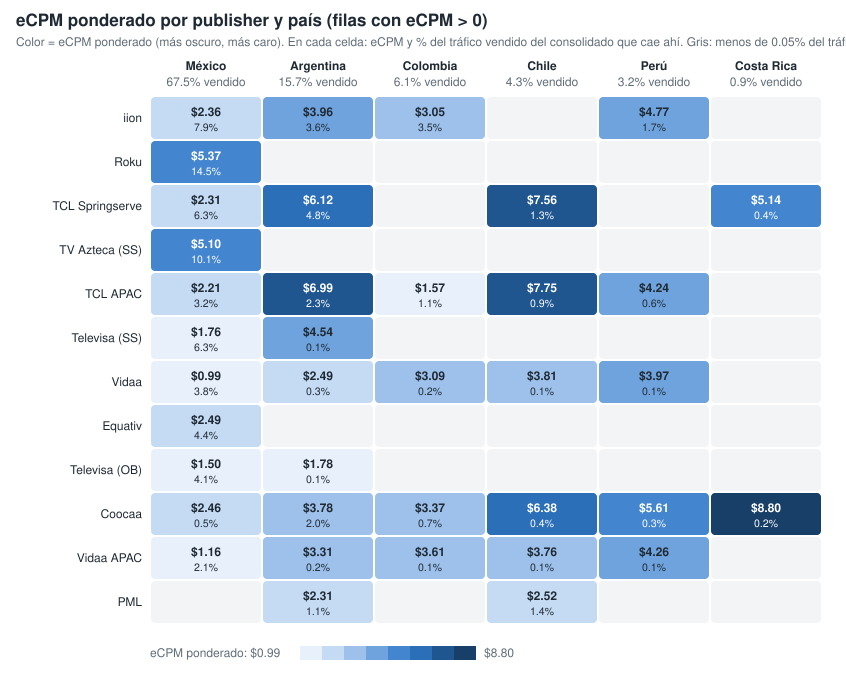
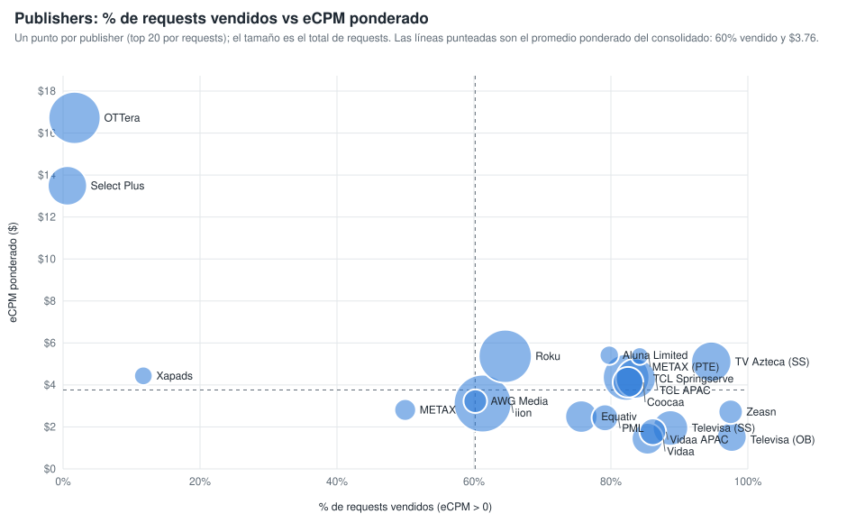

# Qué mueve el eCPM ponderado: la ruta de venta (publisher y país) (consolidado v10 a v23)

Sobre las filas con eCPM > 0 y requests > 0, la combinación publisher × país explica el 62.0 % de la variación del eCPM ponderado; los content objects, controlando por la ruta, aportan pocos puntos (género y rating los que más). Generado con `scripts/generar_graficos_drivers_ecpm.py` → `graficos-drivers-ecpm.json`.

## 1. eCPM ponderado por publisher y país

*Publishers ordenados por requests vendidos (top 12). En cada celda, eCPM ponderado y, debajo, % del tráfico vendido del consolidado que cae en esa combinación. Vacío = menos del 0.05 % del tráfico vendido.*

| Publisher | Mexico | Argentina | Colombia | Chile | Peru | Costa Rica |
|---|---:|---:|---:|---:|---:|---:|
| iion Pty Ltd | $2.36 (7.9%) | $3.96 (3.6%) | $3.05 (3.5%) | — | $4.77 (1.7%) | — |
| Roku - oRTB | $5.37 (14.4%) | — | — | — | — | — |
| TCL ADS - Springserve | $2.31 (6.3%) | $6.12 (4.8%) | — | $7.56 (1.3%) | — | $5.14 (0.4%) |
| TV Azteca - Springserve | $5.10 (10.2%) | — | — | — | — | — |
| TCL ADs (APAC) | $2.21 (3.2%) | $6.99 (2.3%) | $1.57 (1.1%) | $7.75 (0.9%) | $4.24 (0.6%) | — |
| Televisa Univision via SpringServe | $1.76 (6.3%) | $4.54 (0.1%) | — | — | — | — |
| Vidaa | $0.99 (3.8%) | $2.49 (0.3%) | $3.09 (0.2%) | $3.81 (0.1%) | $3.97 (0.1%) | — |
| Equativ (Formerly SMART AdServer) - oRTB CTV | $2.49 (4.4%) | — | — | — | — | — |
| Televisa Univision via OB | $1.50 (4.1%) | $1.78 (0.1%) | — | — | — | — |
| Coocaa, a SKYWORTH company | $2.46 (0.5%) | $3.78 (2.0%) | $3.37 (0.7%) | $6.38 (0.4%) | $5.61 (0.3%) | $8.80 (0.2%) |
| Vidaa  APAC Hisense Headquarter | $1.16 (2.1%) | $3.31 (0.2%) | $3.61 (0.1%) | $3.76 (0.1%) | $4.26 (0.1%) | — |
| PML Digital | — | $2.31 (1.1%) | — | $2.52 (1.4%) | — | — |

## 2. Publishers: % de requests vendidos vs eCPM ponderado

*Un punto por publisher (top 20 por requests); el tamaño es el total de requests. Líneas punteadas: promedio ponderado del consolidado (60 % vendido, $3.76).*

| Publisher | Requests | % vendido (eCPM > 0) | eCPM pond. | % del tráfico vendido |
|---|---:|---:|---:|---:|
| iion Pty Ltd | 99,800,198,492 | 61.3% | $3.11 | 16.8% |
| Roku - oRTB | 81,439,220,160 | 64.6% | $5.37 | 14.5% |
| OTTera.tv | 77,393,556,640 | 1.7% | $16.72 | 0.4% |
| TCL ADS - Springserve | 57,887,070,000 | 82.2% | $4.36 | 13.1% |
| TV Azteca - Springserve | 38,991,442,160 | 94.7% | $5.10 | 10.2% |
| TCL ADs (APAC) | 38,749,043,120 | 83.7% | $4.31 | 8.9% |
| Select Plus PTE LTD (CTV) | 37,023,115,520 | 0.6% | $13.49 | 0.1% |
| Televisa Univision via SpringServe | 27,267,377,200 | 88.7% | $1.95 | 6.7% |
| Equativ (Formerly SMART AdServer) - oRTB CTV | 21,058,515,280 | 75.7% | $2.49 | 4.4% |
| Vidaa | 19,411,409,440 | 85.3% | $1.44 | 4.6% |
| Coocaa, a SKYWORTH company | 17,848,880,960 | 82.5% | $4.13 | 4.0% |
| Televisa Univision via OB | 15,902,432,560 | 97.7% | $1.52 | 4.3% |
| PML Digital | 11,446,558,160 | 79.1% | $2.44 | 2.5% |
| Vidaa  APAC Hisense Headquarter | 11,338,340,800 | 86.1% | $1.77 | 2.7% |
| Zeasn Europe B.V. | 8,203,339,360 | 97.5% | $2.72 | 2.2% |
| AWG Media | 7,366,768,240 | 60.2% | $3.23 | 1.2% |
| METAX SOFTWARE PTE. LTD. (Exchange) | 5,544,376,880 | 50.0% | $2.81 | 0.8% |
| Aluna Limited | 3,281,935,680 | 79.8% | $5.41 | 0.7% |
| Xapads Media - CTV | 2,771,814,160 | 11.7% | $4.43 | 0.1% |
| METAX SOFTWARE PTE. LTD. | 2,082,642,960 | 84.2% | $5.37 | 0.5% |
