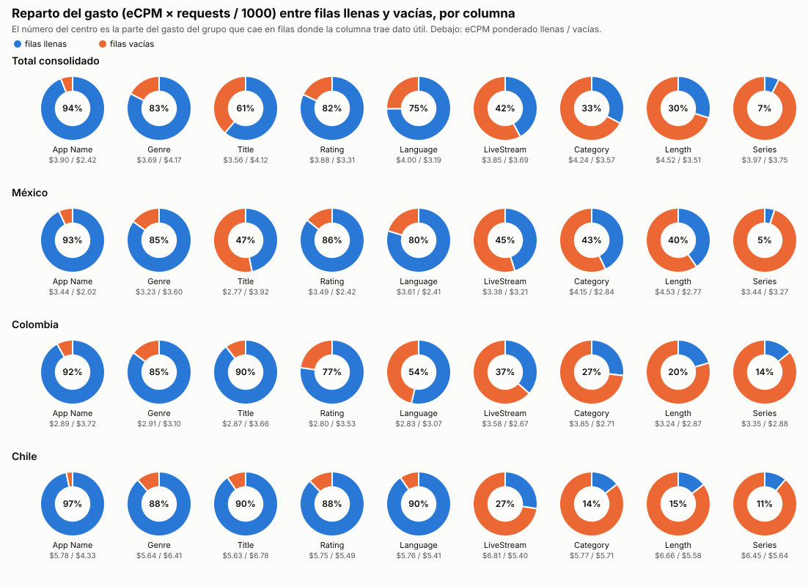
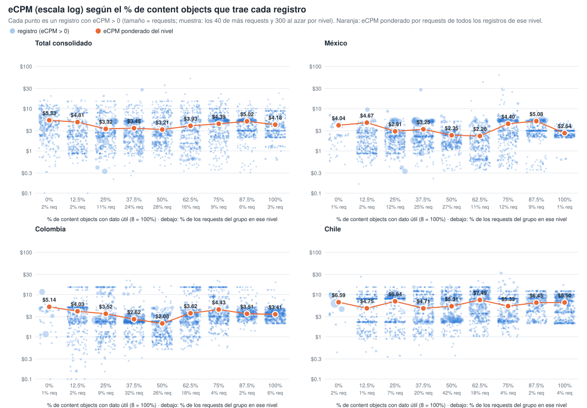
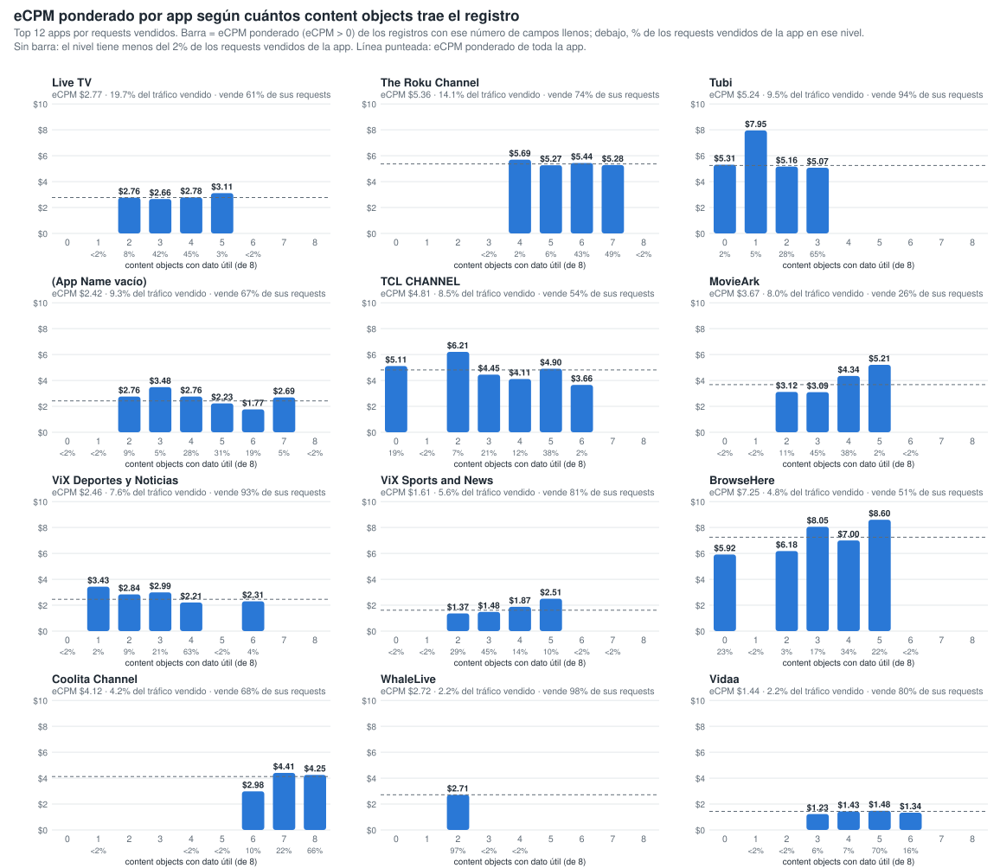
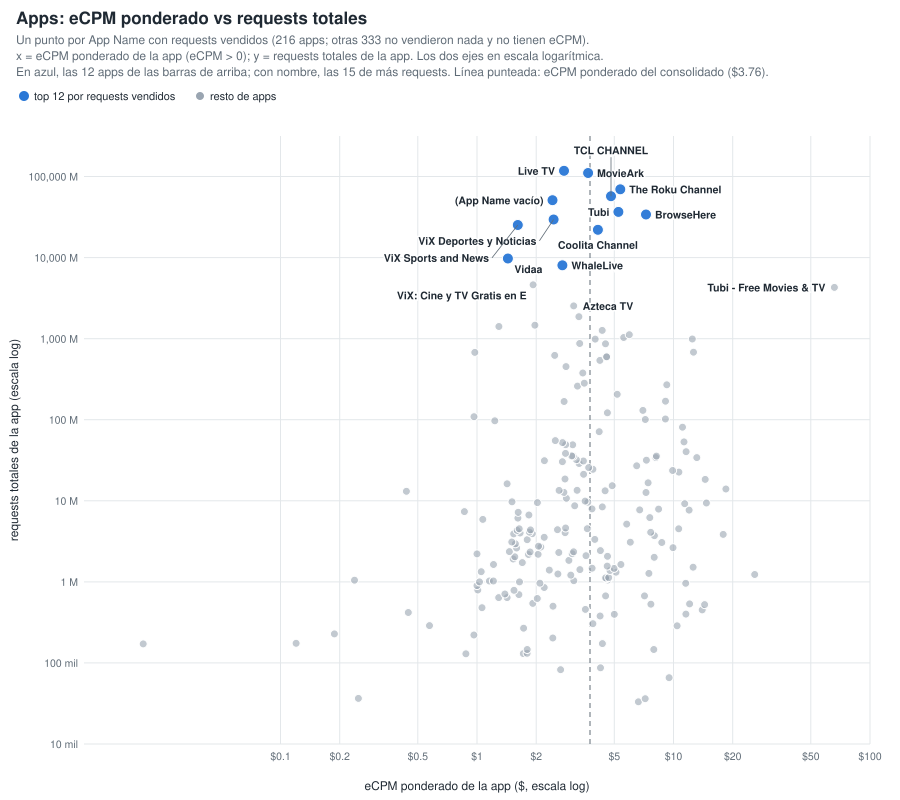
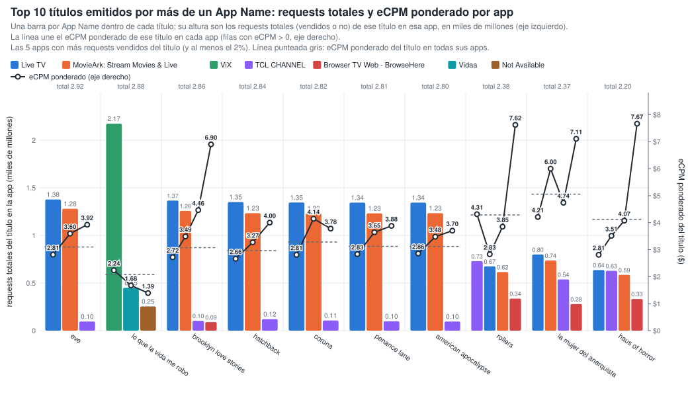
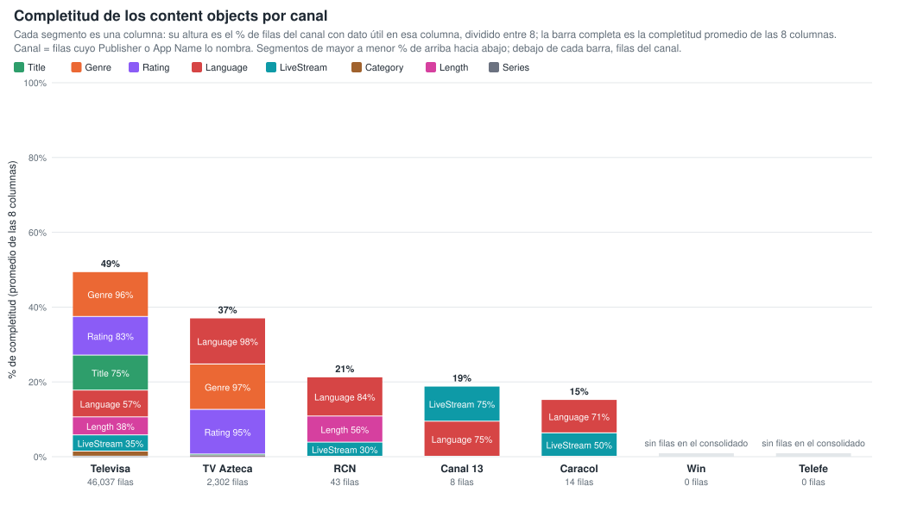
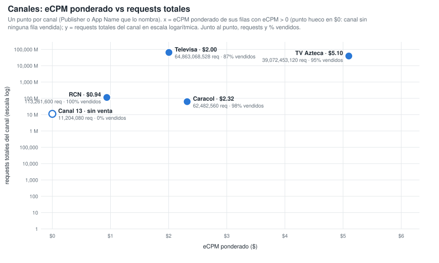
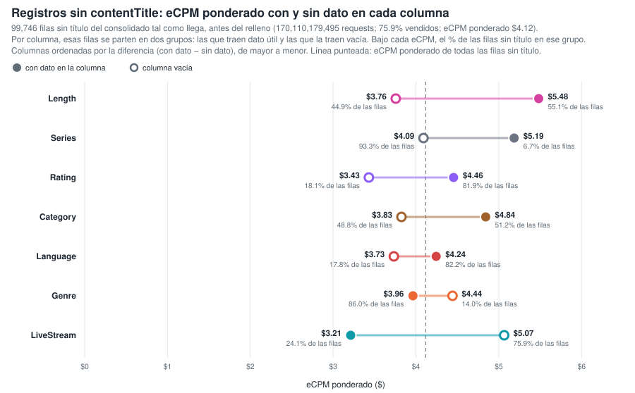
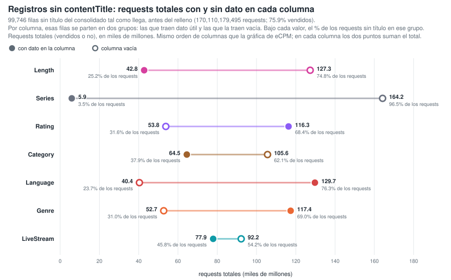
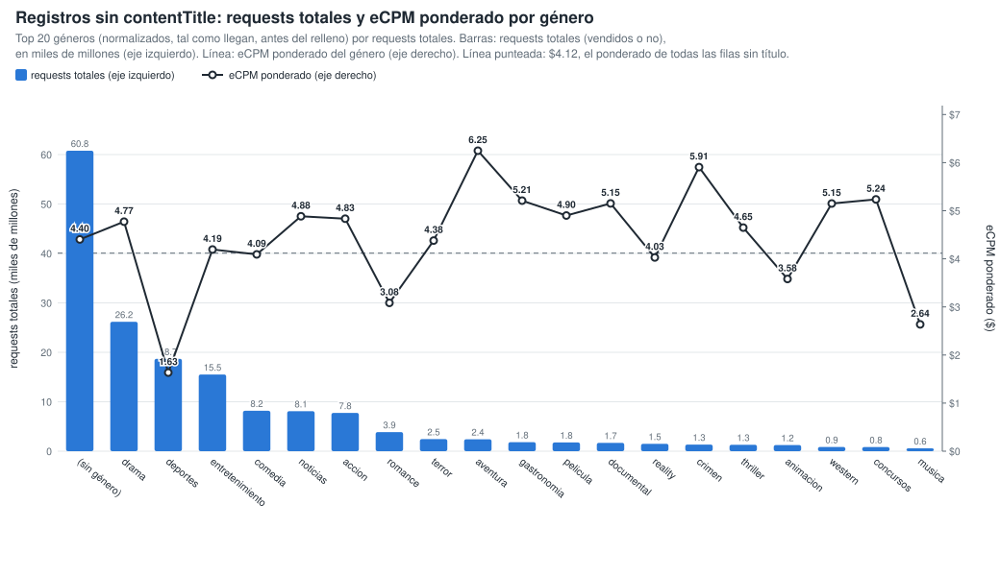

# Gráficos: eCPM de las filas llenas vs vacías (consolidado v10 a v23)

**Fuente:** `recursos/reporte-requests-ecpm-por-vacio-v23.json` (mismos datos de las tablas por país del detallado). Generado con `scripts/generar_graficos_ecpm_vacio.py` → `recursos/graficos-ecpm-vacio-r2.json`; tablas con `scripts/generar_reporte_graficos.py`.

*eCPM ponderado = Σ(eCPM × requests) / Σ requests, sin las filas con requests = 0 o eCPM = 0. Columnas: App Name y los 8 content objects con filas vacías; contentIsTitlePresent y Publisher vienen al 100% y no entran.*

## 1. Reparto del gasto (eCPM × requests / 1000) entre filas llenas y vacías

*% del gasto del grupo que cae en filas donde la columna trae dato útil. El gasto se calcula solo sobre filas con eCPM > 0.*

| Columna | Total consolidado | México | Colombia | Chile |
|---|---:|---:|---:|---:|
| App Name | 94.0% | 93.0% | 92.0% | 96.8% |
| contentGenre | 82.6% | 84.9% | 85.3% | 88.4% |
| contentTitle | 61.2% | 46.8% | 89.5% | 90.4% |
| contentRating | 82.2% | 85.8% | 77.3% | 87.8% |
| contentLanguage | 74.8% | 79.8% | 53.7% | 90.4% |
| contentIsLiveStream | 42.2% | 45.1% | 36.6% | 27.3% |
| contentCategory | 32.7% | 43.0% | 26.7% | 14.5% |
| contentLength | 29.8% | 40.4% | 20.3% | 14.7% |
| contentSeries | 7.2% | 5.0% | 14.3% | 11.2% |

## 2. % de columnas llenas de la fila vs eCPM (fila a fila)

Cada registro del consolidado se clasifica por el % de los 8 content objects que trae con dato útil (contentGenre, contentCategory, contentSeries, contentLength, contentLanguage, contentIsLiveStream, contentTitle, contentRating; contentIsTitlePresent no cuenta porque siempre viene). Cada punto es un registro con eCPM > 0, con el eCPM en escala logarítmica y el tamaño según sus requests (por nivel y panel se dibujan los 40 registros de más requests y 300 al azar). El punto naranja es el eCPM ponderado por requests de todos los registros del nivel. Generado con `scripts/generar_scatter_completitud_ecpm.py` → `recursos/graficos-ecpm-completitud-scatter.json`.

**Total consolidado** — 1,377,006 filas · 604,322,292,147 requests

| % de columnas llenas (de 8) | % filas | % requests | % requests vendidos (eCPM > 0) | eCPM pond. (>0) |
|---:|---:|---:|---:|---:|
| 0% (0) | 0.1% | 2.2% | 89.5% | $5.33 |
| 12.5% (1) | 1.9% | 1.8% | 52.3% | $4.81 |
| 25% (2) | 10.7% | 10.7% | 65.4% | $3.32 |
| 37.5% (3) | 23.5% | 24.2% | 67.0% | $3.45 |
| 50% (4) | 32.0% | 27.8% | 52.1% | $3.21 |
| 62.5% (5) | 21.6% | 15.8% | 43.8% | $3.93 |
| 75% (6) | 5.4% | 8.8% | 67.4% | $4.39 |
| 87.5% (7) | 2.2% | 6.3% | 80.6% | $5.02 |
| 100% (8) | 2.5% | 2.6% | 68.9% | $4.18 |

**México** — 408,487 filas · 356,582,562,883 requests

| % de columnas llenas (de 8) | % filas | % requests | % requests vendidos (eCPM > 0) | eCPM pond. (>0) |
|---:|---:|---:|---:|---:|
| 0% (0) | 0.1% | 0.7% | 82.5% | $4.04 |
| 12.5% (1) | 2.9% | 1.9% | 54.9% | $4.67 |
| 25% (2) | 13.4% | 12.1% | 75.6% | $2.91 |
| 37.5% (3) | 22.3% | 25.4% | 77.8% | $3.25 |
| 50% (4) | 30.3% | 27.2% | 57.0% | $2.35 |
| 62.5% (5) | 18.1% | 11.3% | 53.4% | $2.26 |
| 75% (6) | 7.9% | 11.7% | 72.7% | $4.40 |
| 87.5% (7) | 3.5% | 8.9% | 85.6% | $5.08 |
| 100% (8) | 1.5% | 0.7% | 75.2% | $2.64 |

**Colombia** — 143,820 filas · 46,852,688,092 requests

| % de columnas llenas (de 8) | % filas | % requests | % requests vendidos (eCPM > 0) | eCPM pond. (>0) |
|---:|---:|---:|---:|---:|
| 0% (0) | 0.1% | 1.2% | 71.0% | $5.14 |
| 12.5% (1) | 2.3% | 1.8% | 41.2% | $4.03 |
| 25% (2) | 13.1% | 9.2% | 49.1% | $3.52 |
| 37.5% (3) | 31.6% | 31.8% | 57.3% | $2.62 |
| 50% (4) | 24.6% | 26.2% | 38.7% | $2.08 |
| 62.5% (5) | 19.1% | 17.6% | 30.4% | $3.62 |
| 75% (6) | 4.9% | 4.4% | 43.5% | $4.43 |
| 87.5% (7) | 1.8% | 2.2% | 71.4% | $3.51 |
| 100% (8) | 2.6% | 5.5% | 76.4% | $3.41 |

**Chile** — 153,686 filas · 37,076,365,652 requests

| % de columnas llenas (de 8) | % filas | % requests | % requests vendidos (eCPM > 0) | eCPM pond. (>0) |
|---:|---:|---:|---:|---:|
| 0% (0) | 0.1% | 1.9% | 57.0% | $6.59 |
| 12.5% (1) | 1.7% | 0.9% | 15.8% | $4.75 |
| 25% (2) | 14.5% | 7.1% | 27.9% | $6.94 |
| 37.5% (3) | 28.8% | 20.3% | 22.7% | $4.71 |
| 50% (4) | 34.2% | 41.9% | 58.8% | $5.31 |
| 62.5% (5) | 13.9% | 17.8% | 29.9% | $7.49 |
| 75% (6) | 3.4% | 3.9% | 35.2% | $5.33 |
| 87.5% (7) | 1.3% | 1.8% | 51.6% | $6.45 |
| 100% (8) | 2.1% | 4.5% | 58.5% | $6.50 |

## 3. Por app: eCPM ponderado según cuántos content objects trae el registro

Top 12 apps por requests vendidos. Para cada app, barra = eCPM ponderado (eCPM > 0) de los registros con ese número de content objects con dato útil (de 8); debajo de cada barra, el % de los requests vendidos de la app en ese nivel. Los niveles con menos del 2 % de los requests vendidos de la app no se dibujan ni se tabulan. Generado con `scripts/generar_barras_app_completitud.py` → `recursos/graficos-app-completitud-barras.json`.

| App | eCPM pond. app | % tráfico vendido | 0 | 1 | 2 | 3 | 4 | 5 | 6 | 7 | 8 |
|---|---:|---:|---:|---:|---:|---:|---:|---:|---:|---:|---:|
| Live TV | $2.77 | 19.7% | — | — | $2.76 (8%) | $2.66 (42%) | $2.78 (45%) | $3.11 (3%) | — | — | — |
| The Roku Channel | $5.36 | 14.1% | — | — | — | — | $5.69 (2%) | $5.27 (6%) | $5.44 (43%) | $5.28 (49%) | — |
| Tubi: Free Movies & Live TV | $5.24 | 9.5% | $5.31 (2%) | $7.95 (5%) | $5.16 (28%) | $5.07 (65%) | — | — | — | — | — |
| Not Available | $2.42 | 9.3% | — | — | $2.76 (9%) | $3.48 (5%) | $2.76 (28%) | $2.23 (31%) | $1.77 (19%) | $2.69 (5%) | — |
| TCL CHANNEL | $4.81 | 8.5% | $5.11 (19%) | — | $6.21 (7%) | $4.45 (21%) | $4.11 (12%) | $4.90 (38%) | $3.66 (2%) | — | — |
| MovieArk: Stream Movies & Live | $3.67 | 8.0% | — | — | $3.12 (11%) | $3.09 (45%) | $4.34 (38%) | $5.21 (2%) | — | — | — |
| ViX: TV, Deportes y Noticias | $2.46 | 7.6% | — | $3.43 (2%) | $2.84 (9%) | $2.99 (21%) | $2.21 (63%) | — | $2.31 (4%) | — | — |
| ViX: TV, Sports and News | $1.61 | 5.6% | — | — | $1.37 (29%) | $1.48 (45%) | $1.87 (14%) | $2.51 (10%) | — | — | — |
| Browser TV Web - BrowseHere | $7.25 | 4.8% | $5.92 (23%) | — | $6.18 (3%) | $8.05 (17%) | $7.00 (34%) | $8.60 (22%) | — | — | — |
| Coolita Channel | $4.12 | 4.2% | — | — | — | — | — | — | $2.98 (10%) | $4.41 (22%) | $4.25 (66%) |
| WhaleLive | $2.72 | 2.2% | — | — | $2.71 (97%) | — | — | — | — | — | — |
| Vidaa | $1.44 | 2.2% | — | — | — | $1.23 (6%) | $1.43 (7%) | $1.48 (70%) | $1.34 (16%) | — | — |

*Entre paréntesis, el % de los requests vendidos de la app que cae en ese nivel de campos llenos.*

### 3.1 Apps: eCPM ponderado vs requests totales

Un punto por App Name con requests vendidos (216 apps; otras 333 no vendieron nada y no tienen eCPM). x = eCPM ponderado de la app (eCPM > 0); y = requests totales de la app; los dos ejes en escala logarítmica. Línea punteada: eCPM ponderado del consolidado ($3.76). Tabla: las 30 apps de más requests; todas están en `recursos/graficos-app-requests-ecpm.json`.

| App | Requests | Requests vendidos | % vendido | eCPM pond. |
|---|---:|---:|---:|---:|
| Live TV | 117,784,218,089 | 71,600,640,780 | 60.8% | $2.77 |
| MovieArk: Stream Movies & Live | 110,454,354,536 | 29,085,574,496 | 26.3% | $3.67 |
| The Roku Channel | 69,589,898,560 | 51,324,954,240 | 73.8% | $5.36 |
| TCL CHANNEL | 57,127,452,994 | 30,817,828,128 | 53.9% | $4.81 |
| Not Available | 51,035,749,192 | 33,973,475,559 | 66.6% | $2.42 |
| Tubi: Free Movies & Live TV | 36,641,484,720 | 34,458,370,560 | 94.0% | $5.24 |
| Browser TV Web - BrowseHere | 34,008,242,774 | 17,326,232,234 | 50.9% | $7.25 |
| ViX: TV, Deportes y Noticias | 29,512,002,560 | 27,541,036,800 | 93.3% | $2.46 |
| ViX: TV, Sports and News | 25,264,532,160 | 20,437,566,560 | 80.9% | $1.61 |
| Coolita Channel | 22,053,887,040 | 15,083,421,280 | 68.4% | $4.12 |
| Vidaa | 9,745,525,040 | 7,840,102,560 | 80.4% | $1.44 |
| WhaleLive | 8,040,404,960 | 7,872,918,560 | 97.9% | $2.72 |
| ViX: Cine y TV Gratis en Español | 4,621,249,840 | 3,404,378,240 | 73.7% | $1.93 |
| Tubi - Free Movies & TV | 4,287,248,960 | 56,320 | 0.0% | $65.89 |
| Azteca TV | 2,533,248,720 | 2,498,985,680 | 98.6% | $3.10 |
| SAMSUNG TV PLUS | 1,864,479,013 | 1,243,396,960 | 66.7% | $3.30 |
| VIX - Filmes e TV | 1,464,490,320 | 1,379,158,800 | 94.2% | $1.97 |
| ViX: Cine y TV en Español | 1,413,642,928 | 1,276,986,560 | 90.3% | $1.29 |
| Open Browser - TV Web Browser | 1,266,181,920 | 1,132,672,160 | 89.5% | $4.33 |
| Metax TV - Live TV & Movies | 1,119,172,320 | 832,256,000 | 74.4% | $5.96 |
| Ottera | 1,033,895,313 | 555,340,098 | 53.7% | $5.58 |
| PlutoTV: Stream Free Movies/TV | 990,326,480 | 397,556,080 | 40.1% | $12.46 |
| Plex: Find Movies & TV Shows | 987,005,605 | 155,798,915 | 15.8% | $3.99 |
| FreeTV: Películas, Series y TV | 870,945,520 | 452,708,480 | 52.0% | $3.33 |
| Plex - Free Movies & TV | 863,968,192 | 205,744,444 | 23.8% | $4.51 |
| Pluto TV - Free Movies/Shows | 679,957,280 | 173,235,920 | 25.5% | $12.64 |
| Univision App: Univision & Unimas Free | 677,567,520 | 659,200,400 | 97.3% | $0.97 |
| FreeTube- Search & Watch Free | 622,577,596 | 195,656,014 | 31.4% | $2.49 |
| LG | 597,969,095 | 154,715,048 | 25.9% | $4.56 |
| Free Games by PlayWorks | 595,231,998 | 154,574,518 | 26.0% | $4.57 |

## 4. Títulos emitidos por más de un App Name

18,851 títulos reales, agrupados solo por App Name (sin pageURL). Generado con `scripts/generar_tabla_pageurl_titulos.py` → `recursos/titulos-appname.json`.

| App Name distintos por título | % de títulos | % de requests |
|---:|---:|---:|
| 1 | 50.8% | 7.7% |
| 2 | 25.7% | 7.5% |
| 3 | 8.8% | 11.1% |
| 4 | 3.8% | 2.0% |
| 5+ | 10.9% | 71.6% |

**Top 10 títulos (por requests) en dos o más App Name:** una barra por App Name dentro de cada título, con altura = requests totales (vendidos o no) de ese título en esa app, en miles de millones, en el eje izquierdo (las 5 apps con más requests vendidos del título, de mayor a menor requests). La línea une el eCPM ponderado (eCPM > 0) de ese título en cada app, en el eje derecho. Línea punteada = eCPM ponderado del título en todas sus apps; sobre cada grupo, los requests totales del título. Las variantes de ViX (ViX: TV, Deportes y Noticias; ViX: TV, Sports and News; ViX: Cine y TV…; VIX - Filmes e TV) cuentan como una sola app, ViX.

| Título | App Name | Requests | eCPM pond. | Reparto por app (% de requests vendidos, eCPM pond. de la app) |
|---|---:|---:|---:|---|
| eve | 9 | 2,919,236,759 | $3.10 | Live TV 64% ($2.81), MovieArk: Stream Movies & Live 30% ($3.60), TCL CHANNEL 2% ($3.92), Browser TV Web - BrowseHere 1% ($5.28), ViX 1% ($2.12) |
| lo que la vida me robo | 3 | 2,877,000,380 | $2.08 | ViX 76% ($2.24), Vidaa 15% ($1.68), Not Available 9% ($1.39) |
| brooklyn love stories | 8 | 2,861,167,299 | $3.07 | Live TV 66% ($2.72), MovieArk: Stream Movies & Live 29% ($3.49), TCL CHANNEL 2% ($4.46), Browser TV Web - BrowseHere 2% ($6.90), Not Available 0% ($3.85) |
| hatchback | 7 | 2,844,317,409 | $2.96 | Live TV 65% ($2.66), MovieArk: Stream Movies & Live 29% ($3.27), TCL CHANNEL 4% ($4.00), Browser TV Web - BrowseHere 2% ($6.64), Not Available 0% ($4.14) |
| corona | 7 | 2,820,302,962 | $3.28 | Live TV 66% ($2.81), MovieArk: Stream Movies & Live 28% ($4.14), TCL CHANNEL 3% ($3.78), Browser TV Web - BrowseHere 2% ($6.25), Not Available 0% ($3.91) |
| penance lane | 8 | 2,806,265,837 | $3.12 | Live TV 67% ($2.83), MovieArk: Stream Movies & Live 28% ($3.65), TCL CHANNEL 2% ($3.88), Browser TV Web - BrowseHere 2% ($4.72), Not Available 0% ($3.77) |
| american apocalypse | 8 | 2,800,629,390 | $3.12 | Live TV 66% ($2.86), MovieArk: Stream Movies & Live 29% ($3.48), TCL CHANNEL 3% ($3.70), Browser TV Web - BrowseHere 2% ($5.68), Not Available 0% ($5.06) |
| rollers | 7 | 2,378,284,489 | $4.29 | TCL CHANNEL 34% ($4.31), Live TV 34% ($2.83), Browser TV Web - BrowseHere 16% ($7.62), MovieArk: Stream Movies & Live 15% ($3.85), Not Available 0% ($2.86) |
| la mujer del anarquista | 7 | 2,370,473,007 | $5.05 | Live TV 42% ($4.21), TCL CHANNEL 27% ($4.74), MovieArk: Stream Movies & Live 18% ($6.00), Browser TV Web - BrowseHere 13% ($7.11), Not Available 0% ($6.38) |
| haus of horror | 7 | 2,204,608,363 | $4.12 | TCL CHANNEL 33% ($3.51), Live TV 33% ($2.81), Browser TV Web - BrowseHere 18% ($7.67), MovieArk: Stream Movies & Live 15% ($4.07), Not Available 0% ($4.48) |

| Título | Requests del título | Requests por app (% de los requests del título) |
|---|---:|---|
| eve | 2,919,236,759 | Live TV 1,376,815,180 (47%), MovieArk: Stream Movies & Live 1,279,534,470 (44%), TCL CHANNEL 95,956,239 (3%) |
| lo que la vida me robo | 2,877,000,380 | ViX 2,173,285,980 (76%), Vidaa 449,850,720 (16%), Not Available 253,863,680 (9%) |
| brooklyn love stories | 2,861,167,299 | Live TV 1,365,879,106 (48%), MovieArk: Stream Movies & Live 1,257,281,932 (44%), TCL CHANNEL 103,773,489 (4%), Browser TV Web - BrowseHere 89,481,100 (3%) |
| hatchback | 2,844,317,409 | Live TV 1,350,614,372 (47%), MovieArk: Stream Movies & Live 1,233,021,216 (43%), TCL CHANNEL 120,752,400 (4%) |
| corona | 2,820,302,962 | Live TV 1,345,132,020 (48%), MovieArk: Stream Movies & Live 1,231,062,778 (44%), TCL CHANNEL 106,068,777 (4%) |
| penance lane | 2,806,265,837 | Live TV 1,343,983,211 (48%), MovieArk: Stream Movies & Live 1,231,023,494 (44%), TCL CHANNEL 98,316,915 (4%) |
| american apocalypse | 2,800,629,390 | Live TV 1,344,219,434 (48%), MovieArk: Stream Movies & Live 1,233,301,616 (44%), TCL CHANNEL 96,013,824 (3%) |
| rollers | 2,378,284,489 | TCL CHANNEL 729,498,588 (31%), Live TV 674,788,106 (28%), MovieArk: Stream Movies & Live 615,232,648 (26%), Browser TV Web - BrowseHere 336,514,023 (14%) |
| la mujer del anarquista | 2,370,473,007 | Live TV 800,041,785 (34%), MovieArk: Stream Movies & Live 736,263,992 (31%), TCL CHANNEL 537,921,093 (23%), Browser TV Web - BrowseHere 278,836,361 (12%) |
| haus of horror | 2,204,608,363 | Live TV 636,484,157 (29%), TCL CHANNEL 628,497,552 (29%), MovieArk: Stream Movies & Live 585,396,216 (27%), Browser TV Web - BrowseHere 332,780,042 (15%) |

## 5. Completitud de los content objects por canal

Canal = filas cuyo Publisher o App Name lo nombra (Caracol via OB / ditu por Caracol, RCN via OB / Canal RCN, Canal 13 OB, Televisa Univision via … / ViX, TV Azteca - Springserve / Azteca TV). Cada segmento de la barra es una columna, con altura = % de filas del canal con dato útil en esa columna dividido entre 8, apilados de mayor % (arriba) a menor (abajo); la barra completa es la completitud promedio de las 8 columnas. La tabla va ordenada por completitud promedio. Generado con `scripts/generar_barras_canales_completitud.py` → `recursos/graficos-canales-completitud-barras.json`.

| Canal | Promedio | Filas | Requests | Title | Genre | Rating | Language | IsLiveStream | Category | Length | Series |
|---|---:|---:|---:|---:|---:|---:|---:|---:|---:|---:|---:|
| Televisa | 49.4% | 46,037 | 64,863,068,528 | 74.9% | 95.9% | 82.6% | 57.3% | 34.6% | 10.8% | 38.5% | 0.3% |
| TV Azteca | 37.0% | 2,302 | 39,072,453,120 | 2.0% | 97.0% | 95.4% | 98.5% | 0.7% | 0.7% | 0.6% | 0.9% |
| RCN | 21.2% | 43 | 113,261,600 | 0.0% | 0.0% | 0.0% | 83.7% | 30.2% | 0.0% | 55.8% | 0.0% |
| Canal 13 | 18.8% | 8 | 11,204,080 | 0.0% | 0.0% | 0.0% | 75.0% | 75.0% | 0.0% | 0.0% | 0.0% |
| Caracol | 15.2% | 14 | 62,482,560 | 0.0% | 0.0% | 0.0% | 71.4% | 50.0% | 0.0% | 0.0% | 0.0% |
| Win | — | 0 | 0 | — | — | — | — | — | — | — | — |
| Telefe | — | 0 | 0 | — | — | — | — | — | — | — | — |

*Win y Telefe no aparecen en el consolidado: ningún Publisher ni App Name los nombra.*

## 6. Canales: eCPM ponderado vs requests totales

Un punto por canal (mismos canales y misma definición de la sección 5). x = eCPM ponderado de sus filas con eCPM > 0; un canal con requests pero sin ninguna fila vendida va en $0 con un punto hueco; y = requests totales del canal en escala logarítmica. Junto al punto, requests totales y % de requests vendidos.

| Canal | Requests | Requests vendidos | % vendido | eCPM pond. |
|---|---:|---:|---:|---:|
| Televisa | 64,863,068,528 | 56,561,018,400 | 87.2% | $2.00 |
| TV Azteca | 39,072,453,120 | 36,957,356,240 | 94.6% | $5.10 |
| RCN | 113,261,600 | 113,116,480 | 99.9% | $0.94 |
| Caracol | 62,482,560 | 61,339,920 | 98.2% | $2.32 |
| Canal 13 | 11,204,080 | 0 | 0.0% | — (sin filas vendidas) |
| Win | 0 | 0 | — | — |
| Telefe | 0 | 0 | — | — |

## 7. Registros sin contentTitle: qué content objects se relacionan con el eCPM

99,746 filas sin título (170,110,179,495 requests; 75.9% vendidos; eCPM ponderado $4.12). Generado con `scripts/generar_graficos_sin_titulo.py` → `recursos/graficos-sin-titulo.json`.

### 7.1 eCPM ponderado con y sin dato en cada columna

Filas sin título del consolidado tal como llega, antes del relleno. Por columna se parten en dos grupos: las que traen dato útil (círculo lleno) y las que la traen vacía (círculo hueco); de cada grupo, su % de las filas sin título, su % de requests vendidos y su eCPM ponderado. Diferencia = eCPM con dato − eCPM sin dato.

| Columna | % filas con dato | % vendido con dato | eCPM pond. con dato | % filas sin dato | % vendido sin dato | eCPM pond. sin dato | Diferencia |
|---|---:|---:|---:|---:|---:|---:|---:|
| contentLength | 55.1% | 63.3% | $5.48 | 44.9% | 80.1% | $3.76 | +$1.73 |
| contentSeries | 6.7% | 55.6% | $5.19 | 93.3% | 76.6% | $4.09 | +$1.09 |
| contentRating | 81.9% | 74.5% | $4.46 | 18.1% | 78.8% | $3.43 | +$1.02 |
| contentCategory | 51.2% | 57.7% | $4.84 | 48.8% | 87.0% | $3.83 | +$1.02 |
| contentLanguage | 82.2% | 75.0% | $4.24 | 17.8% | 78.6% | $3.73 | +$0.51 |
| contentGenre | 86.0% | 74.4% | $3.96 | 14.0% | 79.0% | $4.44 | −$0.48 |
| contentIsLiveStream | 24.1% | 84.6% | $3.21 | 75.9% | 68.4% | $5.07 | −$1.85 |

### 7.2 Requests totales con y sin dato en cada columna

Las mismas filas sin título y los mismos dos grupos por columna que en 7.1 (mismo orden de columnas), con los requests totales (vendidos o no) de cada grupo en el eje x, en miles de millones. En cada columna los dos puntos suman el total de requests sin título (170,110,179,495).

| Columna | Requests con dato | % requests con dato | Requests sin dato | % requests sin dato |
|---|---:|---:|---:|---:|
| contentLength | 42,786,894,126 | 25.2% | 127,323,285,369 | 74.8% |
| contentSeries | 5,918,004,896 | 3.5% | 164,192,174,599 | 96.5% |
| contentRating | 116,297,922,985 | 68.4% | 53,812,256,510 | 31.6% |
| contentCategory | 64,503,605,686 | 37.9% | 105,606,573,809 | 62.1% |
| contentLanguage | 129,734,465,514 | 76.3% | 40,375,713,981 | 23.7% |
| contentGenre | 117,366,381,234 | 69.0% | 52,743,798,261 | 31.0% |
| contentIsLiveStream | 77,926,645,252 | 45.8% | 92,183,534,243 | 54.2% |

### 7.3 Requests totales y eCPM ponderado por género en las filas sin título

Género normalizado tal como llega. Explica el 16.4 % de la variación del eCPM ponderado solo y aporta 4.5 puntos más controlando por publisher × país (rating: 11.8 % y 4.4 puntos; livestream, length, categoría y series: 7.6 puntos o menos).

Top 20 géneros por requests totales. Barras = requests totales (vendidos o no) del género, en miles de millones (eje izquierdo), de mayor a menor; línea = eCPM ponderado del género (eje derecho). Línea punteada = eCPM ponderado de todas las filas sin título.

| Género | Filas | Requests | % vendido | % del tráfico vendido sin título | eCPM pond. |
|---|---:|---:|---:|---:|---:|
| (sin género) | 35,700 | 60,793,919,304 | 72.2% | 34.0% | $4.40 |
| drama | 9,240 | 26,179,357,007 | 72.8% | 14.8% | $4.77 |
| deportes | 4,161 | 18,677,441,639 | 92.2% | 13.4% | $1.63 |
| entretenimiento | 4,485 | 15,521,607,811 | 78.3% | 9.4% | $4.19 |
| comedia | 6,320 | 8,169,266,726 | 77.0% | 4.9% | $4.09 |
| noticias | 2,846 | 8,094,238,741 | 87.2% | 5.5% | $4.88 |
| accion | 5,248 | 7,757,823,754 | 79.2% | 4.8% | $4.83 |
| romance | 2,742 | 3,857,872,069 | 81.8% | 2.4% | $3.08 |
| terror | 2,416 | 2,453,571,044 | 75.8% | 1.4% | $4.38 |
| aventura | 1,460 | 2,409,329,197 | 67.6% | 1.3% | $6.25 |
| gastronomia | 601 | 1,816,882,704 | 64.0% | 0.9% | $5.21 |
| pelicula | 2,258 | 1,763,933,606 | 79.2% | 1.1% | $4.90 |
| documental | 2,773 | 1,695,291,197 | 61.6% | 0.8% | $5.15 |
| reality | 3,062 | 1,493,808,764 | 72.0% | 0.8% | $4.03 |
| crimen | 3,836 | 1,343,491,746 | 58.8% | 0.6% | $5.91 |
| thriller | 2,123 | 1,292,342,951 | 78.0% | 0.8% | $4.65 |
| animacion | 405 | 1,248,923,299 | 69.8% | 0.7% | $3.58 |
| western | 526 | 855,548,188 | 79.4% | 0.5% | $5.15 |
| concursos | 620 | 843,004,751 | 77.6% | 0.5% | $5.24 |
| musica | 649 | 588,109,360 | 63.2% | 0.3% | $2.64 |
