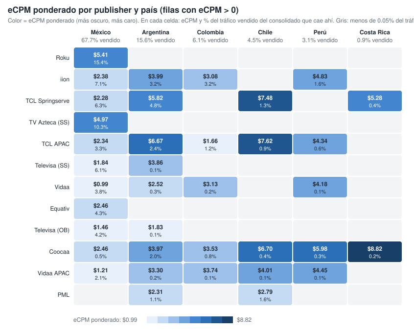
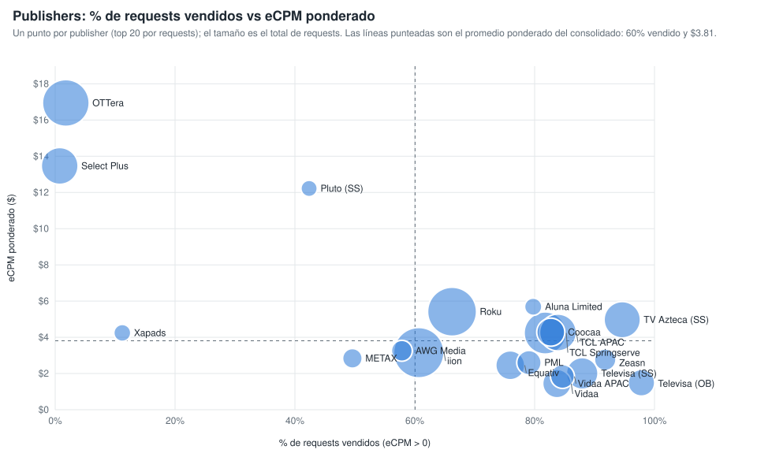

# Qué mueve el eCPM ponderado: la ruta de venta (publisher y país) (consolidado v10 a v24)

Sobre las filas con eCPM > 0 y requests > 0, la combinación publisher × país explica el 59.8 % de la variación del eCPM ponderado; los content objects, controlando por la ruta, aportan pocos puntos (género y rating los que más). Generado con `scripts/generar_graficos_drivers_ecpm.py` → `graficos-drivers-ecpm.json`.

## 1. eCPM ponderado por publisher y país

*Publishers ordenados por requests vendidos (top 12). En cada celda, eCPM ponderado y, debajo, % del tráfico vendido del consolidado que cae en esa combinación. Vacío = menos del 0.05 % del tráfico vendido.*

| Publisher | Mexico | Argentina | Colombia | Chile | Peru | Costa Rica |
|---|---:|---:|---:|---:|---:|---:|
| Roku - oRTB | $5.41 (15.4%) | — | — | — | — | — |
| iion Pty Ltd | $2.38 (7.1%) | $3.99 (3.2%) | $3.08 (3.2%) | — | $4.83 (1.6%) | — |
| TCL ADS - Springserve | $2.28 (6.3%) | $5.82 (4.8%) | — | $7.48 (1.3%) | — | $5.28 (0.3%) |
| TV Azteca - Springserve | $4.97 (10.3%) | — | — | — | — | — |
| TCL ADs (APAC) | $2.34 (3.3%) | $6.67 (2.4%) | $1.66 (1.2%) | $7.62 (0.9%) | $4.34 (0.6%) | — |
| Televisa Univision via SpringServe | $1.84 (6.1%) | $3.86 (0.1%) | — | — | — | — |
| Vidaa | $0.99 (3.8%) | $2.52 (0.3%) | $3.13 (0.2%) | — | $4.18 (0.1%) | — |
| Equativ (Formerly SMART AdServer) - oRTB CTV | $2.46 (4.3%) | — | — | — | — | — |
| Televisa Univision via OB | $1.46 (4.2%) | $1.83 (0.1%) | — | — | — | — |
| Coocaa, a SKYWORTH company | $2.46 (0.5%) | $3.97 (2.0%) | $3.53 (0.8%) | $6.70 (0.4%) | $5.98 (0.3%) | $8.82 (0.2%) |
| Vidaa  APAC Hisense Headquarter | $1.21 (2.1%) | $3.30 (0.2%) | $3.74 (0.1%) | $4.00 (0.1%) | $4.45 (0.1%) | — |
| PML Digital | — | $2.31 (1.1%) | — | $2.79 (1.6%) | — | — |

## 2. Publishers: % de requests vendidos vs eCPM ponderado

*Un punto por publisher (top 20 por requests); el tamaño es el total de requests. Líneas punteadas: promedio ponderado del consolidado (60 % vendido, $3.81).*

| Publisher | Requests | % vendido (eCPM > 0) | eCPM pond. | % del tráfico vendido |
|---|---:|---:|---:|---:|
| iion Pty Ltd | 87,506,972,349 | 60.7% | $3.15 | 15.2% |
| Roku - oRTB | 81,602,740,400 | 66.2% | $5.41 | 15.4% |
| OTTera.tv | 72,480,617,280 | 1.8% | $16.94 | 0.4% |
| TCL ADS - Springserve | 55,918,968,640 | 81.8% | $4.24 | 13.1% |
| TCL ADs (APAC) | 39,005,526,000 | 83.9% | $4.26 | 9.3% |
| Select Plus PTE LTD (CTV) | 38,995,557,200 | 0.8% | $13.47 | 0.1% |
| TV Azteca - Springserve | 38,040,574,418 | 94.6% | $4.97 | 10.3% |
| Televisa Univision via SpringServe | 25,594,960,400 | 87.9% | $2.01 | 6.4% |
| Equativ (Formerly SMART AdServer) - oRTB CTV | 19,986,563,200 | 75.9% | $2.46 | 4.3% |
| Vidaa | 19,022,726,000 | 83.7% | $1.45 | 4.5% |
| Coocaa, a SKYWORTH company | 17,973,619,840 | 82.7% | $4.28 | 4.2% |
| Televisa Univision via OB | 15,373,499,600 | 97.8% | $1.49 | 4.3% |
| PML Digital | 11,698,961,840 | 79.1% | $2.60 | 2.6% |
| Vidaa  APAC Hisense Headquarter | 11,028,512,800 | 84.6% | $1.84 | 2.7% |
| Zeasn Europe B.V. | 7,639,929,120 | 91.8% | $2.76 | 2.0% |
| AWG Media | 6,943,823,120 | 57.8% | $3.25 | 1.1% |
| METAX SOFTWARE PTE. LTD. (Exchange) | 5,429,569,040 | 49.6% | $2.84 | 0.8% |
| Aluna Limited | 3,256,153,360 | 79.8% | $5.69 | 0.7% |
| Xapads Media - CTV | 2,973,947,840 | 11.2% | $4.24 | 0.1% |
| Pluto LATAM via SpringServe | 2,561,704,000 | 42.4% | $12.22 | 0.3% |
