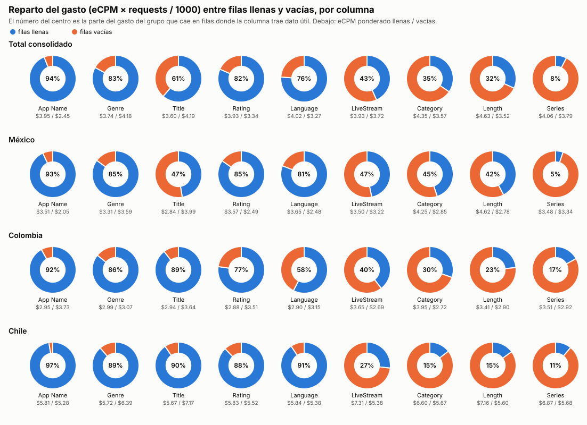
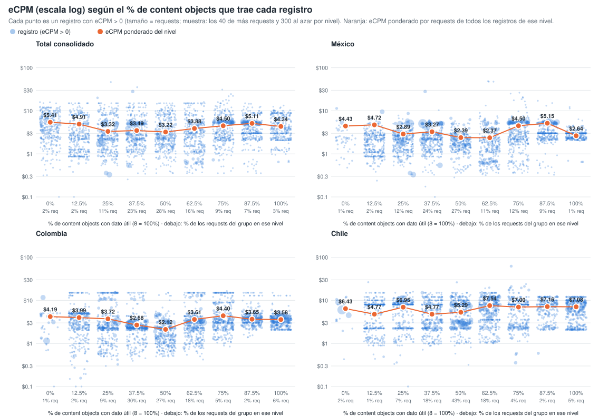
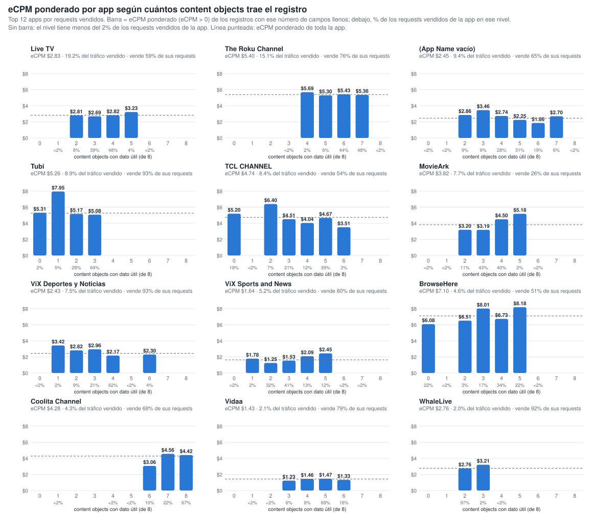
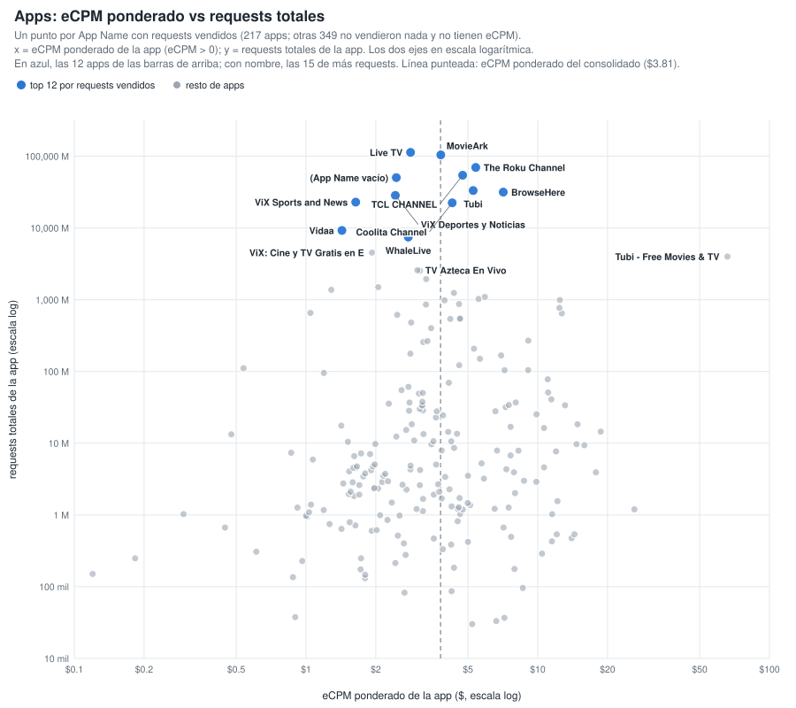
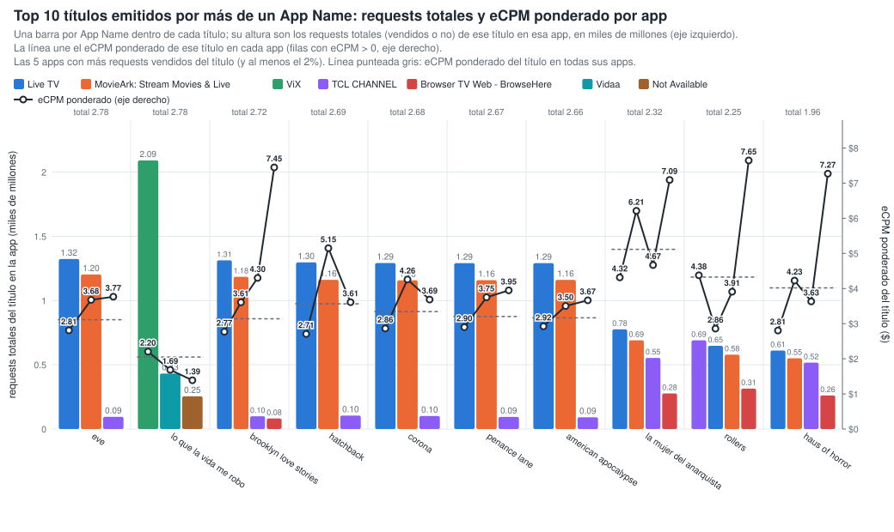
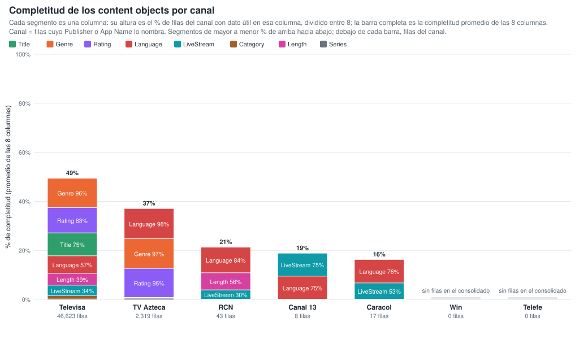
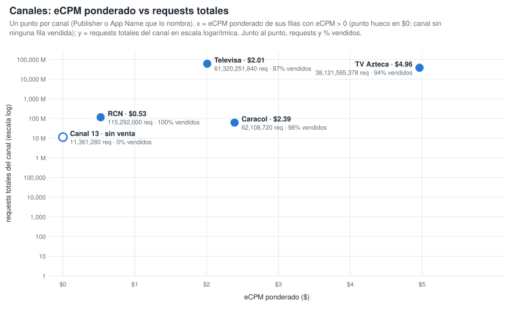
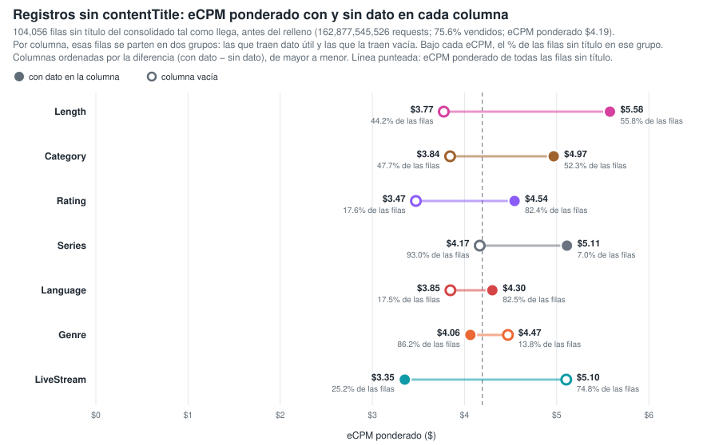
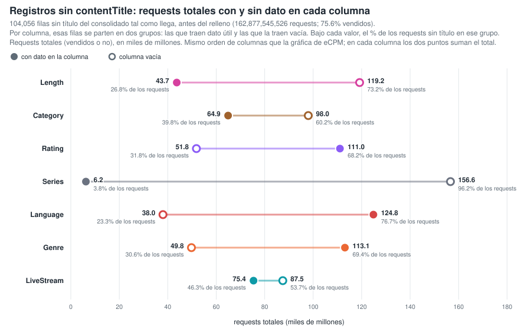
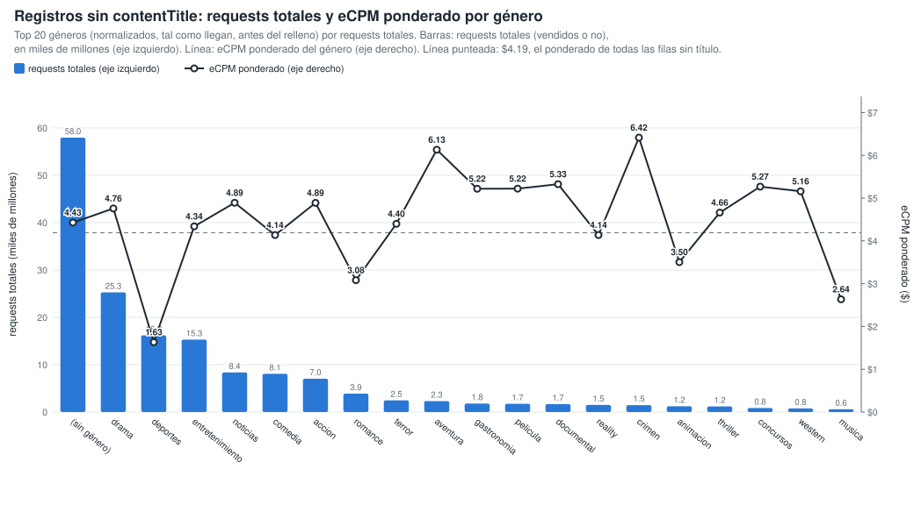

# Gráficos: eCPM de las filas llenas vs vacías (consolidado v10 a v24)

**Fuente:** `recursos/reporte-requests-ecpm-por-vacio-v24.json` (mismos datos de las tablas por país del detallado). Generado con `scripts/generar_graficos_ecpm_vacio.py` → `recursos/graficos-ecpm-vacio-r2.json`; tablas con `scripts/generar_reporte_graficos.py`.

*eCPM ponderado = Σ(eCPM × requests) / Σ requests, sin las filas con requests = 0 o eCPM = 0. Columnas: App Name y los 8 content objects con filas vacías; contentIsTitlePresent y Publisher vienen al 100% y no entran.*

## 1. Reparto del gasto (eCPM × requests / 1000) entre filas llenas y vacías

*% del gasto del grupo que cae en filas donde la columna trae dato útil. El gasto se calcula solo sobre filas con eCPM > 0.*

| Columna | Total consolidado | México | Colombia | Chile |
|---|---:|---:|---:|---:|
| App Name | 94.0% | 93.0% | 91.9% | 97.4% |
| contentGenre | 83.0% | 85.1% | 85.8% | 88.5% |
| contentTitle | 61.3% | 47.4% | 89.5% | 90.3% |
| contentRating | 81.7% | 84.8% | 77.3% | 87.8% |
| contentLanguage | 76.1% | 80.9% | 57.6% | 90.6% |
| contentIsLiveStream | 43.3% | 46.8% | 39.6% | 26.8% |
| contentCategory | 34.6% | 44.9% | 30.2% | 14.6% |
| contentLength | 31.7% | 42.3% | 23.4% | 15.0% |
| contentSeries | 7.7% | 5.2% | 17.0% | 11.1% |

## 2. % de columnas llenas de la fila vs eCPM (fila a fila)

Cada registro del consolidado se clasifica por el % de los 8 content objects que trae con dato útil (contentGenre, contentCategory, contentSeries, contentLength, contentLanguage, contentIsLiveStream, contentTitle, contentRating; contentIsTitlePresent no cuenta porque siempre viene). Cada punto es un registro con eCPM > 0, con el eCPM en escala logarítmica y el tamaño según sus requests (por nivel y panel se dibujan los 40 registros de más requests y 300 al azar). El punto naranja es el eCPM ponderado por requests de todos los registros del nivel. Generado con `scripts/generar_scatter_completitud_ecpm.py` → `recursos/graficos-ecpm-completitud-scatter.json`.

**Total consolidado** — 1,396,663 filas · 583,047,756,539 requests

| % de columnas llenas (de 8) | % filas | % requests | % requests vendidos (eCPM > 0) | eCPM pond. (>0) |
|---:|---:|---:|---:|---:|
| 0% (0) | 0.1% | 2.1% | 89.7% | $5.41 |
| 12.5% (1) | 1.9% | 1.8% | 52.6% | $4.91 |
| 25% (2) | 10.6% | 10.6% | 64.7% | $3.32 |
| 37.5% (3) | 23.5% | 23.0% | 66.4% | $3.49 |
| 50% (4) | 31.9% | 28.0% | 52.1% | $3.22 |
| 62.5% (5) | 21.6% | 16.0% | 43.7% | $3.88 |
| 75% (6) | 5.5% | 9.2% | 68.7% | $4.50 |
| 87.5% (7) | 2.3% | 6.5% | 80.9% | $5.11 |
| 100% (8) | 2.5% | 2.8% | 68.3% | $4.34 |

**México** — 413,895 filas · 345,406,547,038 requests

| % de columnas llenas (de 8) | % filas | % requests | % requests vendidos (eCPM > 0) | eCPM pond. (>0) |
|---:|---:|---:|---:|---:|
| 0% (0) | 0.1% | 0.7% | 83.2% | $4.43 |
| 12.5% (1) | 2.8% | 1.9% | 55.4% | $4.72 |
| 25% (2) | 13.3% | 12.2% | 75.2% | $2.89 |
| 37.5% (3) | 22.2% | 24.3% | 76.7% | $3.27 |
| 50% (4) | 30.2% | 27.3% | 56.7% | $2.39 |
| 62.5% (5) | 18.1% | 11.5% | 52.8% | $2.37 |
| 75% (6) | 8.1% | 12.1% | 74.6% | $4.50 |
| 87.5% (7) | 3.7% | 9.2% | 86.2% | $5.15 |
| 100% (8) | 1.5% | 0.8% | 74.5% | $2.64 |

**Colombia** — 146,020 filas · 44,781,463,156 requests

| % de columnas llenas (de 8) | % filas | % requests | % requests vendidos (eCPM > 0) | eCPM pond. (>0) |
|---:|---:|---:|---:|---:|
| 0% (0) | 0.2% | 1.1% | 73.0% | $4.19 |
| 12.5% (1) | 2.2% | 1.8% | 41.4% | $3.99 |
| 25% (2) | 13.0% | 9.0% | 48.4% | $3.72 |
| 37.5% (3) | 31.6% | 29.7% | 56.6% | $2.68 |
| 50% (4) | 24.5% | 27.2% | 38.7% | $2.12 |
| 62.5% (5) | 19.1% | 18.0% | 29.7% | $3.61 |
| 75% (6) | 5.0% | 4.7% | 42.5% | $4.40 |
| 87.5% (7) | 1.8% | 2.5% | 75.2% | $3.65 |
| 100% (8) | 2.5% | 6.2% | 80.4% | $3.58 |

**Chile** — 155,307 filas · 36,141,962,295 requests

| % de columnas llenas (de 8) | % filas | % requests | % requests vendidos (eCPM > 0) | eCPM pond. (>0) |
|---:|---:|---:|---:|---:|
| 0% (0) | 0.1% | 1.7% | 62.4% | $6.43 |
| 12.5% (1) | 1.7% | 0.9% | 16.5% | $4.77 |
| 25% (2) | 14.4% | 6.9% | 29.6% | $6.95 |
| 37.5% (3) | 28.6% | 18.2% | 26.7% | $4.78 |
| 50% (4) | 34.1% | 43.3% | 59.5% | $5.29 |
| 62.5% (5) | 14.1% | 17.9% | 29.5% | $7.54 |
| 75% (6) | 3.5% | 4.1% | 27.6% | $7.00 |
| 87.5% (7) | 1.3% | 2.0% | 42.4% | $7.16 |
| 100% (8) | 2.1% | 5.0% | 49.5% | $7.08 |

## 3. Por app: eCPM ponderado según cuántos content objects trae el registro

Top 12 apps por requests vendidos. Para cada app, barra = eCPM ponderado (eCPM > 0) de los registros con ese número de content objects con dato útil (de 8); debajo de cada barra, el % de los requests vendidos de la app en ese nivel. Los niveles con menos del 2 % de los requests vendidos de la app no se dibujan ni se tabulan. Generado con `scripts/generar_barras_app_completitud.py` → `recursos/graficos-app-completitud-barras.json`.

| App | eCPM pond. app | % tráfico vendido | 0 | 1 | 2 | 3 | 4 | 5 | 6 | 7 | 8 |
|---|---:|---:|---:|---:|---:|---:|---:|---:|---:|---:|---:|
| Live TV | $2.83 | 19.2% | — | — | $2.81 (8%) | $2.69 (39%) | $2.82 (48%) | $3.23 (4%) | — | — | — |
| The Roku Channel | $5.40 | 15.1% | — | — | — | — | $5.69 (2%) | $5.30 (6%) | $5.43 (44%) | $5.36 (48%) | — |
| Not Available | $2.45 | 9.4% | — | — | $2.86 (9%) | $3.46 (6%) | $2.74 (28%) | $2.25 (31%) | $1.86 (19%) | $2.70 (6%) | — |
| Tubi: Free Movies & Live TV | $5.26 | 8.9% | $5.31 (2%) | $7.95 (5%) | $5.17 (28%) | $5.08 (64%) | — | — | — | — | — |
| TCL CHANNEL | $4.74 | 8.4% | $5.20 (18%) | — | $6.40 (7%) | $4.51 (21%) | $4.04 (12%) | $4.67 (39%) | $3.51 (3%) | — | — |
| MovieArk: Stream Movies & Live | $3.82 | 7.7% | — | — | $3.20 (11%) | $3.19 (43%) | $4.50 (40%) | $5.18 (2%) | — | — | — |
| ViX: TV, Deportes y Noticias | $2.43 | 7.5% | — | $3.42 (2%) | $2.82 (9%) | $2.96 (21%) | $2.17 (62%) | — | $2.30 (4%) | — | — |
| ViX: TV, Sports and News | $1.64 | 5.2% | — | $1.78 (2%) | $1.25 (32%) | $1.53 (41%) | $2.09 (13%) | $2.45 (12%) | — | — | — |
| Browser TV Web - BrowseHere | $7.10 | 4.6% | $6.08 (22%) | — | $6.51 (3%) | $8.01 (17%) | $6.73 (34%) | $8.18 (22%) | — | — | — |
| Coolita Channel | $4.28 | 4.3% | — | — | — | — | — | — | $3.06 (10%) | $4.56 (22%) | $4.42 (67%) |
| Vidaa | $1.43 | 2.1% | — | — | — | $1.23 (6%) | $1.46 (8%) | $1.47 (69%) | $1.33 (16%) | — | — |
| WhaleLive | $2.76 | 2.0% | — | — | $2.76 (97%) | $3.21 (2%) | — | — | — | — | — |

*Entre paréntesis, el % de los requests vendidos de la app que cae en ese nivel de campos llenos.*

### 3.1 Apps: eCPM ponderado vs requests totales

Un punto por App Name con requests vendidos (217 apps; otras 349 no vendieron nada y no tienen eCPM). x = eCPM ponderado de la app (eCPM > 0); y = requests totales de la app; los dos ejes en escala logarítmica. Línea punteada: eCPM ponderado del consolidado ($3.81). Tabla: las 30 apps de más requests; todas están en `recursos/graficos-app-requests-ecpm.json`.

| App | Requests | Requests vendidos | % vendido | eCPM pond. |
|---|---:|---:|---:|---:|
| Live TV | 113,172,167,816 | 67,264,240,174 | 59.4% | $2.83 |
| MovieArk: Stream Movies & Live | 104,309,040,016 | 26,837,400,756 | 25.7% | $3.82 |
| The Roku Channel | 69,777,518,998 | 52,822,105,996 | 75.7% | $5.40 |
| TCL CHANNEL | 54,322,977,442 | 29,461,581,192 | 54.2% | $4.74 |
| Not Available | 50,300,711,244 | 32,810,196,071 | 65.2% | $2.45 |
| Tubi: Free Movies & Live TV | 33,284,103,378 | 31,097,849,103 | 93.4% | $5.26 |
| Browser TV Web - BrowseHere | 31,564,761,787 | 16,173,058,891 | 51.2% | $7.10 |
| ViX: TV, Deportes y Noticias | 28,409,430,080 | 26,397,696,800 | 92.9% | $2.43 |
| ViX: TV, Sports and News | 22,932,511,360 | 18,249,703,040 | 79.6% | $1.64 |
| Coolita Channel | 22,379,890,240 | 15,230,516,320 | 68.1% | $4.28 |
| Vidaa | 9,231,655,840 | 7,293,964,400 | 79.0% | $1.43 |
| WhaleLive | 7,468,236,640 | 6,864,118,080 | 91.9% | $2.76 |
| ViX: Cine y TV Gratis en Español | 4,544,606,880 | 3,798,358,560 | 83.6% | $1.93 |
| Tubi - Free Movies & TV | 3,994,206,240 | 56,320 | 0.0% | $65.89 |
| TV Azteca En Vivo | 2,577,995,600 | 2,537,659,274 | 98.4% | $3.02 |
| Azteca TV | 2,533,248,720 | 2,498,985,680 | 98.6% | $3.10 |
| SAMSUNG TV PLUS | 1,940,156,132 | 1,263,115,706 | 65.1% | $3.30 |
| VIX - Filmes e TV | 1,496,218,080 | 1,402,154,880 | 93.7% | $2.05 |
| ViX: Cine y TV en Español | 1,374,975,600 | 1,231,017,760 | 89.5% | $1.29 |
| Open Browser - TV Web Browser | 1,242,359,200 | 1,107,097,600 | 89.1% | $4.35 |
| Metax TV - Live TV & Movies | 1,092,853,920 | 816,817,440 | 74.7% | $5.91 |
| Ottera | 1,025,648,680 | 548,018,432 | 53.4% | $5.56 |
| PlutoTV: Stream Free Movies/TV | 990,326,480 | 397,556,080 | 40.1% | $12.46 |
| Plex: Find Movies & TV Shows | 982,101,541 | 158,048,988 | 16.1% | $3.96 |
| Plex - Free Movies & TV | 869,110,882 | 206,623,380 | 23.8% | $4.57 |
| FreeTV: Películas, Series y TV | 856,602,480 | 430,028,640 | 50.2% | $3.29 |
| Pluto TV: Watch Free Movies/TV | 770,171,280 | 384,583,920 | 49.9% | $12.40 |
| Univision App: Univision & Unimas Free | 654,673,440 | 635,112,640 | 97.0% | $1.04 |
| Pluto TV - Free Movies/Shows | 645,394,880 | 168,838,560 | 26.2% | $12.70 |
| FreeTube- Search & Watch Free | 614,084,376 | 183,332,984 | 29.9% | $2.48 |

## 4. Títulos emitidos por más de un App Name

19,182 títulos reales, agrupados solo por App Name (sin pageURL). Generado con `scripts/generar_tabla_pageurl_titulos.py` → `recursos/titulos-appname.json`.

| App Name distintos por título | % de títulos | % de requests |
|---:|---:|---:|
| 1 | 50.9% | 7.2% |
| 2 | 25.7% | 8.7% |
| 3 | 8.9% | 11.2% |
| 4 | 3.7% | 2.0% |
| 5+ | 10.8% | 70.8% |

**Top 10 títulos (por requests) en dos o más App Name:** una barra por App Name dentro de cada título, con altura = requests totales (vendidos o no) de ese título en esa app, en miles de millones, en el eje izquierdo (las 5 apps con más requests vendidos del título, de mayor a menor requests). La línea une el eCPM ponderado (eCPM > 0) de ese título en cada app, en el eje derecho. Línea punteada = eCPM ponderado del título en todas sus apps; sobre cada grupo, los requests totales del título. Las variantes de ViX (ViX: TV, Deportes y Noticias; ViX: TV, Sports and News; ViX: Cine y TV…; VIX - Filmes e TV) cuentan como una sola app, ViX.

| Título | App Name | Requests | eCPM pond. | Reparto por app (% de requests vendidos, eCPM pond. de la app) |
|---|---:|---:|---:|---|
| eve | 9 | 2,780,449,036 | $3.11 | Live TV 65% ($2.81), MovieArk: Stream Movies & Live 29% ($3.68), TCL CHANNEL 3% ($3.77), Browser TV Web - BrowseHere 1% ($5.63), ViX 1% ($2.07) |
| lo que la vida me robo | 3 | 2,777,928,908 | $2.05 | ViX 76% ($2.20), Vidaa 15% ($1.69), Not Available 9% ($1.39) |
| brooklyn love stories | 8 | 2,722,997,189 | $3.14 | Live TV 67% ($2.77), MovieArk: Stream Movies & Live 28% ($3.61), TCL CHANNEL 2% ($4.30), Browser TV Web - BrowseHere 2% ($7.45), Not Available 0% ($3.85) |
| hatchback | 7 | 2,691,351,044 | $3.56 | Live TV 64% ($2.71), MovieArk: Stream Movies & Live 31% ($5.15), TCL CHANNEL 3% ($3.61), Browser TV Web - BrowseHere 2% ($6.62), Not Available 0% ($4.14) |
| corona | 7 | 2,681,264,608 | $3.34 | Live TV 67% ($2.86), MovieArk: Stream Movies & Live 28% ($4.26), TCL CHANNEL 3% ($3.69), Browser TV Web - BrowseHere 2% ($6.45), Not Available 0% ($3.91) |
| penance lane | 8 | 2,668,543,832 | $3.20 | Live TV 67% ($2.90), MovieArk: Stream Movies & Live 28% ($3.75), TCL CHANNEL 3% ($3.95), Browser TV Web - BrowseHere 2% ($5.03), Not Available 0% ($3.77) |
| american apocalypse | 8 | 2,662,543,505 | $3.17 | Live TV 66% ($2.92), MovieArk: Stream Movies & Live 29% ($3.50), TCL CHANNEL 3% ($3.67), Browser TV Web - BrowseHere 2% ($5.83), Not Available 0% ($5.06) |
| la mujer del anarquista | 7 | 2,315,188,857 | $5.12 | Live TV 41% ($4.32), TCL CHANNEL 29% ($4.67), MovieArk: Stream Movies & Live 17% ($6.21), Browser TV Web - BrowseHere 13% ($7.09), Not Available 0% ($6.38) |
| rollers | 7 | 2,254,249,285 | $4.33 | TCL CHANNEL 35% ($4.38), Live TV 34% ($2.86), Browser TV Web - BrowseHere 16% ($7.65), MovieArk: Stream Movies & Live 15% ($3.91), Not Available 0% ($2.86) |
| haus of horror | 7 | 1,961,102,918 | $4.02 | Live TV 36% ($2.81), TCL CHANNEL 32% ($3.63), Browser TV Web - BrowseHere 16% ($7.27), MovieArk: Stream Movies & Live 16% ($4.23), Not Available 0% ($4.48) |

| Título | Requests del título | Requests por app (% de los requests del título) |
|---|---:|---|
| eve | 2,780,449,036 | Live TV 1,323,531,235 (48%), MovieArk: Stream Movies & Live 1,203,369,294 (43%), TCL CHANNEL 94,992,756 (3%) |
| lo que la vida me robo | 2,777,928,908 | ViX 2,091,103,228 (75%), Vidaa 432,284,080 (16%), Not Available 254,541,600 (9%) |
| brooklyn love stories | 2,722,997,189 | Live TV 1,313,019,217 (48%), MovieArk: Stream Movies & Live 1,184,935,510 (44%), TCL CHANNEL 99,593,343 (4%), Browser TV Web - BrowseHere 81,929,521 (3%) |
| hatchback | 2,691,351,044 | Live TV 1,297,486,297 (48%), MovieArk: Stream Movies & Live 1,161,503,946 (43%), TCL CHANNEL 104,700,252 (4%) |
| corona | 2,681,264,608 | Live TV 1,292,712,807 (48%), MovieArk: Stream Movies & Live 1,157,696,226 (43%), TCL CHANNEL 101,745,033 (4%) |
| penance lane | 2,668,543,832 | Live TV 1,291,250,267 (48%), MovieArk: Stream Movies & Live 1,158,782,762 (43%), TCL CHANNEL 94,178,742 (4%) |
| american apocalypse | 2,662,543,505 | Live TV 1,291,179,482 (48%), MovieArk: Stream Movies & Live 1,160,966,488 (44%), TCL CHANNEL 91,722,165 (3%) |
| la mujer del anarquista | 2,315,188,857 | Live TV 776,413,377 (34%), MovieArk: Stream Movies & Live 690,470,464 (30%), TCL CHANNEL 553,521,714 (24%), Browser TV Web - BrowseHere 277,439,510 (12%) |
| rollers | 2,254,249,285 | TCL CHANNEL 690,676,722 (31%), Live TV 648,112,727 (29%), MovieArk: Stream Movies & Live 579,126,626 (26%), Browser TV Web - BrowseHere 314,633,580 (14%) |
| haus of horror | 1,961,102,918 | Live TV 611,086,847 (31%), MovieArk: Stream Movies & Live 550,862,848 (28%), TCL CHANNEL 516,937,515 (26%), Browser TV Web - BrowseHere 261,298,840 (13%) |

## 5. Completitud de los content objects por canal

Canal = filas cuyo Publisher o App Name lo nombra (Caracol via OB / ditu por Caracol, RCN via OB / Canal RCN, Canal 13 OB, Televisa Univision via … / ViX, TV Azteca - Springserve / Azteca TV). Cada segmento de la barra es una columna, con altura = % de filas del canal con dato útil en esa columna dividido entre 8, apilados de mayor % (arriba) a menor (abajo); la barra completa es la completitud promedio de las 8 columnas. La tabla va ordenada por completitud promedio. Generado con `scripts/generar_barras_canales_completitud.py` → `recursos/graficos-canales-completitud-barras.json`.

| Canal | Promedio | Filas | Requests | Title | Genre | Rating | Language | IsLiveStream | Category | Length | Series |
|---|---:|---:|---:|---:|---:|---:|---:|---:|---:|---:|---:|
| Televisa | 49.3% | 46,623 | 61,320,251,840 | 74.8% | 95.8% | 82.6% | 57.3% | 34.5% | 10.7% | 38.6% | 0.3% |
| TV Azteca | 37.0% | 2,319 | 38,121,585,378 | 2.6% | 96.8% | 94.8% | 98.5% | 0.8% | 0.6% | 0.6% | 0.9% |
| RCN | 21.2% | 43 | 115,292,000 | 0.0% | 0.0% | 0.0% | 83.7% | 30.2% | 0.0% | 55.8% | 0.0% |
| Canal 13 | 18.8% | 8 | 11,361,280 | 0.0% | 0.0% | 0.0% | 75.0% | 75.0% | 0.0% | 0.0% | 0.0% |
| Caracol | 16.2% | 17 | 62,108,720 | 0.0% | 0.0% | 0.0% | 76.5% | 52.9% | 0.0% | 0.0% | 0.0% |
| Win | — | 0 | 0 | — | — | — | — | — | — | — | — |
| Telefe | — | 0 | 0 | — | — | — | — | — | — | — | — |

*Win y Telefe no aparecen en el consolidado: ningún Publisher ni App Name los nombra.*

## 6. Canales: eCPM ponderado vs requests totales

Un punto por canal (mismos canales y misma definición de la sección 5). x = eCPM ponderado de sus filas con eCPM > 0; un canal con requests pero sin ninguna fila vendida va en $0 con un punto hueco; y = requests totales del canal en escala logarítmica. Junto al punto, requests totales y % de requests vendidos.

| Canal | Requests | Requests vendidos | % vendido | eCPM pond. |
|---|---:|---:|---:|---:|
| Televisa | 61,320,251,840 | 53,580,387,120 | 87.4% | $2.01 |
| TV Azteca | 38,121,585,378 | 36,041,332,137 | 94.5% | $4.96 |
| RCN | 115,292,000 | 115,146,880 | 99.9% | $0.53 |
| Caracol | 62,108,720 | 60,831,600 | 97.9% | $2.39 |
| Canal 13 | 11,361,280 | 0 | 0.0% | — (sin filas vendidas) |
| Win | 0 | 0 | — | — |
| Telefe | 0 | 0 | — | — |

## 7. Registros sin contentTitle: qué content objects se relacionan con el eCPM

104,056 filas sin título (162,877,545,526 requests; 75.6% vendidos; eCPM ponderado $4.19). Generado con `scripts/generar_graficos_sin_titulo.py` → `recursos/graficos-sin-titulo.json`.

### 7.1 eCPM ponderado con y sin dato en cada columna

Filas sin título del consolidado tal como llega, antes del relleno. Por columna se parten en dos grupos: las que traen dato útil (círculo lleno) y las que la traen vacía (círculo hueco); de cada grupo, su % de las filas sin título, su % de requests vendidos y su eCPM ponderado. Diferencia = eCPM con dato − eCPM sin dato.

| Columna | % filas con dato | % vendido con dato | eCPM pond. con dato | % filas sin dato | % vendido sin dato | eCPM pond. sin dato | Diferencia |
|---|---:|---:|---:|---:|---:|---:|---:|
| contentLength | 55.8% | 65.3% | $5.58 | 44.2% | 79.3% | $3.77 | +$1.80 |
| contentCategory | 52.3% | 58.9% | $4.97 | 47.7% | 86.6% | $3.84 | +$1.12 |
| contentRating | 82.4% | 74.6% | $4.54 | 17.6% | 77.6% | $3.47 | +$1.07 |
| contentSeries | 7.0% | 59.5% | $5.11 | 93.0% | 76.2% | $4.17 | +$0.95 |
| contentLanguage | 82.5% | 74.9% | $4.30 | 17.5% | 77.7% | $3.85 | +$0.45 |
| contentGenre | 86.2% | 74.3% | $4.06 | 13.8% | 78.3% | $4.47 | −$0.41 |
| contentIsLiveStream | 25.2% | 84.9% | $3.35 | 74.8% | 67.5% | $5.10 | −$1.75 |

### 7.2 Requests totales con y sin dato en cada columna

Las mismas filas sin título y los mismos dos grupos por columna que en 7.1 (mismo orden de columnas), con los requests totales (vendidos o no) de cada grupo en el eje x, en miles de millones. En cada columna los dos puntos suman el total de requests sin título (162,877,545,526).

| Columna | Requests con dato | % requests con dato | Requests sin dato | % requests sin dato |
|---|---:|---:|---:|---:|
| contentLength | 43,719,269,459 | 26.8% | 119,158,276,067 | 73.2% |
| contentCategory | 64,888,470,430 | 39.8% | 97,989,075,096 | 60.2% |
| contentRating | 111,046,712,764 | 68.2% | 51,830,832,762 | 31.8% |
| contentSeries | 6,232,411,076 | 3.8% | 156,645,134,450 | 96.2% |
| contentLanguage | 124,847,039,192 | 76.7% | 38,030,506,334 | 23.3% |
| contentGenre | 113,088,269,855 | 69.4% | 49,789,275,671 | 30.6% |
| contentIsLiveStream | 75,402,663,236 | 46.3% | 87,474,882,290 | 53.7% |

### 7.3 Requests totales y eCPM ponderado por género en las filas sin título

Género normalizado tal como llega. Explica el 15.4 % de la variación del eCPM ponderado solo y aporta 4.7 puntos más controlando por publisher × país (rating: 9.9 % y 4.1 puntos; livestream, length, categoría y series: 7.5 puntos o menos).

Top 20 géneros por requests totales. Barras = requests totales (vendidos o no) del género, en miles de millones (eje izquierdo), de mayor a menor; línea = eCPM ponderado del género (eje derecho). Línea punteada = eCPM ponderado de todas las filas sin título.

| Género | Filas | Requests | % vendido | % del tráfico vendido sin título | eCPM pond. |
|---|---:|---:|---:|---:|---:|
| (sin género) | 36,517 | 57,956,436,313 | 71.6% | 33.7% | $4.43 |
| drama | 9,700 | 25,266,595,077 | 71.7% | 14.7% | $4.76 |
| deportes | 4,345 | 16,191,571,161 | 92.0% | 12.1% | $1.63 |
| entretenimiento | 4,775 | 15,287,791,213 | 82.0% | 10.2% | $4.34 |
| noticias | 3,051 | 8,355,915,567 | 87.9% | 6.0% | $4.89 |
| comedia | 6,726 | 8,074,020,597 | 77.5% | 5.1% | $4.14 |
| accion | 5,557 | 7,041,743,441 | 77.5% | 4.4% | $4.89 |
| romance | 2,899 | 3,889,411,422 | 81.6% | 2.6% | $3.08 |
| terror | 2,570 | 2,453,866,661 | 75.1% | 1.5% | $4.40 |
| aventura | 1,490 | 2,322,283,644 | 66.8% | 1.3% | $6.13 |
| gastronomia | 640 | 1,798,931,170 | 63.6% | 0.9% | $5.22 |
| pelicula | 2,312 | 1,739,744,483 | 78.7% | 1.1% | $5.22 |
| documental | 2,964 | 1,666,508,836 | 65.5% | 0.9% | $5.33 |
| reality | 3,316 | 1,497,763,978 | 71.2% | 0.9% | $4.14 |
| crimen | 4,064 | 1,467,782,318 | 58.6% | 0.7% | $6.42 |
| animacion | 425 | 1,214,133,552 | 69.5% | 0.7% | $3.50 |
| thriller | 2,268 | 1,181,374,317 | 73.4% | 0.7% | $4.66 |
| concursos | 684 | 844,795,442 | 76.7% | 0.5% | $5.27 |
| western | 540 | 754,026,069 | 77.8% | 0.5% | $5.16 |
| musica | 649 | 588,109,360 | 63.2% | 0.3% | $2.64 |
